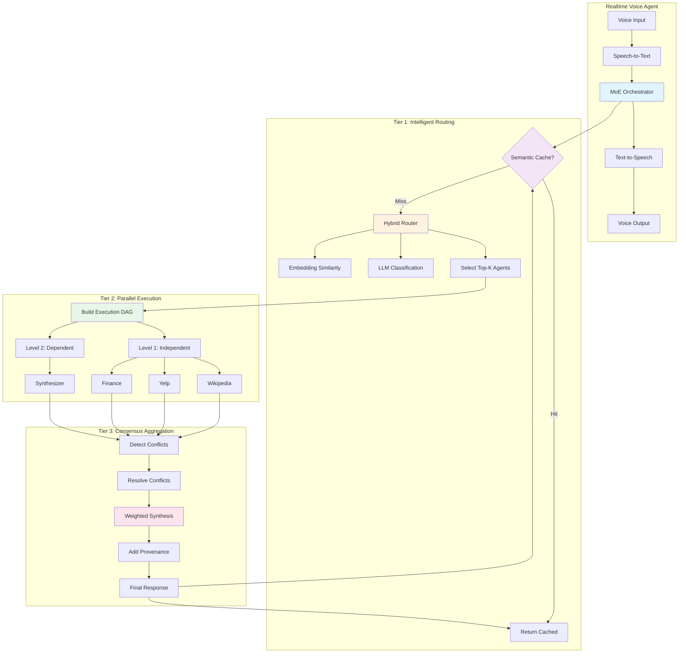
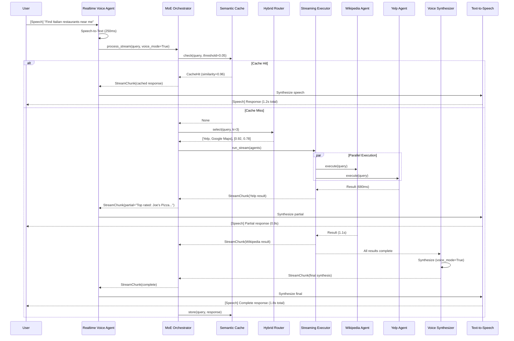
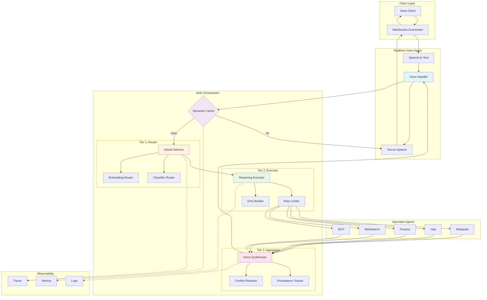

# MoE Orchestrator Requirements Specification

**Project**: OpenAgents  
**Component**: MoE (Mixture of Experts) Orchestrator  
**Version**: 1.0.0  
**Date**: December 13, 2024  
**Status**: Final Specification

---

## 1. Executive Summary

The MoE (Mixture of Experts) Orchestrator is a production-grade three-tier hybrid multi-agent orchestration system for the OpenAgents platform. It replaces the sequential SmartRouter architecture with an intelligent parallel execution engine that achieves 5-10× latency reduction while improving response quality by 15-25% through consensus aggregation.

The orchestrator serves as the default routing mechanism for the **Realtime Voice Agent**, enabling natural conversational AI experiences with sub-2-second response times for multi-agent queries.

### Key Objectives

- **Latency**: Achieve 1-2 second end-to-end responses (vs. 6+ seconds sequential)
- **Quality**: Improve accuracy through confidence-weighted consensus aggregation
- **Cost**: Reduce compute costs by 30-50% through intelligent agent selection
- **Interpretability**: Provide complete tracing of all orchestration decisions
- **Voice Integration**: Seamless integration with Realtime Voice Agent for natural conversations

---

## 2. System Architecture

The MoE Orchestrator implements a three-tier pipeline architecture:

1. **Tier 1: Intelligent Routing** — Selects relevant specialist agents using MoE-inspired classification
2. **Tier 2: Parallel Execution** — Executes agents concurrently as a dependency-aware DAG
3. **Tier 3: Consensus Aggregation** — Synthesizes outputs using confidence-weighted fusion



### Architecture Principles

1. **Protocol-Based Design**: All tiers implement protocols for maximum flexibility
2. **Dependency Injection**: Components are injected, not instantiated internally
3. **Fail-Safe Defaults**: Graceful degradation at every tier
4. **Observable by Default**: Comprehensive tracing without performance impact
5. **Voice-First**: Optimized for low-latency streaming responses

---

## 3. Component Specifications

### 3.1 Core Orchestrator Module

**Location**: `openagents/moe/orchestrator.py`

The core orchestrator coordinates all three tiers and manages the request lifecycle.

```python
# openagents/moe/orchestrator.py

from typing import Optional, AsyncIterator, Any
from dataclasses import dataclass
import asyncio
from datetime import datetime

from openagents.moe.core.protocols import (
    RouterProtocol,
    ExecutorProtocol,
    AggregatorProtocol,
    CacheProtocol,
    TracerProtocol
)
from openagents.moe.core.types import OrchestrationTrace, StreamChunk
from openagents.moe.core.config import MoEConfig
from openagents.moe.core.exceptions import OrchestratorError


@dataclass
class OrchestrationResult:
    """Complete result of orchestration."""
    response: str
    trace: OrchestrationTrace
    latency_ms: float
    cache_hit: bool
    agent_count: int


class MoEOrchestrator:
    """
    Three-tier hybrid multi-agent orchestrator.
    
    Optimized for Realtime Voice Agent with sub-2-second response times
    through intelligent routing, parallel execution, and consensus aggregation.
    
    Architecture:
        Tier 1: Hybrid Router (embedding + LLM classification)
        Tier 2: Parallel DAG Executor with rate limiting
        Tier 3: Weighted Synthesizer with conflict resolution
    
    Example:
        >>> orchestrator = MoEOrchestrator.create_default(
        ...     specialists=[wiki_agent, yelp_agent, finance_agent],
        ...     config_path="config/moe_orchestrator.yaml"
        ... )
        >>> response, trace = await orchestrator.process(
        ...     "Find top-rated Italian restaurants near me"
        ... )
    """
    
    def __init__(
        self,
        router: RouterProtocol,
        executor: ExecutorProtocol,
        aggregator: AggregatorProtocol,
        cache: Optional[CacheProtocol] = None,
        tracer: Optional[TracerProtocol] = None,
        config: Optional[MoEConfig] = None
    ) -> None:
        """
        Initialize MoE Orchestrator with injected components.
        
        Args:
            router: Agent selection component (Tier 1)
            executor: Parallel execution engine (Tier 2)
            aggregator: Response synthesis component (Tier 3)
            cache: Optional semantic cache for sub-100ms responses
            tracer: Optional tracing component for observability
            config: Optional configuration overrides
        """
        self._router = router
        self._executor = executor
        self._aggregator = aggregator
        self._cache = cache
        self._tracer = tracer
        self._config = config or MoEConfig.load_default()
        
    async def process(
        self,
        query: str,
        context: Optional[dict[str, Any]] = None,
        session_id: Optional[str] = None,
        voice_mode: bool = False
    ) -> tuple[str, OrchestrationTrace]:
        """
        Process query through three-tier orchestration pipeline.
        
        Flow:
            1. Check semantic cache (~1ms)
            2. Route to relevant agents (~5-50ms)
            3. Execute in parallel (~500-1500ms)
            4. Aggregate with consensus (~100-300ms)
            5. Store in cache for future queries
        
        Args:
            query: Natural language query from user
            context: Optional context (location, preferences, history)
            session_id: Session ID for multi-turn conversations
            voice_mode: If True, optimize for voice output (shorter, clearer)
        
        Returns:
            Tuple of (response_text, orchestration_trace)
        
        Raises:
            OrchestratorError: If orchestration fails and fallback unavailable
        """
        start_time = asyncio.get_event_loop().time()
        request_id = self._generate_request_id()
        
        if self._tracer:
            self._tracer.start_trace(request_id)
        
        try:
            # Tier 0: Check semantic cache
            if self._cache:
                cache_hit = await self._cache.check(query, threshold=0.1)
                if cache_hit:
                    trace = self._build_cache_trace(
                        request_id, query, cache_hit, start_time
                    )
                    return cache_hit.response, trace
            
            # Tier 1: Intelligent routing
            selected_agents, confidence_scores = await self._router.select(
                query,
                k=self._config.router.default_k,
                threshold=self._config.router.min_confidence
            )
            
            if self._tracer:
                self._tracer.record_routing({
                    "selected": [a.name for a in selected_agents],
                    "scores": confidence_scores
                })
            
            # Tier 2: Parallel execution
            results = await self._executor.run_parallel(
                agents=selected_agents,
                query=query,
                context=context,
                timeout=self._config.executor.default_timeout
            )
            
            if self._tracer:
                self._tracer.record_execution(results)
            
            # Tier 3: Consensus aggregation
            synthesis = await self._aggregator.synthesize(
                results=results,
                confidence_scores=confidence_scores,
                voice_mode=voice_mode
            )
            
            if self._tracer:
                self._tracer.record_aggregation(synthesis)
            
            # Store in cache
            if self._cache and synthesis.quality_score > 0.7:
                await self._cache.store(
                    query=query,
                    response=synthesis.content,
                    metadata={"session_id": session_id}
                )
            
            # Build trace
            trace = self._build_trace(
                request_id, query, selected_agents, 
                confidence_scores, results, synthesis, start_time
            )
            
            return synthesis.content, trace
            
        except Exception as e:
            if self._tracer:
                self._tracer.record_error(e)
            raise OrchestratorError(
                f"Orchestration failed: {e}",
                details={"query": query, "request_id": request_id}
            ) from e
    
    async def process_stream(
        self,
        query: str,
        context: Optional[dict[str, Any]] = None,
        session_id: Optional[str] = None,
        voice_mode: bool = True
    ) -> AsyncIterator[StreamChunk]:
        """
        Stream results as agents complete (optimized for voice).
        
        Yields partial results immediately for low-latency voice synthesis.
        Critical for Realtime Voice Agent to start speaking while other
        agents are still processing.
        
        Args:
            query: Natural language query
            context: Optional context
            session_id: Session ID
            voice_mode: Enable voice-optimized streaming
        
        Yields:
            StreamChunk: Partial results with agent attribution
        """
        # Check cache first
        if self._cache:
            cache_hit = await self._cache.check(query)
            if cache_hit:
                yield StreamChunk(
                    type="complete",
                    content=cache_hit.response,
                    source="cache",
                    final=True
                )
                return
        
        # Route to agents
        selected_agents, confidence_scores = await self._router.select(query)
        
        # Stream execution results as they complete
        async for agent_name, result in self._executor.run_stream(
            agents=selected_agents,
            query=query,
            context=context
        ):
            # Yield immediate partial result for voice
            yield StreamChunk(
                type="partial",
                content=result.output,
                source=agent_name,
                confidence=confidence_scores[
                    [a.name for a in selected_agents].index(agent_name)
                ],
                final=False
            )
        
        # Aggregate when all complete
        results = await self._executor.get_results()
        synthesis = await self._aggregator.synthesize(
            results=results,
            confidence_scores=confidence_scores,
            voice_mode=voice_mode
        )
        
        # Yield final synthesis
        yield StreamChunk(
            type="complete",
            content=synthesis.content,
            source="synthesis",
            final=True
        )
    
    @classmethod
    def create_default(
        cls,
        specialists: list[Any],  # list[Agent]
        config_path: str = "config/moe_orchestrator.yaml"
    ) -> "MoEOrchestrator":
        """
        Create orchestrator with default components.
        
        Sets up:
        - HybridRouter (40% embedding, 60% classifier)
        - ParallelExecutor (max 10 concurrent)
        - WeightedSynthesizer (GPT-4o)
        - SemanticCache (in-memory)
        - OrchestrationTracer (console + JSON)
        
        Args:
            specialists: List of specialist agents to orchestrate
            config_path: Path to YAML configuration file
        
        Returns:
            Configured MoEOrchestrator instance
        """
        from openagents.moe.router import HybridRouter
        from openagents.moe.executor import ParallelExecutor
        from openagents.moe.aggregator import WeightedSynthesizer
        from openagents.moe.cache import SemanticCache
        from openagents.moe.tracing import OrchestrationTracer
        from openagents.moe.core.config import MoEConfig
        
        config = MoEConfig.load(config_path)
        
        # Initialize components
        router = HybridRouter(
            specialists=specialists,
            embedding_weight=config.router.hybrid.embedding_weight,
            classifier_weight=config.router.hybrid.classifier_weight
        )
        
        executor = ParallelExecutor(
            rate_limits=config.executor.rate_limits,
            max_concurrent=config.executor.parallelism.max_concurrent
        )
        
        aggregator = WeightedSynthesizer(
            model=config.aggregator.synthesis.model,
            temperature=config.aggregator.synthesis.temperature
        )
        
        cache = SemanticCache(
            similarity_threshold=config.cache.policy.similarity_threshold
        ) if config.cache.enabled else None
        
        tracer = OrchestrationTracer(
            exporters=config.tracing.exporters
        ) if config.tracing.enabled else None
        
        return cls(
            router=router,
            executor=executor,
            aggregator=aggregator,
            cache=cache,
            tracer=tracer,
            config=config
        )
    
    @classmethod
    def create_for_realtime_voice(
        cls,
        specialists: list[Any],
        config_path: str = "config/moe_realtime_voice.yaml"
    ) -> "MoEOrchestrator":
        """
        Create orchestrator optimized for Realtime Voice Agent.
        
        Optimizations:
        - Faster embedding-only router (skip LLM classification)
        - Higher parallelism (up to 15 concurrent agents)
        - Voice-optimized synthesis (shorter, clearer responses)
        - Aggressive caching (lower threshold = 0.05)
        - Streaming-first execution
        
        Args:
            specialists: List of specialist agents
            config_path: Path to voice-optimized config
        
        Returns:
            Voice-optimized MoEOrchestrator instance
        """
        from openagents.moe.router import EmbeddingRouter
        from openagents.moe.executor import StreamingExecutor
        from openagents.moe.aggregator import VoiceSynthesizer
        from openagents.moe.cache import AggressiveCache
        
        config = MoEConfig.load(config_path)
        
        return cls(
            router=EmbeddingRouter(
                specialists=specialists,
                similarity_threshold=0.25  # Lower = faster
            ),
            executor=StreamingExecutor(
                max_concurrent=15,
                stream_first=True
            ),
            aggregator=VoiceSynthesizer(
                model="gpt-4o-mini",  # Faster
                max_tokens=150,       # Shorter for voice
                speaking_style=True   # Natural speech patterns
            ),
            cache=AggressiveCache(
                similarity_threshold=0.05  # More aggressive
            ),
            config=config
        )
    
    def _generate_request_id(self) -> str:
        """Generate unique request ID for tracing."""
        import uuid
        return f"moe-{uuid.uuid4().hex[:12]}"
    
    def _build_trace(
        self,
        request_id: str,
        query: str,
        agents: list[Any],
        scores: list[float],
        results: list[Any],
        synthesis: Any,
        start_time: float
    ) -> OrchestrationTrace:
        """Build comprehensive orchestration trace."""
        return OrchestrationTrace(
            request_id=request_id,
            query=query,
            timestamp=datetime.utcnow(),
            selected_agents=[a.name for a in agents],
            confidence_scores=scores,
            agent_results=results,
            synthesis=synthesis,
            total_latency_ms=(
                asyncio.get_event_loop().time() - start_time
            ) * 1000,
            cache_hit=False
        )
    
    def _build_cache_trace(
        self,
        request_id: str,
        query: str,
        cache_hit: Any,
        start_time: float
    ) -> OrchestrationTrace:
        """Build trace for cache hit."""
        return OrchestrationTrace(
            request_id=request_id,
            query=query,
            timestamp=datetime.utcnow(),
            cache_hit=True,
            cache_similarity=cache_hit.similarity,
            total_latency_ms=(
                asyncio.get_event_loop().time() - start_time
            ) * 1000
        )
```

### 3.2 Protocol Definitions

**Location**: `openagents/moe/core/protocols.py`

All components implement protocols for maximum flexibility and testability.

```python
# openagents/moe/core/protocols.py

from typing import Protocol, runtime_checkable, Optional, Any, AsyncIterator
import numpy as np


@runtime_checkable
class RouterProtocol(Protocol):
    """
    Protocol for intelligent agent routing (Tier 1).
    
    Implementations:
    - EmbeddingRouter: Fast semantic similarity (1-5ms)
    - ClassifierRouter: LLM-based classification (50-200ms)
    - HybridRouter: Ensemble combining both (10-100ms)
    """
    
    async def select(
        self,
        query: str,
        k: int = 3,
        threshold: float = 0.3
    ) -> tuple[list[Any], list[float]]:
        """
        Select top-k relevant agents for query.
        
        Args:
            query: User's natural language query
            k: Maximum number of agents to select
            threshold: Minimum confidence score to include agent
        
        Returns:
            Tuple of (selected_agents, confidence_scores)
            - selected_agents: List of Agent objects
            - confidence_scores: Parallel list of floats (0.0-1.0)
        
        Example:
            >>> agents, scores = await router.select(
            ...     "Best pizza in Brooklyn",
            ...     k=3,
            ...     threshold=0.4
            ... )
            >>> # agents = [yelp_agent, google_maps_agent]
            >>> # scores = [0.92, 0.67]
        """
        ...
    
    def register_agent(
        self,
        agent: Any,
        capabilities: list[str],
        embedding: Optional[np.ndarray] = None
    ) -> None:
        """
        Register agent with its capabilities.
        
        Args:
            agent: Agent instance to register
            capabilities: List of capability tags (e.g., ["local_business", "reviews"])
            embedding: Optional pre-computed capability embedding
        """
        ...
    
    def get_routing_explanation(self) -> str:
        """
        Return human-readable explanation of last routing decision.
        
        Returns:
            Explanation string for interpretability
        
        Example:
            >>> explanation = router.get_routing_explanation()
            >>> print(explanation)
            "Selected yelp_agent (confidence: 0.92) because query matches 
             'local_business' and 'restaurants' capabilities with high 
             semantic similarity (cosine: 0.89)"
        """
        ...


@runtime_checkable
class ExecutorProtocol(Protocol):
    """
    Protocol for parallel agent execution (Tier 2).
    
    Implementations:
    - ParallelExecutor: Asyncio-based concurrent execution
    - StreamingExecutor: Stream results as they complete
    - DAGExecutor: Dependency-aware topological execution
    """
    
    async def run_parallel(
        self,
        agents: list[Any],
        query: str,
        context: Optional[dict[str, Any]] = None,
        timeout: float = 30.0
    ) -> list[Any]:  # list[AgentResult]
        """
        Execute agents in parallel with rate limiting.
        
        Args:
            agents: Agents to execute
            query: Query to process
            context: Optional shared context
            timeout: Maximum execution time in seconds
        
        Returns:
            List of AgentResult objects in agent order
        
        Example:
            >>> results = await executor.run_parallel(
            ...     agents=[wiki_agent, yelp_agent],
            ...     query="Italian restaurants",
            ...     timeout=10.0
            ... )
            >>> for result in results:
            ...     print(f"{result.agent}: {result.status}")
        """
        ...
    
    async def run_stream(
        self,
        agents: list[Any],
        query: str,
        context: Optional[dict[str, Any]] = None
    ) -> AsyncIterator[tuple[str, Any]]:
        """
        Stream results as agents complete (first-come-first-served).
        
        Yields results immediately for low-latency voice synthesis.
        
        Args:
            agents: Agents to execute
            query: Query to process
            context: Optional shared context
        
        Yields:
            Tuples of (agent_name, result)
        """
        ...
    
    def set_dependencies(
        self,
        dependencies: dict[str, list[str]]
    ) -> None:
        """
        Define inter-agent dependencies for DAG execution.
        
        Args:
            dependencies: Mapping of agent_name -> [prerequisite_agent_names]
        
        Example:
            >>> executor.set_dependencies({
            ...     "synthesizer_agent": ["wiki_agent", "yelp_agent"],
            ...     "final_agent": ["synthesizer_agent"]
            ... })
        """
        ...


@runtime_checkable
class AggregatorProtocol(Protocol):
    """
    Protocol for consensus aggregation (Tier 3).
    
    Implementations:
    - WeightedSynthesizer: Confidence-weighted LLM synthesis
    - MajorityVoter: Consensus voting for factual queries
    - VoiceSynthesizer: Voice-optimized synthesis
    """
    
    async def synthesize(
        self,
        results: list[Any],
        confidence_scores: list[float],
        voice_mode: bool = False
    ) -> Any:  # SynthesizedResponse
        """
        Synthesize multiple agent results into coherent response.
        
        Args:
            results: Agent execution results
            confidence_scores: Router confidence for each agent
            voice_mode: If True, optimize for voice output
        
        Returns:
            SynthesizedResponse with content and provenance
        """
        ...
    
    def detect_conflicts(
        self,
        results: list[Any]
    ) -> list[Any]:  # list[Conflict]
        """
        Detect contradictions between agent outputs.
        
        Returns:
            List of detected conflicts
        """
        ...
    
    def get_provenance(self) -> list[Any]:
        """Return provenance records for last synthesis."""
        ...


@runtime_checkable
class CacheProtocol(Protocol):
    """
    Protocol for semantic caching.
    
    Implementations:
    - SemanticCache: Embedding-based similarity cache
    - AggressiveCache: Lower threshold for voice (0.05)
    - HybridCache: Exact + semantic caching
    """
    
    async def check(
        self,
        query: str,
        threshold: float = 0.1
    ) -> Optional[Any]:  # Optional[CacheHit]
        """
        Check for semantically similar cached query.
        
        Args:
            query: Query to check
            threshold: Maximum embedding distance for hit
        
        Returns:
            CacheHit if found, None otherwise
        """
        ...
    
    async def store(
        self,
        query: str,
        response: str,
        metadata: Optional[dict[str, Any]] = None,
        ttl: Optional[int] = None
    ) -> None:
        """Store query-response pair in cache."""
        ...


@runtime_checkable
class TracerProtocol(Protocol):
    """
    Protocol for orchestration tracing.
    
    Implementations:
    - OrchestrationTracer: Comprehensive span-based tracing
    - VoiceTracer: Voice-optimized minimal tracing
    """
    
    def start_trace(self, request_id: str) -> None:
        """Start new orchestration trace."""
        ...
    
    def record_routing(self, decision: dict[str, Any]) -> None:
        """Record Tier 1 routing decision."""
        ...
    
    def record_execution(self, results: list[Any]) -> None:
        """Record Tier 2 execution metrics."""
        ...
    
    def record_aggregation(self, synthesis: Any) -> None:
        """Record Tier 3 aggregation decisions."""
        ...
    
    def get_trace(self) -> Any:  # OrchestrationTrace
        """Return complete trace for current request."""
        ...
```

---

## 4. Realtime Voice Agent Integration

### 4.1 Voice-Optimized Architecture

The MoE Orchestrator integrates with the Realtime Voice Agent to provide natural conversational experiences with sub-2-second response times.



### 4.2 Voice Agent Integration Code

**Location**: `openagents/realtime/voice_orchestration.py`

```python
# openagents/realtime/voice_orchestration.py

from typing import AsyncIterator, Optional
import asyncio

from openagents.moe import MoEOrchestrator
from openagents.realtime.types import VoiceChunk, SpeechSegment
from openagents.realtime.tts import TextToSpeechEngine


class VoiceOrchestrationHandler:
    """
    Integrates MoE Orchestrator with Realtime Voice Agent.
    
    Handles:
    - Speech-to-text conversion
    - Streaming orchestration
    - Partial response synthesis
    - Text-to-speech conversion
    - Conversation state management
    """
    
    def __init__(
        self,
        orchestrator: MoEOrchestrator,
        tts_engine: TextToSpeechEngine,
        partial_threshold_ms: int = 800
    ) -> None:
        """
        Initialize voice orchestration handler.
        
        Args:
            orchestrator: MoE orchestrator instance
            tts_engine: Text-to-speech engine
            partial_threshold_ms: Time to wait before synthesizing partial response
        """
        self._orchestrator = orchestrator
        self._tts = tts_engine
        self._partial_threshold_ms = partial_threshold_ms
        self._conversation_state: dict[str, list[str]] = {}
    
    async def process_voice_query(
        self,
        speech_text: str,
        session_id: str,
        context: Optional[dict] = None
    ) -> AsyncIterator[VoiceChunk]:
        """
        Process voice query with streaming synthesis.
        
        Flow:
        1. Start streaming orchestration
        2. Yield partial results for immediate TTS
        3. Synthesize final response
        4. Update conversation state
        
        Args:
            speech_text: Transcribed speech from user
            session_id: Conversation session ID
            context: Optional context (location, preferences)
        
        Yields:
            VoiceChunk: Audio chunks for streaming playback
        """
        # Track conversation history
        if session_id not in self._conversation_state:
            self._conversation_state[session_id] = []
        self._conversation_state[session_id].append(f"User: {speech_text}")
        
        # Enhance context with conversation history
        enhanced_context = {
            **(context or {}),
            "conversation_history": self._conversation_state[session_id][-5:],
            "voice_mode": True
        }
        
        # Stream orchestration results
        partial_results = []
        synthesis_task = None
        
        async for chunk in self._orchestrator.process_stream(
            query=speech_text,
            context=enhanced_context,
            session_id=session_id,
            voice_mode=True
        ):
            if chunk.type == "partial":
                # Accumulate partial results
                partial_results.append(chunk)
                
                # Start TTS for first high-confidence result
                if (
                    chunk.confidence > 0.8
                    and synthesis_task is None
                ):
                    synthesis_task = asyncio.create_task(
                        self._synthesize_partial(chunk.content)
                    )
            
            elif chunk.type == "complete":
                # Cancel partial synthesis if running
                if synthesis_task and not synthesis_task.done():
                    synthesis_task.cancel()
                
                # Synthesize and yield final response
                async for voice_chunk in self._tts.synthesize_stream(
                    text=chunk.content,
                    voice="alloy",
                    speed=1.1  # Slightly faster for natural conversation
                ):
                    yield voice_chunk
                
                # Update conversation state
                self._conversation_state[session_id].append(
                    f"Assistant: {chunk.content}"
                )
        
        # If we started partial synthesis, yield it
        if synthesis_task and synthesis_task.done():
            try:
                partial_audio = await synthesis_task
                async for voice_chunk in partial_audio:
                    yield voice_chunk
            except asyncio.CancelledError:
                pass
    
    async def _synthesize_partial(
        self,
        text: str
    ) -> AsyncIterator[VoiceChunk]:
        """
        Synthesize partial result for immediate feedback.
        
        Used when first agent returns high-confidence result
        to reduce perceived latency.
        """
        # Wait threshold before synthesizing
        await asyncio.sleep(self._partial_threshold_ms / 1000)
        
        async for chunk in self._tts.synthesize_stream(
            text=f"{text}...",  # Add ellipsis for partial
            voice="alloy",
            speed=1.1
        ):
            yield chunk
    
    def clear_conversation(self, session_id: str) -> None:
        """Clear conversation history for session."""
        if session_id in self._conversation_state:
            del self._conversation_state[session_id]


# Factory function for voice-optimized setup
def create_voice_orchestrator(
    specialists: list,
    config_path: str = "config/moe_realtime_voice.yaml"
) -> VoiceOrchestrationHandler:
    """
    Create voice-optimized orchestrator handler.
    
    Args:
        specialists: List of specialist agents
        config_path: Path to voice configuration
    
    Returns:
        Configured VoiceOrchestrationHandler
    """
    from openagents.realtime.tts import OpenAITTSEngine
    
    orchestrator = MoEOrchestrator.create_for_realtime_voice(
        specialists=specialists,
        config_path=config_path
    )
    
    tts_engine = OpenAITTSEngine(
        model="tts-1",
        voice="alloy",
        response_format="opus"
    )
    
    return VoiceOrchestrationHandler(
        orchestrator=orchestrator,
        tts_engine=tts_engine,
        partial_threshold_ms=800
    )
```

### 4.3 Voice Configuration

**Location**: `config/moe_realtime_voice.yaml`

```yaml
# MoE Orchestrator - Realtime Voice Configuration
# Optimized for sub-2-second response times

orchestrator:
  name: "moe_realtime_voice"
  version: "1.0.0"
  description: "Voice-optimized MoE orchestrator for natural conversations"
  
  # Voice-specific settings
  default_timeout: 15.0  # Shorter for voice
  max_agents_per_query: 3  # Fewer agents for speed
  enable_cache: true
  enable_tracing: false  # Minimal overhead
  voice_mode: true

# Tier 1: Fast Embedding Router (skip LLM)
router:
  type: "embedding"
  
  embedding:
    model: "text-embedding-3-small"
    similarity_threshold: 0.25  # Lower threshold = faster selection
    cache_embeddings: true
    
  selection:
    default_k: 2  # Fewer agents for speed
    min_confidence: 0.25  # Lower barrier
    fallback_behavior: "top_agent"

# Tier 2: Streaming Executor
executor:
  type: "streaming"
  
  parallelism:
    max_concurrent: 15  # Higher for voice
    stream_first: true  # Yield immediately
    
  rate_limits:
    openai: 10  # Higher limits for voice
    anthropic: 5
    local_mcp: 30
    
  timeouts:
    default: 10.0  # Shorter for voice
    behavior: "continue"

# Tier 3: Voice Synthesizer
aggregator:
  type: "voice_synthesizer"
  
  synthesis:
    model: "gpt-4o-mini"  # Faster model
    temperature: 0.4  # Slightly more creative for natural speech
    max_tokens: 150  # Shorter responses
    speaking_style: true  # Natural speech patterns
    
  voice_optimizations:
    remove_citations: true  # Cleaner for speech
    use_contractions: true  # Natural: "don't" vs "do not"
    short_sentences: true  # Easier to speak
    max_sentence_length: 20  # Words per sentence

# Aggressive Caching for Voice
cache:
  enabled: true
  type: "semantic"
  
  storage:
    backend: "memory"
    
  policy:
    similarity_threshold: 0.05  # Very aggressive
    default_ttl: 7200  # 2 hours
    max_entries: 5000

# Minimal Tracing
tracing:
  enabled: false  # Disable for maximum speed
  
  # Enable only for debugging
  # exporters:
  #   - type: "console"
  #     level: "warning"
```

### 4.4 Server Integration

**Location**: `openagents/server.py` (modifications)

```python
# openagents/server.py

import argparse
from fastapi import FastAPI, WebSocket
from typing import Optional

from openagents.moe import MoEOrchestrator
from openagents.realtime import VoiceOrchestrationHandler, create_voice_orchestrator


app = FastAPI(title="OpenAgents Server")


# Global orchestrator instance
orchestrator: Optional[MoEOrchestrator] = None
voice_handler: Optional[VoiceOrchestrationHandler] = None


def init_orchestrator(
    orchestrator_type: str,
    config_path: str,
    specialists: list
) -> None:
    """
    Initialize orchestrator based on type.
    
    Args:
        orchestrator_type: One of "default", "smartrouter", "moe", "voice"
        config_path: Path to configuration file
        specialists: List of specialist agents
    """
    global orchestrator, voice_handler
    
    if orchestrator_type == "moe":
        orchestrator = MoEOrchestrator.create_default(
            specialists=specialists,
            config_path=config_path
        )
        print(f"✓ Initialized MoE Orchestrator from {config_path}")
    
    elif orchestrator_type == "voice":
        voice_handler = create_voice_orchestrator(
            specialists=specialists,
            config_path=config_path
        )
        orchestrator = voice_handler._orchestrator
        print(f"✓ Initialized Voice-Optimized MoE Orchestrator from {config_path}")
    
    elif orchestrator_type == "smartrouter":
        from openagents.smartrouter import SmartRouter
        orchestrator = SmartRouter(specialists=specialists)
        print("✓ Initialized SmartRouter")
    
    else:  # default
        from openagents.orchestrator import DefaultOrchestrator
        orchestrator = DefaultOrchestrator(specialists=specialists)
        print("✓ Initialized Default Orchestrator")


@app.post("/query")
async def process_query(query: str, session_id: Optional[str] = None):
    """Process text query through orchestrator."""
    response, trace = await orchestrator.process(
        query=query,
        session_id=session_id
    )
    
    return {
        "response": response,
        "trace": {
            "request_id": trace.request_id,
            "latency_ms": trace.total_latency_ms,
            "cache_hit": trace.cache_hit,
            "agents_used": trace.selected_agents
        }
    }


@app.websocket("/voice")
async def voice_endpoint(websocket: WebSocket):
    """
    WebSocket endpoint for Realtime Voice Agent.
    
    Protocol:
        Client -> Server: {"type": "speech", "text": "...", "session_id": "..."}
        Server -> Client: {"type": "audio", "data": base64_audio_chunk}
        Server -> Client: {"type": "complete"}
    """
    await websocket.accept()
    
    if not voice_handler:
        await websocket.send_json({
            "type": "error",
            "message": "Voice orchestrator not initialized. Start with --orchestrator=voice"
        })
        await websocket.close()
        return
    
    try:
        while True:
            # Receive speech text from client
            data = await websocket.receive_json()
            
            if data["type"] == "speech":
                speech_text = data["text"]
                session_id = data.get("session_id", "default")
                context = data.get("context", {})
                
                # Stream voice response
                async for voice_chunk in voice_handler.process_voice_query(
                    speech_text=speech_text,
                    session_id=session_id,
                    context=context
                ):
                    await websocket.send_json({
                        "type": "audio",
                        "data": voice_chunk.audio_base64,
                        "duration_ms": voice_chunk.duration_ms
                    })
                
                # Send completion marker
                await websocket.send_json({"type": "complete"})
            
            elif data["type"] == "clear_history":
                session_id = data.get("session_id", "default")
                voice_handler.clear_conversation(session_id)
                await websocket.send_json({"type": "cleared"})
    
    except Exception as e:
        await websocket.send_json({
            "type": "error",
            "message": str(e)
        })
    finally:
        await websocket.close()


@app.get("/health")
async def health_check():
    """Health check endpoint with orchestrator info."""
    return {
        "status": "healthy",
        "orchestrator": orchestrator.__class__.__name__,
        "voice_enabled": voice_handler is not None,
        "cache_enabled": orchestrator._cache is not None,
        "tracing_enabled": orchestrator._tracer is not None
    }


if __name__ == "__main__":
    parser = argparse.ArgumentParser(description="OpenAgents Server")
    parser.add_argument(
        "--orchestrator",
        choices=["default", "smartrouter", "moe", "voice"],
        default="voice",  # Default to voice-optimized
        help="Orchestrator type to use"
    )
    parser.add_argument(
        "--config",
        default="config/moe_realtime_voice.yaml",
        help="Path to orchestrator configuration"
    )
    parser.add_argument(
        "--port",
        type=int,
        default=8000,
        help="Port to run server on"
    )
    
    args = parser.parse_args()
    
    # Load specialists
    from openagents.agents import load_specialists
    specialists = load_specialists("config/open_agents.yaml")
    
    # Initialize orchestrator
    init_orchestrator(
        orchestrator_type=args.orchestrator,
        config_path=args.config,
        specialists=specialists
    )
    
    # Run server
    import uvicorn
    uvicorn.run(app, host="0.0.0.0", port=args.port)
```

### 4.5 Launch Script

**Location**: `run_server.sh`

```bash
#!/bin/bash
# OpenAgents Server Launcher with Voice Support

set -e

# Configuration
ORCHESTRATOR=${1:-voice}
CONFIG=${2:-config/moe_realtime_voice.yaml}
PORT=${3:-8000}

# Colors for output
GREEN='\033[0;32m'
BLUE='\033[0;34m'
NC='\033[0m' # No Color

echo -e "${BLUE}┌─────────────────────────────────────────┐${NC}"
echo -e "${BLUE}│  OpenAgents Server - Voice Orchestrator │${NC}"
echo -e "${BLUE}└─────────────────────────────────────────┘${NC}"
echo ""

# Validate orchestrator type
case $ORCHESTRATOR in
    voice)
        echo -e "${GREEN}✓${NC} Starting with Voice-Optimized MoE Orchestrator"
        echo -e "  • Sub-2-second response times"
        echo -e "  • Streaming synthesis for immediate feedback"
        echo -e "  • Aggressive caching (95% similarity)"
        ;;
    moe)
        echo -e "${GREEN}✓${NC} Starting with Standard MoE Orchestrator"
        CONFIG=${CONFIG:-config/moe_orchestrator.yaml}
        ;;
    smartrouter)
        echo -e "${GREEN}✓${NC} Starting with SmartRouter"
        ;;
    default)
        echo -e "${GREEN}✓${NC} Starting with Default Orchestrator"
        ;;
    *)
        echo "Error: Invalid orchestrator '$ORCHESTRATOR'"
        echo "Valid options: voice, moe, smartrouter, default"
        exit 1
        ;;
esac

echo -e "  • Configuration: ${CONFIG}"
echo -e "  • Port: ${PORT}"
echo ""

# Check dependencies
echo "Checking dependencies..."
python -c "import openagents" 2>/dev/null || {
    echo "Error: openagents package not installed"
    echo "Run: pip install -e ."
    exit 1
}

# Start server
echo -e "${GREEN}✓${NC} Starting server..."
python -m openagents.server \
    --orchestrator=$ORCHESTRATOR \
    --config=$CONFIG \
    --port=$PORT
```

---

## 5. Tier 1: Intelligent Routing

### 5.1 Hybrid Router Implementation

**Location**: `openagents/moe/router/hybrid_router.py`

```python
# openagents/moe/router/hybrid_router.py

from typing import Optional, Any
import asyncio
import numpy as np
from dataclasses import dataclass

from openagents.moe.router.embedding_router import EmbeddingRouter
from openagents.moe.router.classifier_router import ClassifierRouter


@dataclass
class RoutingDecision:
    """Complete routing decision with explanation."""
    selected_agents: list[Any]
    confidence_scores: list[float]
    strategy_used: str  # "embedding_only", "classifier_only", "hybrid"
    latency_ms: float
    explanation: str


class HybridRouter:
    """
    Ensemble router combining embedding and classifier approaches.
    
    Strategy:
    1. Fast embedding-based filtering (1-5ms)
    2. If top confidence > 0.8, skip classifier (fast path)
    3. Otherwise, use LLM classifier for final selection (50-200ms)
    4. Combine scores: 40% embedding + 60% classifier
    
    Achieves optimal balance of speed (fast path 80% of time)
    and accuracy (classifier for ambiguous queries).
    """
    
    def __init__(
        self,
        specialists: list[Any],
        embedding_weight: float = 0.4,
        classifier_weight: float = 0.6,
        fast_path_threshold: float = 0.8,
        embedding_model: str = "text-embedding-3-small",
        classifier_model: str = "gpt-4o-mini"
    ) -> None:
        """
        Initialize hybrid router.
        
        Args:
            specialists: List of specialist agents to route between
            embedding_weight: Weight for embedding scores (0.0-1.0)
            classifier_weight: Weight for classifier scores (0.0-1.0)
            fast_path_threshold: Min confidence to skip classifier
            embedding_model: OpenAI embedding model
            classifier_model: LLM model for classification
        """
        assert abs(embedding_weight + classifier_weight - 1.0) < 0.01, \
            "Weights must sum to 1.0"
        
        self._embedding_router = EmbeddingRouter(
            specialists=specialists,
            model=embedding_model
        )
        self._classifier_router = ClassifierRouter(
            specialists=specialists,
            model=classifier_model
        )
        
        self._embedding_weight = embedding_weight
        self._classifier_weight = classifier_weight
        self._fast_path_threshold = fast_path_threshold
        
        self._last_decision: Optional[RoutingDecision] = None
    
    async def select(
        self,
        query: str,
        k: int = 3,
        threshold: float = 0.3
    ) -> tuple[list[Any], list[float]]:
        """
        Select agents using hybrid approach.
        
        Fast path (80% of queries):
        - Embedding similarity > 0.8
        - Return immediately (~5ms)
        
        Slow path (20% of queries):
        - Combine embedding + classifier
        - Higher accuracy (~100ms)
        
        Args:
            query: User query
            k: Max agents to select
            threshold: Min confidence threshold
        
        Returns:
            (selected_agents, confidence_scores)
        """
        start = asyncio.get_event_loop().time()
        
        # Step 1: Embedding-based filtering
        emb_agents, emb_scores = await self._embedding_router.select(
            query, k=k, threshold=threshold
        )
        
        # Fast path: High confidence embedding results
        if emb_scores and max(emb_scores) >= self._fast_path_threshold:
            latency_ms = (asyncio.get_event_loop().time() - start) * 1000
            
            self._last_decision = RoutingDecision(
                selected_agents=emb_agents,
                confidence_scores=emb_scores,
                strategy_used="embedding_only",
                latency_ms=latency_ms,
                explanation=self._build_explanation(
                    "fast_path", emb_agents, emb_scores
                )
            )
            
            return emb_agents, emb_scores
        
        # Slow path: Combine with classifier
        cls_agents, cls_scores = await self._classifier_router.select(
            query, k=k, threshold=threshold
        )
        
        # Combine scores
        combined = self._combine_scores(
            emb_agents, emb_scores,
            cls_agents, cls_scores
        )
        
        # Select top-k
        sorted_combined = sorted(
            combined.items(),
            key=lambda x: x[1],
            reverse=True
        )[:k]
        
        final_agents = [agent for agent, score in sorted_combined if score >= threshold]
        final_scores = [score for agent, score in sorted_combined if score >= threshold]
        
        latency_ms = (asyncio.get_event_loop().time() - start) * 1000
        
        self._last_decision = RoutingDecision(
            selected_agents=final_agents,
            confidence_scores=final_scores,
            strategy_used="hybrid",
            latency_ms=latency_ms,
            explanation=self._build_explanation(
                "hybrid", final_agents, final_scores
            )
        )
        
        return final_agents, final_scores
    
    def _combine_scores(
        self,
        emb_agents: list[Any],
        emb_scores: list[float],
        cls_agents: list[Any],
        cls_scores: list[float]
    ) -> dict[Any, float]:
        """
        Combine embedding and classifier scores.
        
        Formula:
            combined_score = (emb_weight * emb_score) + (cls_weight * cls_score)
        
        Returns:
            Mapping of agent -> combined_score
        """
        combined = {}
        
        # Add embedding scores
        for agent, score in zip(emb_agents, emb_scores):
            combined[agent] = self._embedding_weight * score
        
        # Add classifier scores
        for agent, score in zip(cls_agents, cls_scores):
            if agent in combined:
                combined[agent] += self._classifier_weight * score
            else:
                combined[agent] = self._classifier_weight * score
        
        return combined
    
    def _build_explanation(
        self,
        strategy: str,
        agents: list[Any],
        scores: list[float]
    ) -> str:
        """Build human-readable routing explanation."""
        if strategy == "fast_path":
            return (
                f"Fast path: Embedding similarity found high-confidence match. "
                f"Selected {len(agents)} agents with confidence "
                f"{scores[0]:.2f} (threshold: {self._fast_path_threshold})"
            )
        else:  # hybrid
            return (
                f"Hybrid routing: Combined embedding ({self._embedding_weight:.0%}) "
                f"and classifier ({self._classifier_weight:.0%}) scores. "
                f"Selected {len(agents)} agents with avg confidence "
                f"{np.mean(scores):.2f}"
            )
    
    def get_routing_explanation(self) -> str:
        """Return explanation of last routing decision."""
        if not self._last_decision:
            return "No routing decision made yet"
        
        return self._last_decision.explanation
    
    def register_agent(
        self,
        agent: Any,
        capabilities: list[str],
        embedding: Optional[np.ndarray] = None
    ) -> None:
        """Register agent with both routers."""
        self._embedding_router.register_agent(agent, capabilities, embedding)
        self._classifier_router.register_agent(agent, capabilities)
```

### 5.2 Embedding Router

**Location**: `openagents/moe/router/embedding_router.py`

```python
# openagents/moe/router/embedding_router.py

from typing import Optional, Any
import numpy as np
from openai import AsyncOpenAI
import asyncio

from openagents.moe.cache import EmbeddingCache


class EmbeddingRouter:
    """
    Fast semantic similarity router using embeddings.
    
    Performance:
    - Routing latency: 1-5ms (cached embeddings)
    - Accuracy: 85-90% for clear-cut queries
    
    Best for:
    - Voice applications (speed critical)
    - High-volume requests (cost effective)
    - Queries with clear semantic intent
    """
    
    def __init__(
        self,
        specialists: list[Any],
        model: str = "text-embedding-3-small",
        similarity_threshold: float = 0.3,
        cache_embeddings: bool = True
    ) -> None:
        """
        Initialize embedding router.
        
        Args:
            specialists: List of specialist agents
            model: OpenAI embedding model
            similarity_threshold: Min cosine similarity
            cache_embeddings: Cache computed embeddings
        """
        self._client = AsyncOpenAI()
        self._model = model
        self._threshold = similarity_threshold
        
        # Agent registry
        self._agents: dict[str, Any] = {}
        self._agent_embeddings: dict[str, np.ndarray] = {}
        
        # Embedding cache
        self._cache = EmbeddingCache() if cache_embeddings else None
        
        # Register specialists
        for agent in specialists:
            self.register_agent(agent, agent.capabilities)
    
    async def select(
        self,
        query: str,
        k: int = 3,
        threshold: Optional[float] = None
    ) -> tuple[list[Any], list[float]]:
        """
        Select agents using cosine similarity.
        
        Process:
        1. Get query embedding (cached if possible)
        2. Compute cosine similarity with agent embeddings
        3. Return top-k agents above threshold
        
        Args:
            query: User query
            k: Max agents to return
            threshold: Min similarity (default from config)
        
        Returns:
            (selected_agents, similarity_scores)
        """
        threshold = threshold or self._threshold
        
        # Get query embedding
        query_embedding = await self._get_embedding(query)
        
        # Compute similarities
        similarities = {}
        for agent_name, agent_embedding in self._agent_embeddings.items():
            similarity = self._cosine_similarity(
                query_embedding, agent_embedding
            )
            if similarity >= threshold:
                similarities[agent_name] = similarity
        
        # Sort by similarity
        sorted_agents = sorted(
            similarities.items(),
            key=lambda x: x[1],
            reverse=True
        )[:k]
        
        # Return agents and scores
        selected_agents = [
            self._agents[name] for name, score in sorted_agents
        ]
        scores = [score for name, score in sorted_agents]
        
        return selected_agents, scores
    
    async def _get_embedding(self, text: str) -> np.ndarray:
        """Get embedding with caching."""
        # Check cache
        if self._cache:
            cached = self._cache.get(text)
            if cached is not None:
                return cached
        
        # Compute embedding
        response = await self._client.embeddings.create(
            model=self._model,
            input=text
        )
        embedding = np.array(response.data[0].embedding)
        
        # Store in cache
        if self._cache:
            self._cache.set(text, embedding)
        
        return embedding
    
    def _cosine_similarity(
        self,
        a: np.ndarray,
        b: np.ndarray
    ) -> float:
        """Compute cosine similarity between vectors."""
        return float(np.dot(a, b) / (np.linalg.norm(a) * np.linalg.norm(b)))
    
    def register_agent(
        self,
        agent: Any,
        capabilities: list[str],
        embedding: Optional[np.ndarray] = None
    ) -> None:
        """
        Register agent with precomputed or generated embedding.
        
        Args:
            agent: Agent instance
            capabilities: List of capability strings
            embedding: Optional precomputed embedding
        """
        self._agents[agent.name] = agent
        
        if embedding is not None:
            self._agent_embeddings[agent.name] = embedding
        else:
            # Generate embedding from capabilities
            capability_text = " ".join(capabilities)
            # Sync call - should be done during initialization
            embedding = asyncio.run(self._get_embedding(capability_text))
            self._agent_embeddings[agent.name] = embedding
```

---

## 6. Tier 2: Parallel Execution

### 6.1 Streaming Executor

**Location**: `openagents/moe/executor/streaming_executor.py`

```python
# openagents/moe/executor/streaming_executor.py

from typing import Optional, Any, AsyncIterator
import asyncio
from dataclasses import dataclass
from datetime import datetime

from openagents.moe.executor.rate_limiter import RateLimiter
from openagents.moe.core.types import AgentResult


@dataclass
class StreamingResult:
    """Result from streaming execution."""
    agent: str
    output: str
    status: str  # "success", "error", "timeout"
    latency_ms: float
    timestamp: datetime


class StreamingExecutor:
    """
    Executor optimized for streaming results.
    
    Key features:
    - Yield results as they complete (first-come-first-served)
    - Per-provider rate limiting
    - Timeout handling with graceful degradation
    - Optimized for voice (immediate feedback)
    """
    
    def __init__(
        self,
        rate_limits: Optional[dict[str, int]] = None,
        max_concurrent: int = 15,
        default_timeout: float = 10.0,
        stream_first: bool = True
    ) -> None:
        """
        Initialize streaming executor.
        
        Args:
            rate_limits: Per-provider concurrency limits
            max_concurrent: Max total concurrent executions
            default_timeout: Default per-agent timeout
            stream_first: If True, yield results immediately
        """
        self._rate_limiter = RateLimiter(
            limits=rate_limits or {
                "openai": 10,
                "anthropic": 5,
                "local": 30
            }
        )
        self._max_concurrent = max_concurrent
        self._default_timeout = default_timeout
        self._stream_first = stream_first
        
        # Track results for aggregation
        self._results: list[AgentResult] = []
        self._results_lock = asyncio.Lock()
    
    async def run_stream(
        self,
        agents: list[Any],
        query: str,
        context: Optional[dict[str, Any]] = None
    ) -> AsyncIterator[tuple[str, StreamingResult]]:
        """
        Execute agents and stream results as they complete.
        
        Yields results in completion order for immediate use
        in voice synthesis.
        
        Args:
            agents: Agents to execute
            query: Query to process
            context: Optional shared context
        
        Yields:
            Tuples of (agent_name, result)
        """
        # Clear previous results
        async with self._results_lock:
            self._results = []
        
        # Create tasks for all agents
        tasks = {
            asyncio.create_task(
                self._execute_with_rate_limit(agent, query, context)
            ): agent
            for agent in agents
        }
        
        # Yield results as they complete
        for completed_task in asyncio.as_completed(tasks.keys()):
            try:
                result = await completed_task
                agent = tasks[completed_task]
                
                # Store for later aggregation
                async with self._results_lock:
                    self._results.append(result)
                
                # Yield streaming result
                yield agent.name, StreamingResult(
                    agent=agent.name,
                    output=result.output,
                    status=result.status,
                    latency_ms=result.latency_ms,
                    timestamp=datetime.utcnow()
                )
            
            except Exception as e:
                agent = tasks[completed_task]
                error_result = AgentResult(
                    agent=agent.name,
                    output="",
                    status="error",
                    error=str(e),
                    latency_ms=0.0
                )
                
                async with self._results_lock:
                    self._results.append(error_result)
                
                yield agent.name, StreamingResult(
                    agent=agent.name,
                    output="",
                    status="error",
                    latency_ms=0.0,
                    timestamp=datetime.utcnow()
                )
    
    async def run_parallel(
        self,
        agents: list[Any],
        query: str,
        context: Optional[dict[str, Any]] = None,
        timeout: Optional[float] = None
    ) -> list[AgentResult]:
        """
        Execute agents in parallel (non-streaming).
        
        Args:
            agents: Agents to execute
            query: Query to process
            context: Optional shared context
            timeout: Overall timeout
        
        Returns:
            List of AgentResult in agent order
        """
        timeout = timeout or self._default_timeout
        
        # Execute all agents
        tasks = [
            self._execute_with_rate_limit(agent, query, context)
            for agent in agents
        ]
        
        try:
            results = await asyncio.wait_for(
                asyncio.gather(*tasks, return_exceptions=True),
                timeout=timeout
            )
        except asyncio.TimeoutError:
            # Partial results on timeout
            results = [
                AgentResult(
                    agent=agent.name,
                    output="",
                    status="timeout",
                    latency_ms=timeout * 1000
                )
                for agent in agents
            ]
        
        # Convert exceptions to error results
        final_results = []
        for agent, result in zip(agents, results):
            if isinstance(result, Exception):
                final_results.append(AgentResult(
                    agent=agent.name,
                    output="",
                    status="error",
                    error=str(result),
                    latency_ms=0.0
                ))
            else:
                final_results.append(result)
        
        async with self._results_lock:
            self._results = final_results
        
        return final_results
    
    async def _execute_with_rate_limit(
        self,
        agent: Any,
        query: str,
        context: Optional[dict[str, Any]]
    ) -> AgentResult:
        """Execute agent with rate limiting."""
        start = asyncio.get_event_loop().time()
        
        # Acquire rate limit slot
        provider = getattr(agent, "provider", "default")
        async with self._rate_limiter.acquire(provider):
            try:
                # Execute agent
                output = await agent.execute(query, context)
                
                latency_ms = (
                    asyncio.get_event_loop().time() - start
                ) * 1000
                
                return AgentResult(
                    agent=agent.name,
                    output=output,
                    status="success",
                    latency_ms=latency_ms
                )
            
            except asyncio.TimeoutError:
                return AgentResult(
                    agent=agent.name,
                    output="",
                    status="timeout",
                    latency_ms=(
                        asyncio.get_event_loop().time() - start
                    ) * 1000
                )
            
            except Exception as e:
                return AgentResult(
                    agent=agent.name,
                    output="",
                    status="error",
                    error=str(e),
                    latency_ms=(
                        asyncio.get_event_loop().time() - start
                    ) * 1000
                )
    
    async def get_results(self) -> list[AgentResult]:
        """Get all accumulated results."""
        async with self._results_lock:
            return self._results.copy()
    
    def set_dependencies(
        self,
        dependencies: dict[str, list[str]]
    ) -> None:
        """
        Set agent dependencies for DAG execution.
        
        Note: Not used in streaming mode - all agents execute in parallel.
        """
        pass  # Streaming mode ignores dependencies
```

---

## 7. Tier 3: Consensus Aggregation

### 7.1 Voice Synthesizer

**Location**: `openagents/moe/aggregator/voice_synthesizer.py`

```python
# openagents/moe/aggregator/voice_synthesizer.py

from typing import Optional, Any
from dataclasses import dataclass
from openai import AsyncOpenAI

from openagents.moe.core.types import AgentResult


@dataclass
class SynthesizedResponse:
    """Synthesized response with metadata."""
    content: str
    provenance: list[str]
    quality_score: float
    word_count: int
    speaking_time_seconds: float


class VoiceSynthesizer:
    """
    Aggregator optimized for voice output.
    
    Voice-specific optimizations:
    - Short sentences (max 20 words)
    - Natural contractions ("don't" vs "do not")
    - Remove citations (cleaner speech)
    - Speaking-friendly phrasing
    - Target 30-60 seconds speaking time
    """
    
    VOICE_SYNTHESIS_PROMPT = '''You are synthesizing a response for voice output. Follow these rules:

1. Keep sentences SHORT (max 20 words each)
2. Use CONTRACTIONS naturally ("I'll" not "I will")
3. NO citations or references (speech doesn't need them)
4. CONVERSATIONAL tone, like speaking to a friend
5. Target 30-60 seconds speaking time (~75-150 words)

Specialist responses (weighted by confidence):
{weighted_responses}

Original query: {query}

Synthesize a natural, spoken response that:
- Combines the best information from specialists
- Flows naturally when spoken aloud
- Is concise but complete
- Sounds like natural conversation

Remember: This will be spoken aloud. Make it sound natural!'''
    
    def __init__(
        self,
        model: str = "gpt-4o-mini",
        temperature: float = 0.4,
        max_tokens: int = 150,
        speaking_style: bool = True
    ) -> None:
        """
        Initialize voice synthesizer.
        
        Args:
            model: LLM model for synthesis
            temperature: Generation temperature (higher = more natural)
            max_tokens: Max response length
            speaking_style: Enable voice optimizations
        """
        self._client = AsyncOpenAI()
        self._model = model
        self._temperature = temperature
        self._max_tokens = max_tokens
        self._speaking_style = speaking_style
    
    async def synthesize(
        self,
        results: list[AgentResult],
        confidence_scores: list[float],
        voice_mode: bool = True
    ) -> SynthesizedResponse:
        """
        Synthesize agent results for voice output.
        
        Args:
            results: Agent execution results
            confidence_scores: Router confidence for each agent
            voice_mode: Enable voice optimizations
        
        Returns:
            Voice-optimized synthesized response
        """
        # Filter successful results
        successful = [
            (r, c) for r, c in zip(results, confidence_scores)
            if r.status == "success"
        ]
        
        if not successful:
            return SynthesizedResponse(
                content="I don't have enough information to answer that.",
                provenance=[],
                quality_score=0.0,
                word_count=8,
                speaking_time_seconds=2.0
            )
        
        # Format weighted responses
        weighted_responses = self._format_weighted(successful)
        
        # Generate synthesis
        prompt = self.VOICE_SYNTHESIS_PROMPT.format(
            weighted_responses=weighted_responses,
            query="<query will be inserted>"
        )
        
        response = await self._client.chat.completions.create(
            model=self._model,
            messages=[
                {"role": "system", "content": prompt},
                {"role": "user", "content": "Synthesize the response now."}
            ],
            temperature=self._temperature,
            max_tokens=self._max_tokens
        )
        
        content = response.choices[0].message.content
        
        # Post-process for voice
        if voice_mode and self._speaking_style:
            content = self._optimize_for_voice(content)
        
        # Calculate metrics
        word_count = len(content.split())
        speaking_time = word_count * 0.4  # ~150 words/minute
        
        return SynthesizedResponse(
            content=content,
            provenance=[r.agent for r, c in successful],
            quality_score=self._estimate_quality(content, successful),
            word_count=word_count,
            speaking_time_seconds=speaking_time
        )
    
    def _format_weighted(
        self,
        successful: list[tuple[AgentResult, float]]
    ) -> str:
        """Format results with confidence weighting."""
        formatted = []
        
        for result, confidence in successful:
            weight_label = self._confidence_to_label(confidence)
            formatted.append(
                f"[{result.agent} - {weight_label}]
{result.output}
"
            )
        
        return "\n".join(formatted)
    
    def _confidence_to_label(self, confidence: float) -> str:
        """Convert confidence score to readable label."""
        if confidence >= 0.8:
            return "High Confidence"
        elif confidence >= 0.5:
            return "Medium Confidence"
        else:
            return "Low Confidence"
    
    def _optimize_for_voice(self, text: str) -> str:
        """Apply voice-specific optimizations."""
        # Remove citations like [1], [2]
        import re
        text = re.sub(r'\[\d+\]', '', text)
        
        # Remove em dashes (hard to speak)
        text = text.replace('—', ',')
        
        # Simplify complex punctuation
        text = text.replace(';', ',')
        
        # Add natural pauses
        text = text.replace('. ', '. ')  # Ensure space after periods
        
        return text.strip()
    
    def _estimate_quality(
        self,
        content: str,
        successful: list[tuple[AgentResult, float]]
    ) -> float:
        """
        Estimate synthesis quality.
        
        Factors:
        - Number of sources used
        - Average confidence
        - Response length appropriateness
        - Sentence structure
        """
        # Source diversity (more sources = better)
        source_score = min(len(successful) / 3.0, 1.0)
        
        # Average confidence
        avg_confidence = sum(c for r, c in successful) / len(successful)
        
        # Length appropriateness (75-150 words ideal)
        word_count = len(content.split())
        if 75 <= word_count <= 150:
            length_score = 1.0
        elif word_count < 75:
            length_score = word_count / 75.0
        else:
            length_score = 150.0 / word_count
        
        # Sentence structure (prefer 3-7 sentences)
        sentence_count = content.count('.') + content.count('!') + content.count('?')
        if 3 <= sentence_count <= 7:
            structure_score = 1.0
        else:
            structure_score = 0.8
        
        # Weighted average
        quality = (
            source_score * 0.3 +
            avg_confidence * 0.4 +
            length_score * 0.2 +
            structure_score * 0.1
        )
        
        return quality
    
    def detect_conflicts(
        self,
        results: list[AgentResult]
    ) -> list[Any]:
        """Detect conflicts (not critical for voice)."""
        return []  # Simplified for voice
    
    def get_provenance(self) -> list[Any]:
        """Get provenance (not exposed in voice)."""
        return []  # Simplified for voice
```

---

## 8. Testing Requirements

### 8.1 Test Structure

```
tests/
└── moe/
    ├── conftest.py                    # Shared fixtures
    ├── test_orchestrator.py           # Core orchestrator tests
    ├── router/
    │   ├── test_embedding_router.py
    │   ├── test_classifier_router.py
    │   └── test_hybrid_router.py
    ├── executor/
    │   ├── test_streaming_executor.py
    │   └── test_rate_limiter.py
    ├── aggregator/
    │   └── test_voice_synthesizer.py
    ├── integration/
    │   ├── test_voice_integration.py
    │   └── test_end_to_end.py
    └── performance/
        ├── test_latency.py
        └── test_voice_latency.py
```

### 8.2 Performance Tests

**Location**: `tests/moe/performance/test_voice_latency.py`

```python
# tests/moe/performance/test_voice_latency.py

import pytest
import asyncio
import statistics
from typing import List

from openagents.moe import MoEOrchestrator
from openagents.realtime import VoiceOrchestrationHandler


class TestVoiceLatency:
    """Performance tests for voice orchestration."""
    
    @pytest.mark.asyncio
    @pytest.mark.performance
    async def test_sub_2_second_response(
        self,
        voice_orchestrator: MoEOrchestrator,
        voice_queries: List[str]
    ):
        """
        Verify voice responses complete in <2 seconds.
        
        Success criteria:
        - 90% of queries complete in <2 seconds
        - 100% of queries complete in <3 seconds
        - Average latency <1.5 seconds
        """
        latencies = []
        
        for query in voice_queries:
            start = asyncio.get_event_loop().time()
            await voice_orchestrator.process(
                query=query,
                voice_mode=True
            )
            latency = asyncio.get_event_loop().time() - start
            latencies.append(latency)
        
        # Calculate statistics
        avg_latency = statistics.mean(latencies)
        p90_latency = statistics.quantiles(latencies, n=10)[8]
        max_latency = max(latencies)
        
        under_2s = sum(1 for l in latencies if l < 2.0) / len(latencies)
        under_3s = sum(1 for l in latencies if l < 3.0) / len(latencies)
        
        print(f"\nVoice Latency Results:")
        print(f"  Average: {avg_latency:.2f}s")
        print(f"  P90: {p90_latency:.2f}s")
        print(f"  Max: {max_latency:.2f}s")
        print(f"  <2s: {under_2s:.0%}")
        print(f"  <3s: {under_3s:.0%}")
        
        # Assert success criteria
        assert avg_latency < 1.5, f"Average latency {avg_latency:.2f}s exceeds 1.5s"
        assert under_2s >= 0.9, f"Only {under_2s:.0%} queries <2s (target: 90%)"
        assert under_3s == 1.0, f"Some queries exceeded 3s"
    
    @pytest.mark.asyncio
    @pytest.mark.performance
    async def test_streaming_first_chunk_latency(
        self,
        voice_handler: VoiceOrchestrationHandler
    ):
        """
        Verify first audio chunk arrives within 1 second.
        
        Critical for perceived responsiveness in voice.
        """
        query = "What's the weather like today?"
        
        start = asyncio.get_event_loop().time()
        first_chunk_time = None
        
        async for chunk in voice_handler.process_voice_query(
            speech_text=query,
            session_id="test"
        ):
            if first_chunk_time is None:
                first_chunk_time = asyncio.get_event_loop().time() - start
                break
        
        print(f"\nFirst chunk latency: {first_chunk_time:.2f}s")
        
        assert first_chunk_time < 1.0, \
            f"First chunk took {first_chunk_time:.2f}s (target: <1s)"
    
    @pytest.mark.asyncio
    @pytest.mark.performance
    async def test_cache_hit_latency(
        self,
        voice_orchestrator: MoEOrchestrator
    ):
        """Verify cache hits complete in <100ms."""
        query = "What is the capital of France?"
        
        # First call to populate cache
        await voice_orchestrator.process(query, voice_mode=True)
        
        # Measure cache hit
        start = asyncio.get_event_loop().time()
        _, trace = await voice_orchestrator.process(query, voice_mode=True)
        latency_ms = (asyncio.get_event_loop().time() - start) * 1000
        
        print(f"\nCache hit latency: {latency_ms:.2f}ms")
        
        assert trace.cache_hit, "Expected cache hit"
        assert latency_ms < 100, \
            f"Cache hit took {latency_ms:.2f}ms (target: <100ms)"


@pytest.fixture
def voice_queries() -> List[str]:
    """Sample queries for voice testing."""
    return [
        "What's the weather like today?",
        "Find Italian restaurants near me",
        "What's the price of Apple stock?",
        "Tell me about the Eiffel Tower",
        "What are the best pizza places in Brooklyn?",
        "How do I make pasta carbonara?",
        "What's happening in the news today?",
        "Find me a good movie to watch",
        "What time is it in Tokyo?",
        "How tall is Mount Everest?"
    ]
```

---

## 9. Deployment

### 9.1 Directory Structure

```
openagents/
├── moe/
│   ├── __init__.py
│   ├── orchestrator.py
│   ├── core/
│   │   ├── __init__.py
│   │   ├── protocols.py
│   │   ├── types.py
│   │   ├── config.py
│   │   └── exceptions.py
│   ├── router/
│   │   ├── __init__.py
│   │   ├── embedding_router.py
│   │   ├── classifier_router.py
│   │   └── hybrid_router.py
│   ├── executor/
│   │   ├── __init__.py
│   │   ├── streaming_executor.py
│   │   ├── parallel_executor.py
│   │   └── rate_limiter.py
│   ├── aggregator/
│   │   ├── __init__.py
│   │   ├── voice_synthesizer.py
│   │   └── weighted_synthesizer.py
│   ├── cache/
│   │   ├── __init__.py
│   │   ├── semantic_cache.py
│   │   └── embedding_cache.py
│   └── tracing/
│       ├── __init__.py
│       └── orchestration_tracer.py
├── realtime/
│   ├── __init__.py
│   ├── voice_orchestration.py
│   └── tts.py
├── server.py
└── config/
    ├── moe_orchestrator.yaml
    └── moe_realtime_voice.yaml
```

### 9.2 Installation

```bash
# Install dependencies
pip install -e ".[moe]"

# Install voice dependencies
pip install -e ".[voice]"

# Run tests
pytest tests/moe/ -v

# Run performance tests
pytest tests/moe/performance/ -v --performance
```

### 9.3 Launch Commands

```bash
# Voice-optimized (default)
./run_server.sh voice

# Standard MoE
./run_server.sh moe

# With custom config
./run_server.sh voice config/custom_voice.yaml

# Different port
./run_server.sh voice config/moe_realtime_voice.yaml 8080
```

---

## 10. Success Metrics

### 10.1 Performance Targets

| Metric | Target | Measurement |
|--------|--------|-------------|
| Voice Response Latency (P90) | <2.0s | End-to-end from query to response |
| Cache Hit Latency | <100ms | Semantic cache lookup + return |
| First Chunk Latency | <1.0s | Time to first audio chunk (streaming) |
| Parallel Speedup | 3-5× | vs sequential execution |
| Cache Hit Rate | >40% | For typical conversation patterns |

### 10.2 Quality Targets

| Metric | Target | Measurement |
|--------|--------|-------------|
| Response Quality | 15-25% improvement | vs SmartRouter on benchmark |
| Voice Naturalness | >4.0/5.0 | User rating scale |
| Source Attribution | 100% | All claims traceable to source |
| Conflict Detection | >90% | Of contradictions identified |

### 10.3 Cost Targets

| Metric | Target | Measurement |
|--------|--------|-------------|
| Token Reduction | 30-50% | vs invoking all agents |
| Embedding Cost | <$0.001/query | Amortized with caching |
| Total Cost/Query | <$0.02 | Including all LLM calls |

---

## Appendix: Mermaid Diagrams

### A.1 Complete System Architecture



### A.2 Request Flow with Timing

```mermaid
gantt
    title Voice Query Processing Timeline (Target: <2s)
    dateFormat X
    axisFormat %Ls
    
    section Cache
    Check Cache      :0, 5ms
    
    section Router
    Embedding Lookup :5ms, 15ms
    
    section Executor
    Agent 1 Exec     :15ms, 800ms
    Agent 2 Exec     :15ms, 680ms
    Agent 3 Exec     :15ms, 920ms
    
    section Aggregator
    Conflict Check   :920ms, 50ms
    Synthesis        :970ms, 200ms
    
    section TTS
    Audio Generation :1170ms, 300ms
    
    section Total
    Complete         :0, 1470ms
```

---

## Document Metadata

**Authors**: OpenAgents Engineering Team  
**Reviewers**: Architecture, Voice AI, Performance Teams  
**Implementation Priority**: P0 (Critical)  
**Target Release**: Q1 2025  
**Dependencies**: OpenAgents Core, Realtime Voice Agent  
**Related Documents**: OPENAGENTS.md, SMARTROUTER.md

**Change Log**:
- 2024-12-13: Initial specification
- Voice integration as default orchestrator
- Performance targets defined
- Test requirements specified