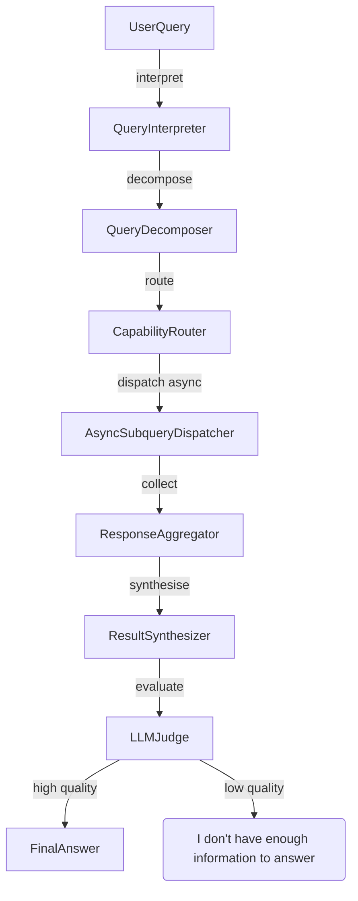

# SmartRouter Extension Requirements Document

## Introduction

This document extends the OpenAgents platform with a **SmartRouter** multi‑agent orchestrator.  The SmartRouter is an advanced orchestrator that can interpret complex user queries, decompose them into simpler subqueries, dispatch those subqueries to specialist agents, and synthesise the results into a coherent final answer.  It leverages a large language model (LLM) both to perform query understanding and decomposition, and to evaluate the quality of the final answer.  The SmartRouter must be implemented alongside, and without breaking, the existing orchestration framework defined in the platform.

Key goals of this extension are:

* Provide a new modular, configurable orchestrator using **OOP best practices** (SOLID, DRY, modularity, dependency injection, extensibility, robustness).
* Add a **YAML configuration** file (`config/smartrouter.yaml`) for controlling SmartRouter behaviour and maintaining hooks so that other orchestrators can be plugged in.
* Allow runtime selection between the SmartRouter and the existing base orchestrator via command‑line parameters in both the Python server and the `run_server.sh` script.
* Deliver comprehensive **pytests** for maximum code coverage, ensuring that all components are thoroughly tested and all discovered issues are fixed.
* Provide **complete inline documentation** and structured Markdown documentation in a new `docs` folder, including mermaid diagrams to illustrate the orchestration flow.

## Glossary

The glossary extends the baseline terminology with SmartRouter‑specific terms:

| Term                              | Definition                                                                                                                                                                                    |
| --------------------------------- | --------------------------------------------------------------------------------------------------------------------------------------------------------------------------------------------- |
| **SmartRouter**                   | A sophisticated orchestrator that uses LLMs to interpret, decompose, route, and synthesise complex queries across multiple agents.                                                            |
| **Subquery**                      | A digestible atomic task derived from a user’s original query, routed to a specialist agent.                                                                                                  |
| **LLM Judge**                     | A language model component that evaluates the completeness, correctness, and clarity of the final answer and decides whether it meets quality criteria or should trigger a fallback response. |
| **Delegation Pattern**            | A routing pattern where the SmartRouter assigns a subquery to an agent and retains control of the conversation.                                                                               |
| **Handoff Pattern**               | A routing pattern where the SmartRouter transfers the conversation context to another agent for iterative or domain‑specific processing.                                                      |
| **Capability Map**                | A mapping of agent names to their respective capabilities as defined in YAML configuration files.                                                                                             |
| **SmartRouter Orchestrator Mode** | A runtime mode in which the server uses the SmartRouter instead of the default orchestrator.                                                                                                  |

## Requirements

### Requirement SR‑1: SmartRouter Orchestrator Module

**User Story:** As a developer, I need a SmartRouter orchestrator that follows OOP best practices so that I can extend and maintain the system easily while decomposing and routing complex queries.

#### Acceptance Criteria

1. THE System SHALL implement a SmartRouter orchestrator in a new Python module at `openagents/asdrp/agents/router/smartrouter.py` using object‑oriented design.
2. THE SmartRouter SHALL follow the SOLID principles: single responsibility, open/closed, Liskov substitution, interface segregation, and dependency inversion.
3. THE SmartRouter implementation SHALL adhere to DRY (Do Not Repeat Yourself) by factoring out reusable logic into well‑named methods or classes.
4. THE SmartRouter SHALL employ dependency injection for model clients, agent registries, and evaluation components to enable easy testing and replacement.
5. THE SmartRouter SHALL be composed of the following internal classes (each in its own file where appropriate):
   * **QueryInterpreter** – responsible for parsing and classifying the user query.
   * **QueryDecomposer** – responsible for breaking the query into independent subqueries and ensuring no cyclic dependencies exist.
   * **CapabilityRouter** – responsible for selecting appropriate agents based on capability maps and determining whether to delegate or hand off each subquery.
   * **AsyncSubqueryDispatcher** – responsible for asynchronously dispatching subqueries to specialist agents and handling timeouts or errors.
   * **ResponseAggregator** – responsible for collecting agent responses and preserving ordering and context.
   * **ResultSynthesizer** – responsible for merging disparate responses into a coherent answer, resolving conflicts, and ensuring clarity.
   * **LLMJudge** – responsible for evaluating the final answer using clearly defined criteria (completeness, accuracy, faithfulness, relevance, clarity, actionability) and deciding whether to return the answer or the fallback message.
6. THE SmartRouter SHALL support both **delegation** and **handoff** routing patterns, selecting the appropriate pattern based on the nature of each subquery (for example, using handoff when iterative interactions are required).
7. THE SmartRouter SHALL expose an interface compatible with the existing orchestrator hooks so that agents can be interchanged without code duplication.
8. THE SmartRouter SHALL log all routing decisions, subquery creation, dispatch outcomes, synthesis steps, and evaluation results at an appropriate log level for debugging and observability.

### Requirement SR‑2: SmartRouter YAML Configuration File

**User Story:** As a system administrator, I want to configure SmartRouter behaviour via YAML so that I can tune its operation without modifying code.

#### Acceptance Criteria

1. THE System SHALL add a new configuration file at `config/smartrouter.yaml` that defines SmartRouter settings.
2. THE SmartRouter YAML file SHALL define:
   * Model parameters for query interpretation, decomposition, synthesis, and evaluation (e.g., model name, temperature, max tokens).
   * Decomposition settings such as maximum number of subqueries, recursion limits, and fallback thresholds.
   * An explicit capability map linking agent names to capability keywords; this MUST default to the same values found in `config/open_agents.yaml` but permit overrides.
   * Evaluation criteria including the fallback message (`"I don't have enough information to answer"`) and thresholds for high‑quality determination.
   * Error handling parameters (e.g., timeouts, retries).
3. THE SmartRouter implementation SHALL load and validate this YAML on startup, using a strict schema with descriptive error messages for invalid configurations.
4. WHEN the SmartRouter YAML is updated in development mode, THE System SHALL reload the configuration without requiring a full restart.
5. WHEN the SmartRouter is disabled via configuration, THE System SHALL not interfere with operation of the default orchestrator and SHALL provide hooks for other orchestrators.

### Requirement SR‑3: Server Runtime Selection

**User Story:** As an operator, I want to choose which orchestrator to use at runtime, so that I can switch between the SmartRouter and the default orchestrator easily.

#### Acceptance Criteria

1. THE System SHALL extend the backend server to accept a command‑line argument `--orchestrator` with values `default` or `smartrouter`.
2. WHEN the server is started with `--orchestrator=smartrouter`, THE System SHALL load configuration from `config/smartrouter.yaml` and instantiate the SmartRouter.
3. WHEN the server is started without specifying an orchestrator, THE System SHALL default to using the existing orchestrator as defined in `config/open_agents.yaml`.
4. THE server SHALL document available orchestrators in its help text (`--help`) and describe the new SmartRouter mode.
5. THE System SHALL also honour an environment variable `ORCHESTRATOR` with the same allowed values for runtime flexibility; command‑line arguments MUST override the environment variable.

### Requirement SR‑4: run_server.sh Enhancements

**User Story:** As a developer, I want to launch the server via a shell script with orchestrator selection, so that I can test different orchestrators without manually crafting Python commands.

#### Acceptance Criteria

1. THE script `run_server.sh` SHALL accept an optional argument specifying the orchestrator (`default` or `smartrouter`).
2. WHEN no argument is provided, THE script SHALL start the server in default orchestrator mode.
3. WHEN the argument is `smartrouter`, THE script SHALL pass `--orchestrator=smartrouter` to the server.
4. THE script SHALL document usage examples at the top of the file.
5. THE script SHALL fail with a descriptive error if an invalid orchestrator argument is provided.

### Requirement SR‑5: OOP Best Practices and Software Engineering Principles

**User Story:** As a lead engineer, I want the SmartRouter codebase to be maintainable and extensible, so that future developers can easily add new features or orchestrators.

#### Acceptance Criteria

1. THE SmartRouter design SHALL strictly follow SOLID principles: each class SHALL have a single responsibility; classes SHOULD be open for extension but closed for modification; abstractions SHALL be substituted without affecting correctness; interfaces SHALL be specific and minimal; and dependencies SHALL be injected rather than hard‑coded.
2. THE codebase SHALL avoid duplication; common functionality MUST be extracted into reusable classes or functions.
3. THE codebase SHALL be modular: each component (router, synthesizer, judge, etc.) MUST be defined in its own file or package with a clear API.
4. THE SmartRouter SHALL use dependency injection (via constructor parameters or factory methods) for model clients and agent dependencies.
5. THE SmartRouter SHALL be extensible so that additional routing strategies or evaluation criteria can be added without modifying existing classes.
6. THE code SHALL include type hints for all public methods and data structures to improve static analysis and documentation quality.
7. THE code SHALL include comprehensive inline docstrings using the Google or Sphinx format, describing parameters, return types, and exceptions.
8. THE code SHALL handle errors robustly; all exceptions MUST be caught and rethrown as domain‑specific exceptions with meaningful messages.

### Requirement SR‑6: Testing Infrastructure for SmartRouter

**User Story:** As a developer, I want comprehensive tests for the SmartRouter so that I can ensure its correctness and prevent regressions.

#### Acceptance Criteria

1. THE System SHALL provide unit tests in `tests/` for every class and function introduced by the SmartRouter, covering normal operation, edge cases, and error handling.
2. THE tests SHALL mock external dependencies (e.g., LLM calls, agent responses) to ensure reproducibility and isolation.
3. THE tests SHALL achieve high coverage (target > 90%) for the SmartRouter module; test cases MUST exercise decomposition logic, routing selection, asynchronous dispatch, synthesis, and evaluation.
4. THE tests SHALL include parametrised tests for varying numbers of subqueries, agent capability overlaps, timeout scenarios, and fallback triggers.
5. THE tests SHALL verify that invalid configurations result in descriptive exceptions.
6. WHEN a bug is discovered in the implementation, THE tests SHALL be updated or added to reproduce the bug before the fix is applied, ensuring test‑driven debugging.
7. THE Continuous Integration pipeline (if present) SHALL run all tests automatically; failing tests MUST block merges.

### Requirement SR‑7: Documentation and Diagrams

**User Story:** As a user or developer, I want thorough documentation for SmartRouter so that I can understand and maintain the system.

#### Acceptance Criteria

1. THE System SHALL include inline documentation via docstrings for all SmartRouter classes and methods, explaining their purpose, parameters, return values, and exceptions.
2. THE System SHALL provide a new `docs` folder containing Markdown files that describe:
   * The overall architecture and flow of the SmartRouter (including query interpretation, decomposition, routing, dispatch, synthesis, and evaluation).
   * Configuration options available in `config/smartrouter.yaml` and how they interact with agents.
   * Guidelines for extending the SmartRouter with new routing strategies or evaluation criteria.
3. THE documentation SHALL include mermaid diagrams illustrating the SmartRouter workflow and component interactions (similar to the baseline `graph` endpoint diagrams), including at least one flowchart and one sequence diagram.
4. THE documentation SHALL follow the same tone, structure, and level of detail as the existing requirements documentation, using headings, tables, and emphasised text as appropriate.
5. THE documentation SHALL be automatically included in any packaged release or deployment script.

### Requirement SR‑8: Fallback and Error Handling

**User Story:** As a user, I want reliable answers or transparent failure messages, so that I understand when the system cannot provide an answer.

#### Acceptance Criteria

1. THE SmartRouter SHALL define a fallback message: **"I don't have enough information to answer"** and return it when the LLM Judge deems the synthesised answer low quality.
2. THE fallback behaviour SHALL be configurable via `config/smartrouter.yaml` without code changes.
3. THE SmartRouter SHALL implement timeouts for agent responses; if an agent fails to respond within the configured time, the dispatcher MUST capture the timeout and continue with available responses.
4. WHEN an agent returns an error, THE SmartRouter SHALL log the error and proceed if other agents succeed; if all subqueries fail, the fallback message MUST be returned.
5. THE SmartRouter SHALL handle malformed agent responses by raising a domain‑specific exception and triggering the fallback message.

### Requirement SR‑9: Integration with Existing Agent Infrastructure

**User Story:** As a platform maintainer, I need the SmartRouter to integrate seamlessly with existing agents and orchestrators, so that the platform remains backward compatible.

#### Acceptance Criteria

1. THE SmartRouter SHALL read the existing `config/open_agents.yaml` for agent definitions and merge or override capability maps from `config/smartrouter.yaml`.
2. THE SmartRouter SHALL interact with agents through the same base interface (AgentProtocol) used by the default orchestrator.
3. THE SmartRouter SHALL not modify or interfere with the operation of the default orchestrator unless explicitly selected at runtime.
4. THE SmartRouter SHALL maintain hooks or extension points so that additional orchestrators can be plugged in through configuration and runtime selection.
5. THE SmartRouter SHALL expose instrumentation or metrics (e.g., via log entries or optional metrics endpoints) similar to the existing orchestrator to aid monitoring.

### Requirement SR‑10: Deployment and Operations

**User Story:** As a DevOps engineer, I want the SmartRouter extension to deploy as easily as the existing system, so that I can run it in various environments.

#### Acceptance Criteria

1. THE SmartRouter SHALL be built and packaged as part of the existing project without altering deployment scripts other than to support orchestrator selection.
2. THE `run_server.sh` script and the `Dockerfile` (if present) SHALL copy the new configuration file `config/smartrouter.yaml` into the image.
3. THE health check endpoint MUST indicate which orchestrator is currently active.
4. THE server startup logs SHALL include the name of the active orchestrator and the path of the loaded configuration file.
5. THE SmartRouter SHALL support graceful shutdown, ensuring that any asynchronous tasks or subprocesses (e.g., MCP servers) are terminated cleanly.

## Appendix: Example Mermaid Diagram Placeholder

The following mermaid diagram illustrates the high‑level SmartRouter workflow.  The actual diagram MUST be implemented in the `docs` folder as part of the project documentation.

## Conclusion

By satisfying these requirements, the OpenAgents platform will gain a robust, extensible SmartRouter orchestrator that provides advanced multi‑agent routing capabilities while adhering to sound software engineering practices.  The SmartRouter will coexist with existing orchestrators and can be selected at runtime, enabling developers and users to benefit from more powerful and context‑aware interactions without sacrificing reliability or maintainability.