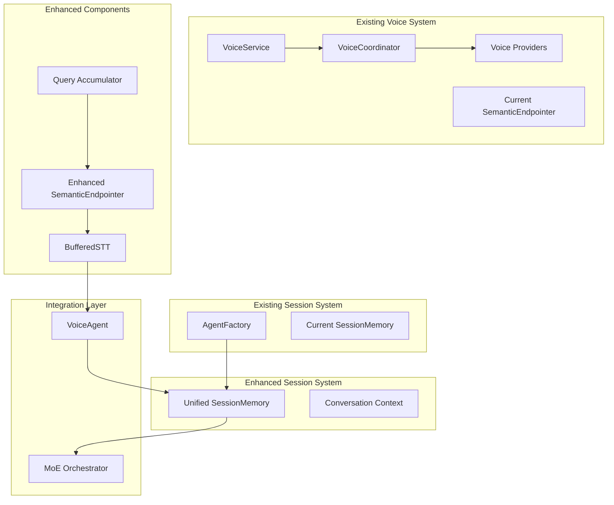

# Design Document

## Overview

This design enhances the existing voice interaction system with intelligent query accumulation, improved semantic endpointing, and unified session memory. The architecture builds upon the current VoiceService, VoiceCoordinator, and provider system while adding new components for robustness and session continuity.

The system addresses current limitations by extending existing components:
1. **Voice Processing Layer**: Enhance existing semantic endpointing and add query accumulation
2. **Session Management Layer**: Extend existing AgentFactory session memory for voice interactions
3. **Integration Layer**: Improve integration between VoiceAgent and MoE orchestrator

## Architecture

### High-Level Architecture



### Component Relationships

The system extends existing dependency injection patterns and interfaces:

- **IQueryAccumulator**: New interface for buffering and combining speech segments
- **ISemanticEndpointer**: Enhanced version of existing interface
- **IVoiceProvider**: Existing interface (no changes needed)
- **ISessionMemory**: Enhanced version extending existing AgentFactory session memory
- **VoiceConfigManager**: Existing configuration system (extend for new features)

## Components and Interfaces

### 1. Query Accumulation System (New Component)

#### IQueryAccumulator Interface

```python
from abc import ABC, abstractmethod
from typing import List, Optional
from dataclasses import dataclass
from enum import Enum

class QueryStatus(Enum):
    ACCUMULATING = "accumulating"
    READY = "ready"
    TIMEOUT = "timeout"

@dataclass
class SpeechSegment:
    text: str
    confidence: float
    start_time: float
    end_time: float
    silence_after: float

@dataclass
class AccumulatedQuery:
    text: str
    segments: List[SpeechSegment]
    total_duration: float
    confidence: float
    status: QueryStatus

class IQueryAccumulator(ABC):
    @abstractmethod
    async def add_segment(self, segment: SpeechSegment) -> AccumulatedQuery:
        """Add speech segment to accumulator."""
        pass
    
    @abstractmethod
    async def force_completion(self) -> Optional[AccumulatedQuery]:
        """Force completion of current query."""
        pass
    
    @abstractmethod
    def reset(self) -> None:
        """Reset accumulator state."""
        pass
```

#### BufferedQueryAccumulator Implementation

```python
class BufferedQueryAccumulator(IQueryAccumulator):
    """
    Buffers speech segments and combines them into complete queries.
    
    Features:
    - Intelligent text normalization (stutter removal, repetition handling)
    - Configurable timeout and buffer limits
    - Confidence-based segment filtering
    - Rolling buffer for context preservation
    """
    
    def __init__(
        self,
        max_buffer_duration: float = 45.0,
        min_confidence: float = 0.6,
        stutter_threshold: float = 0.3,
        normalization_enabled: bool = True
    ):
        self._segments: List[SpeechSegment] = []
        self._max_duration = max_buffer_duration
        self._min_confidence = min_confidence
        self._stutter_threshold = stutter_threshold
        self._normalization_enabled = normalization_enabled
        self._start_time: Optional[float] = None
    
    async def add_segment(self, segment: SpeechSegment) -> AccumulatedQuery:
        """Add segment with intelligent normalization."""
        if self._start_time is None:
            self._start_time = segment.start_time
        
        # Filter low-confidence segments
        if segment.confidence < self._min_confidence:
            return self._build_current_query(QueryStatus.ACCUMULATING)
        
        # Normalize text if enabled
        if self._normalization_enabled:
            segment = self._normalize_segment(segment)
        
        self._segments.append(segment)
        
        # Check for timeout
        total_duration = segment.end_time - self._start_time
        if total_duration > self._max_duration:
            return self._build_current_query(QueryStatus.TIMEOUT)
        
        return self._build_current_query(QueryStatus.ACCUMULATING)
    
    def _normalize_segment(self, segment: SpeechSegment) -> SpeechSegment:
        """Remove stutters and normalize text."""
        # Implementation for stutter detection and removal
        # Word repetition detection and cleanup
        # Filler word removal (um, uh, etc.)
        pass
```

### 2. Enhanced Semantic Endpointing System

#### Enhanced SemanticEndpointer (Extends Existing)

The existing `SemanticEndpointer` in `server/voice/realtime/semantic_endpointing.py` will be enhanced with:

```python
class EnhancedSemanticEndpointer(SemanticEndpointer):
    """
    Enhanced semantic endpointing with query accumulation integration.
    
    Extends the existing SemanticEndpointer with:
    - Query accumulation awareness
    - Multi-turn conversation context
    - User-specific pattern learning
    - Improved confidence scoring
    """
    
    def __init__(
        self,
        query_accumulator: IQueryAccumulator,
        session_memory: 'IUnifiedSessionMemory',
        strategy: Optional[IEndpointingStrategy] = None,
        enable_logging: bool = True,
    ):
        super().__init__(strategy, enable_logging)
        self._query_accumulator = query_accumulator
        self._session_memory = session_memory
        self._user_patterns: Dict[str, Any] = {}
    
    async def analyze_with_context(
        self,
        text: str,
        silence_duration: float,
        utterance_duration: float,
        session_id: Optional[str] = None,
        context: Optional[Dict[str, Any]] = None,
    ) -> EndpointingResult:
        """
        Analyze utterance with conversation context and user patterns.
        
        Enhances the existing analyze_utterance method with:
        - Session-based conversation context
        - User-specific speaking patterns
        - Query accumulation state awareness
        """
        # Get conversation context from session memory
        conversation_context = []
        if session_id and self._session_memory:
            try:
                conversation_context = await self._session_memory.get_conversation_context(
                    session_id, max_turns=5
                )
            except Exception as e:
                logger.warning(f"Failed to get conversation context: {e}")
        
        # Get user patterns
        user_patterns = self._user_patterns.get(session_id, {}) if session_id else {}
        
        # Create enhanced context
        enhanced_context = {
            'conversation_history': [turn.user_query for turn in conversation_context],
            'current_topic': self._extract_current_topic(conversation_context),
            'user_speaking_patterns': user_patterns,
            'session_metadata': context or {}
        }
        
        # Use existing analysis with enhanced context
        result = self.analyze_utterance(text, silence_duration, utterance_duration, enhanced_context)
        
        # Update user patterns based on result
        if session_id:
            self._update_user_patterns(session_id, result)
        
        return result
```

### 3. Enhanced Voice Provider System (Extends Existing)

The existing provider system in `server/voice/providers/` already implements the interfaces we need. We'll enhance the ElevenLabs provider to support the latest features:

```python
# Extend existing ElevenLabsProvider in server/voice/providers/elevenlabs_provider.py
class EnhancedElevenLabsProvider(ElevenLabsProvider):
    """
    Enhanced ElevenLabs provider with latest API features.
    
    Adds support for:
    - Latest Scribe v2 models
    - Advanced diarization features
    - Multi-channel transcription
    - Enhanced voice cloning
    """
    
    async def transcribe_with_advanced_features(
        self,
        audio_data: bytes,
        config: Optional[STTConfig] = None,
        enable_diarization: bool = False,
        enable_audio_events: bool = True,
        multi_channel: bool = False
    ) -> TranscriptResult:
        """Enhanced transcription with advanced ElevenLabs features."""
        # Implementation using latest ElevenLabs SDK features
        pass
```

### 4. Unified Session Memory System (Extends Existing)

#### IUnifiedSessionMemory Interface (Extends AgentFactory)

```python
from abc import ABC, abstractmethod
from typing import List, Optional, Dict, Any
from dataclasses import dataclass
from datetime import datetime

# Extend existing session memory from asdrp/agents/agent_factory.py
from asdrp.agents.agent_factory import AgentFactory
from asdrp.agents.config_loader import SessionMemoryConfig

@dataclass
class VoiceConversationTurn:
    """Extended conversation turn for voice interactions."""
    turn_id: str
    user_query: str
    agent_response: str
    timestamp: datetime
    metadata: Dict[str, Any]
    expert_selections: Optional[List[str]] = None
    voice_metadata: Optional[Dict[str, Any]] = None  # Voice-specific data

@dataclass
class VoiceSessionContext:
    """Extended session context for voice interactions."""
    session_id: str
    user_id: str
    turns: List[VoiceConversationTurn]
    created_at: datetime
    last_activity: datetime
    metadata: Dict[str, Any]
    voice_preferences: Optional[Dict[str, Any]] = None

class IUnifiedSessionMemory(ABC):
    @abstractmethod
    async def create_voice_session(
        self,
        session_id: str,
        user_id: str,
        voice_preferences: Optional[Dict[str, Any]] = None,
        metadata: Optional[Dict[str, Any]] = None
    ) -> VoiceSessionContext:
        """Create new voice session with enhanced context."""
        pass
    
    @abstractmethod
    async def get_voice_session(self, session_id: str) -> Optional[VoiceSessionContext]:
        """Retrieve voice session context."""
        pass
    
    @abstractmethod
    async def add_voice_turn(
        self,
        session_id: str,
        turn: VoiceConversationTurn
    ) -> None:
        """Add voice conversation turn."""
        pass
    
    @abstractmethod
    async def get_conversation_context(
        self,
        session_id: str,
        max_turns: int = 10
    ) -> List[VoiceConversationTurn]:
        """Get recent conversation context for voice interactions."""
        pass

class UnifiedSessionMemory(IUnifiedSessionMemory):
    """
    Unified session memory extending existing AgentFactory session support.
    
    Features:
    - Extends existing SQLite session storage
    - Voice-specific metadata and preferences
    - Conversation summarization
    - Cross-component session sharing
    - Thread-safe operations
    """
    
    def __init__(
        self,
        agent_factory: AgentFactory,
        config: SessionMemoryConfig
    ):
        self._agent_factory = agent_factory
        self._config = config
        self._session_cache: Dict[str, VoiceSessionContext] = {}
    
    async def create_voice_session(
        self,
        session_id: str,
        user_id: str,
        voice_preferences: Optional[Dict[str, Any]] = None,
        metadata: Optional[Dict[str, Any]] = None
    ) -> VoiceSessionContext:
        """Create voice session using existing AgentFactory session infrastructure."""
        # Use existing session creation but add voice-specific enhancements
        base_session = self._agent_factory.get_session("voice", session_id=session_id)
        
        voice_session = VoiceSessionContext(
            session_id=session_id,
            user_id=user_id,
            turns=[],
            created_at=datetime.now(),
            last_activity=datetime.now(),
            metadata=metadata or {},
            voice_preferences=voice_preferences
        )
        
        self._session_cache[session_id] = voice_session
        return voice_session
```

## Data Models

### Configuration Models (Extends Existing)

```python
# Extend existing VoiceConfig in server/voice/models.py
@dataclass
class EnhancedVoiceConfig(VoiceConfig):
    """Enhanced voice configuration with query accumulation and session memory."""
    
    # Query accumulation settings
    query_accumulation: QueryAccumulatorConfig = field(default_factory=QueryAccumulatorConfig)
    
    # Enhanced semantic endpointing
    semantic_endpointing: SemanticEndpointingConfig = field(default_factory=SemanticEndpointingConfig)
    
    # Session memory integration
    session_memory: SessionMemoryConfig = field(default_factory=SessionMemoryConfig)

@dataclass
class QueryAccumulatorConfig:
    max_buffer_duration: float = 45.0
    min_confidence: float = 0.6
    stutter_threshold: float = 0.3
    normalization_enabled: bool = True
    timeout_strategy: str = "force_process"

@dataclass
class SemanticEndpointingConfig:
    linguistic_weight: float = 0.4
    prosodic_weight: float = 0.3
    contextual_weight: float = 0.3
    confidence_threshold: float = 0.7
    min_silence_complete: float = 0.8
    min_silence_ambiguous: float = 0.4
    max_wait_time: float = 3.0
    enable_user_patterns: bool = True

# Extend existing SessionMemoryConfig in asdrp/agents/config_loader.py
@dataclass
class VoiceSessionMemoryConfig(SessionMemoryConfig):
    """Voice-specific session memory configuration."""
    max_turns_before_summary: int = 20
    session_expiry_hours: int = 24
    cleanup_interval_hours: int = 6
    enable_summarization: bool = True
    voice_preferences_storage: bool = True
```

### Integration Models (Extends Existing)

```python
# Extend existing models in server/voice/realtime/agent.py
@dataclass
class EnhancedVoiceInteractionResult:
    """Enhanced voice interaction result with accumulation metadata."""
    query: str
    accumulated_segments: List[SpeechSegment]
    response: str
    session_id: str
    experts_used: List[str]
    processing_time_ms: float
    endpointing_decision: EndpointingDecision
    metadata: Dict[str, Any]

@dataclass
class VoiceSessionState:
    """Voice session state for tracking ongoing interactions."""
    session_id: str
    user_id: str
    current_query: Optional[AccumulatedQuery]
    conversation_context: List[VoiceConversationTurn]
    voice_config: EnhancedVoiceConfig
    last_interaction: datetime
    user_patterns: Dict[str, Any]
```

Now I'll use the prework tool to analyze the acceptance criteria for correctness properties:

<function_calls>
<invoke name="prework">
<parameter name="featureName">voice-robustness-session-memory

## Correctness Properties

*A property is a characteristic or behavior that should hold true across all valid executions of a system-essentially, a formal statement about what the system should do. Properties serve as the bridge between human-readable specifications and machine-verifiable correctness guarantees.*

Based on the prework analysis of acceptance criteria, the following correctness properties will be implemented as property-based tests to ensure system reliability:

### Query Accumulation Properties

**Property 1: Speech segment buffering with pauses**
*For any* sequence of speech segments with pauses up to 2 seconds, the Query_Accumulator should combine them into a single accumulated query
**Validates: Requirements 1.1**

**Property 2: Query appending behavior**
*For any* existing query buffer and new speech segment, adding the segment should append the text while preserving the existing content
**Validates: Requirements 1.2**

**Property 3: Stutter normalization**
*For any* speech segment containing repeated words or stutters, the Query_Accumulator should normalize the text by removing obvious repetitions
**Validates: Requirements 1.3**

**Property 4: Buffer timeout handling**
*For any* accumulated query exceeding 30 seconds of total speech duration, the Query_Accumulator should force processing and return a timeout status
**Validates: Requirements 1.4**

**Property 5: Rolling buffer maintenance**
*For any* sequence of speech segments, the Query_Accumulator should maintain a rolling buffer containing only the last 45 seconds of speech
**Validates: Requirements 1.5**

### Semantic Endpointing Properties

**Property 6: Multi-modal analysis consistency**
*For any* speech segment, the Semantic_Endpointer should analyze linguistic cues, prosodic features, and conversation context to produce consistent completeness assessments
**Validates: Requirements 2.1**

**Property 7: Complete query endpointing**
*For any* syntactically complete query with silence duration >= 0.8 seconds, the Semantic_Endpointer should return an ENDPOINT decision
**Validates: Requirements 2.2**

**Property 8: Incomplete query continuation**
*For any* query ending with prepositions or conjunctions, the Semantic_Endpointer should return CONTINUE or WAIT decision with suggested wait time <= 3 seconds
**Validates: Requirements 2.3**

**Property 9: Question pattern handling**
*For any* incomplete question pattern, the Semantic_Endpointer should wait for complete question structure before returning ENDPOINT decision
**Validates: Requirements 2.4**

### Session Memory Properties

**Property 10: Cross-component session consistency**
*For any* session identifier, both Voice_Mode and MoE_Orchestrator should access the same conversation history and session data
**Validates: Requirements 3.1**

**Property 11: Persistent session initialization**
*For any* voice session creation, the Session_Memory should initialize with SQLite storage regardless of individual agent session configurations
**Validates: Requirements 3.2**

**Property 12: Context provision for orchestration**
*For any* query processed through MoE_Orchestrator, the Session_Memory should provide conversation context that includes previous turns and metadata
**Validates: Requirements 3.3**

**Property 13: Complete turn storage**
*For any* conversation turn, the Session_Memory should store user query, agent response, timestamp, and expert selections (when available)
**Validates: Requirements 3.4**

**Property 14: Session expiry management**
*For any* session inactive for 24+ hours, the Session_Memory should mark it for expiry while preserving conversation threads that meet retention criteria
**Validates: Requirements 3.5**

### Multi-Turn Conversation Properties

**Property 15: Context-aware follow-up processing**
*For any* follow-up query with conversation history, the MoE_Orchestrator should use previous turns to understand context and references
**Validates: Requirements 4.1**

**Property 16: Expert selection consistency**
*For any* expert selection with conversation history, the MoE_Orchestrator should consider previous expert choices to maintain topical consistency
**Validates: Requirements 4.3**

**Property 17: Conversation thread maintenance**
*For any* session, the Session_Memory should maintain up to 20 turns of conversation history for context retrieval
**Validates: Requirements 4.4**

**Property 18: Intelligent conversation summarization**
*For any* conversation exceeding the turn limit, the Session_Memory should summarize older turns while preserving key information and context
**Validates: Requirements 4.5**

### Error Handling Properties

**Property 19: Semantic endpointing fallback**
*For any* semantic endpointing failure, the Voice_Agent should fall back to silence-based endpointing with conservative thresholds
**Validates: Requirements 5.1**

**Property 20: Session memory error recovery**
*For any* session memory operation failure, the Voice_Agent should continue processing queries without session context rather than failing completely
**Validates: Requirements 5.2**

**Property 21: Buffer overflow handling**
*For any* query accumulation buffer overflow, the Query_Accumulator should process the current buffer and reset to start fresh
**Validates: Requirements 5.3**

**Property 22: MoE session error handling**
*For any* session memory error in MoE_Orchestrator, the system should log the error and continue with stateless processing
**Validates: Requirements 5.4**

**Property 23: Thinking filler provision**
*For any* query processing that exceeds 1.5 seconds, the Voice_Agent should provide thinking fillers to maintain user engagement
**Validates: Requirements 6.5**

### Configuration Properties

**Property 24: Semantic endpointing configuration support**
*For any* valid configuration values for silence duration, confidence levels, and linguistic markers, the Semantic_Endpointer should accept and apply them correctly
**Validates: Requirements 7.1**

**Property 25: Query accumulator configuration support**
*For any* valid configuration values for buffer sizes, timeout values, and normalization rules, the Query_Accumulator should accept and apply them correctly
**Validates: Requirements 7.2**

**Property 26: Session memory configuration support**
*For any* valid configuration values for retention policies, storage backends, and cleanup schedules, the Session_Memory should accept and apply them correctly
**Validates: Requirements 7.3**

**Property 27: Runtime configuration updates**
*For any* non-sensitive configuration change, the system should apply updates without requiring service restart
**Validates: Requirements 7.5**

### ElevenLabs Integration Properties

**Property 28: ElevenLabs TTS provider support**
*For any* TTS operation, when ElevenLabs is configured as the provider, the system should use the ELEVENLABS_API_KEY and produce valid audio output
**Validates: Requirements 11.1**

**Property 29: Environment configuration loading**
*For any* system startup, the ElevenLabs API key should be loaded from the .env file using python-dotenv package
**Validates: Requirements 11.2**

**Property 30: ElevenLabs model support**
*For any* synthesis request, the system should support Eleven Multilingual v2, Eleven Flash v2.5, and Eleven Turbo v2.5 models
**Validates: Requirements 11.3**

**Property 31: ElevenLabs voice selection**
*For any* available voice in the ElevenLabs library, the system should support voice selection and cloning capabilities
**Validates: Requirements 11.4**

**Property 32: ElevenLabs parameter support**
*For any* synthesis request, the system should support stability, similarity_boost, style, and speaker_boost parameters
**Validates: Requirements 11.5**

**Property 33: TTS provider fallback**
*For any* ElevenLabs TTS failure or unavailability, the system should fall back to OpenAI TTS
**Validates: Requirements 11.6**

**Property 34: ElevenLabs STT provider support**
*For any* transcription operation, when ElevenLabs is configured as the STT provider, the system should use Scribe models and produce valid transcription results
**Validates: Requirements 12.1**

**Property 35: Unified API key usage**
*For any* ElevenLabs service (TTS or STT), the system should use the same ELEVENLABS_API_KEY environment variable
**Validates: Requirements 12.2**

**Property 36: ElevenLabs STT feature support**
*For any* transcription request, the system should support speaker diarization, audio event tagging, and multi-channel transcription features
**Validates: Requirements 12.3**

**Property 37: STT parameter configuration**
*For any* transcription request, the system should support configurable language_code, timestamps_granularity, and diarization_threshold parameters
**Validates: Requirements 12.4**

**Property 38: ElevenLabs response handling**
*For any* ElevenLabs STT response, the system should correctly parse and handle provider-specific formats and metadata
**Validates: Requirements 12.5**

**Property 39: STT provider fallback**
*For any* ElevenLabs STT failure or unavailability, the system should fall back to OpenAI Whisper
**Validates: Requirements 12.6**

### Configuration Management Properties

**Property 40: YAML configuration loading**
*For any* valid YAML configuration in config/voice_config.yaml, the system should load and apply voice provider settings following dependency injection principles
**Validates: Requirements 13.1**

**Property 41: Provider configuration separation**
*For any* provider-specific configuration, the system should maintain clear separation between OpenAI and ElevenLabs settings
**Validates: Requirements 13.2**

**Property 42: Interface-based provider switching**
*For any* voice provider combination (TTS/STT), the system should support runtime switching through interface-based dependency injection
**Validates: Requirements 13.3**

**Property 43: Environment variable overrides**
*For any* sensitive configuration like API keys, environment variables should override YAML settings while maintaining structure for other settings
**Validates: Requirements 13.4**

**Property 44: Configuration validation**
*For any* configuration input, the system should validate settings at startup and provide clear error messages for invalid configurations
**Validates: Requirements 13.5**

**Property 45: Hot configuration reloading**
*For any* non-sensitive configuration change, the system should support hot-reloading without service restart
**Validates: Requirements 13.6**

## Error Handling

The system implements comprehensive error handling following the fail-safe principle:

### Error Recovery Strategies

1. **Graceful Degradation**: When advanced features fail, fall back to simpler alternatives
2. **Circuit Breaker Pattern**: Prevent cascading failures by temporarily disabling failing components
3. **Retry with Backoff**: Implement exponential backoff for transient failures
4. **Fallback Providers**: Automatic switching between voice providers on failure

### Error Categories

- **Configuration Errors**: Invalid settings, missing API keys, malformed YAML
- **Provider Errors**: API failures, network issues, quota exceeded
- **Processing Errors**: Semantic analysis failures, buffer overflows, timeout conditions
- **Storage Errors**: Database connection issues, disk space problems, corruption

### Monitoring and Alerting

- **Health Checks**: Regular provider availability and performance monitoring
- **Metrics Collection**: Query processing times, error rates, fallback frequency
- **Structured Logging**: Comprehensive logging with correlation IDs for debugging
- **Alert Thresholds**: Configurable alerts for error rates and performance degradation

## Testing Strategy

The system employs a comprehensive testing approach combining unit tests, integration tests, and property-based tests:

### Unit Testing
- **Component Isolation**: Test individual components with mocked dependencies
- **Edge Case Coverage**: Test boundary conditions, error scenarios, and invalid inputs
- **Configuration Testing**: Validate configuration loading and validation logic
- **Provider Testing**: Test voice provider implementations with mock APIs

### Property-Based Testing
- **Universal Properties**: Test properties that should hold for all valid inputs
- **Randomized Testing**: Generate diverse test cases to uncover edge cases
- **Invariant Verification**: Ensure system invariants are maintained across operations
- **Regression Prevention**: Catch regressions through comprehensive property coverage

**Property Test Configuration**:
- Minimum 100 iterations per property test
- Each property test references its design document property
- Tag format: **Feature: voice-robustness-session-memory, Property {number}: {property_text}**

### Integration Testing
- **End-to-End Scenarios**: Test complete voice interaction workflows
- **Provider Integration**: Test actual API integrations with rate limiting
- **Session Continuity**: Verify session memory across system restarts
- **Multi-Component Testing**: Test interactions between voice processing and MoE orchestrator

### Performance Testing
- **Latency Validation**: Ensure response times meet requirements
- **Load Testing**: Validate system behavior under concurrent voice sessions
- **Memory Usage**: Monitor memory consumption and detect leaks
- **Scalability Testing**: Test system limits and degradation patterns

The testing strategy ensures high confidence in system reliability while maintaining development velocity through automated test execution and comprehensive coverage reporting.