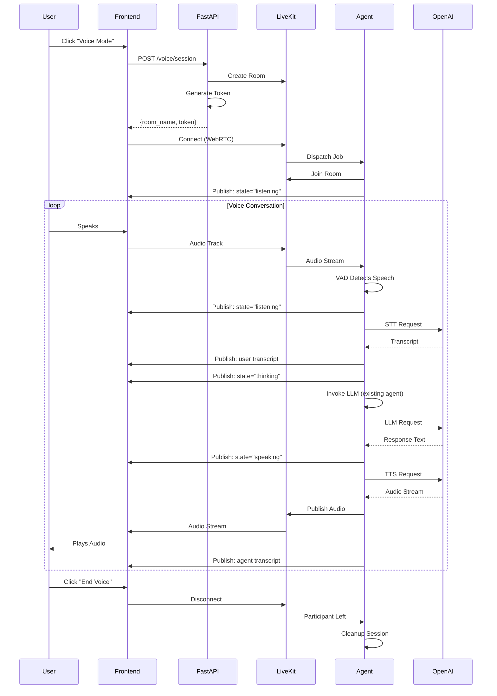
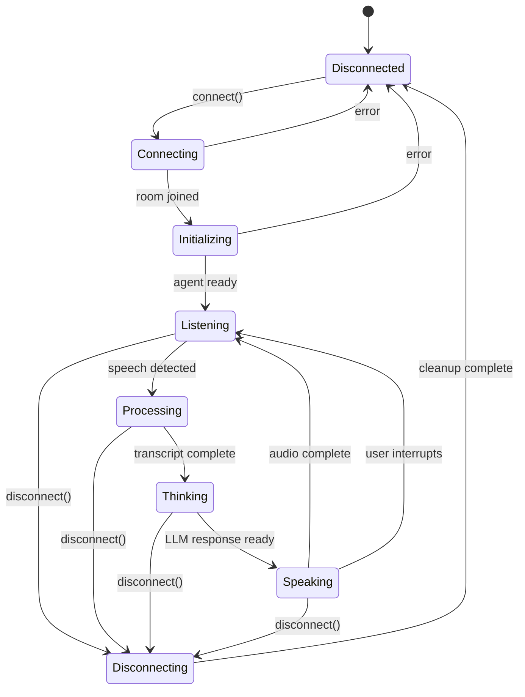

# Real-Time Voice Agent System Specification

## Executive Summary

This specification defines a production-ready real-time voice agent system that enables continuous, natural voice conversations between users and AI agents without explicit turn-by-turn transcription. The system provides seamless bidirectional voice communication with visual feedback representing listening, thinking, and speaking states.

**Version:** 1.0.0  
**Status:** Draft  
**Last Updated:** December 2025

---

## Table of Contents

1. [Introduction](#1-introduction)
2. [Architectural Approaches Analysis](#2-architectural-approaches-analysis)
3. [Recommended Architecture](#3-recommended-architecture)
4. [System Architecture](#4-system-architecture)
5. [Backend Specification](#5-backend-specification)
6. [Frontend Specification](#6-frontend-specification)
7. [Data Models](#7-data-models)
8. [Configuration](#8-configuration)
9. [Testing Requirements](#9-testing-requirements)
10. [Deployment Considerations](#10-deployment-considerations)
11. [File Structure](#11-file-structure)
12. [Dependencies](#12-dependencies)

---

## 1. Introduction

### 1.1 Purpose

The Real-Time Voice Agent System extends the existing OpenAgents platform to support continuous, natural voice conversations. Unlike the current async voice capability that requires explicit transcription for each turn, this system enables:

- **Continuous listening** with automatic voice activity detection (VAD)
- **Real-time transcription** that streams to the agent without user action
- **Streaming agent responses** that begin playing as they're generated
- **Natural interruption handling** allowing users to interject mid-response
- **Visual state representation** showing listening, thinking, and speaking states

### 1.2 Scope

This specification covers:

- Backend Python implementation using LiveKit Agents framework
- OpenAI STT and TTS model integration
- WebRTC-based real-time audio transport
- Frontend React components for voice mode with animations
- Integration with existing agent orchestration (`asdrp.orchestration.smartrouter` and `asdrp.agents.single`)

### 1.3 Glossary

| Term | Definition |
|------|------------|
| **VAD** | Voice Activity Detection - automatically detects when a user starts/stops speaking |
| **STT** | Speech-to-Text - converts audio to text |
| **TTS** | Text-to-Speech - converts text to audio |
| **Turn Detection** | Semantic model determining when a user has finished their conversational turn |
| **Endpointing** | Process of detecting the end of speech in an audio stream |
| **WebRTC** | Web Real-Time Communication protocol for peer-to-peer audio/video |
| **LiveKit** | Real-time communication platform providing WebRTC infrastructure |
| **Room** | LiveKit abstraction for a communication session between participants |
| **Agent Session** | LiveKit abstraction managing the voice AI pipeline lifecycle |
| **Pipeline Agent** | STT → LLM → TTS chained architecture |
| **Realtime/Multimodal Agent** | Speech-to-Speech (S2S) architecture using models like gpt-4o-realtime |

---

## 2. Architectural Approaches Analysis

### 2.1 Approach A: OpenAI Realtime API (Speech-to-Speech)

**Description:** Direct use of OpenAI's `gpt-4o-realtime-preview` model via WebSocket/WebRTC for true speech-to-speech processing.

```
┌─────────────┐    WebRTC     ┌──────────────────────┐
│   Browser   │ ────────────► │  OpenAI Realtime API │
│  (Client)   │ ◄──────────── │  (gpt-4o-realtime)   │
└─────────────┘               └──────────────────────┘
```

**Pros:**
- Lowest latency (~300ms response time)
- Native understanding of prosody, emotion, and vocal nuances
- Single model handles entire audio-to-audio pipeline
- Built-in interruption detection
- Preserves non-verbal cues (tone, emphasis, accents)

**Cons:**
- No text transcript intermediate step (reduced controllability)
- Higher cost per conversation
- Limited model selection (only gpt-4o-realtime variants)
- Cannot integrate with existing text-based agent workflows
- Less transparency in the processing pipeline
- Vendor lock-in to OpenAI

**Best For:** Highly interactive, low-latency conversational applications where natural voice quality is paramount.

### 2.2 Approach B: Chained Pipeline (STT → LLM → TTS)

**Description:** Traditional three-stage pipeline where audio is transcribed, processed by an LLM, then synthesized back to speech.

```
┌──────────┐   audio   ┌─────┐   text   ┌─────┐   text   ┌─────┐   audio   ┌──────────┐
│ Browser  │ ────────► │ STT │ ───────► │ LLM │ ───────► │ TTS │ ────────► │ Browser  │
└──────────┘           └─────┘          └─────┘          └─────┘           └──────────┘
```

**Pros:**
- Full control over each processing stage
- Text transcripts available at every step
- Can use any combination of STT, LLM, and TTS providers
- Integrates with existing text-based agent systems
- Lower cost with model flexibility
- Transparent and debuggable

**Cons:**
- Higher cumulative latency (1.5-3s typical)
- Loss of prosodic information between stages
- More complex orchestration required
- Each stage introduces potential failure points

**Best For:** Applications requiring full transcript control, existing text-based agent integration, or cost optimization.

### 2.3 Approach C: LiveKit Agents with STT-LLM-TTS Pipeline

**Description:** LiveKit Agents framework orchestrating a chained pipeline with WebRTC transport to clients.

```
┌──────────┐  WebRTC   ┌─────────────────────────────────────────┐   HTTP/WS   ┌──────────────┐
│ Browser  │ ◄───────► │            LiveKit Server               │ ◄─────────► │ AI Providers │
│ (Client) │           │                                         │             │ (STT/LLM/TTS)│
└──────────┘           │  ┌──────────────────────────────────┐   │             └──────────────┘
                       │  │        LiveKit Agent              │   │
                       │  │  ┌─────┐  ┌─────┐  ┌─────┐       │   │
                       │  │  │ VAD │→ │ STT │→ │ LLM │→ │TTS │   │
                       │  │  └─────┘  └─────┘  └─────┘  └───┘   │   │
                       │  │                                      │   │
                       │  │  • Turn Detection                    │   │
                       │  │  • Interruption Handling             │   │
                       │  │  • Transcript Sync                   │   │
                       │  └──────────────────────────────────┘   │
                       └─────────────────────────────────────────┘
```

**Pros:**
- Production-grade WebRTC infrastructure handles unreliable networks
- Automatic VAD, turn detection, and interruption handling
- Plugin ecosystem for multiple AI providers
- Full text transcripts at every stage
- Background audio support (thinking sounds, ambient)
- Native frontend components (React, Swift, Android)
- Open-source with self-hosting option
- Semantic turn detection using transformer models
- Built-in noise cancellation integration (Krisp)

**Cons:**
- Additional infrastructure layer (LiveKit server required)
- Learning curve for LiveKit-specific concepts
- STT-LLM-TTS latency still present (though optimized)

**Best For:** Production applications requiring reliable real-time communication, multi-platform support, and flexibility in AI provider selection.

### 2.4 Approach D: LiveKit Agents with OpenAI Realtime Model

**Description:** LiveKit Agents framework using OpenAI's realtime model for speech-to-speech, with LiveKit handling transport.

```
┌──────────┐  WebRTC   ┌─────────────────────────────────────────┐  WebSocket  ┌──────────────────┐
│ Browser  │ ◄───────► │            LiveKit Server               │ ◄─────────► │ OpenAI Realtime  │
│ (Client) │           │                                         │             │ API              │
└──────────┘           │  ┌──────────────────────────────────┐   │             └──────────────────┘
                       │  │   LiveKit MultimodalAgent         │   │
                       │  │                                   │   │
                       │  │  • Audio passthrough to OpenAI    │   │
                       │  │  • Transcript synchronization     │   │
                       │  │  • Interruption coordination      │   │
                       │  │  • Tool call handling             │   │
                       │  └──────────────────────────────────┘   │
                       └─────────────────────────────────────────┘
```

**Pros:**
- Best of both worlds: LiveKit reliability + OpenAI voice quality
- WebRTC handles poor network conditions gracefully
- Automatic transcript time-alignment with audio
- Same frontend components work for both pipeline and realtime
- Can add tools that leverage the realtime API

**Cons:**
- Limited to OpenAI realtime models
- Higher cost than chained approach
- Less control over intermediate processing
- OpenAI Realtime API still in preview

**Best For:** Applications prioritizing voice quality and low latency while needing robust network handling and native client support.

### 2.5 Architectural Decision Matrix

| Criterion | Weight | A: OpenAI Direct | B: Chained | C: LiveKit+Pipeline | D: LiveKit+Realtime |
|-----------|--------|------------------|------------|---------------------|---------------------|
| Latency | 20% | ★★★★★ | ★★☆☆☆ | ★★★☆☆ | ★★★★☆ |
| Voice Quality | 15% | ★★★★★ | ★★★☆☆ | ★★★★☆ | ★★★★★ |
| Transcript Control | 15% | ★☆☆☆☆ | ★★★★★ | ★★★★★ | ★★★☆☆ |
| Provider Flexibility | 10% | ★☆☆☆☆ | ★★★★★ | ★★★★★ | ★★☆☆☆ |
| Existing Agent Integration | 15% | ★★☆☆☆ | ★★★★★ | ★★★★★ | ★★★☆☆ |
| Network Reliability | 10% | ★★☆☆☆ | ★★☆☆☆ | ★★★★★ | ★★★★★ |
| Cost Efficiency | 10% | ★★☆☆☆ | ★★★★☆ | ★★★★☆ | ★★☆☆☆ |
| Frontend Support | 5% | ★★★☆☆ | ★★☆☆☆ | ★★★★★ | ★★★★★ |
| **Weighted Score** | 100% | **2.85** | **3.35** | **4.05** | **3.70** |

---

## 3. Recommended Architecture

### 3.1 Decision: LiveKit Agents with STT-LLM-TTS Pipeline (Approach C)

**Primary Recommendation:** Approach C (LiveKit Agents with STT-LLM-TTS Pipeline)

**Rationale:**

1. **Integration with Existing System:** The OpenAgents platform already has text-based agent workflows (`asdrp.orchestration.smartrouter`, `asdrp.agents.single`). A pipeline approach preserves full compatibility with these existing agents—the voice layer simply converts audio to text, invokes the existing agent logic, then converts the response back to audio.

2. **Provider Flexibility:** Using OpenAI for STT (`gpt-4o-transcribe`) and TTS (`gpt-4o-mini-tts`) provides high quality, but the architecture allows swapping providers (Deepgram, AssemblyAI, Cartesia, ElevenLabs) without architectural changes.

3. **Transcript Transparency:** Every user utterance and agent response has a text transcript. This enables:
   - Logging and analytics
   - Content moderation
   - Debugging conversation flow
   - Accessibility features
   - Chat history display

4. **Production Reliability:** LiveKit's WebRTC infrastructure handles:
   - Network jitter and packet loss
   - Automatic reconnection
   - Cross-platform client SDKs
   - Scalable media routing

5. **Advanced Features:** Built-in support for:
   - Semantic turn detection (reducing false interruptions)
   - Noise cancellation (Krisp integration)
   - Background audio (thinking sounds)
   - Multi-agent handoffs

6. **Future Flexibility:** If requirements change to prioritize latency over control, upgrading to Approach D (LiveKit + OpenAI Realtime) requires minimal code changes—same frontend, same LiveKit infrastructure, just swap the agent type.

### 3.2 Fallback Strategy

If latency proves unacceptable for specific use cases:
- Implement Approach D as an alternative mode
- Allow per-conversation or per-user selection
- Both modes share the same frontend components

---

## 4. System Architecture

### 4.1 High-Level Architecture

```
┌─────────────────────────────────────────────────────────────────────────────────────┐
│                                    FRONTEND                                          │
│  ┌─────────────────────────────────────────────────────────────────────────────┐    │
│  │                         Next.js Application                                   │    │
│  │  ┌──────────────┐  ┌──────────────┐  ┌──────────────┐  ┌──────────────┐    │    │
│  │  │ VoiceMode    │  │ VoiceState   │  │ Visualizer   │  │ Transcript   │    │    │
│  │  │ Toggle       │  │ Animation    │  │ (BarViz)     │  │ Display      │    │    │
│  │  └──────────────┘  └──────────────┘  └──────────────┘  └──────────────┘    │    │
│  │                                                                              │    │
│  │  ┌─────────────────────────────────────────────────────────────────────┐    │    │
│  │  │                    LiveKitRoom Context                               │    │    │
│  │  │  • useVoiceAssistant hook                                           │    │    │
│  │  │  • Audio track management                                            │    │    │
│  │  │  • State synchronization                                             │    │    │
│  │  └─────────────────────────────────────────────────────────────────────┘    │    │
│  └─────────────────────────────────────────────────────────────────────────────┘    │
│                                        │                                              │
│                                   WebRTC                                              │
│                                        │                                              │
└────────────────────────────────────────┼─────────────────────────────────────────────┘
                                         │
┌────────────────────────────────────────┼─────────────────────────────────────────────┐
│                                  INFRASTRUCTURE                                       │
│                                        │                                              │
│  ┌─────────────────────────────────────┴────────────────────────────────────────┐    │
│  │                         LiveKit Server (Cloud or Self-Hosted)                │    │
│  │                                                                               │    │
│  │  • WebRTC SFU (Selective Forwarding Unit)                                    │    │
│  │  • Room management                                                            │    │
│  │  • Participant coordination                                                   │    │
│  │  • Agent dispatch                                                             │    │
│  └───────────────────────────────────────────────────────────────────────────────┘    │
│                                        │                                              │
│                                  Room Events                                          │
│                                        │                                              │
└────────────────────────────────────────┼─────────────────────────────────────────────┘
                                         │
┌────────────────────────────────────────┼─────────────────────────────────────────────┐
│                                    BACKEND                                            │
│                                        │                                              │
│  ┌─────────────────────────────────────┴────────────────────────────────────────┐    │
│  │                         LiveKit Agent Worker (Python)                         │    │
│  │                                                                               │    │
│  │  ┌──────────────────────────────────────────────────────────────────────┐    │    │
│  │  │                        AgentSession                                   │    │    │
│  │  │                                                                       │    │    │
│  │  │  ┌────────────┐   ┌────────────┐   ┌────────────┐   ┌────────────┐   │    │    │
│  │  │  │   Silero   │   │  OpenAI    │   │  OpenAI    │   │  OpenAI    │   │    │    │
│  │  │  │    VAD     │ → │   STT      │ → │   LLM      │ → │   TTS      │   │    │    │
│  │  │  │            │   │ (whisper)  │   │ (gpt-4o)   │   │ (mini-tts) │   │    │    │
│  │  │  └────────────┘   └────────────┘   └────────────┘   └────────────┘   │    │    │
│  │  │                                          │                            │    │    │
│  │  │                           ┌──────────────┴──────────────┐            │    │    │
│  │  │                           │   Existing Agent System     │            │    │    │
│  │  │                           │   (SmartRouter / Single)    │            │    │    │
│  │  │                           └─────────────────────────────┘            │    │    │
│  │  │                                                                       │    │    │
│  │  │  • Turn Detection (Semantic Model)                                   │    │    │
│  │  │  • Interruption Handling                                             │    │    │
│  │  │  • Background Audio (Thinking Sounds)                                │    │    │
│  │  │  • Transcript Publication                                            │    │    │
│  │  └──────────────────────────────────────────────────────────────────────┘    │    │
│  │                                                                               │    │
│  └───────────────────────────────────────────────────────────────────────────────┘    │
│                                                                                       │
│  ┌───────────────────────────────────────────────────────────────────────────────┐    │
│  │                         FastAPI Backend (Existing)                            │    │
│  │                                                                               │    │
│  │  ┌──────────────┐  ┌──────────────┐  ┌──────────────┐  ┌──────────────┐    │    │
│  │  │ Token        │  │ Room        │  │ Agent        │  │ Voice        │    │    │
│  │  │ Generation   │  │ Management  │  │ Dispatch     │  │ Config       │    │    │
│  │  └──────────────┘  └──────────────┘  └──────────────┘  └──────────────┘    │    │
│  │                                                                               │    │
│  └───────────────────────────────────────────────────────────────────────────────┘    │
│                                                                                       │
└───────────────────────────────────────────────────────────────────────────────────────┘
```

### 4.2 Component Interaction Sequence



### 4.3 State Machine



**State Definitions:**

| State | Description | Visual Feedback |
|-------|-------------|-----------------|
| `disconnected` | No active session | Idle icon |
| `connecting` | Establishing WebRTC connection | Connecting spinner |
| `initializing` | Agent joining room | Loading dots |
| `listening` | Agent ready, awaiting user speech | Pulsing mic, low-intensity bars |
| `processing` | STT converting speech to text | Waveform animation |
| `thinking` | LLM generating response | Thinking dots, subtle pulse |
| `speaking` | TTS playing agent response | High-intensity bar visualizer |

---

## 5. Backend Specification

### 5.1 Requirement 1: LiveKit Agent Worker

**User Story:** As a platform operator, I want the voice agent to run as a LiveKit Agent worker, so that it can be dispatched to handle incoming voice sessions with proper lifecycle management.

#### Acceptance Criteria

1. THE System SHALL implement a LiveKit Agent worker using `livekit-agents` Python SDK
2. THE System SHALL connect to LiveKit Cloud or self-hosted LiveKit server via configuration
3. THE System SHALL handle job dispatch events and create agent sessions per room
4. THE System SHALL gracefully shutdown when receiving termination signals
5. THE System SHALL support both `dev` and `production` run modes
6. THE System SHALL emit structured logs for observability

#### Technical Specification

```python
# server/voice/realtime/worker.py

from livekit.agents import (
    Agent,
    AgentSession,
    JobContext,
    WorkerOptions,
    cli,
)
from livekit.plugins import openai, silero
from livekit.plugins.turn_detector import EOUModel

from server.voice.realtime.agent import VoiceAgent
from server.voice.realtime.config import RealtimeVoiceConfig


async def entrypoint(ctx: JobContext) -> None:
    """
    Entry point for LiveKit Agent worker.
    
    Called when a new job is dispatched to this worker. Creates an AgentSession
    and starts the voice agent to handle the conversation.
    
    Args:
        ctx: Job context containing room information and connection details.
    """
    config = RealtimeVoiceConfig.load()
    
    # Connect to the room
    await ctx.connect()
    
    # Create the agent with custom instructions
    agent = VoiceAgent(
        instructions=config.agent_instructions,
        tools=config.get_tools(),
    )
    
    # Configure the session with STT-LLM-TTS pipeline
    session = AgentSession(
        vad=silero.VAD.load(),
        stt=openai.STT(model=config.stt_model),
        llm=openai.LLM(model=config.llm_model),
        tts=openai.TTS(
            model=config.tts_model,
            voice=config.tts_voice,
        ),
        turn_detection=EOUModel(),
        allow_interruptions=config.allow_interruptions,
        min_endpointing_delay=config.min_endpointing_delay,
    )
    
    # Start the session
    await session.start(agent=agent, room=ctx.room)
    
    # Generate initial greeting if configured
    if config.initial_greeting:
        await session.generate_reply(
            instructions=config.initial_greeting_instructions
        )


def main() -> None:
    """Main entry point for the worker process."""
    cli.run_app(
        WorkerOptions(
            entrypoint_fnc=entrypoint,
            worker_type="voice_agent",
        )
    )


if __name__ == "__main__":
    main()
```

### 5.2 Requirement 2: Custom Agent Implementation

**User Story:** As a developer, I want to integrate the voice agent with the existing agent system, so that voice interactions can leverage the same intelligence as text-based conversations.

#### Acceptance Criteria

1. THE System SHALL implement a custom `Agent` subclass that bridges to existing agent system
2. THE System SHALL override `llm_node` to route through `SmartRouter` or single agent
3. THE System SHALL maintain conversation context across turns
4. THE System SHALL support tool definitions from the existing agent system
5. THE System SHALL handle multi-agent handoffs when using SmartRouter
6. THE System SHALL provide hooks for custom STT/TTS processing

#### Technical Specification

```python
# server/voice/realtime/agent.py

from typing import AsyncIterable, Optional, Any
from livekit.agents import Agent, RunContext
from livekit.agents.llm import ChatChunk
from livekit.agents.voice import ModelSettings

from asdrp.orchestration.smartrouter import SmartRouter
from asdrp.agents.single import SingleAgent
from server.voice.realtime.config import AgentType


class VoiceAgent(Agent):
    """
    Custom voice agent that bridges LiveKit voice pipeline to existing agent system.
    
    This agent overrides the LLM node to route through the OpenAgents SmartRouter
    or SingleAgent, preserving all existing agent capabilities while adding
    real-time voice interaction.
    """
    
    def __init__(
        self,
        instructions: str,
        tools: Optional[list] = None,
        agent_type: AgentType = AgentType.SMART_ROUTER,
        agent_config: Optional[dict] = None,
    ):
        """
        Initialize the voice agent.
        
        Args:
            instructions: System instructions for the agent.
            tools: List of tools available to the agent.
            agent_type: Type of underlying agent (SMART_ROUTER or SINGLE).
            agent_config: Configuration for the underlying agent.
        """
        super().__init__(
            instructions=instructions,
            tools=tools or [],
        )
        self._agent_type = agent_type
        self._agent_config = agent_config or {}
        self._underlying_agent: Optional[Any] = None
        self._conversation_history: list[dict] = []
    
    async def on_enter(self) -> None:
        """Called when this agent becomes active in the session."""
        # Initialize the underlying agent
        if self._agent_type == AgentType.SMART_ROUTER:
            self._underlying_agent = SmartRouter(**self._agent_config)
        else:
            self._underlying_agent = SingleAgent(**self._agent_config)
        
        await super().on_enter()
    
    async def on_exit(self) -> None:
        """Called when this agent is being replaced or session ends."""
        # Cleanup underlying agent resources
        if self._underlying_agent:
            await self._underlying_agent.cleanup()
        
        await super().on_exit()
    
    async def llm_node(
        self,
        chat_ctx: Any,
        model_settings: ModelSettings,
    ) -> AsyncIterable[ChatChunk | str]:
        """
        Override LLM node to route through existing agent system.
        
        This method intercepts the LLM call and routes it through the
        SmartRouter or SingleAgent, enabling all existing agent capabilities
        (tools, handoffs, etc.) while maintaining voice pipeline integration.
        
        Args:
            chat_ctx: Current chat context with message history.
            model_settings: Model configuration settings.
            
        Yields:
            ChatChunk or str with the agent response.
        """
        # Extract the latest user message
        user_message = self._extract_user_message(chat_ctx)
        
        # Route through underlying agent
        async for chunk in self._underlying_agent.stream_response(
            message=user_message,
            history=self._conversation_history,
        ):
            if isinstance(chunk, str):
                yield chunk
            else:
                yield ChatChunk(
                    text=chunk.get("text", ""),
                    tool_calls=chunk.get("tool_calls", []),
                )
        
        # Update conversation history
        self._conversation_history.append({
            "role": "user",
            "content": user_message,
        })
    
    def _extract_user_message(self, chat_ctx: Any) -> str:
        """Extract the latest user message from chat context."""
        for msg in reversed(chat_ctx.messages):
            if msg.role == "user":
                return msg.content
        return ""
    
    async def stt_node(
        self,
        audio: AsyncIterable,
        model_settings: ModelSettings,
    ) -> Optional[AsyncIterable]:
        """
        Optional STT node override for custom speech processing.
        
        Can be used to add preprocessing (noise reduction) or postprocessing
        (filler word removal, profanity filtering).
        """
        # Use default STT processing
        return await Agent.default.stt_node(self, audio, model_settings)
    
    async def tts_node(
        self,
        text: AsyncIterable[str],
        model_settings: ModelSettings,
    ) -> AsyncIterable:
        """
        Optional TTS node override for custom audio processing.
        
        Can be used to modify pronunciation, add SSML markup, or
        adjust speaking rate dynamically.
        """
        # Use default TTS processing
        async for chunk in Agent.default.tts_node(self, text, model_settings):
            yield chunk
```

### 5.3 Requirement 3: FastAPI Voice Endpoints

**User Story:** As a frontend developer, I want REST endpoints for voice session management, so that I can initiate, configure, and monitor voice sessions.

#### Acceptance Criteria

1. THE System SHALL provide `POST /voice/realtime/session` to create new sessions
2. THE System SHALL provide `GET /voice/realtime/session/{id}` for session status
3. THE System SHALL provide `DELETE /voice/realtime/session/{id}` to end sessions
4. THE System SHALL provide `GET /voice/realtime/config` for current configuration
5. THE System SHALL provide `PUT /voice/realtime/config` to update configuration
6. THE System SHALL generate LiveKit access tokens with appropriate permissions
7. THE System SHALL integrate with existing authentication system

#### Technical Specification

```python
# server/voice/realtime/router.py

from fastapi import APIRouter, Depends, HTTPException, status
from livekit import api as livekit_api
from typing import Optional
import uuid

from server.auth.dependencies import get_current_user
from server.voice.realtime.config import RealtimeVoiceConfig
from server.voice.realtime.models import (
    CreateSessionRequest,
    CreateSessionResponse,
    SessionStatus,
    VoiceConfigUpdate,
    VoiceConfigResponse,
)
from server.voice.realtime.service import RealtimeVoiceService


router = APIRouter(prefix="/voice/realtime", tags=["voice-realtime"])


@router.post("/session", response_model=CreateSessionResponse)
async def create_voice_session(
    request: CreateSessionRequest,
    user = Depends(get_current_user),
    service: RealtimeVoiceService = Depends(),
) -> CreateSessionResponse:
    """
    Create a new real-time voice session.
    
    This endpoint creates a LiveKit room and generates an access token
    for the client to connect. The agent will be automatically dispatched
    to the room when the client connects.
    
    Returns:
        Room name and access token for client connection.
    """
    session = await service.create_session(
        user_id=user.id,
        agent_type=request.agent_type,
        agent_config=request.agent_config,
    )
    
    return CreateSessionResponse(
        session_id=session.id,
        room_name=session.room_name,
        token=session.token,
        url=session.livekit_url,
    )


@router.get("/session/{session_id}", response_model=SessionStatus)
async def get_session_status(
    session_id: str,
    user = Depends(get_current_user),
    service: RealtimeVoiceService = Depends(),
) -> SessionStatus:
    """
    Get the status of a voice session.
    
    Returns session state, connected participants, and statistics.
    """
    session = await service.get_session(session_id, user.id)
    if not session:
        raise HTTPException(
            status_code=status.HTTP_404_NOT_FOUND,
            detail="Session not found",
        )
    return session


@router.delete("/session/{session_id}", status_code=status.HTTP_204_NO_CONTENT)
async def end_voice_session(
    session_id: str,
    user = Depends(get_current_user),
    service: RealtimeVoiceService = Depends(),
) -> None:
    """
    End a voice session and cleanup resources.
    
    This will disconnect all participants and delete the room.
    """
    await service.end_session(session_id, user.id)


@router.get("/config", response_model=VoiceConfigResponse)
async def get_voice_config(
    user = Depends(get_current_user),
    service: RealtimeVoiceService = Depends(),
) -> VoiceConfigResponse:
    """Get current real-time voice configuration."""
    config = await service.get_config(user.id)
    return VoiceConfigResponse(config=config)


@router.put("/config", response_model=VoiceConfigResponse)
async def update_voice_config(
    update: VoiceConfigUpdate,
    user = Depends(get_current_user),
    service: RealtimeVoiceService = Depends(),
) -> VoiceConfigResponse:
    """Update real-time voice configuration."""
    config = await service.update_config(user.id, update)
    return VoiceConfigResponse(config=config)


@router.get("/health")
async def health_check(
    service: RealtimeVoiceService = Depends(),
) -> dict:
    """Health check for real-time voice service."""
    return await service.health_check()
```

### 5.4 Requirement 4: Service Layer

**User Story:** As a developer, I want a service layer that manages voice session lifecycle, so that business logic is cleanly separated from API and agent concerns.

#### Acceptance Criteria

1. THE System SHALL manage session creation with unique room names
2. THE System SHALL generate LiveKit tokens with correct permissions
3. THE System SHALL track active sessions per user
4. THE System SHALL enforce session limits based on configuration
5. THE System SHALL cleanup orphaned sessions
6. THE System SHALL emit events for session lifecycle changes

#### Technical Specification

```python
# server/voice/realtime/service.py

from typing import Optional
from datetime import datetime, timedelta
import uuid

from livekit import api as livekit_api
from livekit.api import LiveKitAPI

from server.voice.realtime.config import RealtimeVoiceConfig
from server.voice.realtime.models import (
    VoiceSession,
    SessionStatus,
    VoiceConfigUpdate,
    AgentType,
)
from server.voice.realtime.exceptions import (
    SessionLimitExceeded,
    SessionNotFound,
)


class RealtimeVoiceService:
    """
    Service layer for real-time voice session management.
    
    Handles session creation, token generation, and lifecycle management.
    """
    
    def __init__(self, config: Optional[RealtimeVoiceConfig] = None):
        """
        Initialize the service.
        
        Args:
            config: Voice configuration. Loaded from defaults if not provided.
        """
        self._config = config or RealtimeVoiceConfig.load()
        self._livekit_api = LiveKitAPI(
            url=self._config.livekit_url,
            api_key=self._config.livekit_api_key,
            api_secret=self._config.livekit_api_secret,
        )
        self._sessions: dict[str, VoiceSession] = {}
    
    async def create_session(
        self,
        user_id: str,
        agent_type: AgentType = AgentType.SMART_ROUTER,
        agent_config: Optional[dict] = None,
    ) -> VoiceSession:
        """
        Create a new voice session.
        
        Args:
            user_id: ID of the user creating the session.
            agent_type: Type of agent to use.
            agent_config: Additional agent configuration.
            
        Returns:
            Created session with room name and access token.
            
        Raises:
            SessionLimitExceeded: If user has too many active sessions.
        """
        # Check session limits
        active_count = sum(
            1 for s in self._sessions.values()
            if s.user_id == user_id and s.is_active
        )
        if active_count >= self._config.max_sessions_per_user:
            raise SessionLimitExceeded(
                f"Maximum {self._config.max_sessions_per_user} sessions allowed"
            )
        
        # Generate unique room name
        session_id = str(uuid.uuid4())
        room_name = f"voice-{user_id}-{session_id[:8]}"
        
        # Create room
        await self._livekit_api.room.create_room(
            livekit_api.CreateRoomRequest(
                name=room_name,
                empty_timeout=self._config.room_empty_timeout,
                max_participants=2,  # User + Agent
                metadata=self._build_room_metadata(agent_type, agent_config),
            )
        )
        
        # Generate access token for user
        token = self._generate_token(
            room_name=room_name,
            participant_identity=f"user-{user_id}",
            participant_name=f"User {user_id}",
        )
        
        # Create session record
        session = VoiceSession(
            id=session_id,
            user_id=user_id,
            room_name=room_name,
            token=token,
            livekit_url=self._config.livekit_ws_url,
            agent_type=agent_type,
            created_at=datetime.utcnow(),
            is_active=True,
        )
        
        self._sessions[session_id] = session
        return session
    
    async def get_session(
        self,
        session_id: str,
        user_id: str,
    ) -> Optional[SessionStatus]:
        """Get session status with participant information."""
        session = self._sessions.get(session_id)
        if not session or session.user_id != user_id:
            return None
        
        # Get room info from LiveKit
        try:
            participants = await self._livekit_api.room.list_participants(
                livekit_api.ListParticipantsRequest(room=session.room_name)
            )
            
            return SessionStatus(
                session_id=session.id,
                room_name=session.room_name,
                is_active=session.is_active,
                participant_count=len(participants.participants),
                agent_connected=any(
                    p.identity.startswith("agent-")
                    for p in participants.participants
                ),
                created_at=session.created_at,
                duration_seconds=(
                    datetime.utcnow() - session.created_at
                ).total_seconds(),
            )
        except Exception:
            return SessionStatus(
                session_id=session.id,
                room_name=session.room_name,
                is_active=False,
                participant_count=0,
                agent_connected=False,
                created_at=session.created_at,
                duration_seconds=0,
            )
    
    async def end_session(self, session_id: str, user_id: str) -> None:
        """End a voice session and cleanup resources."""
        session = self._sessions.get(session_id)
        if not session or session.user_id != user_id:
            raise SessionNotFound(f"Session {session_id} not found")
        
        # Delete the room (disconnects all participants)
        await self._livekit_api.room.delete_room(
            livekit_api.DeleteRoomRequest(room=session.room_name)
        )
        
        # Mark session as inactive
        session.is_active = False
        session.ended_at = datetime.utcnow()
    
    def _generate_token(
        self,
        room_name: str,
        participant_identity: str,
        participant_name: str,
    ) -> str:
        """Generate a LiveKit access token."""
        token = livekit_api.AccessToken(
            api_key=self._config.livekit_api_key,
            api_secret=self._config.livekit_api_secret,
        )
        
        token.with_identity(participant_identity)
        token.with_name(participant_name)
        token.with_grants(
            livekit_api.VideoGrants(
                room=room_name,
                room_join=True,
                can_publish=True,
                can_subscribe=True,
                can_publish_data=True,
            )
        )
        token.with_ttl(timedelta(hours=self._config.token_ttl_hours))
        
        return token.to_jwt()
    
    def _build_room_metadata(
        self,
        agent_type: AgentType,
        agent_config: Optional[dict],
    ) -> str:
        """Build room metadata for agent dispatch."""
        import json
        return json.dumps({
            "agent_type": agent_type.value,
            "agent_config": agent_config or {},
        })
    
    async def health_check(self) -> dict:
        """Check service health."""
        try:
            rooms = await self._livekit_api.room.list_rooms(
                livekit_api.ListRoomsRequest()
            )
            return {
                "status": "healthy",
                "livekit_connected": True,
                "active_rooms": len(rooms.rooms),
                "timestamp": datetime.utcnow().isoformat(),
            }
        except Exception as e:
            return {
                "status": "unhealthy",
                "livekit_connected": False,
                "error": str(e),
                "timestamp": datetime.utcnow().isoformat(),
            }
```

### 5.5 Requirement 5: Background Audio Support

**User Story:** As a user, I want audio feedback while the agent is thinking, so that I know my request is being processed.

#### Acceptance Criteria

1. THE System SHALL play subtle "thinking" audio while LLM is processing
2. THE System SHALL support ambient background audio
3. THE System SHALL smoothly crossfade between audio states
4. THE System SHALL stop thinking audio immediately when response begins
5. THE System SHALL be configurable (enable/disable, volume, sound selection)

#### Technical Specification

```python
# server/voice/realtime/audio.py

from pathlib import Path
from typing import Optional
from livekit.agents import BackgroundAudioPlayer, AudioConfig

from server.voice.realtime.config import RealtimeVoiceConfig


class VoiceAudioManager:
    """
    Manages background audio for voice sessions.
    
    Provides thinking sounds, ambient audio, and other audio feedback
    synchronized to the agent lifecycle.
    """
    
    THINKING_SOUNDS_DIR = Path(__file__).parent / "assets" / "thinking"
    AMBIENT_SOUNDS_DIR = Path(__file__).parent / "assets" / "ambient"
    
    def __init__(self, config: RealtimeVoiceConfig):
        """
        Initialize the audio manager.
        
        Args:
            config: Voice configuration with audio settings.
        """
        self._config = config
        self._player: Optional[BackgroundAudioPlayer] = None
    
    def create_player(self, session) -> BackgroundAudioPlayer:
        """
        Create a BackgroundAudioPlayer for a session.
        
        Args:
            session: The AgentSession to attach audio to.
            
        Returns:
            Configured BackgroundAudioPlayer instance.
        """
        audio_config = AudioConfig(
            thinking_sound=self._get_thinking_sound(),
            thinking_volume=self._config.thinking_volume,
            ambient_sound=self._get_ambient_sound() if self._config.enable_ambient else None,
            ambient_volume=self._config.ambient_volume,
            crossfade_duration=0.3,
        )
        
        self._player = BackgroundAudioPlayer(
            session=session,
            config=audio_config,
        )
        
        return self._player
    
    def _get_thinking_sound(self) -> Optional[Path]:
        """Get the configured thinking sound file."""
        if not self._config.enable_thinking_sound:
            return None
        
        sound_file = self.THINKING_SOUNDS_DIR / f"{self._config.thinking_sound}.mp3"
        if sound_file.exists():
            return sound_file
        
        # Fall back to default
        default = self.THINKING_SOUNDS_DIR / "subtle_pulse.mp3"
        return default if default.exists() else None
    
    def _get_ambient_sound(self) -> Optional[Path]:
        """Get the configured ambient sound file."""
        if not self._config.enable_ambient:
            return None
        
        sound_file = self.AMBIENT_SOUNDS_DIR / f"{self._config.ambient_sound}.mp3"
        if sound_file.exists():
            return sound_file
        return None
```

---

## 6. Frontend Specification

### 6.1 Requirement 6: Voice Mode Component

**User Story:** As a user, I want a clear way to enter "voice mode" in the chat interface, so that I can switch to continuous voice conversation.

#### Acceptance Criteria

1. THE System SHALL provide a VoiceMode toggle button in the chat interface
2. WHEN entering voice mode, THE System SHALL request microphone permission
3. WHEN permission is granted, THE System SHALL connect to LiveKit room
4. THE System SHALL show a dedicated voice interface when in voice mode
5. THE System SHALL provide a clear way to exit voice mode
6. THE System SHALL remember voice mode preference per session
7. THE System SHALL handle permission denial gracefully

#### Technical Specification

```typescript
// frontend_web/src/components/voice/VoiceModeProvider.tsx

import React, { createContext, useContext, useReducer, useCallback, useEffect } from 'react';
import { LiveKitRoom, useRoomContext } from '@livekit/components-react';
import { VoiceApiClient } from '@/services/VoiceApiClient';

interface VoiceModeState {
  isEnabled: boolean;
  isConnecting: boolean;
  isConnected: boolean;
  roomName: string | null;
  token: string | null;
  serverUrl: string | null;
  error: Error | null;
}

type VoiceModeAction =
  | { type: 'START_CONNECTING' }
  | { type: 'CONNECTED'; payload: { roomName: string; token: string; serverUrl: string } }
  | { type: 'DISCONNECTED' }
  | { type: 'ERROR'; payload: Error }
  | { type: 'RESET' };

interface VoiceModeContextValue extends VoiceModeState {
  enterVoiceMode: () => Promise<void>;
  exitVoiceMode: () => Promise<void>;
}

const VoiceModeContext = createContext<VoiceModeContextValue | null>(null);

const initialState: VoiceModeState = {
  isEnabled: false,
  isConnecting: false,
  isConnected: false,
  roomName: null,
  token: null,
  serverUrl: null,
  error: null,
};

function voiceModeReducer(state: VoiceModeState, action: VoiceModeAction): VoiceModeState {
  switch (action.type) {
    case 'START_CONNECTING':
      return { ...state, isEnabled: true, isConnecting: true, error: null };
    case 'CONNECTED':
      return {
        ...state,
        isConnecting: false,
        isConnected: true,
        ...action.payload,
      };
    case 'DISCONNECTED':
      return { ...initialState };
    case 'ERROR':
      return { ...state, isConnecting: false, error: action.payload };
    case 'RESET':
      return initialState;
    default:
      return state;
  }
}

export const VoiceModeProvider: React.FC<{ children: React.ReactNode }> = ({ children }) => {
  const [state, dispatch] = useReducer(voiceModeReducer, initialState);
  const apiClient = new VoiceApiClient();

  const enterVoiceMode = useCallback(async () => {
    dispatch({ type: 'START_CONNECTING' });
    
    try {
      // Request microphone permission
      await navigator.mediaDevices.getUserMedia({ audio: true });
      
      // Create session
      const session = await apiClient.createRealtimeSession({
        agentType: 'smart_router',
      });
      
      dispatch({
        type: 'CONNECTED',
        payload: {
          roomName: session.roomName,
          token: session.token,
          serverUrl: session.url,
        },
      });
    } catch (error) {
      dispatch({ type: 'ERROR', payload: error as Error });
    }
  }, [apiClient]);

  const exitVoiceMode = useCallback(async () => {
    if (state.roomName) {
      try {
        await apiClient.endRealtimeSession(state.roomName);
      } catch (error) {
        console.error('Failed to end session:', error);
      }
    }
    dispatch({ type: 'DISCONNECTED' });
  }, [state.roomName, apiClient]);

  const contextValue: VoiceModeContextValue = {
    ...state,
    enterVoiceMode,
    exitVoiceMode,
  };

  return (
    <VoiceModeContext.Provider value={contextValue}>
      {state.isConnected && state.token && state.serverUrl ? (
        <LiveKitRoom
          serverUrl={state.serverUrl}
          token={state.token}
          connect={true}
          audio={true}
          onDisconnected={() => dispatch({ type: 'DISCONNECTED' })}
        >
          {children}
        </LiveKitRoom>
      ) : (
        children
      )}
    </VoiceModeContext.Provider>
  );
};

export const useVoiceMode = (): VoiceModeContextValue => {
  const context = useContext(VoiceModeContext);
  if (!context) {
    throw new Error('useVoiceMode must be used within VoiceModeProvider');
  }
  return context;
};
```

### 6.2 Requirement 7: Voice State Animation

**User Story:** As a user, I want clear visual feedback showing the agent's current state, so that I know when to speak and when to listen.

#### Acceptance Criteria

1. THE System SHALL display distinct animations for each state:
   - **Listening:** Subtle pulsing, ready to receive input
   - **Processing:** Waveform visualization of captured audio
   - **Thinking:** Animated dots or orbital motion
   - **Speaking:** Dynamic bar visualizer synced to audio
2. THE System SHALL smoothly transition between states
3. THE System SHALL respect `prefers-reduced-motion`
4. THE System SHALL be accessible with ARIA labels
5. THE System SHALL scale responsively for different screen sizes

#### Technical Specification

```typescript
// frontend_web/src/components/voice/VoiceStateAnimation.tsx

import React, { useMemo } from 'react';
import { useVoiceAssistant, BarVisualizer } from '@livekit/components-react';
import { motion, AnimatePresence } from 'framer-motion';
import { cn } from '@/lib/utils';

type VoiceState = 'disconnected' | 'connecting' | 'initializing' | 'listening' | 'thinking' | 'speaking';

interface VoiceStateAnimationProps {
  className?: string;
}

export const VoiceStateAnimation: React.FC<VoiceStateAnimationProps> = ({ className }) => {
  const { state, audioTrack } = useVoiceAssistant();
  const prefersReducedMotion = usePrefersReducedMotion();

  const stateConfig = useMemo(() => getStateConfig(state as VoiceState), [state]);

  return (
    <div
      className={cn(
        'relative flex items-center justify-center rounded-full transition-all duration-300',
        stateConfig.containerClass,
        className
      )}
      role="status"
      aria-label={stateConfig.ariaLabel}
      aria-live="polite"
    >
      <AnimatePresence mode="wait">
        {state === 'speaking' && audioTrack ? (
          <motion.div
            key="speaking"
            initial={{ opacity: 0, scale: 0.9 }}
            animate={{ opacity: 1, scale: 1 }}
            exit={{ opacity: 0, scale: 0.9 }}
            className="w-full h-full"
          >
            <BarVisualizer
              trackRef={audioTrack}
              state={state}
              barCount={5}
              options={{
                minHeight: 8,
                maxHeight: 48,
              }}
              className="voice-visualizer"
            />
          </motion.div>
        ) : state === 'thinking' ? (
          <ThinkingAnimation reduced={prefersReducedMotion} />
        ) : state === 'listening' ? (
          <ListeningAnimation reduced={prefersReducedMotion} />
        ) : state === 'connecting' || state === 'initializing' ? (
          <ConnectingAnimation reduced={prefersReducedMotion} />
        ) : (
          <IdleIndicator />
        )}
      </AnimatePresence>
      
      {/* State label for screen readers */}
      <span className="sr-only">{stateConfig.ariaLabel}</span>
    </div>
  );
};

const ThinkingAnimation: React.FC<{ reduced: boolean }> = ({ reduced }) => {
  if (reduced) {
    return (
      <div className="flex gap-2">
        {[0, 1, 2].map((i) => (
          <div key={i} className="w-3 h-3 rounded-full bg-primary/80" />
        ))}
      </div>
    );
  }

  return (
    <motion.div
      key="thinking"
      initial={{ opacity: 0 }}
      animate={{ opacity: 1 }}
      exit={{ opacity: 0 }}
      className="flex gap-2"
    >
      {[0, 1, 2].map((i) => (
        <motion.div
          key={i}
          className="w-3 h-3 rounded-full bg-primary"
          animate={{
            y: [0, -12, 0],
            opacity: [0.5, 1, 0.5],
          }}
          transition={{
            duration: 0.8,
            repeat: Infinity,
            delay: i * 0.15,
            ease: 'easeInOut',
          }}
        />
      ))}
    </motion.div>
  );
};

const ListeningAnimation: React.FC<{ reduced: boolean }> = ({ reduced }) => {
  if (reduced) {
    return <div className="w-16 h-16 rounded-full bg-green-500/20 border-2 border-green-500" />;
  }

  return (
    <motion.div
      key="listening"
      initial={{ opacity: 0, scale: 0.8 }}
      animate={{ opacity: 1, scale: 1 }}
      exit={{ opacity: 0, scale: 0.8 }}
      className="relative"
    >
      {/* Pulsing rings */}
      {[0, 1, 2].map((i) => (
        <motion.div
          key={i}
          className="absolute inset-0 rounded-full border-2 border-green-500"
          animate={{
            scale: [1, 1.5, 1.8],
            opacity: [0.6, 0.3, 0],
          }}
          transition={{
            duration: 2,
            repeat: Infinity,
            delay: i * 0.5,
            ease: 'easeOut',
          }}
        />
      ))}
      {/* Center dot */}
      <motion.div
        className="w-4 h-4 rounded-full bg-green-500"
        animate={{
          scale: [1, 1.1, 1],
        }}
        transition={{
          duration: 1,
          repeat: Infinity,
          ease: 'easeInOut',
        }}
      />
    </motion.div>
  );
};

const ConnectingAnimation: React.FC<{ reduced: boolean }> = ({ reduced }) => {
  if (reduced) {
    return <div className="w-8 h-8 rounded-full border-2 border-primary border-t-transparent" />;
  }

  return (
    <motion.div
      key="connecting"
      className="w-8 h-8 rounded-full border-2 border-primary border-t-transparent"
      animate={{ rotate: 360 }}
      transition={{
        duration: 1,
        repeat: Infinity,
        ease: 'linear',
      }}
    />
  );
};

const IdleIndicator: React.FC = () => (
  <div className="w-4 h-4 rounded-full bg-muted-foreground/30" />
);

function getStateConfig(state: VoiceState) {
  const configs: Record<VoiceState, { containerClass: string; ariaLabel: string }> = {
    disconnected: {
      containerClass: 'w-24 h-24 bg-muted',
      ariaLabel: 'Voice mode inactive',
    },
    connecting: {
      containerClass: 'w-24 h-24 bg-primary/10',
      ariaLabel: 'Connecting to voice session',
    },
    initializing: {
      containerClass: 'w-24 h-24 bg-primary/10',
      ariaLabel: 'Initializing voice agent',
    },
    listening: {
      containerClass: 'w-32 h-32 bg-green-500/10',
      ariaLabel: 'Agent is listening. Speak now.',
    },
    thinking: {
      containerClass: 'w-28 h-28 bg-amber-500/10',
      ariaLabel: 'Agent is thinking',
    },
    speaking: {
      containerClass: 'w-36 h-36 bg-blue-500/10',
      ariaLabel: 'Agent is speaking',
    },
  };
  return configs[state] || configs.disconnected;
}

function usePrefersReducedMotion(): boolean {
  const [prefersReduced, setPrefersReduced] = React.useState(false);

  React.useEffect(() => {
    const query = window.matchMedia('(prefers-reduced-motion: reduce)');
    setPrefersReduced(query.matches);
    
    const handler = (e: MediaQueryListEvent) => setPrefersReduced(e.matches);
    query.addEventListener('change', handler);
    return () => query.removeEventListener('change', handler);
  }, []);

  return prefersReduced;
}
```

### 6.3 Requirement 8: Voice Mode Interface

**User Story:** As a user, I want a dedicated full-screen voice interface, so that I can focus entirely on the voice conversation.

#### Acceptance Criteria

1. THE System SHALL display the state animation prominently
2. THE System SHALL show real-time transcripts of user and agent speech
3. THE System SHALL provide controls for mute, volume, and end call
4. THE System SHALL show connection status and quality indicators
5. THE System SHALL be usable on mobile devices
6. THE System SHALL support landscape and portrait orientations

#### Technical Specification

```typescript
// frontend_web/src/components/voice/VoiceModeInterface.tsx

import React from 'react';
import { useVoiceAssistant, useLocalParticipant } from '@livekit/components-react';
import { useVoiceMode } from './VoiceModeProvider';
import { VoiceStateAnimation } from './VoiceStateAnimation';
import { VoiceTranscript } from './VoiceTranscript';
import { VoiceControls } from './VoiceControls';
import { ConnectionQuality } from './ConnectionQuality';
import { cn } from '@/lib/utils';

interface VoiceModeInterfaceProps {
  onClose: () => void;
}

export const VoiceModeInterface: React.FC<VoiceModeInterfaceProps> = ({ onClose }) => {
  const { state, agentTranscriptions } = useVoiceAssistant();
  const { exitVoiceMode } = useVoiceMode();
  const { localParticipant } = useLocalParticipant();

  const handleEndCall = async () => {
    await exitVoiceMode();
    onClose();
  };

  return (
    <div className="fixed inset-0 z-50 bg-background flex flex-col">
      {/* Header */}
      <header className="flex items-center justify-between p-4 border-b">
        <div className="flex items-center gap-3">
          <div className={cn(
            'w-3 h-3 rounded-full',
            state === 'listening' || state === 'speaking' ? 'bg-green-500' : 'bg-amber-500'
          )} />
          <span className="text-sm font-medium capitalize">{state}</span>
        </div>
        <ConnectionQuality participant={localParticipant} />
      </header>

      {/* Main content */}
      <main className="flex-1 flex flex-col items-center justify-center p-8">
        {/* State Animation */}
        <div className="mb-8">
          <VoiceStateAnimation className="w-40 h-40 md:w-56 md:h-56" />
        </div>

        {/* State Label */}
        <h2 className="text-2xl font-semibold mb-4">
          {getStateLabel(state)}
        </h2>

        {/* Hint Text */}
        <p className="text-muted-foreground text-center max-w-md">
          {getStateHint(state)}
        </p>
      </main>

      {/* Transcript */}
      <div className="h-48 border-t overflow-hidden">
        <VoiceTranscript
          transcriptions={agentTranscriptions}
          className="h-full"
        />
      </div>

      {/* Controls */}
      <footer className="p-4 border-t bg-muted/50">
        <VoiceControls onEndCall={handleEndCall} />
      </footer>
    </div>
  );
};

function getStateLabel(state: string): string {
  const labels: Record<string, string> = {
    disconnected: 'Not Connected',
    connecting: 'Connecting...',
    initializing: 'Starting Agent...',
    listening: 'Listening',
    thinking: 'Thinking...',
    speaking: 'Speaking',
  };
  return labels[state] || 'Unknown';
}

function getStateHint(state: string): string {
  const hints: Record<string, string> = {
    disconnected: 'Click the button below to start voice mode',
    connecting: 'Establishing secure connection',
    initializing: 'The voice agent is preparing to assist you',
    listening: 'Speak naturally. The agent will respond when you pause.',
    thinking: 'Processing your request...',
    speaking: 'You can interrupt at any time by speaking',
  };
  return hints[state] || '';
}
```

### 6.4 Requirement 9: Voice Controls

**User Story:** As a user, I want controls for muting and ending the voice session, so that I have full control over my audio and the conversation.

#### Acceptance Criteria

1. THE System SHALL provide a mute/unmute toggle for the microphone
2. THE System SHALL provide an end call button
3. THE System SHALL show visual feedback when muted
4. THE System SHALL support keyboard shortcuts (M for mute, Escape to end)
5. THE System SHALL provide haptic feedback on mobile devices

#### Technical Specification

```typescript
// frontend_web/src/components/voice/VoiceControls.tsx

import React, { useCallback, useEffect } from 'react';
import { useLocalParticipant } from '@livekit/components-react';
import { Mic, MicOff, PhoneOff, Volume2, VolumeX } from 'lucide-react';
import { Button } from '@/components/ui/button';
import { Slider } from '@/components/ui/slider';
import { cn } from '@/lib/utils';

interface VoiceControlsProps {
  onEndCall: () => void;
}

export const VoiceControls: React.FC<VoiceControlsProps> = ({ onEndCall }) => {
  const { localParticipant } = useLocalParticipant();
  const [isMuted, setIsMuted] = React.useState(false);
  const [volume, setVolume] = React.useState(100);

  const toggleMute = useCallback(async () => {
    if (localParticipant) {
      await localParticipant.setMicrophoneEnabled(isMuted);
      setIsMuted(!isMuted);
      
      // Haptic feedback on mobile
      if ('vibrate' in navigator) {
        navigator.vibrate(50);
      }
    }
  }, [localParticipant, isMuted]);

  // Keyboard shortcuts
  useEffect(() => {
    const handleKeyDown = (e: KeyboardEvent) => {
      if (e.key === 'm' || e.key === 'M') {
        e.preventDefault();
        toggleMute();
      } else if (e.key === 'Escape') {
        e.preventDefault();
        onEndCall();
      }
    };

    window.addEventListener('keydown', handleKeyDown);
    return () => window.removeEventListener('keydown', handleKeyDown);
  }, [toggleMute, onEndCall]);

  return (
    <div className="flex items-center justify-center gap-4">
      {/* Mute Button */}
      <Button
        variant={isMuted ? 'destructive' : 'secondary'}
        size="lg"
        className={cn(
          'rounded-full w-14 h-14',
          isMuted && 'animate-pulse'
        )}
        onClick={toggleMute}
        aria-label={isMuted ? 'Unmute microphone' : 'Mute microphone'}
        title={`${isMuted ? 'Unmute' : 'Mute'} (M)`}
      >
        {isMuted ? <MicOff className="w-6 h-6" /> : <Mic className="w-6 h-6" />}
      </Button>

      {/* Volume Control */}
      <div className="flex items-center gap-2 px-4">
        <Button
          variant="ghost"
          size="sm"
          onClick={() => setVolume(volume === 0 ? 100 : 0)}
          aria-label={volume === 0 ? 'Unmute speaker' : 'Mute speaker'}
        >
          {volume === 0 ? <VolumeX className="w-5 h-5" /> : <Volume2 className="w-5 h-5" />}
        </Button>
        <Slider
          value={[volume]}
          onValueChange={([v]) => setVolume(v)}
          max={100}
          step={1}
          className="w-24"
          aria-label="Volume"
        />
      </div>

      {/* End Call Button */}
      <Button
        variant="destructive"
        size="lg"
        className="rounded-full w-14 h-14"
        onClick={onEndCall}
        aria-label="End voice session"
        title="End call (Escape)"
      >
        <PhoneOff className="w-6 h-6" />
      </Button>
    </div>
  );
};
```

### 6.5 Requirement 10: Voice Transcript Display

**User Story:** As a user, I want to see a real-time transcript of the conversation, so that I can follow along and reference what was said.

#### Acceptance Criteria

1. THE System SHALL display user and agent transcripts in distinct styles
2. THE System SHALL show in-progress transcripts with visual indication
3. THE System SHALL auto-scroll to show latest content
4. THE System SHALL support copying transcript text
5. THE System SHALL handle long conversations with virtualization

#### Technical Specification

```typescript
// frontend_web/src/components/voice/VoiceTranscript.tsx

import React, { useRef, useEffect } from 'react';
import { useVoiceAssistant } from '@livekit/components-react';
import { cn } from '@/lib/utils';
import { ScrollArea } from '@/components/ui/scroll-area';

interface TranscriptEntry {
  id: string;
  role: 'user' | 'agent';
  text: string;
  isFinal: boolean;
  timestamp: Date;
}

interface VoiceTranscriptProps {
  className?: string;
}

export const VoiceTranscript: React.FC<VoiceTranscriptProps> = ({ className }) => {
  const { agentTranscriptions } = useVoiceAssistant();
  const scrollRef = useRef<HTMLDivElement>(null);
  const [entries, setEntries] = React.useState<TranscriptEntry[]>([]);

  // Update entries from transcriptions
  useEffect(() => {
    if (agentTranscriptions) {
      const newEntries = agentTranscriptions.map((t, i) => ({
        id: `${t.participant?.identity || 'unknown'}-${i}`,
        role: t.participant?.identity?.startsWith('agent') ? 'agent' : 'user',
        text: t.text || '',
        isFinal: t.isFinal || false,
        timestamp: new Date(t.timestamp || Date.now()),
      })) as TranscriptEntry[];
      
      setEntries(newEntries);
    }
  }, [agentTranscriptions]);

  // Auto-scroll to bottom
  useEffect(() => {
    if (scrollRef.current) {
      scrollRef.current.scrollTop = scrollRef.current.scrollHeight;
    }
  }, [entries]);

  return (
    <ScrollArea className={cn('p-4', className)} ref={scrollRef}>
      <div className="space-y-3">
        {entries.length === 0 ? (
          <p className="text-center text-muted-foreground text-sm">
            Conversation transcript will appear here
          </p>
        ) : (
          entries.map((entry) => (
            <TranscriptBubble key={entry.id} entry={entry} />
          ))
        )}
      </div>
    </ScrollArea>
  );
};

const TranscriptBubble: React.FC<{ entry: TranscriptEntry }> = ({ entry }) => {
  const isAgent = entry.role === 'agent';

  return (
    <div
      className={cn(
        'flex',
        isAgent ? 'justify-start' : 'justify-end'
      )}
    >
      <div
        className={cn(
          'max-w-[80%] px-4 py-2 rounded-2xl',
          isAgent
            ? 'bg-muted text-muted-foreground rounded-bl-none'
            : 'bg-primary text-primary-foreground rounded-br-none',
          !entry.isFinal && 'opacity-70'
        )}
      >
        <p className="text-sm">{entry.text}</p>
        {!entry.isFinal && (
          <span className="inline-flex items-center gap-1 text-xs opacity-70 mt-1">
            <span className="animate-pulse">●</span>
            Transcribing...
          </span>
        )}
      </div>
    </div>
  );
};
```

---

## 7. Data Models

### 7.1 Backend Models

```python
# server/voice/realtime/models.py

from datetime import datetime
from enum import Enum
from typing import Optional, Any
from pydantic import BaseModel, Field


class AgentType(str, Enum):
    """Type of agent to use for the session."""
    SMART_ROUTER = "smart_router"
    SINGLE_AGENT = "single_agent"


class VoiceState(str, Enum):
    """Possible states of a voice agent."""
    DISCONNECTED = "disconnected"
    CONNECTING = "connecting"
    INITIALIZING = "initializing"
    LISTENING = "listening"
    THINKING = "thinking"
    SPEAKING = "speaking"


class CreateSessionRequest(BaseModel):
    """Request to create a new voice session."""
    agent_type: AgentType = Field(default=AgentType.SMART_ROUTER)
    agent_config: Optional[dict[str, Any]] = Field(default=None)
    initial_greeting: bool = Field(default=True)


class CreateSessionResponse(BaseModel):
    """Response containing session connection details."""
    session_id: str
    room_name: str
    token: str
    url: str


class SessionStatus(BaseModel):
    """Current status of a voice session."""
    session_id: str
    room_name: str
    is_active: bool
    participant_count: int
    agent_connected: bool
    agent_state: Optional[VoiceState] = None
    created_at: datetime
    duration_seconds: float


class VoiceSession(BaseModel):
    """Internal session record."""
    id: str
    user_id: str
    room_name: str
    token: str
    livekit_url: str
    agent_type: AgentType
    created_at: datetime
    ended_at: Optional[datetime] = None
    is_active: bool = True


class VoiceConfigUpdate(BaseModel):
    """Request to update voice configuration."""
    stt_model: Optional[str] = None
    llm_model: Optional[str] = None
    tts_model: Optional[str] = None
    tts_voice: Optional[str] = None
    enable_thinking_sound: Optional[bool] = None
    thinking_volume: Optional[float] = Field(None, ge=0.0, le=1.0)
    allow_interruptions: Optional[bool] = None


class VoiceConfigResponse(BaseModel):
    """Response containing voice configuration."""
    config: dict[str, Any]
```

### 7.2 Frontend Types

```typescript
// frontend_web/src/types/voice.ts

export type VoiceState =
  | 'disconnected'
  | 'connecting'
  | 'initializing'
  | 'listening'
  | 'thinking'
  | 'speaking';

export type AgentType = 'smart_router' | 'single_agent';

export interface CreateSessionRequest {
  agentType: AgentType;
  agentConfig?: Record<string, unknown>;
  initialGreeting?: boolean;
}

export interface CreateSessionResponse {
  sessionId: string;
  roomName: string;
  token: string;
  url: string;
}

export interface SessionStatus {
  sessionId: string;
  roomName: string;
  isActive: boolean;
  participantCount: number;
  agentConnected: boolean;
  agentState?: VoiceState;
  createdAt: string;
  durationSeconds: number;
}

export interface VoiceConfig {
  sttModel: string;
  llmModel: string;
  ttsModel: string;
  ttsVoice: string;
  enableThinkingSound: boolean;
  thinkingVolume: number;
  allowInterruptions: boolean;
}

export interface TranscriptEntry {
  id: string;
  role: 'user' | 'agent';
  text: string;
  isFinal: boolean;
  timestamp: Date;
}
```

---

## 8. Configuration

### 8.1 Backend Configuration

```yaml
# config/voice_realtime_config.yaml

voice_realtime:
  # Enable/disable the real-time voice feature
  enabled: true
  
  # LiveKit connection settings
  livekit:
    # LiveKit server URL (wss:// for WebSocket)
    url: ${LIVEKIT_URL}
    ws_url: ${LIVEKIT_WS_URL}
    api_key: ${LIVEKIT_API_KEY}
    api_secret: ${LIVEKIT_API_SECRET}
    
    # Room settings
    room_empty_timeout: 300  # seconds
    max_participants: 2
  
  # STT (Speech-to-Text) settings
  stt:
    provider: openai
    model: gpt-4o-transcribe
    language: en
    # Alternative: deepgram, assemblyai
  
  # LLM settings
  llm:
    provider: openai
    model: gpt-4o
    temperature: 0.7
    max_tokens: 1024
  
  # TTS (Text-to-Speech) settings
  tts:
    provider: openai
    model: gpt-4o-mini-tts
    voice: alloy
    # Available voices: alloy, echo, fable, onyx, nova, shimmer
    speed: 1.0
  
  # VAD (Voice Activity Detection) settings
  vad:
    provider: silero
    threshold: 0.5
    min_speech_duration: 0.1
    max_speech_duration: 30.0
  
  # Turn detection settings
  turn_detection:
    enabled: true
    model: livekit/turn-detector
    min_endpointing_delay: 0.5
    max_endpointing_delay: 3.0
  
  # Interruption handling
  interruptions:
    allow: true
    min_duration: 0.5
    min_words: 0
  
  # Agent settings
  agent:
    type: smart_router  # or single_agent
    instructions: |
      You are a helpful voice assistant. Speak naturally and concisely.
      Keep responses brief for voice interaction - aim for 1-3 sentences
      unless more detail is requested.
    initial_greeting: true
    greeting_instructions: |
      Greet the user warmly and ask how you can help them today.
  
  # Background audio settings
  audio:
    enable_thinking_sound: true
    thinking_sound: subtle_pulse
    thinking_volume: 0.3
    enable_ambient: false
    ambient_sound: soft_background
    ambient_volume: 0.1
  
  # Session limits
  limits:
    max_sessions_per_user: 3
    max_session_duration: 3600  # seconds
    token_ttl_hours: 2
  
  # Logging
  logging:
    level: INFO
    log_transcripts: true
    log_audio_events: false
```

### 8.2 Environment Variables

```bash
# .env

# LiveKit credentials
LIVEKIT_URL=wss://your-project.livekit.cloud
LIVEKIT_WS_URL=wss://your-project.livekit.cloud
LIVEKIT_API_KEY=your_api_key
LIVEKIT_API_SECRET=your_api_secret

# OpenAI API key (for STT, LLM, TTS)
OPENAI_API_KEY=your_openai_key

# Optional: Alternative providers
DEEPGRAM_API_KEY=your_deepgram_key
ASSEMBLYAI_API_KEY=your_assemblyai_key
CARTESIA_API_KEY=your_cartesia_key
ELEVENLABS_API_KEY=your_elevenlabs_key
```

---

## 9. Testing Requirements

### 9.1 Backend Unit Tests

```python
# server/tests/voice/realtime/test_service.py

import pytest
from unittest.mock import AsyncMock, MagicMock, patch
from datetime import datetime

from server.voice.realtime.service import RealtimeVoiceService
from server.voice.realtime.models import AgentType, VoiceSession
from server.voice.realtime.exceptions import SessionLimitExceeded


class TestRealtimeVoiceService:
    """Unit tests for RealtimeVoiceService."""
    
    @pytest.fixture
    def mock_livekit_api(self):
        """Mock LiveKit API client."""
        with patch('server.voice.realtime.service.LiveKitAPI') as mock:
            api = MagicMock()
            api.room.create_room = AsyncMock()
            api.room.delete_room = AsyncMock()
            api.room.list_rooms = AsyncMock(return_value=MagicMock(rooms=[]))
            api.room.list_participants = AsyncMock(
                return_value=MagicMock(participants=[])
            )
            mock.return_value = api
            yield api
    
    @pytest.fixture
    def service(self, mock_livekit_api):
        """Create service instance with mocked dependencies."""
        return RealtimeVoiceService()
    
    @pytest.mark.asyncio
    async def test_create_session_success(self, service, mock_livekit_api):
        """Test successful session creation."""
        session = await service.create_session(
            user_id="user-123",
            agent_type=AgentType.SMART_ROUTER,
        )
        
        assert session.user_id == "user-123"
        assert session.room_name.startswith("voice-user-123-")
        assert session.token is not None
        assert session.is_active is True
        mock_livekit_api.room.create_room.assert_called_once()
    
    @pytest.mark.asyncio
    async def test_create_session_limit_exceeded(self, service, mock_livekit_api):
        """Test session limit enforcement."""
        # Create max sessions
        for i in range(3):
            await service.create_session(user_id="user-123")
        
        # Should raise on 4th attempt
        with pytest.raises(SessionLimitExceeded):
            await service.create_session(user_id="user-123")
    
    @pytest.mark.asyncio
    async def test_end_session_success(self, service, mock_livekit_api):
        """Test ending a session."""
        session = await service.create_session(user_id="user-123")
        
        await service.end_session(session.id, "user-123")
        
        mock_livekit_api.room.delete_room.assert_called_once()
    
    @pytest.mark.asyncio
    async def test_health_check_healthy(self, service, mock_livekit_api):
        """Test health check when service is healthy."""
        result = await service.health_check()
        
        assert result["status"] == "healthy"
        assert result["livekit_connected"] is True


# server/tests/voice/realtime/test_agent.py

import pytest
from unittest.mock import AsyncMock, MagicMock
from server.voice.realtime.agent import VoiceAgent
from server.voice.realtime.models import AgentType


class TestVoiceAgent:
    """Unit tests for VoiceAgent."""
    
    @pytest.fixture
    def agent(self):
        """Create agent instance."""
        return VoiceAgent(
            instructions="You are a test assistant.",
            agent_type=AgentType.SMART_ROUTER,
        )
    
    @pytest.mark.asyncio
    async def test_on_enter_initializes_underlying_agent(self, agent):
        """Test that on_enter initializes the underlying agent."""
        await agent.on_enter()
        
        assert agent._underlying_agent is not None
    
    @pytest.mark.asyncio
    async def test_llm_node_routes_to_underlying_agent(self, agent):
        """Test that LLM node routes through underlying agent."""
        agent._underlying_agent = MagicMock()
        agent._underlying_agent.stream_response = AsyncMock(
            return_value=async_generator(["Hello", " world"])
        )
        
        chat_ctx = MagicMock()
        chat_ctx.messages = [MagicMock(role="user", content="Hi")]
        
        chunks = []
        async for chunk in agent.llm_node(chat_ctx, MagicMock()):
            chunks.append(chunk)
        
        assert len(chunks) == 2
        agent._underlying_agent.stream_response.assert_called_once()


async def async_generator(items):
    """Helper to create async generator."""
    for item in items:
        yield item
```

### 9.2 Frontend Unit Tests

```typescript
// frontend_web/src/__tests__/components/voice/VoiceStateAnimation.test.tsx

import React from 'react';
import { render, screen } from '@testing-library/react';
import { VoiceStateAnimation } from '@/components/voice/VoiceStateAnimation';

// Mock LiveKit hooks
jest.mock('@livekit/components-react', () => ({
  useVoiceAssistant: () => ({
    state: 'listening',
    audioTrack: null,
  }),
  BarVisualizer: () => <div data-testid="bar-visualizer" />,
}));

describe('VoiceStateAnimation', () => {
  it('renders listening state correctly', () => {
    render(<VoiceStateAnimation />);
    
    expect(screen.getByRole('status')).toHaveAttribute(
      'aria-label',
      'Agent is listening. Speak now.'
    );
  });

  it('applies correct CSS class for listening state', () => {
    render(<VoiceStateAnimation />);
    
    const container = screen.getByRole('status');
    expect(container).toHaveClass('bg-green-500/10');
  });

  it('respects reduced motion preference', () => {
    // Mock matchMedia
    window.matchMedia = jest.fn().mockImplementation((query) => ({
      matches: query === '(prefers-reduced-motion: reduce)',
      addEventListener: jest.fn(),
      removeEventListener: jest.fn(),
    }));

    render(<VoiceStateAnimation />);
    
    // Reduced motion version should render static elements
    expect(screen.queryByTestId('animated-ring')).not.toBeInTheDocument();
  });
});


// frontend_web/src/__tests__/components/voice/VoiceControls.test.tsx

import React from 'react';
import { render, screen, fireEvent } from '@testing-library/react';
import { VoiceControls } from '@/components/voice/VoiceControls';

// Mock LiveKit hooks
const mockSetMicrophoneEnabled = jest.fn();
jest.mock('@livekit/components-react', () => ({
  useLocalParticipant: () => ({
    localParticipant: {
      setMicrophoneEnabled: mockSetMicrophoneEnabled,
    },
  }),
}));

describe('VoiceControls', () => {
  const mockOnEndCall = jest.fn();

  beforeEach(() => {
    jest.clearAllMocks();
  });

  it('renders mute button', () => {
    render(<VoiceControls onEndCall={mockOnEndCall} />);
    
    expect(screen.getByRole('button', { name: /mute microphone/i })).toBeInTheDocument();
  });

  it('toggles mute state on click', async () => {
    render(<VoiceControls onEndCall={mockOnEndCall} />);
    
    const muteButton = screen.getByRole('button', { name: /mute microphone/i });
    fireEvent.click(muteButton);
    
    expect(mockSetMicrophoneEnabled).toHaveBeenCalledWith(false);
  });

  it('calls onEndCall when end button clicked', () => {
    render(<VoiceControls onEndCall={mockOnEndCall} />);
    
    const endButton = screen.getByRole('button', { name: /end voice session/i });
    fireEvent.click(endButton);
    
    expect(mockOnEndCall).toHaveBeenCalled();
  });

  it('responds to M keyboard shortcut for mute', () => {
    render(<VoiceControls onEndCall={mockOnEndCall} />);
    
    fireEvent.keyDown(window, { key: 'm' });
    
    expect(mockSetMicrophoneEnabled).toHaveBeenCalled();
  });

  it('responds to Escape keyboard shortcut for end call', () => {
    render(<VoiceControls onEndCall={mockOnEndCall} />);
    
    fireEvent.keyDown(window, { key: 'Escape' });
    
    expect(mockOnEndCall).toHaveBeenCalled();
  });
});
```

### 9.3 Integration Tests

```python
# server/tests/voice/realtime/test_integration.py

import pytest
from fastapi.testclient import TestClient
from unittest.mock import patch, AsyncMock

from server.main import app
from server.voice.realtime.models import AgentType


class TestVoiceRealtimeIntegration:
    """Integration tests for voice realtime endpoints."""
    
    @pytest.fixture
    def client(self):
        """Create test client."""
        return TestClient(app)
    
    @pytest.fixture
    def mock_service(self):
        """Mock the voice service."""
        with patch('server.voice.realtime.router.RealtimeVoiceService') as mock:
            service = mock.return_value
            service.create_session = AsyncMock()
            service.get_session = AsyncMock()
            service.end_session = AsyncMock()
            service.health_check = AsyncMock()
            yield service
    
    @pytest.fixture
    def auth_headers(self):
        """Mock authentication headers."""
        return {"Authorization": "Bearer test-token"}
    
    def test_create_session_endpoint(self, client, mock_service, auth_headers):
        """Test POST /voice/realtime/session."""
        mock_service.create_session.return_value = MagicMock(
            id="session-123",
            room_name="voice-user-123-abc",
            token="jwt-token",
            livekit_url="wss://test.livekit.cloud",
        )
        
        response = client.post(
            "/voice/realtime/session",
            json={"agent_type": "smart_router"},
            headers=auth_headers,
        )
        
        assert response.status_code == 200
        data = response.json()
        assert "session_id" in data
        assert "token" in data
        assert "room_name" in data
    
    def test_get_session_status_endpoint(self, client, mock_service, auth_headers):
        """Test GET /voice/realtime/session/{id}."""
        mock_service.get_session.return_value = MagicMock(
            session_id="session-123",
            room_name="voice-user-123-abc",
            is_active=True,
            participant_count=2,
            agent_connected=True,
        )
        
        response = client.get(
            "/voice/realtime/session/session-123",
            headers=auth_headers,
        )
        
        assert response.status_code == 200
        data = response.json()
        assert data["is_active"] is True
        assert data["agent_connected"] is True
    
    def test_end_session_endpoint(self, client, mock_service, auth_headers):
        """Test DELETE /voice/realtime/session/{id}."""
        response = client.delete(
            "/voice/realtime/session/session-123",
            headers=auth_headers,
        )
        
        assert response.status_code == 204
        mock_service.end_session.assert_called_once()
    
    def test_health_check_endpoint(self, client, mock_service):
        """Test GET /voice/realtime/health."""
        mock_service.health_check.return_value = {
            "status": "healthy",
            "livekit_connected": True,
        }
        
        response = client.get("/voice/realtime/health")
        
        assert response.status_code == 200
        assert response.json()["status"] == "healthy"
```

---

## 10. Deployment Considerations

### 10.1 LiveKit Cloud vs Self-Hosted

| Aspect | LiveKit Cloud | Self-Hosted |
|--------|--------------|-------------|
| Setup | Minutes | Hours to days |
| Scaling | Automatic | Manual configuration |
| Geographic distribution | Global edge | Your infrastructure |
| Cost | Usage-based | Infrastructure + maintenance |
| Features | Full | Depends on configuration |
| Support | Included | Community / self-service |
| Compliance | SOC 2, HIPAA available | Your responsibility |

**Recommendation:** Start with LiveKit Cloud for rapid development and switch to self-hosted only if specific compliance or cost requirements demand it.

### 10.2 Agent Worker Deployment

The LiveKit Agent worker runs as a separate Python process:

```bash
# Development mode (with hot-reload)
python -m server.voice.realtime.worker dev

# Production mode
python -m server.voice.realtime.worker start
```

For production, deploy using:
- Docker container with the worker process
- Kubernetes deployment for scaling
- LiveKit Cloud Agent hosting

### 10.3 Scaling Considerations

1. **Agent Workers:** Each worker can handle multiple concurrent sessions. Scale horizontally based on CPU/memory usage.

2. **LiveKit Server:** Handles WebRTC media routing. Automatically scales in LiveKit Cloud; requires SFU clustering for self-hosted.

3. **AI Provider Limits:** Monitor OpenAI rate limits. Consider request queuing or provider fallbacks.

4. **Frontend:** Standard Next.js deployment. WebRTC connections are peer-to-peer through LiveKit, not through your servers.

---

## 11. File Structure

```
server/
├── voice/
│   ├── __init__.py
│   ├── realtime/
│   │   ├── __init__.py
│   │   ├── worker.py          # LiveKit Agent worker entry point
│   │   ├── agent.py           # Custom VoiceAgent implementation
│   │   ├── router.py          # FastAPI endpoints
│   │   ├── service.py         # Business logic service
│   │   ├── config.py          # Configuration management
│   │   ├── models.py          # Pydantic data models
│   │   ├── exceptions.py      # Custom exceptions
│   │   ├── audio.py           # Background audio manager
│   │   └── assets/
│   │       ├── thinking/      # Thinking sound files
│   │       └── ambient/       # Ambient sound files
│   └── # ... existing async voice module

server/tests/
├── voice/
│   ├── realtime/
│   │   ├── __init__.py
│   │   ├── test_worker.py
│   │   ├── test_agent.py
│   │   ├── test_service.py
│   │   ├── test_router.py
│   │   ├── test_integration.py
│   │   └── conftest.py

config/
├── voice_config.yaml          # Existing async config
└── voice_realtime_config.yaml # New realtime config

frontend_web/
├── src/
│   ├── components/
│   │   └── voice/
│   │       ├── VoiceModeProvider.tsx
│   │       ├── VoiceModeInterface.tsx
│   │       ├── VoiceStateAnimation.tsx
│   │       ├── VoiceControls.tsx
│   │       ├── VoiceTranscript.tsx
│   │       ├── ConnectionQuality.tsx
│   │       └── index.ts
│   ├── services/
│   │   └── VoiceApiClient.ts  # Extended for realtime
│   ├── types/
│   │   └── voice.ts
│   └── __tests__/
│       └── components/
│           └── voice/
│               ├── VoiceStateAnimation.test.tsx
│               ├── VoiceControls.test.tsx
│               └── VoiceModeProvider.test.tsx

docs/
├── REALTIME_VOICE_AGENT_SPECIFICATION.md  # This document
├── ARCHITECTURE_DECISION_RECORD.md        # ADR for approach selection
└── API_REFERENCE.md                       # API documentation
```

---

## 12. Dependencies

### 12.1 Backend Dependencies

```toml
# pyproject.toml additions

[tool.poetry.dependencies]
# LiveKit Agents framework
livekit-agents = "^1.0.0"

# LiveKit plugins for AI providers
livekit-plugins-openai = "^1.0.0"
livekit-plugins-silero = "^1.0.0"
livekit-plugins-turn-detector = "^1.0.0"
livekit-plugins-noise-cancellation = "^0.2.0"  # Optional

# LiveKit API for room management
livekit-api = "^0.7.0"

# Existing dependencies
python-dotenv = "^1.0.0"
pyyaml = "^6.0"
pydantic = "^2.0"

[tool.poetry.dev-dependencies]
pytest = "^7.4"
pytest-asyncio = "^0.21"
pytest-cov = "^4.1"
```

### 12.2 Frontend Dependencies

```json
{
  "dependencies": {
    "@livekit/components-react": "^2.0.0",
    "@livekit/components-styles": "^1.0.0",
    "livekit-client": "^2.0.0",
    "framer-motion": "^11.0.0"
  },
  "devDependencies": {
    "@testing-library/react": "^14.0.0",
    "@testing-library/jest-dom": "^6.0.0"
  }
}
```

### 12.3 Environment Setup

```bash
# Install LiveKit CLI
curl -sSL https://get.livekit.io/cli | bash

# Link to LiveKit Cloud project
lk cloud auth

# Download VAD and turn detector models
python -c "from livekit.plugins import silero; silero.VAD.load()"
python -c "from livekit.plugins.turn_detector import EOUModel; EOUModel()"
```

---

## Appendix A: Implementation Priority

### Phase 1: Core Backend (Week 1)
- [ ] LiveKit Agent worker setup
- [ ] Basic VoiceAgent with STT-LLM-TTS pipeline
- [ ] FastAPI session endpoints
- [ ] Configuration management

### Phase 2: Agent Integration (Week 1-2)
- [ ] Integration with SmartRouter
- [ ] Integration with SingleAgent
- [ ] Conversation history management
- [ ] Tool support bridging

### Phase 3: Frontend Voice Mode (Week 2-3)
- [ ] VoiceModeProvider context
- [ ] VoiceStateAnimation component
- [ ] VoiceControls component
- [ ] VoiceTranscript component
- [ ] Chat interface integration

### Phase 4: Polish & Testing (Week 3-4)
- [ ] Background audio support
- [ ] Unit tests (90% coverage target)
- [ ] Integration tests
- [ ] Performance optimization
- [ ] Documentation

### Phase 5: Advanced Features (Week 4+)
- [ ] Multi-agent handoffs in voice
- [ ] Custom VAD tuning
- [ ] Alternative provider support
- [ ] Analytics and monitoring

---

## Appendix B: API Reference

See [API_REFERENCE.md](./API_REFERENCE.md) for complete endpoint documentation.

---

## Appendix C: Troubleshooting

### Common Issues

1. **No audio from agent**
   - Check TTS API key configuration
   - Verify audio permissions in browser
   - Check LiveKit room connection status

2. **Agent not responding**
   - Verify agent worker is running and connected
   - Check agent dispatch in LiveKit dashboard
   - Review agent logs for errors

3. **High latency**
   - Check network connection quality
   - Consider using `eleven_flash` for faster TTS
   - Enable preemptive synthesis

4. **Interruptions not working**
   - Verify `allow_interruptions` is enabled
   - Check VAD sensitivity settings
   - Ensure `min_interruption_duration` is appropriate

---

*This specification is a living document and will be updated as implementation progresses.*
