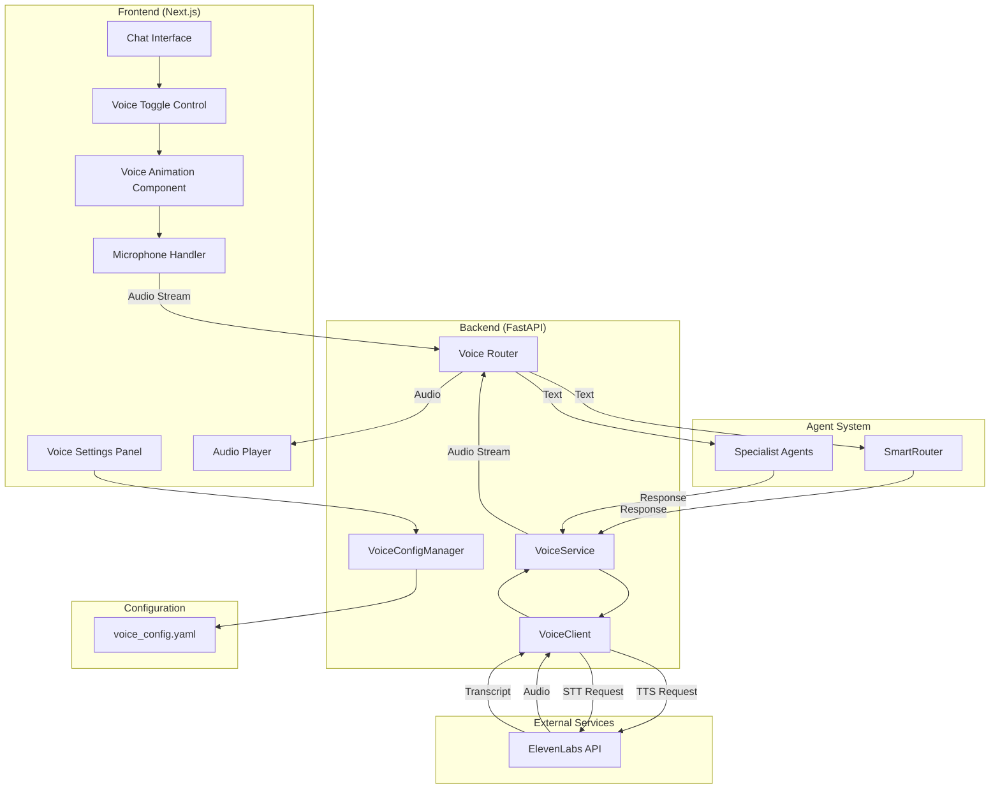
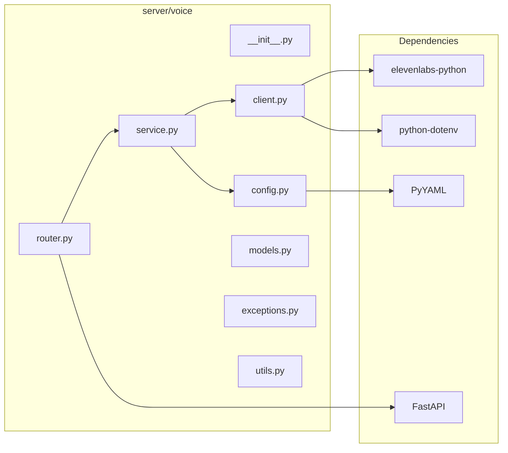
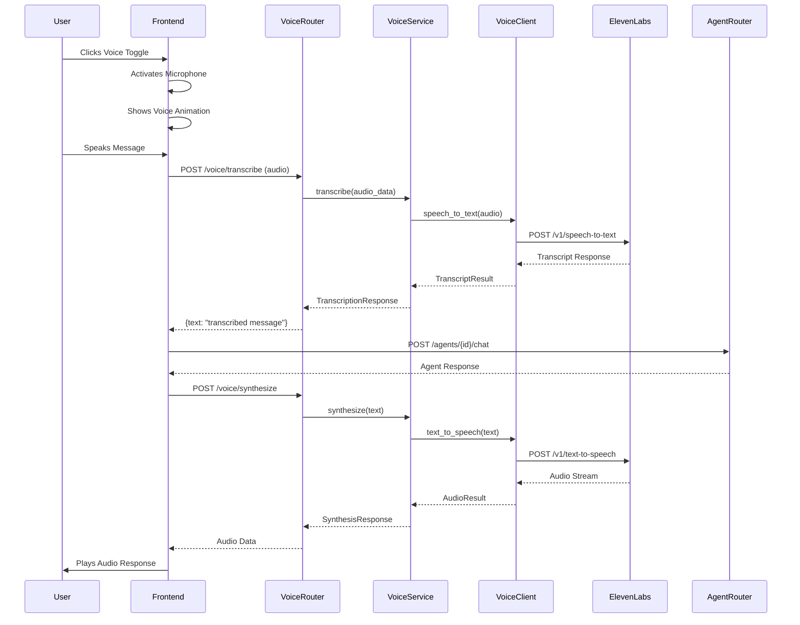
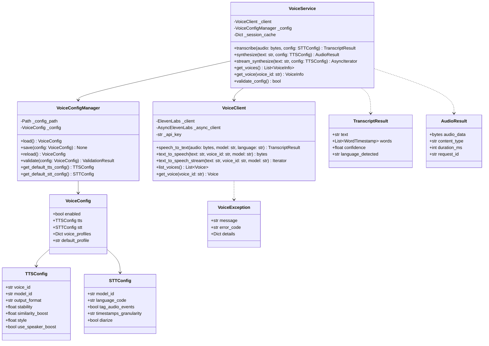
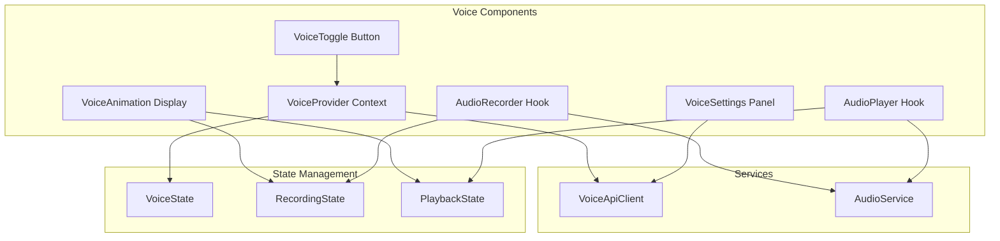

# Voice Module Specification

## Introduction

The Voice Module is a production-ready extension to the OpenAgents multi-agent orchestration platform that enables natural voice-based interactions with AI agents. The module provides bidirectional voice capabilities: Speech-to-Text (STT) for capturing user voice input and Text-to-Speech (TTS) for delivering agent responses as natural-sounding audio. Built on ElevenLabs' industry-leading voice AI technology, the module integrates seamlessly with the existing FastAPI backend and Next.js frontend while maintaining the platform's clean architecture principles.

The Voice Module supports multiple execution contexts including the SmartRouter orchestrator (`asdrp.orchestration.smartrouter`) and individual specialist agents (`asdrp.agents.single`), providing consistent voice interaction regardless of the underlying agent configuration.

## Glossary

- **Voice Module**: The complete system for voice-based interactions, encompassing both STT and TTS capabilities
- **Text-to-Speech (TTS)**: The process of converting text output from agents into synthesized speech audio
- **Speech-to-Text (STT)**: The process of transcribing user voice input into text for agent processing
- **ElevenLabs**: Third-party AI voice platform providing high-quality TTS and STT services
- **Voice Profile**: A configured combination of voice_id, model, and settings for TTS output
- **Voice Session**: A stateful container managing voice interaction state within a conversation
- **Audio Chunk**: A discrete segment of audio data used in streaming operations
- **Voice Animation**: Visual feedback component displaying audio waveform or activity indicator during voice interaction
- **Scribe Model**: ElevenLabs' speech-to-text model (scribe_v1) for transcription
- **Multilingual Model**: ElevenLabs' eleven_multilingual_v2 TTS model supporting 29 languages
- **Flash Model**: ElevenLabs' eleven_flash_v2_5 low-latency TTS model for real-time applications
- **VoiceConfig**: YAML-based configuration schema for voice module settings
- **VoiceService**: Core service class orchestrating TTS and STT operations
- **VoiceClient**: Wrapper around ElevenLabs SDK providing unified interface
- **AudioFormat**: Specification of audio encoding (mp3, pcm, etc.) and quality parameters

## Architecture Overview

### System Context Diagram



### Component Architecture Diagram



### Data Flow Diagram - Voice Input



### Class Diagram



### Frontend Component Architecture



## Requirements

### Requirement 1: Voice Client Integration

**User Story:** As a developer, I want a robust ElevenLabs client wrapper, so that I can reliably perform TTS and STT operations with proper error handling and configuration.

#### Acceptance Criteria

1. THE System SHALL initialize the ElevenLabs client using ELEVENLABS_API_KEY from environment variables loaded via python-dotenv
2. THE System SHALL provide both synchronous and asynchronous client interfaces for flexibility
3. WHEN the API key is missing or invalid, THE System SHALL raise a VoiceConfigurationException with clear diagnostic message
4. THE System SHALL implement automatic retry logic with exponential backoff for transient failures
5. THE System SHALL support connection pooling for improved performance under load
6. THE System SHALL expose client health status via a health check method
7. THE System SHALL log all API interactions at appropriate log levels for debugging

#### Technical Specification

```python
# server/voice/client.py

from typing import Iterator, Optional, List
from elevenlabs.client import ElevenLabs, AsyncElevenLabs
from dotenv import load_dotenv
import os

class VoiceClient:
    """
    Wrapper around ElevenLabs SDK providing unified interface for TTS/STT operations.
    
    Implements connection pooling, retry logic, and comprehensive error handling.
    """
    
    def __init__(self, api_key: Optional[str] = None):
        """
        Initialize client with API key from parameter or environment.
        
        Args:
            api_key: Optional API key. If not provided, reads from ELEVENLABS_API_KEY env var.
            
        Raises:
            VoiceConfigurationException: If API key is not available.
        """
        pass
    
    def speech_to_text(
        self,
        audio: bytes,
        model_id: str = "scribe_v1",
        language_code: Optional[str] = None,
        tag_audio_events: bool = False,
        timestamps_granularity: str = "word"
    ) -> "TranscriptResult":
        """Convert audio to text using ElevenLabs Scribe model."""
        pass
    
    def text_to_speech(
        self,
        text: str,
        voice_id: str,
        model_id: str = "eleven_multilingual_v2",
        output_format: str = "mp3_44100_128"
    ) -> bytes:
        """Convert text to audio using specified voice and model."""
        pass
    
    def text_to_speech_stream(
        self,
        text: str,
        voice_id: str,
        model_id: str = "eleven_multilingual_v2"
    ) -> Iterator[bytes]:
        """Stream audio generation for real-time playback."""
        pass
```

### Requirement 2: Voice Service Layer

**User Story:** As a developer, I want a service layer that orchestrates voice operations, so that business logic is cleanly separated from the API layer and client implementation.

#### Acceptance Criteria

1. THE System SHALL provide a VoiceService class that encapsulates all voice operation logic
2. THE System SHALL implement the Single Responsibility Principle by delegating client operations to VoiceClient
3. THE System SHALL support configurable voice profiles that can be selected per request
4. THE System SHALL cache frequently accessed data (voice list, configurations) to reduce API calls
5. WHEN synthesizing speech, THE System SHALL support both complete and streaming response modes
6. THE System SHALL validate input parameters before invoking client operations
7. THE System SHALL emit structured events for monitoring and analytics

#### Technical Specification

```python
# server/voice/service.py

from typing import AsyncIterator, Optional, List, Dict
from .client import VoiceClient
from .config import VoiceConfigManager
from .models import TranscriptResult, AudioResult, VoiceInfo, TTSConfig, STTConfig

class VoiceService:
    """
    Core service orchestrating TTS and STT operations.
    
    Implements caching, validation, and profile management.
    """
    
    def __init__(
        self,
        client: Optional[VoiceClient] = None,
        config_manager: Optional[VoiceConfigManager] = None
    ):
        """
        Initialize service with injected dependencies.
        
        Args:
            client: VoiceClient instance. Created if not provided.
            config_manager: Configuration manager. Created with defaults if not provided.
        """
        pass
    
    async def transcribe(
        self,
        audio_data: bytes,
        config: Optional[STTConfig] = None,
        session_id: Optional[str] = None
    ) -> TranscriptResult:
        """
        Transcribe audio to text.
        
        Args:
            audio_data: Raw audio bytes (supports mp3, wav, webm, ogg)
            config: STT configuration overrides
            session_id: Optional session for context continuity
            
        Returns:
            TranscriptResult with text and metadata
        """
        pass
    
    async def synthesize(
        self,
        text: str,
        config: Optional[TTSConfig] = None,
        profile_name: Optional[str] = None
    ) -> AudioResult:
        """
        Synthesize text to speech audio.
        
        Args:
            text: Text to convert to speech
            config: TTS configuration overrides
            profile_name: Named voice profile to use
            
        Returns:
            AudioResult with audio data and metadata
        """
        pass
    
    async def stream_synthesize(
        self,
        text: str,
        config: Optional[TTSConfig] = None,
        profile_name: Optional[str] = None
    ) -> AsyncIterator[bytes]:
        """
        Stream synthesized speech for real-time playback.
        
        Yields audio chunks as they become available.
        """
        pass
    
    async def get_voices(self, refresh: bool = False) -> List[VoiceInfo]:
        """Get available voices with optional cache refresh."""
        pass
    
    async def get_voice(self, voice_id: str) -> VoiceInfo:
        """Get detailed information about a specific voice."""
        pass
```

### Requirement 3: REST API Endpoints

**User Story:** As a frontend developer, I want well-defined REST API endpoints for voice operations, so that I can integrate voice capabilities into the user interface.

#### Acceptance Criteria

1. THE System SHALL provide a POST /voice/transcribe endpoint for speech-to-text conversion
2. THE System SHALL provide a POST /voice/synthesize endpoint for text-to-speech conversion
3. THE System SHALL provide a POST /voice/synthesize/stream endpoint for streaming TTS responses
4. THE System SHALL provide a GET /voice/voices endpoint to list available voices
5. THE System SHALL provide a GET /voice/voices/{voice_id} endpoint for voice details
6. THE System SHALL provide GET and PUT /voice/config endpoints for configuration management
7. THE System SHALL provide a GET /voice/health endpoint for health checks
8. ALL endpoints SHALL return appropriate HTTP status codes and structured error responses
9. THE System SHALL support CORS for cross-origin requests from the frontend

#### API Specification

```yaml
openapi: 3.0.0
info:
  title: Voice Module API
  version: 1.0.0

paths:
  /voice/transcribe:
    post:
      summary: Transcribe audio to text
      requestBody:
        content:
          multipart/form-data:
            schema:
              type: object
              properties:
                audio:
                  type: string
                  format: binary
                  description: Audio file (mp3, wav, webm, ogg)
                language_code:
                  type: string
                  description: ISO 639-1 language code (optional)
                tag_audio_events:
                  type: boolean
                  default: false
              required:
                - audio
      responses:
        200:
          description: Successful transcription
          content:
            application/json:
              schema:
                $ref: '#/components/schemas/TranscriptResponse'
        400:
          description: Invalid audio format or parameters
        500:
          description: Transcription service error

  /voice/synthesize:
    post:
      summary: Convert text to speech
      requestBody:
        content:
          application/json:
            schema:
              type: object
              properties:
                text:
                  type: string
                  maxLength: 5000
                voice_id:
                  type: string
                model_id:
                  type: string
                  default: eleven_multilingual_v2
                output_format:
                  type: string
                  default: mp3_44100_128
                profile_name:
                  type: string
              required:
                - text
      responses:
        200:
          description: Synthesized audio
          content:
            audio/mpeg:
              schema:
                type: string
                format: binary
        400:
          description: Invalid text or parameters
        500:
          description: Synthesis service error

  /voice/synthesize/stream:
    post:
      summary: Stream synthesized speech
      requestBody:
        content:
          application/json:
            schema:
              $ref: '#/components/schemas/SynthesizeRequest'
      responses:
        200:
          description: Audio stream
          content:
            text/event-stream:
              schema:
                type: string

  /voice/voices:
    get:
      summary: List available voices
      parameters:
        - name: refresh
          in: query
          schema:
            type: boolean
            default: false
      responses:
        200:
          description: Voice list
          content:
            application/json:
              schema:
                type: array
                items:
                  $ref: '#/components/schemas/VoiceInfo'

  /voice/voices/{voice_id}:
    get:
      summary: Get voice details
      parameters:
        - name: voice_id
          in: path
          required: true
          schema:
            type: string
      responses:
        200:
          description: Voice details
          content:
            application/json:
              schema:
                $ref: '#/components/schemas/VoiceInfo'
        404:
          description: Voice not found

  /voice/config:
    get:
      summary: Get voice configuration
      responses:
        200:
          description: Current configuration
          content:
            application/json:
              schema:
                $ref: '#/components/schemas/VoiceConfig'
    put:
      summary: Update voice configuration
      requestBody:
        content:
          application/json:
            schema:
              $ref: '#/components/schemas/VoiceConfig'
      responses:
        200:
          description: Configuration updated
        400:
          description: Invalid configuration

  /voice/health:
    get:
      summary: Voice service health check
      responses:
        200:
          description: Service healthy
          content:
            application/json:
              schema:
                type: object
                properties:
                  status:
                    type: string
                    enum: [healthy, degraded, unhealthy]
                  elevenlabs_connected:
                    type: boolean
                  timestamp:
                    type: string
                    format: date-time

components:
  schemas:
    TranscriptResponse:
      type: object
      properties:
        text:
          type: string
        words:
          type: array
          items:
            type: object
            properties:
              word:
                type: string
              start:
                type: number
              end:
                type: number
        confidence:
          type: number
        language_detected:
          type: string

    VoiceInfo:
      type: object
      properties:
        voice_id:
          type: string
        name:
          type: string
        category:
          type: string
        labels:
          type: object
        preview_url:
          type: string

    VoiceConfig:
      type: object
      properties:
        enabled:
          type: boolean
        tts:
          $ref: '#/components/schemas/TTSConfig'
        stt:
          $ref: '#/components/schemas/STTConfig'
        voice_profiles:
          type: object
        default_profile:
          type: string

    TTSConfig:
      type: object
      properties:
        voice_id:
          type: string
        model_id:
          type: string
        output_format:
          type: string
        stability:
          type: number
        similarity_boost:
          type: number
        style:
          type: number
        use_speaker_boost:
          type: boolean

    STTConfig:
      type: object
      properties:
        model_id:
          type: string
        language_code:
          type: string
        tag_audio_events:
          type: boolean
        timestamps_granularity:
          type: string
        diarize:
          type: boolean
```

#### Technical Specification

```python
# server/voice/router.py

from fastapi import APIRouter, File, UploadFile, HTTPException, Depends
from fastapi.responses import StreamingResponse
from typing import Optional
from .service import VoiceService
from .models import (
    SynthesizeRequest, TranscriptResponse, VoiceConfigResponse,
    VoiceConfigUpdate, VoiceInfo, HealthResponse
)
from .dependencies import get_voice_service

router = APIRouter(prefix="/voice", tags=["voice"])

@router.post("/transcribe", response_model=TranscriptResponse)
async def transcribe_audio(
    audio: UploadFile = File(...),
    language_code: Optional[str] = None,
    tag_audio_events: bool = False,
    service: VoiceService = Depends(get_voice_service)
) -> TranscriptResponse:
    """Transcribe uploaded audio file to text."""
    pass

@router.post("/synthesize")
async def synthesize_speech(
    request: SynthesizeRequest,
    service: VoiceService = Depends(get_voice_service)
) -> StreamingResponse:
    """Convert text to speech and return audio."""
    pass

@router.post("/synthesize/stream")
async def stream_synthesize_speech(
    request: SynthesizeRequest,
    service: VoiceService = Depends(get_voice_service)
) -> StreamingResponse:
    """Stream synthesized speech using Server-Sent Events."""
    pass

@router.get("/voices", response_model=list[VoiceInfo])
async def list_voices(
    refresh: bool = False,
    service: VoiceService = Depends(get_voice_service)
) -> list[VoiceInfo]:
    """List all available voices."""
    pass

@router.get("/voices/{voice_id}", response_model=VoiceInfo)
async def get_voice(
    voice_id: str,
    service: VoiceService = Depends(get_voice_service)
) -> VoiceInfo:
    """Get details for a specific voice."""
    pass

@router.get("/config", response_model=VoiceConfigResponse)
async def get_config(
    service: VoiceService = Depends(get_voice_service)
) -> VoiceConfigResponse:
    """Get current voice configuration."""
    pass

@router.put("/config", response_model=VoiceConfigResponse)
async def update_config(
    config: VoiceConfigUpdate,
    service: VoiceService = Depends(get_voice_service)
) -> VoiceConfigResponse:
    """Update voice configuration."""
    pass

@router.get("/health", response_model=HealthResponse)
async def health_check(
    service: VoiceService = Depends(get_voice_service)
) -> HealthResponse:
    """Check voice service health status."""
    pass
```

### Requirement 4: Configuration Management

**User Story:** As a system administrator, I want to configure voice settings through YAML files and API, so that I can modify voice behavior without changing code.

#### Acceptance Criteria

1. THE System SHALL load voice configurations from config/voice_config.yaml
2. THE System SHALL validate configuration schema on load and save operations
3. WHEN configuration is updated via API, THE System SHALL persist changes to the YAML file
4. THE System SHALL support hot-reload of configuration without server restart
5. THE System SHALL provide default configurations for all required settings
6. THE System SHALL support multiple named voice profiles for different use cases
7. THE System SHALL validate voice_id references against available voices
8. WHEN configuration validation fails, THE System SHALL return specific error messages

#### Configuration Schema

```yaml
# config/voice_config.yaml

# Voice Module Configuration
voice:
  # Global enable/disable for voice features
  enabled: true
  
  # Text-to-Speech Configuration
  tts:
    # Default voice ID (ElevenLabs voice identifier)
    voice_id: "JBFqnCBsd6RMkjVDRZzb"
    
    # Model selection
    # Options: eleven_multilingual_v2, eleven_flash_v2_5, eleven_turbo_v2_5
    model_id: "eleven_multilingual_v2"
    
    # Output audio format
    # Options: mp3_44100_128, mp3_22050_32, pcm_16000, pcm_22050, pcm_24000, pcm_44100
    output_format: "mp3_44100_128"
    
    # Voice settings (0.0 - 1.0)
    stability: 0.5
    similarity_boost: 0.75
    style: 0.0
    use_speaker_boost: true
    
    # Maximum text length per request
    max_text_length: 5000
    
    # Request timeout in seconds
    timeout: 30

  # Speech-to-Text Configuration
  stt:
    # Model selection
    # Options: scribe_v1, scribe_v1_experimental
    model_id: "scribe_v1"
    
    # Default language (ISO 639-1 or 639-3)
    # Set to null for automatic detection
    language_code: null
    
    # Tag audio events (laughter, applause, etc.)
    tag_audio_events: false
    
    # Timestamp granularity: word or character
    timestamps_granularity: "word"
    
    # Enable speaker diarization
    diarize: false
    
    # Maximum speakers (1-32)
    max_speakers: 10
    
    # Request timeout in seconds
    timeout: 60

  # Named Voice Profiles
  voice_profiles:
    default:
      voice_id: "JBFqnCBsd6RMkjVDRZzb"
      model_id: "eleven_multilingual_v2"
      stability: 0.5
      similarity_boost: 0.75
      
    professional:
      voice_id: "21m00Tcm4TlvDq8ikWAM"
      model_id: "eleven_multilingual_v2"
      stability: 0.7
      similarity_boost: 0.8
      
    conversational:
      voice_id: "EXAVITQu4vr4xnSDxMaL"
      model_id: "eleven_flash_v2_5"
      stability: 0.4
      similarity_boost: 0.6

  # Default profile to use
  default_profile: "default"

  # Caching settings
  cache:
    # Cache voice list for this duration (seconds)
    voice_list_ttl: 3600
    
    # Enable response caching for repeated phrases
    enable_response_cache: false
    response_cache_ttl: 86400

  # Logging settings
  logging:
    # Log API calls
    log_api_calls: true
    
    # Log audio data (WARNING: can be large)
    log_audio_data: false
    
    # Log level: DEBUG, INFO, WARNING, ERROR
    level: "INFO"
```

#### Technical Specification

```python
# server/voice/config.py

from pathlib import Path
from typing import Optional, Dict, Any, List
from pydantic import BaseModel, Field, validator
import yaml

class TTSConfig(BaseModel):
    """Text-to-Speech configuration model."""
    voice_id: str = Field(default="JBFqnCBsd6RMkjVDRZzb")
    model_id: str = Field(default="eleven_multilingual_v2")
    output_format: str = Field(default="mp3_44100_128")
    stability: float = Field(default=0.5, ge=0.0, le=1.0)
    similarity_boost: float = Field(default=0.75, ge=0.0, le=1.0)
    style: float = Field(default=0.0, ge=0.0, le=1.0)
    use_speaker_boost: bool = Field(default=True)
    max_text_length: int = Field(default=5000, ge=1, le=10000)
    timeout: int = Field(default=30, ge=5, le=120)

class STTConfig(BaseModel):
    """Speech-to-Text configuration model."""
    model_id: str = Field(default="scribe_v1")
    language_code: Optional[str] = Field(default=None)
    tag_audio_events: bool = Field(default=False)
    timestamps_granularity: str = Field(default="word")
    diarize: bool = Field(default=False)
    max_speakers: int = Field(default=10, ge=1, le=32)
    timeout: int = Field(default=60, ge=5, le=300)
    
    @validator('timestamps_granularity')
    def validate_granularity(cls, v):
        if v not in ('word', 'character'):
            raise ValueError('timestamps_granularity must be word or character')
        return v

class VoiceProfile(BaseModel):
    """Named voice profile configuration."""
    voice_id: str
    model_id: str = Field(default="eleven_multilingual_v2")
    stability: float = Field(default=0.5, ge=0.0, le=1.0)
    similarity_boost: float = Field(default=0.75, ge=0.0, le=1.0)
    style: float = Field(default=0.0, ge=0.0, le=1.0)
    use_speaker_boost: bool = Field(default=True)

class CacheConfig(BaseModel):
    """Cache configuration."""
    voice_list_ttl: int = Field(default=3600, ge=60)
    enable_response_cache: bool = Field(default=False)
    response_cache_ttl: int = Field(default=86400, ge=3600)

class LoggingConfig(BaseModel):
    """Logging configuration."""
    log_api_calls: bool = Field(default=True)
    log_audio_data: bool = Field(default=False)
    level: str = Field(default="INFO")

class VoiceConfig(BaseModel):
    """Root voice configuration model."""
    enabled: bool = Field(default=True)
    tts: TTSConfig = Field(default_factory=TTSConfig)
    stt: STTConfig = Field(default_factory=STTConfig)
    voice_profiles: Dict[str, VoiceProfile] = Field(default_factory=dict)
    default_profile: str = Field(default="default")
    cache: CacheConfig = Field(default_factory=CacheConfig)
    logging: LoggingConfig = Field(default_factory=LoggingConfig)

class ValidationResult(BaseModel):
    """Configuration validation result."""
    valid: bool
    errors: List[str] = Field(default_factory=list)
    warnings: List[str] = Field(default_factory=list)

class VoiceConfigManager:
    """
    Manages voice configuration loading, saving, and validation.
    
    Implements hot-reload capability and schema validation.
    """
    
    DEFAULT_CONFIG_PATH = Path("config/voice_config.yaml")
    
    def __init__(self, config_path: Optional[Path] = None):
        """
        Initialize configuration manager.
        
        Args:
            config_path: Path to configuration file. Uses default if not provided.
        """
        self._config_path = config_path or self.DEFAULT_CONFIG_PATH
        self._config: Optional[VoiceConfig] = None
        self._last_loaded: Optional[float] = None
    
    def load(self) -> VoiceConfig:
        """Load configuration from YAML file."""
        pass
    
    def save(self, config: VoiceConfig) -> None:
        """Save configuration to YAML file."""
        pass
    
    def reload(self) -> VoiceConfig:
        """Force reload configuration from file."""
        pass
    
    def validate(self, config: VoiceConfig) -> ValidationResult:
        """Validate configuration against schema and business rules."""
        pass
    
    def get_default_tts_config(self) -> TTSConfig:
        """Get default TTS configuration."""
        pass
    
    def get_default_stt_config(self) -> STTConfig:
        """Get default STT configuration."""
        pass
    
    def get_profile(self, name: str) -> Optional[VoiceProfile]:
        """Get voice profile by name."""
        pass
    
    @property
    def config(self) -> VoiceConfig:
        """Get current configuration, loading if necessary."""
        pass
```

### Requirement 5: Data Models

**User Story:** As a developer, I want well-defined data models for all voice operations, so that I have type safety and clear contracts between components.

#### Acceptance Criteria

1. THE System SHALL define Pydantic models for all request and response types
2. THE System SHALL implement proper validation on all model fields
3. THE System SHALL support serialization to and from JSON and YAML
4. THE System SHALL provide clear error messages for validation failures
5. THE System SHALL implement __repr__ and __str__ for debugging
6. THE System SHALL support optional fields with sensible defaults

#### Technical Specification

```python
# server/voice/models.py

from typing import Optional, List, Dict, Any
from pydantic import BaseModel, Field, validator
from enum import Enum
from datetime import datetime

class OutputFormat(str, Enum):
    """Supported audio output formats."""
    MP3_44100_128 = "mp3_44100_128"
    MP3_22050_32 = "mp3_22050_32"
    PCM_16000 = "pcm_16000"
    PCM_22050 = "pcm_22050"
    PCM_24000 = "pcm_24000"
    PCM_44100 = "pcm_44100"

class TTSModel(str, Enum):
    """Available TTS models."""
    MULTILINGUAL_V2 = "eleven_multilingual_v2"
    FLASH_V2_5 = "eleven_flash_v2_5"
    TURBO_V2_5 = "eleven_turbo_v2_5"

class STTModel(str, Enum):
    """Available STT models."""
    SCRIBE_V1 = "scribe_v1"
    SCRIBE_V1_EXPERIMENTAL = "scribe_v1_experimental"

class TimestampGranularity(str, Enum):
    """Timestamp granularity options."""
    WORD = "word"
    CHARACTER = "character"

# Request Models

class SynthesizeRequest(BaseModel):
    """Request model for text-to-speech synthesis."""
    text: str = Field(..., min_length=1, max_length=5000)
    voice_id: Optional[str] = Field(default=None)
    model_id: Optional[TTSModel] = Field(default=None)
    output_format: Optional[OutputFormat] = Field(default=None)
    stability: Optional[float] = Field(default=None, ge=0.0, le=1.0)
    similarity_boost: Optional[float] = Field(default=None, ge=0.0, le=1.0)
    style: Optional[float] = Field(default=None, ge=0.0, le=1.0)
    use_speaker_boost: Optional[bool] = Field(default=None)
    profile_name: Optional[str] = Field(default=None)
    
    @validator('text')
    def validate_text(cls, v):
        if not v.strip():
            raise ValueError('text cannot be empty or whitespace only')
        return v

class TranscribeRequest(BaseModel):
    """Request model for speech-to-text transcription."""
    language_code: Optional[str] = Field(default=None)
    model_id: Optional[STTModel] = Field(default=None)
    tag_audio_events: bool = Field(default=False)
    timestamps_granularity: TimestampGranularity = Field(default=TimestampGranularity.WORD)
    diarize: bool = Field(default=False)
    max_speakers: Optional[int] = Field(default=None, ge=1, le=32)

# Response Models

class WordTimestamp(BaseModel):
    """Word-level timestamp information."""
    word: str
    start: float = Field(..., ge=0.0)
    end: float = Field(..., ge=0.0)
    confidence: Optional[float] = Field(default=None, ge=0.0, le=1.0)
    speaker: Optional[str] = Field(default=None)

class TranscriptResult(BaseModel):
    """Result of speech-to-text transcription."""
    text: str
    words: List[WordTimestamp] = Field(default_factory=list)
    confidence: Optional[float] = Field(default=None, ge=0.0, le=1.0)
    language_detected: Optional[str] = Field(default=None)
    duration_ms: Optional[int] = Field(default=None, ge=0)
    audio_events: List[Dict[str, Any]] = Field(default_factory=list)

class TranscriptResponse(BaseModel):
    """API response for transcription endpoint."""
    success: bool = Field(default=True)
    result: TranscriptResult
    request_id: str
    processing_time_ms: int = Field(..., ge=0)

class AudioResult(BaseModel):
    """Result of text-to-speech synthesis."""
    audio_data: bytes
    content_type: str = Field(default="audio/mpeg")
    duration_ms: Optional[int] = Field(default=None, ge=0)
    request_id: str
    character_count: int = Field(..., ge=0)

class VoiceLabels(BaseModel):
    """Voice characteristic labels."""
    accent: Optional[str] = Field(default=None)
    age: Optional[str] = Field(default=None)
    gender: Optional[str] = Field(default=None)
    use_case: Optional[str] = Field(default=None)
    description: Optional[str] = Field(default=None)

class VoiceInfo(BaseModel):
    """Information about an available voice."""
    voice_id: str
    name: str
    category: Optional[str] = Field(default=None)
    labels: VoiceLabels = Field(default_factory=VoiceLabels)
    preview_url: Optional[str] = Field(default=None)
    available_for_tiers: List[str] = Field(default_factory=list)

class VoiceConfigResponse(BaseModel):
    """API response for configuration endpoints."""
    config: Dict[str, Any]
    last_updated: datetime
    validation: Optional[Dict[str, Any]] = Field(default=None)

class VoiceConfigUpdate(BaseModel):
    """Request model for configuration updates."""
    config: Dict[str, Any]
    validate_only: bool = Field(default=False)

class HealthStatus(str, Enum):
    """Service health status levels."""
    HEALTHY = "healthy"
    DEGRADED = "degraded"
    UNHEALTHY = "unhealthy"

class HealthResponse(BaseModel):
    """Health check response."""
    status: HealthStatus
    elevenlabs_connected: bool
    config_loaded: bool
    timestamp: datetime = Field(default_factory=datetime.utcnow)
    details: Dict[str, Any] = Field(default_factory=dict)
```

### Requirement 6: Exception Handling

**User Story:** As a developer, I want comprehensive exception handling, so that I can quickly diagnose and handle errors appropriately.

#### Acceptance Criteria

1. THE System SHALL define a base VoiceException class for all voice-related errors
2. THE System SHALL provide specific exception types for different error categories
3. WHEN an exception occurs, THE System SHALL include context information (operation, parameters)
4. THE System SHALL map ElevenLabs API errors to appropriate exception types
5. THE System SHALL provide error codes for programmatic error handling
6. THE System SHALL log exceptions with appropriate severity levels

#### Technical Specification

```python
# server/voice/exceptions.py

from typing import Optional, Dict, Any
from enum import Enum

class VoiceErrorCode(str, Enum):
    """Enumeration of voice module error codes."""
    # Configuration Errors (1xx)
    CONFIG_NOT_FOUND = "VOICE_101"
    CONFIG_INVALID = "VOICE_102"
    CONFIG_SAVE_FAILED = "VOICE_103"
    
    # Client Errors (2xx)
    API_KEY_MISSING = "VOICE_201"
    API_KEY_INVALID = "VOICE_202"
    CLIENT_INIT_FAILED = "VOICE_203"
    
    # TTS Errors (3xx)
    TTS_TEXT_TOO_LONG = "VOICE_301"
    TTS_VOICE_NOT_FOUND = "VOICE_302"
    TTS_MODEL_NOT_AVAILABLE = "VOICE_303"
    TTS_SYNTHESIS_FAILED = "VOICE_304"
    TTS_TIMEOUT = "VOICE_305"
    
    # STT Errors (4xx)
    STT_AUDIO_INVALID = "VOICE_401"
    STT_AUDIO_TOO_LONG = "VOICE_402"
    STT_TRANSCRIPTION_FAILED = "VOICE_403"
    STT_TIMEOUT = "VOICE_404"
    STT_LANGUAGE_NOT_SUPPORTED = "VOICE_405"
    
    # Service Errors (5xx)
    SERVICE_UNAVAILABLE = "VOICE_501"
    RATE_LIMIT_EXCEEDED = "VOICE_502"
    QUOTA_EXCEEDED = "VOICE_503"
    NETWORK_ERROR = "VOICE_504"

class VoiceException(Exception):
    """Base exception for all voice module errors."""
    
    def __init__(
        self,
        message: str,
        error_code: VoiceErrorCode,
        details: Optional[Dict[str, Any]] = None,
        cause: Optional[Exception] = None
    ):
        super().__init__(message)
        self.message = message
        self.error_code = error_code
        self.details = details or {}
        self.cause = cause
    
    def to_dict(self) -> Dict[str, Any]:
        """Convert exception to dictionary for API responses."""
        return {
            "error": self.message,
            "error_code": self.error_code.value,
            "details": self.details
        }

class VoiceConfigurationException(VoiceException):
    """Exception for configuration-related errors."""
    pass

class VoiceClientException(VoiceException):
    """Exception for client initialization and connection errors."""
    pass

class TTSException(VoiceException):
    """Exception for text-to-speech operation errors."""
    pass

class STTException(VoiceException):
    """Exception for speech-to-text operation errors."""
    pass

class VoiceServiceException(VoiceException):
    """Exception for service-level errors."""
    pass

def map_elevenlabs_error(error: Exception) -> VoiceException:
    """
    Map ElevenLabs SDK exceptions to VoiceException types.
    
    Args:
        error: Original exception from ElevenLabs SDK
        
    Returns:
        Appropriate VoiceException subclass
    """
    pass
```

### Requirement 7: Frontend Voice Toggle Component

**User Story:** As a user, I want a clear and intuitive voice toggle button in the chat interface, so that I can easily switch between text and voice input modes.

#### Acceptance Criteria

1. THE System SHALL display a voice toggle button adjacent to the message input area
2. WHEN the user clicks the voice toggle, THE System SHALL request microphone permission if not already granted
3. WHEN voice mode is active, THE System SHALL display a distinctive visual indicator
4. THE System SHALL provide clear feedback when microphone access is denied
5. THE System SHALL remember the user's voice mode preference across page refreshes
6. THE System SHALL support keyboard shortcuts for toggling voice mode (Ctrl/Cmd + Shift + V)
7. THE System SHALL disable voice toggle when voice feature is disabled in configuration

#### Technical Specification

```typescript
// frontend_web/src/components/voice/VoiceToggle.tsx

import React from 'react';
import { useVoice } from '@/hooks/useVoice';
import { Mic, MicOff, AlertCircle } from 'lucide-react';

interface VoiceToggleProps {
  disabled?: boolean;
  className?: string;
}

export const VoiceToggle: React.FC<VoiceToggleProps> = ({
  disabled = false,
  className = ''
}) => {
  const {
    isVoiceMode,
    isRecording,
    hasPermission,
    permissionDenied,
    toggleVoiceMode,
    requestPermission
  } = useVoice();
  
  // Component implementation
  return (
    <button
      onClick={handleClick}
      disabled={disabled}
      className={`voice-toggle ${isVoiceMode ? 'active' : ''} ${className}`}
      aria-label={isVoiceMode ? 'Disable voice mode' : 'Enable voice mode'}
      title={getTooltipText()}
    >
      {renderIcon()}
    </button>
  );
};
```

### Requirement 8: Frontend Voice Animation Component

**User Story:** As a user, I want visual feedback during voice interaction, so that I know when the system is listening and when it's processing my speech.

#### Acceptance Criteria

1. THE System SHALL display an animated waveform when recording user voice
2. THE System SHALL display a pulsing indicator when processing/transcribing audio
3. THE System SHALL display a speaker animation when playing back agent response audio
4. THE System SHALL smoothly transition between animation states
5. THE System SHALL scale animation intensity based on audio input levels
6. THE System SHALL be accessible and provide text alternatives for animations
7. THE System SHALL support reduced motion preferences

#### Technical Specification

```typescript
// frontend_web/src/components/voice/VoiceAnimation.tsx

import React, { useEffect, useRef } from 'react';
import { useVoice } from '@/hooks/useVoice';

type AnimationState = 'idle' | 'listening' | 'processing' | 'speaking';

interface VoiceAnimationProps {
  state: AnimationState;
  audioLevel?: number; // 0-1 normalized audio level
  className?: string;
}

export const VoiceAnimation: React.FC<VoiceAnimationProps> = ({
  state,
  audioLevel = 0,
  className = ''
}) => {
  const canvasRef = useRef<HTMLCanvasElement>(null);
  const animationRef = useRef<number>();
  const prefersReducedMotion = useReducedMotion();
  
  useEffect(() => {
    if (prefersReducedMotion) {
      renderStaticIndicator();
      return;
    }
    
    const animate = () => {
      switch (state) {
        case 'listening':
          renderWaveform(audioLevel);
          break;
        case 'processing':
          renderPulsingDots();
          break;
        case 'speaking':
          renderSpeakerWave();
          break;
        default:
          renderIdle();
      }
      animationRef.current = requestAnimationFrame(animate);
    };
    
    animate();
    return () => {
      if (animationRef.current) {
        cancelAnimationFrame(animationRef.current);
      }
    };
  }, [state, audioLevel, prefersReducedMotion]);
  
  return (
    <div className={`voice-animation ${state} ${className}`} role="status">
      <canvas ref={canvasRef} aria-hidden="true" />
      <span className="sr-only">{getAccessibleLabel(state)}</span>
    </div>
  );
};
```

```css
/* frontend_web/src/styles/voice-animation.css */

.voice-animation {
  width: 120px;
  height: 60px;
  display: flex;
  align-items: center;
  justify-content: center;
  border-radius: 30px;
  background: linear-gradient(135deg, #667eea 0%, #764ba2 100%);
  box-shadow: 0 4px 15px rgba(102, 126, 234, 0.3);
  transition: all 0.3s ease;
}

.voice-animation.listening {
  background: linear-gradient(135deg, #11998e 0%, #38ef7d 100%);
  box-shadow: 0 4px 20px rgba(17, 153, 142, 0.4);
}

.voice-animation.processing {
  background: linear-gradient(135deg, #f093fb 0%, #f5576c 100%);
}

.voice-animation.speaking {
  background: linear-gradient(135deg, #4facfe 0%, #00f2fe 100%);
}

@media (prefers-reduced-motion: reduce) {
  .voice-animation {
    animation: none;
  }
}
```

### Requirement 9: Frontend Audio Recording Hook

**User Story:** As a developer, I want a reusable hook for audio recording, so that I can easily capture user voice input across different components.

#### Acceptance Criteria

1. THE System SHALL provide a useAudioRecorder hook for capturing microphone input
2. THE System SHALL support configurable audio format and quality settings
3. THE System SHALL provide real-time audio level monitoring for visualization
4. THE System SHALL handle browser compatibility differences gracefully
5. THE System SHALL properly clean up media streams when component unmounts
6. THE System SHALL support automatic silence detection for voice activity
7. THE System SHALL provide progress callbacks during recording

#### Technical Specification

```typescript
// frontend_web/src/hooks/useAudioRecorder.ts

import { useState, useCallback, useRef, useEffect } from 'react';

interface AudioRecorderConfig {
  mimeType?: string;
  audioBitsPerSecond?: number;
  silenceThreshold?: number;
  silenceDuration?: number;
  maxDuration?: number;
}

interface AudioRecorderState {
  isRecording: boolean;
  isPaused: boolean;
  duration: number;
  audioLevel: number;
  error: Error | null;
}

interface AudioRecorderResult extends AudioRecorderState {
  startRecording: () => Promise<void>;
  stopRecording: () => Promise<Blob>;
  pauseRecording: () => void;
  resumeRecording: () => void;
  cancelRecording: () => void;
  hasPermission: boolean;
  requestPermission: () => Promise<boolean>;
}

const DEFAULT_CONFIG: AudioRecorderConfig = {
  mimeType: 'audio/webm;codecs=opus',
  audioBitsPerSecond: 128000,
  silenceThreshold: 0.01,
  silenceDuration: 2000,
  maxDuration: 60000
};

export function useAudioRecorder(
  config: AudioRecorderConfig = {}
): AudioRecorderResult {
  const mergedConfig = { ...DEFAULT_CONFIG, ...config };
  const [state, setState] = useState<AudioRecorderState>({
    isRecording: false,
    isPaused: false,
    duration: 0,
    audioLevel: 0,
    error: null
  });
  
  const mediaRecorderRef = useRef<MediaRecorder | null>(null);
  const audioContextRef = useRef<AudioContext | null>(null);
  const analyserRef = useRef<AnalyserNode | null>(null);
  const chunksRef = useRef<Blob[]>([]);
  
  // Implementation details...
  
  return {
    ...state,
    startRecording,
    stopRecording,
    pauseRecording,
    resumeRecording,
    cancelRecording,
    hasPermission,
    requestPermission
  };
}
```

### Requirement 10: Frontend Audio Playback Hook

**User Story:** As a developer, I want a reusable hook for audio playback, so that I can easily play agent voice responses across different components.

#### Acceptance Criteria

1. THE System SHALL provide a useAudioPlayer hook for playing audio responses
2. THE System SHALL support both blob and URL audio sources
3. THE System SHALL provide playback controls (play, pause, stop, seek)
4. THE System SHALL report playback progress and duration
5. THE System SHALL handle audio streaming for real-time playback
6. THE System SHALL queue multiple audio segments for continuous playback
7. THE System SHALL properly clean up audio resources when component unmounts

#### Technical Specification

```typescript
// frontend_web/src/hooks/useAudioPlayer.ts

import { useState, useCallback, useRef, useEffect } from 'react';

interface AudioPlayerState {
  isPlaying: boolean;
  isPaused: boolean;
  duration: number;
  currentTime: number;
  isBuffering: boolean;
  error: Error | null;
}

interface AudioPlayerResult extends AudioPlayerState {
  play: (source: Blob | string) => Promise<void>;
  pause: () => void;
  resume: () => void;
  stop: () => void;
  seek: (time: number) => void;
  setVolume: (volume: number) => void;
  queueAudio: (source: Blob | string) => void;
  clearQueue: () => void;
}

export function useAudioPlayer(): AudioPlayerResult {
  const [state, setState] = useState<AudioPlayerState>({
    isPlaying: false,
    isPaused: false,
    duration: 0,
    currentTime: 0,
    isBuffering: false,
    error: null
  });
  
  const audioRef = useRef<HTMLAudioElement | null>(null);
  const queueRef = useRef<Array<Blob | string>>([]);
  
  // Implementation details...
  
  return {
    ...state,
    play,
    pause,
    resume,
    stop,
    seek,
    setVolume,
    queueAudio,
    clearQueue
  };
}
```

### Requirement 11: Frontend Voice Context Provider

**User Story:** As a developer, I want centralized voice state management via React Context, so that voice functionality is consistently available throughout the application.

#### Acceptance Criteria

1. THE System SHALL provide a VoiceProvider component for voice state management
2. THE System SHALL provide a useVoice hook for accessing voice context
3. THE System SHALL manage voice mode toggle state globally
4. THE System SHALL coordinate between recording and playback states
5. THE System SHALL persist voice preferences to localStorage
6. THE System SHALL handle voice service API communication
7. THE System SHALL provide error boundary for voice-related failures

#### Technical Specification

```typescript
// frontend_web/src/contexts/VoiceContext.tsx

import React, { createContext, useContext, useReducer, useEffect } from 'react';
import { VoiceApiClient } from '@/services/VoiceApiClient';
import { useAudioRecorder } from '@/hooks/useAudioRecorder';
import { useAudioPlayer } from '@/hooks/useAudioPlayer';

interface VoiceState {
  isEnabled: boolean;
  isVoiceMode: boolean;
  isRecording: boolean;
  isProcessing: boolean;
  isPlaying: boolean;
  audioLevel: number;
  selectedVoice: string | null;
  config: VoiceConfig | null;
  error: Error | null;
}

type VoiceAction =
  | { type: 'TOGGLE_VOICE_MODE' }
  | { type: 'SET_RECORDING'; payload: boolean }
  | { type: 'SET_PROCESSING'; payload: boolean }
  | { type: 'SET_PLAYING'; payload: boolean }
  | { type: 'SET_AUDIO_LEVEL'; payload: number }
  | { type: 'SET_CONFIG'; payload: VoiceConfig }
  | { type: 'SET_VOICE'; payload: string }
  | { type: 'SET_ERROR'; payload: Error | null }
  | { type: 'RESET' };

interface VoiceContextValue extends VoiceState {
  toggleVoiceMode: () => void;
  startRecording: () => Promise<void>;
  stopRecording: () => Promise<string>;
  playResponse: (text: string) => Promise<void>;
  stopPlayback: () => void;
  setSelectedVoice: (voiceId: string) => void;
  loadConfig: () => Promise<void>;
  updateConfig: (config: Partial<VoiceConfig>) => Promise<void>;
  hasPermission: boolean;
  requestPermission: () => Promise<boolean>;
}

const VoiceContext = createContext<VoiceContextValue | null>(null);

export const VoiceProvider: React.FC<{ children: React.ReactNode }> = ({
  children
}) => {
  const [state, dispatch] = useReducer(voiceReducer, initialState);
  const apiClient = useRef(new VoiceApiClient());
  const recorder = useAudioRecorder();
  const player = useAudioPlayer();
  
  // Implementation details...
  
  return (
    <VoiceContext.Provider value={contextValue}>
      {children}
    </VoiceContext.Provider>
  );
};

export const useVoice = (): VoiceContextValue => {
  const context = useContext(VoiceContext);
  if (!context) {
    throw new Error('useVoice must be used within a VoiceProvider');
  }
  return context;
};
```

### Requirement 12: Frontend Voice API Client

**User Story:** As a developer, I want a dedicated API client for voice operations, so that HTTP communication with the voice service is centralized and consistent.

#### Acceptance Criteria

1. THE System SHALL provide a VoiceApiClient class for all voice API operations
2. THE System SHALL implement proper error handling and retry logic
3. THE System SHALL support request cancellation for long-running operations
4. THE System SHALL handle authentication headers consistently
5. THE System SHALL support both JSON and binary (audio) response types
6. THE System SHALL provide TypeScript types for all request/response shapes

#### Technical Specification

```typescript
// frontend_web/src/services/VoiceApiClient.ts

import { ApiClient } from '@/services/ApiClient';

interface TranscribeOptions {
  languageCode?: string;
  tagAudioEvents?: boolean;
}

interface SynthesizeOptions {
  voiceId?: string;
  modelId?: string;
  profileName?: string;
  stream?: boolean;
}

interface TranscriptResponse {
  text: string;
  words: Array<{
    word: string;
    start: number;
    end: number;
  }>;
  confidence: number;
  languageDetected?: string;
}

interface VoiceInfo {
  voiceId: string;
  name: string;
  category?: string;
  labels: Record<string, string>;
  previewUrl?: string;
}

interface VoiceConfig {
  enabled: boolean;
  tts: TTSConfig;
  stt: STTConfig;
  voiceProfiles: Record<string, VoiceProfile>;
  defaultProfile: string;
}

export class VoiceApiClient {
  private baseUrl: string;
  private apiClient: ApiClient;
  
  constructor(baseUrl: string = '/api/voice') {
    this.baseUrl = baseUrl;
    this.apiClient = ApiClient.getInstance();
  }
  
  async transcribe(
    audio: Blob,
    options: TranscribeOptions = {}
  ): Promise<TranscriptResponse> {
    const formData = new FormData();
    formData.append('audio', audio);
    
    if (options.languageCode) {
      formData.append('language_code', options.languageCode);
    }
    if (options.tagAudioEvents !== undefined) {
      formData.append('tag_audio_events', String(options.tagAudioEvents));
    }
    
    const response = await this.apiClient.post(
      `${this.baseUrl}/transcribe`,
      formData,
      { headers: { 'Content-Type': 'multipart/form-data' } }
    );
    
    return response.data;
  }
  
  async synthesize(
    text: string,
    options: SynthesizeOptions = {}
  ): Promise<Blob> {
    const response = await this.apiClient.post(
      `${this.baseUrl}/synthesize`,
      { text, ...options },
      { responseType: 'blob' }
    );
    
    return response.data;
  }
  
  async synthesizeStream(
    text: string,
    options: SynthesizeOptions = {},
    onChunk: (chunk: ArrayBuffer) => void
  ): Promise<void> {
    const response = await fetch(`${this.baseUrl}/synthesize/stream`, {
      method: 'POST',
      headers: {
        'Content-Type': 'application/json',
        ...this.apiClient.getAuthHeaders()
      },
      body: JSON.stringify({ text, ...options })
    });
    
    const reader = response.body?.getReader();
    if (!reader) throw new Error('No response body');
    
    while (true) {
      const { done, value } = await reader.read();
      if (done) break;
      onChunk(value.buffer);
    }
  }
  
  async getVoices(refresh: boolean = false): Promise<VoiceInfo[]> {
    const response = await this.apiClient.get(
      `${this.baseUrl}/voices`,
      { params: { refresh } }
    );
    return response.data;
  }
  
  async getVoice(voiceId: string): Promise<VoiceInfo> {
    const response = await this.apiClient.get(
      `${this.baseUrl}/voices/${voiceId}`
    );
    return response.data;
  }
  
  async getConfig(): Promise<VoiceConfig> {
    const response = await this.apiClient.get(`${this.baseUrl}/config`);
    return response.data.config;
  }
  
  async updateConfig(config: Partial<VoiceConfig>): Promise<VoiceConfig> {
    const response = await this.apiClient.put(
      `${this.baseUrl}/config`,
      { config }
    );
    return response.data.config;
  }
  
  async healthCheck(): Promise<{ status: string; connected: boolean }> {
    const response = await this.apiClient.get(`${this.baseUrl}/health`);
    return response.data;
  }
}
```

### Requirement 13: Frontend Voice Settings Panel

**User Story:** As a user, I want to configure voice settings through the UI, so that I can customize the voice interaction experience.

#### Acceptance Criteria

1. THE System SHALL provide a Voice tab in the Config Editor
2. THE System SHALL display a YAML editor with syntax highlighting for voice configuration
3. THE System SHALL validate YAML syntax before saving
4. THE System SHALL provide Save and Reload buttons
5. THE System SHALL display available voices in a dropdown for easy selection
6. THE System SHALL preview voice samples before selection
7. THE System SHALL show validation errors inline

#### Technical Specification

```typescript
// frontend_web/src/components/config/VoiceConfigEditor.tsx

import React, { useState, useEffect, useCallback } from 'react';
import { MonacoEditor } from '@/components/common/MonacoEditor';
import { VoiceApiClient } from '@/services/VoiceApiClient';
import { useVoice } from '@/contexts/VoiceContext';
import yaml from 'js-yaml';

interface VoiceConfigEditorProps {
  onSave?: () => void;
  onError?: (error: Error) => void;
}

export const VoiceConfigEditor: React.FC<VoiceConfigEditorProps> = ({
  onSave,
  onError
}) => {
  const [configYaml, setConfigYaml] = useState<string>('');
  const [isLoading, setIsLoading] = useState(true);
  const [isSaving, setIsSaving] = useState(false);
  const [validationErrors, setValidationErrors] = useState<string[]>([]);
  const [voices, setVoices] = useState<VoiceInfo[]>([]);
  const [selectedVoice, setSelectedVoice] = useState<string | null>(null);
  
  const apiClient = new VoiceApiClient();
  
  useEffect(() => {
    loadConfig();
    loadVoices();
  }, []);
  
  const loadConfig = async () => {
    try {
      setIsLoading(true);
      const config = await apiClient.getConfig();
      setConfigYaml(yaml.dump(config));
    } catch (error) {
      onError?.(error as Error);
    } finally {
      setIsLoading(false);
    }
  };
  
  const loadVoices = async () => {
    try {
      const voiceList = await apiClient.getVoices();
      setVoices(voiceList);
    } catch (error) {
      console.error('Failed to load voices:', error);
    }
  };
  
  const handleSave = async () => {
    try {
      setIsSaving(true);
      setValidationErrors([]);
      
      const config = yaml.load(configYaml);
      await apiClient.updateConfig(config as any);
      
      onSave?.();
    } catch (error) {
      if (error instanceof yaml.YAMLException) {
        setValidationErrors([`YAML Syntax Error: ${error.message}`]);
      } else {
        onError?.(error as Error);
      }
    } finally {
      setIsSaving(false);
    }
  };
  
  const handleReload = () => {
    loadConfig();
  };
  
  const handleVoicePreview = async (voiceId: string) => {
    // Play voice preview
  };
  
  return (
    <div className="voice-config-editor">
      <div className="voice-config-header">
        <h3>Voice Configuration</h3>
        <div className="voice-config-actions">
          <button onClick={handleReload} disabled={isLoading}>
            Reload
          </button>
          <button onClick={handleSave} disabled={isSaving}>
            {isSaving ? 'Saving...' : 'Save'}
          </button>
        </div>
      </div>
      
      <div className="voice-selector">
        <label>Quick Voice Selection:</label>
        <select
          value={selectedVoice || ''}
          onChange={(e) => setSelectedVoice(e.target.value)}
        >
          <option value="">Select a voice...</option>
          {voices.map((voice) => (
            <option key={voice.voiceId} value={voice.voiceId}>
              {voice.name} ({voice.category})
            </option>
          ))}
        </select>
        <button
          onClick={() => selectedVoice && handleVoicePreview(selectedVoice)}
          disabled={!selectedVoice}
        >
          Preview
        </button>
      </div>
      
      {validationErrors.length > 0 && (
        <div className="validation-errors">
          {validationErrors.map((error, i) => (
            <div key={i} className="error">{error}</div>
          ))}
        </div>
      )}
      
      <MonacoEditor
        language="yaml"
        value={configYaml}
        onChange={setConfigYaml}
        options={{
          minimap: { enabled: false },
          lineNumbers: 'on',
          scrollBeyondLastLine: false
        }}
      />
    </div>
  );
};
```

### Requirement 14: Chat Interface Voice Integration

**User Story:** As a user, I want seamless voice interaction in the existing chat interface, so that I can speak to agents and hear their responses naturally.

#### Acceptance Criteria

1. THE System SHALL integrate voice toggle button in the chat input area
2. WHEN voice mode is active and user speaks, THE System SHALL transcribe and send as chat message
3. WHEN agent responds, THE System SHALL automatically synthesize and play audio response
4. THE System SHALL display transcribed text in the message input while recording
5. THE System SHALL show voice animation overlay during voice interaction
6. THE System SHALL allow interrupting agent audio by starting to speak
7. THE System SHALL support seamless switching between voice and text modes

#### Technical Specification

```typescript
// frontend_web/src/components/chat/ChatInput.tsx (modified)

import React, { useState, useCallback } from 'react';
import { useVoice } from '@/contexts/VoiceContext';
import { VoiceToggle } from '@/components/voice/VoiceToggle';
import { VoiceAnimation } from '@/components/voice/VoiceAnimation';

interface ChatInputProps {
  onSendMessage: (message: string) => void;
  disabled?: boolean;
}

export const ChatInput: React.FC<ChatInputProps> = ({
  onSendMessage,
  disabled
}) => {
  const [message, setMessage] = useState('');
  const {
    isVoiceMode,
    isRecording,
    isProcessing,
    isPlaying,
    audioLevel,
    startRecording,
    stopRecording,
    stopPlayback,
    hasPermission
  } = useVoice();
  
  const handleVoiceInput = useCallback(async () => {
    if (isRecording) {
      // Stop recording and get transcript
      const transcript = await stopRecording();
      if (transcript) {
        setMessage(transcript);
        onSendMessage(transcript);
      }
    } else if (isPlaying) {
      // Interrupt playback
      stopPlayback();
      await startRecording();
    } else {
      // Start recording
      await startRecording();
    }
  }, [isRecording, isPlaying, stopRecording, stopPlayback, startRecording, onSendMessage]);
  
  const getAnimationState = () => {
    if (isRecording) return 'listening';
    if (isProcessing) return 'processing';
    if (isPlaying) return 'speaking';
    return 'idle';
  };
  
  return (
    <div className="chat-input-container">
      {isVoiceMode && (
        <div className="voice-overlay">
          <VoiceAnimation
            state={getAnimationState()}
            audioLevel={audioLevel}
          />
          <button
            onClick={handleVoiceInput}
            className="voice-action-button"
          >
            {isRecording ? 'Stop' : isPlaying ? 'Interrupt' : 'Speak'}
          </button>
        </div>
      )}
      
      <div className="input-row">
        <input
          type="text"
          value={message}
          onChange={(e) => setMessage(e.target.value)}
          placeholder={isVoiceMode ? 'Voice mode active...' : 'Type a message...'}
          disabled={disabled || (isVoiceMode && isRecording)}
          onKeyPress={(e) => {
            if (e.key === 'Enter' && message.trim()) {
              onSendMessage(message);
              setMessage('');
            }
          }}
        />
        
        <VoiceToggle disabled={disabled || !hasPermission} />
        
        <button
          onClick={() => {
            if (message.trim()) {
              onSendMessage(message);
              setMessage('');
            }
          }}
          disabled={disabled || !message.trim()}
        >
          Send
        </button>
      </div>
    </div>
  );
};
```

### Requirement 15: Testing - Backend Unit Tests

**User Story:** As a developer, I want comprehensive unit tests for backend voice components, so that I can confidently make changes without breaking functionality.

#### Acceptance Criteria

1. THE System SHALL provide unit tests for VoiceClient with mocked ElevenLabs SDK
2. THE System SHALL provide unit tests for VoiceService with mocked dependencies
3. THE System SHALL provide unit tests for VoiceConfigManager with file system mocking
4. THE System SHALL provide unit tests for all data model validations
5. THE System SHALL achieve greater than 90% code coverage on core logic
6. THE System SHALL use pytest fixtures for common test setup

#### Technical Specification

```python
# server/tests/voice/test_client.py

import pytest
from unittest.mock import Mock, patch, MagicMock
from server.voice.client import VoiceClient
from server.voice.exceptions import VoiceClientException, VoiceErrorCode

class TestVoiceClient:
    """Unit tests for VoiceClient."""
    
    @pytest.fixture
    def mock_elevenlabs(self):
        """Mock ElevenLabs SDK client."""
        with patch('server.voice.client.ElevenLabs') as mock:
            yield mock
    
    @pytest.fixture
    def client(self, mock_elevenlabs):
        """Create VoiceClient with mocked SDK."""
        with patch.dict('os.environ', {'ELEVENLABS_API_KEY': 'test-key'}):
            return VoiceClient()
    
    def test_init_with_env_api_key(self, mock_elevenlabs):
        """Test client initialization with environment API key."""
        with patch.dict('os.environ', {'ELEVENLABS_API_KEY': 'test-key'}):
            client = VoiceClient()
            mock_elevenlabs.assert_called_once_with(api_key='test-key')
    
    def test_init_with_explicit_api_key(self, mock_elevenlabs):
        """Test client initialization with explicit API key."""
        client = VoiceClient(api_key='explicit-key')
        mock_elevenlabs.assert_called_once_with(api_key='explicit-key')
    
    def test_init_without_api_key_raises_exception(self, mock_elevenlabs):
        """Test that missing API key raises VoiceClientException."""
        with patch.dict('os.environ', {}, clear=True):
            with pytest.raises(VoiceClientException) as exc_info:
                VoiceClient()
            assert exc_info.value.error_code == VoiceErrorCode.API_KEY_MISSING
    
    def test_speech_to_text_success(self, client, mock_elevenlabs):
        """Test successful speech-to-text conversion."""
        mock_response = Mock()
        mock_response.text = "Hello world"
        mock_response.words = []
        mock_elevenlabs.return_value.speech_to_text.convert.return_value = mock_response
        
        result = client.speech_to_text(b"audio_data")
        
        assert result.text == "Hello world"
        mock_elevenlabs.return_value.speech_to_text.convert.assert_called_once()
    
    def test_text_to_speech_success(self, client, mock_elevenlabs):
        """Test successful text-to-speech conversion."""
        mock_audio = b"audio_bytes"
        mock_elevenlabs.return_value.text_to_speech.convert.return_value = iter([mock_audio])
        
        result = client.text_to_speech("Hello", "voice_id")
        
        assert result == mock_audio
    
    def test_text_to_speech_stream(self, client, mock_elevenlabs):
        """Test streaming text-to-speech."""
        chunks = [b"chunk1", b"chunk2", b"chunk3"]
        mock_elevenlabs.return_value.text_to_speech.stream.return_value = iter(chunks)
        
        result = list(client.text_to_speech_stream("Hello", "voice_id"))
        
        assert result == chunks


# server/tests/voice/test_service.py

import pytest
from unittest.mock import Mock, AsyncMock, patch
from server.voice.service import VoiceService
from server.voice.models import TranscriptResult, AudioResult, TTSConfig, STTConfig

class TestVoiceService:
    """Unit tests for VoiceService."""
    
    @pytest.fixture
    def mock_client(self):
        """Create mock VoiceClient."""
        client = Mock()
        client.speech_to_text = Mock(return_value=TranscriptResult(
            text="test transcript",
            words=[],
            confidence=0.95
        ))
        client.text_to_speech = Mock(return_value=b"audio_data")
        client.list_voices = Mock(return_value=[])
        return client
    
    @pytest.fixture
    def mock_config_manager(self):
        """Create mock VoiceConfigManager."""
        manager = Mock()
        manager.config = Mock()
        manager.config.enabled = True
        manager.get_default_tts_config.return_value = TTSConfig()
        manager.get_default_stt_config.return_value = STTConfig()
        return manager
    
    @pytest.fixture
    def service(self, mock_client, mock_config_manager):
        """Create VoiceService with mocked dependencies."""
        return VoiceService(client=mock_client, config_manager=mock_config_manager)
    
    @pytest.mark.asyncio
    async def test_transcribe_success(self, service, mock_client):
        """Test successful transcription."""
        result = await service.transcribe(b"audio_data")
        
        assert result.text == "test transcript"
        mock_client.speech_to_text.assert_called_once()
    
    @pytest.mark.asyncio
    async def test_transcribe_with_config_override(self, service, mock_client):
        """Test transcription with custom config."""
        custom_config = STTConfig(language_code="es")
        
        await service.transcribe(b"audio_data", config=custom_config)
        
        call_args = mock_client.speech_to_text.call_args
        assert call_args[1].get('language_code') == 'es'
    
    @pytest.mark.asyncio
    async def test_synthesize_success(self, service, mock_client):
        """Test successful synthesis."""
        result = await service.synthesize("Hello world")
        
        assert result.audio_data == b"audio_data"
        mock_client.text_to_speech.assert_called_once()
    
    @pytest.mark.asyncio
    async def test_synthesize_with_profile(self, service, mock_client, mock_config_manager):
        """Test synthesis using named profile."""
        mock_config_manager.get_profile.return_value = Mock(
            voice_id="profile_voice_id",
            model_id="eleven_flash_v2_5"
        )
        
        await service.synthesize("Hello", profile_name="professional")
        
        call_args = mock_client.text_to_speech.call_args
        assert call_args[1].get('voice_id') == 'profile_voice_id'
    
    @pytest.mark.asyncio
    async def test_get_voices_caching(self, service, mock_client):
        """Test voice list caching."""
        mock_client.list_voices.return_value = [Mock(voice_id="v1")]
        
        # First call
        result1 = await service.get_voices()
        # Second call (should use cache)
        result2 = await service.get_voices()
        
        # Should only call API once
        assert mock_client.list_voices.call_count == 1
        assert result1 == result2
    
    @pytest.mark.asyncio
    async def test_get_voices_refresh(self, service, mock_client):
        """Test voice list refresh."""
        mock_client.list_voices.return_value = [Mock(voice_id="v1")]
        
        await service.get_voices()
        await service.get_voices(refresh=True)
        
        assert mock_client.list_voices.call_count == 2


# server/tests/voice/test_config.py

import pytest
from pathlib import Path
from tempfile import NamedTemporaryFile
import yaml
from server.voice.config import VoiceConfigManager, VoiceConfig, TTSConfig, STTConfig

class TestVoiceConfigManager:
    """Unit tests for VoiceConfigManager."""
    
    @pytest.fixture
    def temp_config_file(self):
        """Create temporary config file."""
        config = {
            'voice': {
                'enabled': True,
                'tts': {
                    'voice_id': 'test-voice',
                    'model_id': 'eleven_multilingual_v2'
                },
                'stt': {
                    'model_id': 'scribe_v1'
                }
            }
        }
        
        with NamedTemporaryFile(mode='w', suffix='.yaml', delete=False) as f:
            yaml.dump(config, f)
            yield Path(f.name)
    
    def test_load_config(self, temp_config_file):
        """Test loading configuration from file."""
        manager = VoiceConfigManager(config_path=temp_config_file)
        config = manager.load()
        
        assert config.enabled is True
        assert config.tts.voice_id == 'test-voice'
    
    def test_save_config(self, temp_config_file):
        """Test saving configuration to file."""
        manager = VoiceConfigManager(config_path=temp_config_file)
        
        new_config = VoiceConfig(
            enabled=False,
            tts=TTSConfig(voice_id='new-voice'),
            stt=STTConfig()
        )
        manager.save(new_config)
        
        # Reload and verify
        loaded = manager.load()
        assert loaded.enabled is False
        assert loaded.tts.voice_id == 'new-voice'
    
    def test_validate_valid_config(self):
        """Test validation of valid configuration."""
        manager = VoiceConfigManager()
        config = VoiceConfig()
        
        result = manager.validate(config)
        
        assert result.valid is True
        assert len(result.errors) == 0
    
    def test_validate_invalid_stability(self):
        """Test validation catches invalid stability value."""
        manager = VoiceConfigManager()
        
        with pytest.raises(ValueError):
            TTSConfig(stability=1.5)
    
    def test_reload_config(self, temp_config_file):
        """Test configuration hot-reload."""
        manager = VoiceConfigManager(config_path=temp_config_file)
        
        # Initial load
        config1 = manager.load()
        
        # Modify file
        with open(temp_config_file, 'w') as f:
            yaml.dump({'voice': {'enabled': False}}, f)
        
        # Reload
        config2 = manager.reload()
        
        assert config1.enabled is True
        assert config2.enabled is False
```

### Requirement 16: Testing - Backend Integration Tests

**User Story:** As a developer, I want integration tests for the voice API endpoints, so that I can verify the full request/response cycle works correctly.

#### Acceptance Criteria

1. THE System SHALL provide integration tests for all voice REST endpoints
2. THE System SHALL use pytest-asyncio for async test support
3. THE System SHALL use TestClient from FastAPI for HTTP testing
4. THE System SHALL mock external ElevenLabs API calls
5. THE System SHALL verify response status codes and body structure

#### Technical Specification

```python
# server/tests/voice/test_router_integration.py

import pytest
from fastapi.testclient import TestClient
from unittest.mock import patch, Mock
from server.main import app
from server.voice.models import TranscriptResult

class TestVoiceRouterIntegration:
    """Integration tests for voice API endpoints."""
    
    @pytest.fixture
    def client(self):
        """Create test client."""
        return TestClient(app)
    
    @pytest.fixture
    def mock_voice_service(self):
        """Mock VoiceService for testing."""
        with patch('server.voice.router.get_voice_service') as mock:
            service = Mock()
            mock.return_value = service
            yield service
    
    def test_transcribe_endpoint(self, client, mock_voice_service):
        """Test POST /voice/transcribe endpoint."""
        mock_voice_service.transcribe.return_value = TranscriptResult(
            text="Hello world",
            words=[],
            confidence=0.95
        )
        
        response = client.post(
            "/voice/transcribe",
            files={"audio": ("test.wav", b"audio_data", "audio/wav")}
        )
        
        assert response.status_code == 200
        assert response.json()["result"]["text"] == "Hello world"
    
    def test_transcribe_invalid_file(self, client):
        """Test transcribe with invalid file format."""
        response = client.post(
            "/voice/transcribe",
            files={"audio": ("test.txt", b"not audio", "text/plain")}
        )
        
        assert response.status_code == 400
    
    def test_synthesize_endpoint(self, client, mock_voice_service):
        """Test POST /voice/synthesize endpoint."""
        mock_voice_service.synthesize.return_value = Mock(
            audio_data=b"audio_bytes",
            content_type="audio/mpeg"
        )
        
        response = client.post(
            "/voice/synthesize",
            json={"text": "Hello world"}
        )
        
        assert response.status_code == 200
        assert response.headers["content-type"] == "audio/mpeg"
    
    def test_synthesize_empty_text(self, client):
        """Test synthesize with empty text."""
        response = client.post(
            "/voice/synthesize",
            json={"text": ""}
        )
        
        assert response.status_code == 400
    
    def test_voices_endpoint(self, client, mock_voice_service):
        """Test GET /voice/voices endpoint."""
        mock_voice_service.get_voices.return_value = [
            Mock(voice_id="v1", name="Voice 1"),
            Mock(voice_id="v2", name="Voice 2")
        ]
        
        response = client.get("/voice/voices")
        
        assert response.status_code == 200
        assert len(response.json()) == 2
    
    def test_config_get_endpoint(self, client, mock_voice_service):
        """Test GET /voice/config endpoint."""
        mock_voice_service._config.config = Mock()
        
        response = client.get("/voice/config")
        
        assert response.status_code == 200
        assert "config" in response.json()
    
    def test_config_put_endpoint(self, client, mock_voice_service):
        """Test PUT /voice/config endpoint."""
        response = client.put(
            "/voice/config",
            json={"config": {"enabled": True}}
        )
        
        assert response.status_code == 200
    
    def test_health_endpoint(self, client, mock_voice_service):
        """Test GET /voice/health endpoint."""
        mock_voice_service.validate_config.return_value = True
        
        response = client.get("/voice/health")
        
        assert response.status_code == 200
        assert "status" in response.json()
```

### Requirement 17: Testing - Frontend Unit Tests

**User Story:** As a frontend developer, I want comprehensive unit tests for voice components, so that I can ensure UI components work correctly in isolation.

#### Acceptance Criteria

1. THE System SHALL provide Jest tests for all voice React components
2. THE System SHALL provide tests for custom hooks (useAudioRecorder, useAudioPlayer, useVoice)
3. THE System SHALL mock browser APIs (MediaRecorder, AudioContext)
4. THE System SHALL use React Testing Library for component testing
5. THE System SHALL achieve greater than 90% code coverage on voice components

#### Technical Specification

```typescript
// frontend_web/src/components/voice/__tests__/VoiceToggle.test.tsx

import React from 'react';
import { render, screen, fireEvent, waitFor } from '@testing-library/react';
import { VoiceToggle } from '../VoiceToggle';
import { VoiceProvider } from '@/contexts/VoiceContext';

// Mock useVoice hook
jest.mock('@/hooks/useVoice', () => ({
  useVoice: () => ({
    isVoiceMode: false,
    isRecording: false,
    hasPermission: true,
    permissionDenied: false,
    toggleVoiceMode: jest.fn(),
    requestPermission: jest.fn()
  })
}));

describe('VoiceToggle', () => {
  it('renders microphone icon when voice mode is inactive', () => {
    render(<VoiceToggle />);
    
    expect(screen.getByRole('button')).toBeInTheDocument();
    expect(screen.getByLabelText('Enable voice mode')).toBeInTheDocument();
  });
  
  it('calls toggleVoiceMode when clicked', () => {
    const mockToggle = jest.fn();
    jest.spyOn(require('@/hooks/useVoice'), 'useVoice').mockReturnValue({
      isVoiceMode: false,
      toggleVoiceMode: mockToggle,
      hasPermission: true
    });
    
    render(<VoiceToggle />);
    fireEvent.click(screen.getByRole('button'));
    
    expect(mockToggle).toHaveBeenCalled();
  });
  
  it('is disabled when hasPermission is false', () => {
    jest.spyOn(require('@/hooks/useVoice'), 'useVoice').mockReturnValue({
      isVoiceMode: false,
      hasPermission: false,
      permissionDenied: true
    });
    
    render(<VoiceToggle />);
    
    expect(screen.getByRole('button')).toBeDisabled();
  });
  
  it('shows active state when voice mode is on', () => {
    jest.spyOn(require('@/hooks/useVoice'), 'useVoice').mockReturnValue({
      isVoiceMode: true,
      hasPermission: true
    });
    
    render(<VoiceToggle />);
    
    expect(screen.getByRole('button')).toHaveClass('active');
    expect(screen.getByLabelText('Disable voice mode')).toBeInTheDocument();
  });
});


// frontend_web/src/hooks/__tests__/useAudioRecorder.test.ts

import { renderHook, act } from '@testing-library/react-hooks';
import { useAudioRecorder } from '../useAudioRecorder';

// Mock MediaRecorder
const mockMediaRecorder = {
  start: jest.fn(),
  stop: jest.fn(),
  pause: jest.fn(),
  resume: jest.fn(),
  ondataavailable: null as any,
  onstop: null as any,
  state: 'inactive'
};

const mockMediaStream = {
  getTracks: () => [{ stop: jest.fn() }]
};

beforeEach(() => {
  (global as any).MediaRecorder = jest.fn(() => mockMediaRecorder);
  (global as any).navigator.mediaDevices = {
    getUserMedia: jest.fn().mockResolvedValue(mockMediaStream)
  };
});

describe('useAudioRecorder', () => {
  it('initializes with default state', () => {
    const { result } = renderHook(() => useAudioRecorder());
    
    expect(result.current.isRecording).toBe(false);
    expect(result.current.duration).toBe(0);
    expect(result.current.error).toBeNull();
  });
  
  it('requests microphone permission', async () => {
    const { result } = renderHook(() => useAudioRecorder());
    
    await act(async () => {
      const hasPermission = await result.current.requestPermission();
      expect(hasPermission).toBe(true);
    });
    
    expect(navigator.mediaDevices.getUserMedia).toHaveBeenCalledWith({
      audio: true
    });
  });
  
  it('starts recording successfully', async () => {
    const { result } = renderHook(() => useAudioRecorder());
    
    await act(async () => {
      await result.current.startRecording();
    });
    
    expect(result.current.isRecording).toBe(true);
    expect(mockMediaRecorder.start).toHaveBeenCalled();
  });
  
  it('stops recording and returns blob', async () => {
    const { result } = renderHook(() => useAudioRecorder());
    
    await act(async () => {
      await result.current.startRecording();
    });
    
    // Simulate data available
    const mockBlob = new Blob(['audio'], { type: 'audio/webm' });
    
    await act(async () => {
      // Trigger ondataavailable
      mockMediaRecorder.ondataavailable({ data: mockBlob });
      const blob = await result.current.stopRecording();
      expect(blob).toBeInstanceOf(Blob);
    });
  });
  
  it('handles permission denied error', async () => {
    (navigator.mediaDevices.getUserMedia as jest.Mock).mockRejectedValue(
      new Error('Permission denied')
    );
    
    const { result } = renderHook(() => useAudioRecorder());
    
    await act(async () => {
      const hasPermission = await result.current.requestPermission();
      expect(hasPermission).toBe(false);
    });
    
    expect(result.current.error).toBeTruthy();
  });
});


// frontend_web/src/services/__tests__/VoiceApiClient.test.ts

import { VoiceApiClient } from '../VoiceApiClient';

// Mock fetch
global.fetch = jest.fn();

describe('VoiceApiClient', () => {
  let client: VoiceApiClient;
  
  beforeEach(() => {
    client = new VoiceApiClient();
    (fetch as jest.Mock).mockClear();
  });
  
  describe('transcribe', () => {
    it('sends audio blob to transcribe endpoint', async () => {
      const mockResponse = {
        text: 'Hello world',
        words: [],
        confidence: 0.95
      };
      
      (fetch as jest.Mock).mockResolvedValue({
        ok: true,
        json: () => Promise.resolve(mockResponse)
      });
      
      const audioBlob = new Blob(['audio'], { type: 'audio/webm' });
      const result = await client.transcribe(audioBlob);
      
      expect(fetch).toHaveBeenCalledWith(
        expect.stringContaining('/voice/transcribe'),
        expect.objectContaining({
          method: 'POST'
        })
      );
      expect(result.text).toBe('Hello world');
    });
  });
  
  describe('synthesize', () => {
    it('sends text to synthesize endpoint', async () => {
      const mockAudioBlob = new Blob(['audio'], { type: 'audio/mpeg' });
      
      (fetch as jest.Mock).mockResolvedValue({
        ok: true,
        blob: () => Promise.resolve(mockAudioBlob)
      });
      
      const result = await client.synthesize('Hello world');
      
      expect(fetch).toHaveBeenCalledWith(
        expect.stringContaining('/voice/synthesize'),
        expect.objectContaining({
          method: 'POST',
          body: expect.stringContaining('Hello world')
        })
      );
      expect(result).toBeInstanceOf(Blob);
    });
  });
  
  describe('getVoices', () => {
    it('fetches voice list', async () => {
      const mockVoices = [
        { voiceId: 'v1', name: 'Voice 1' },
        { voiceId: 'v2', name: 'Voice 2' }
      ];
      
      (fetch as jest.Mock).mockResolvedValue({
        ok: true,
        json: () => Promise.resolve(mockVoices)
      });
      
      const result = await client.getVoices();
      
      expect(result).toHaveLength(2);
      expect(result[0].voiceId).toBe('v1');
    });
  });
});
```

### Requirement 18: Performance and Optimization

**User Story:** As a user, I want fast voice interactions, so that conversations feel natural and responsive.

#### Acceptance Criteria

1. THE System SHALL complete STT transcription within 3 seconds for audio under 30 seconds
2. THE System SHALL begin TTS audio playback within 500ms of request (using streaming)
3. THE System SHALL cache voice list for configurable duration to reduce API calls
4. THE System SHALL use streaming responses to minimize time-to-first-byte
5. THE System SHALL implement request debouncing for rapid voice toggle actions
6. THE System SHALL lazy-load voice configuration editor to reduce initial bundle size

## File Structure

```
server/
├── voice/
│   ├── __init__.py
│   ├── router.py          # FastAPI router with endpoints
│   ├── service.py         # Business logic service layer
│   ├── client.py          # ElevenLabs SDK wrapper
│   ├── config.py          # Configuration management
│   ├── models.py          # Pydantic data models
│   ├── exceptions.py      # Custom exceptions
│   ├── utils.py           # Utility functions
│   └── dependencies.py    # FastAPI dependency injection

server/tests/
├── voice/
│   ├── __init__.py
│   ├── test_client.py
│   ├── test_service.py
│   ├── test_config.py
│   ├── test_models.py
│   ├── test_router_integration.py
│   └── conftest.py        # Shared fixtures

config/
├── voice_config.yaml      # Voice module configuration

frontend_web/
├── src/
│   ├── components/
│   │   ├── voice/
│   │   │   ├── VoiceToggle.tsx
│   │   │   ├── VoiceAnimation.tsx
│   │   │   ├── VoiceSettings.tsx
│   │   │   └── index.ts
│   │   └── config/
│   │       └── VoiceConfigEditor.tsx
│   ├── hooks/
│   │   ├── useAudioRecorder.ts
│   │   ├── useAudioPlayer.ts
│   │   └── useVoice.ts
│   ├── contexts/
│   │   └── VoiceContext.tsx
│   ├── services/
│   │   └── VoiceApiClient.ts
│   └── styles/
│       └── voice-animation.css

frontend_web/src/
├── __tests__/
│   ├── components/
│   │   └── voice/
│   │       ├── VoiceToggle.test.tsx
│   │       └── VoiceAnimation.test.tsx
│   ├── hooks/
│   │   ├── useAudioRecorder.test.ts
│   │   └── useAudioPlayer.test.ts
│   └── services/
│       └── VoiceApiClient.test.ts
```

## Dependencies

### Backend Dependencies

```toml
# pyproject.toml additions
[tool.poetry.dependencies]
elevenlabs = "^2.23.0"
python-dotenv = "^1.0.0"
pyyaml = "^6.0"
pydantic = "^2.0"

[tool.poetry.dev-dependencies]
pytest = "^7.4"
pytest-asyncio = "^0.21"
pytest-cov = "^4.1"
```

### Frontend Dependencies

```json
{
  "dependencies": {
    "js-yaml": "^4.1.0"
  },
  "devDependencies": {
    "@testing-library/react-hooks": "^8.0.1",
    "@types/js-yaml": "^4.0.5"
  }
}
```

## Environment Variables

```bash
# .env file additions
ELEVENLABS_API_KEY=your_elevenlabs_api_key_here
```

## Implementation Priority

1. **Phase 1 - Core Backend** (Week 1)
   - VoiceClient with ElevenLabs integration
   - VoiceConfigManager with YAML persistence
   - Basic data models and exceptions

2. **Phase 2 - Service Layer** (Week 1-2)
   - VoiceService implementation
   - REST API router and endpoints
   - Backend unit tests

3. **Phase 3 - Frontend Components** (Week 2-3)
   - VoiceContext and hooks
   - VoiceToggle and VoiceAnimation components
   - VoiceApiClient service

4. **Phase 4 - Integration** (Week 3)
   - Chat interface integration
   - Voice settings panel
   - End-to-end testing

5. **Phase 5 - Polish** (Week 4)
   - Performance optimization
   - Error handling refinement
   - Documentation and code review
