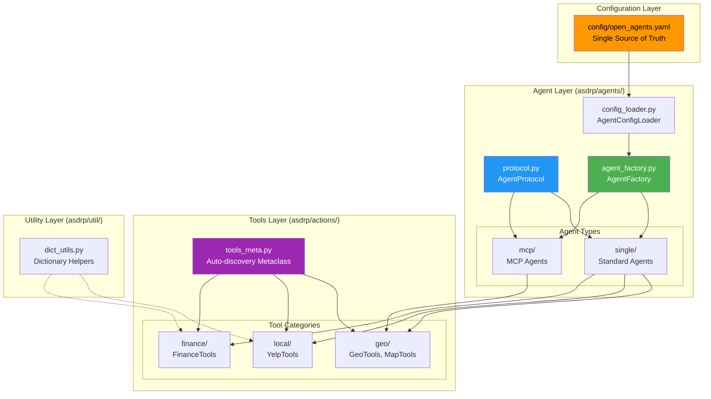
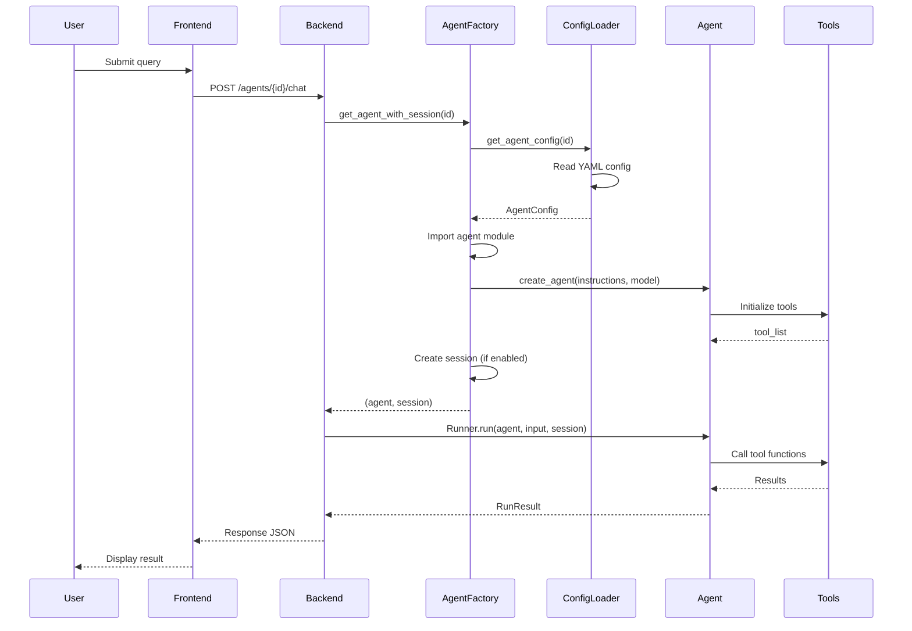
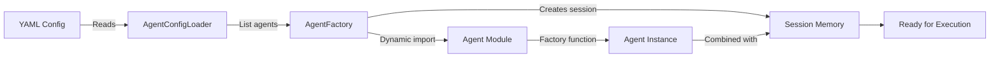

# OpenAgents - Agent System Guide

**Version**: 2.0
**Last Updated**: November 30, 2025
**Purpose**: Comprehensive guide to the OpenAgents agent system architecture and implementation

---

## 📋 Table of Contents

1. [System Overview](#system-overview)
2. [Module Architecture](#module-architecture)
3. [Agent Discovery Flow](#agent-discovery-flow)
4. [Core Components](#core-components)
5. [Agent Types](#agent-types)
6. [Tools System](#tools-system)
7. [MCP Integration](#mcp-integration)
8. [Configuration System](#configuration-system)
9. [Session Management](#session-management)
10. [Adding New Agents](#adding-new-agents)
11. [Testing](#testing)
12. [Troubleshooting](#troubleshooting)

---

## System Overview

### What is the asdrp Module?

The `asdrp` (Agent System Definition, Runtime, and Protocol) module is the **core agent implementation layer** for OpenAgents. It provides:

- **Protocol-based agent interface** (AgentProtocol)
- **Factory pattern** for agent creation (AgentFactory)
- **Configuration-driven architecture** (YAML-based)
- **Tools metaclass system** for automatic tool discovery (ToolsMeta)
- **MCP server management** for external integrations
- **Session memory support** for conversation history
- **Utility functions** for common operations

### Directory Structure

```
asdrp/
├── agents/                           # Agent implementations and factory
│   ├── protocol.py                   # AgentProtocol definition
│   ├── agent_factory.py              # Factory for creating agents
│   ├── config_loader.py              # YAML configuration loader
│   │
│   ├── single/                       # Single-purpose agents
│   │   ├── one_agent.py              # General web search agent
│   │   ├── geo_agent.py              # Geocoding agent
│   │   ├── map_agent.py              # Google Maps agent
│   │   ├── finance_agent.py          # Financial data agent
│   │   └── yelp_agent.py             # Yelp business search agent
│   │
│   └── mcp/                          # MCP-integrated agents
│       ├── mcp_server_manager.py     # MCP server lifecycle management
│       └── yelp_mcp_agent.py         # Yelp Fusion AI via MCP
│
├── actions/                          # Tools and capabilities
│   ├── tools_meta.py                 # Metaclass for automatic tool discovery
│   │
│   ├── geo/                          # Geographic tools
│   │   ├── geo_tools.py              # Geocoding (address ↔ coordinates)
│   │   └── map_tools.py              # Google Maps integration
│   │
│   ├── local/                        # Local business tools
│   │   └── yelp_tools.py             # Yelp API integration
│   │
│   ├── finance/                      # Financial tools
│   │   └── finance_tools.py          # Stock data, financial info
│   │
│   └── weather/                      # Weather tools (future)
│
└── util/                             # Utility functions
    └── dict_utils.py                 # Dictionary manipulation helpers
```

---

## Module Architecture

### High-Level Architecture



### Data Flow: Agent Execution



---

## Agent Discovery Flow

### How Agents Are Discovered

The OpenAgents system uses a **configuration-driven architecture** where all agents are defined in `config/open_agents.yaml` and automatically discovered at runtime.



### Discovery Process

1. **Configuration Loading**:
   ```python
   # config_loader.py
   loader = AgentConfigLoader()
   agent_names = loader.list_agents()  # Returns enabled agents
   ```

2. **Dynamic Import**:
   ```python
   # agent_factory.py
   config = loader.get_agent_config("geo")
   # config.module = "asdrp.agents.single.geo_agent"
   # config.function = "create_geo_agent"

   module = __import__(config.module, fromlist=[config.function])
   factory_func = getattr(module, config.function)
   ```

3. **Agent Creation**:
   ```python
   agent = factory_func(instructions, model_config)
   # Returns an AgentProtocol instance
   ```

4. **Frontend Discovery**:
   ```typescript
   // Frontend calls GET /agents
   const agents = await apiClient.listAgents();
   // Automatically displays all enabled agents in dropdown
   ```

---

## Core Components

### 1. AgentProtocol (`protocol.py`)

**Purpose**: Defines the interface that all agents must implement.

**Implementation**:

```python
from typing import Protocol, runtime_checkable

@runtime_checkable
class AgentProtocol(Protocol):
    """
    Protocol defining the interface for all agents.

    All agents must have:
    - name: str - Agent identifier
    - instructions: str - System instructions/prompt

    The protocol works with the openai-agents SDK's Agent class.
    """
    name: str
    instructions: str
```

**Key Features**:
- **Runtime checkable**: `isinstance(obj, AgentProtocol)` works at runtime
- **Minimal interface**: Only requires `name` and `instructions`
- **SDK compatible**: Works with openai-agents SDK's `Agent` class
- **Type safe**: Provides compile-time type checking

**Exception Handling**:

```python
class AgentException(Exception):
    """
    Base exception for all agent-related errors.

    Args:
        message: Human-readable error message
        agent_name: Optional agent identifier
    """
    def __init__(self, message: str, agent_name: str | None = None):
        self.message = message
        self.agent_name = agent_name
        if agent_name:
            super().__init__(f"{message} (agent: {agent_name})")
        else:
            super().__init__(message)
```

### 2. AgentFactory (`agent_factory.py`)

**Purpose**: Factory class for creating agent instances with session memory.

**Key Features**:
- **Singleton pattern**: Global factory instance
- **Configuration-driven**: Loads agents from YAML
- **Dynamic import**: Imports agent modules at runtime
- **Session management**: Creates and caches session objects
- **Error handling**: Comprehensive validation and error messages
- **MCP support**: Handles MCP-integrated agents

**Class Structure**:

```python
class AgentFactory:
    """
    Factory for creating agents with optional session memory.

    Attributes:
        _instance: Singleton instance
        _registry: Dict mapping agent names to factory functions
        _config_loader: Configuration loader
        _session_cache: Cache of session objects
    """
    _instance: 'AgentFactory | None' = None
    _registry: Dict[str, Callable] | None = None
    _config_loader: Optional[AgentConfigLoader] = None
    _session_cache: Dict[str, Any] = {}
```

**Key Methods**:

```python
async def get_agent(
    self,
    name: str,
    instructions: str | None = None,
    use_config_defaults: bool = True
) -> AgentProtocol:
    """
    Create and return an agent instance by name.

    Args:
        name: Agent name (e.g., "geo", "finance")
        instructions: Optional custom instructions
        use_config_defaults: Use instructions from config if None

    Returns:
        AgentProtocol instance ready for execution

    Raises:
        AgentException: If agent not found or creation fails
    """
```

```python
async def get_agent_with_session(
    self,
    name: str,
    instructions: str | None = None,
    use_config_defaults: bool = True,
    session_id: str | None = None
) -> Tuple[AgentProtocol, Any]:
    """
    Create agent with session memory.

    Args:
        name: Agent name
        instructions: Optional custom instructions
        use_config_defaults: Use instructions from config
        session_id: Optional session ID override

    Returns:
        Tuple of (agent, session) where session may be None
    """
```

**Convenience Functions**:

```python
# Module-level functions for easy access
async def get_agent(name: str, instructions: str | None = None) -> AgentProtocol:
    """Create agent using singleton factory."""
    return await AgentFactory.instance().get_agent(name, instructions)

async def get_agent_with_session(name: str, ...) -> Tuple[AgentProtocol, Any]:
    """Create agent with session using singleton factory."""
    return await AgentFactory.instance().get_agent_with_session(name, ...)
```

### 3. AgentConfigLoader (`config_loader.py`)

**Purpose**: Loads and validates agent configurations from YAML files.

**Configuration Models**:

```python
@dataclass
class ModelConfig:
    """
    Model configuration for agents.

    Attributes:
        name: Model identifier (e.g., "gpt-4.1-mini")
        temperature: Temperature setting (0.0-2.0)
        max_tokens: Maximum tokens for responses
    """
    name: str
    temperature: float = 0.7
    max_tokens: int = 2000
```

```python
@dataclass
class SessionMemoryConfig:
    """
    Session memory configuration.

    Attributes:
        type: "sqlite" or "none"
        session_id: Optional session identifier
        database_path: Path to SQLite database (None = in-memory)
        enabled: Whether session memory is enabled
    """
    type: str = "sqlite"
    session_id: Optional[str] = None
    database_path: Optional[str] = None
    enabled: bool = True
```

```python
@dataclass
class MCPServerConfig:
    """
    MCP server configuration for external integrations.

    Attributes:
        enabled: Whether MCP integration is enabled
        command: Command to start MCP server
        working_directory: Working directory for server process
        env: Environment variables (deprecated - use .env file)
        transport: "stdio", "streamable-http", or "sse"
        host: Host for HTTP/SSE transports
        port: Port for HTTP/SSE transports
    """
    enabled: bool = False
    command: list[str] | None = None
    working_directory: str | None = None
    env: dict[str, str] | None = None
    transport: str = "stdio"
    host: str | None = None
    port: int | None = None
```

```python
@dataclass
class AgentConfig:
    """
    Complete agent configuration.

    Attributes:
        display_name: Human-readable name
        module: Python module path
        function: Factory function name
        default_instructions: Default system instructions
        model: Model configuration
        session_memory: Session memory configuration
        mcp_server: Optional MCP server configuration
        enabled: Whether agent is enabled
    """
    display_name: str
    module: str
    function: str
    default_instructions: str
    model: ModelConfig
    session_memory: SessionMemoryConfig
    mcp_server: MCPServerConfig | None = None
    enabled: bool = True
```

**Key Methods**:

```python
def get_agent_config(self, agent_name: str) -> AgentConfig:
    """
    Get configuration for a specific agent.

    Args:
        agent_name: Agent identifier (case-insensitive)

    Returns:
        AgentConfig with all settings

    Raises:
        AgentException: If agent not found
    """
```

```python
def list_agents(self) -> list[str]:
    """
    List all enabled agent names.

    Returns:
        List of agent identifiers
    """
```

---

## Agent Types

### Standard Agents (`agents/single/`)

**Pattern**: Single-purpose agents that use direct tool integration.

**Example Implementation** (`geo_agent.py`):

```python
from agents import Agent, ModelSettings
from asdrp.actions.geo.geo_tools import GeoTools
from asdrp.agents.protocol import AgentProtocol, AgentException
from asdrp.agents.config_loader import ModelConfig

DEFAULT_INSTRUCTIONS = """You are a geocoding agent that can convert
addresses to coordinates and coordinates to addresses."""

def create_geo_agent(
    instructions: str | None = None,
    model_config: ModelConfig | None = None
) -> AgentProtocol:
    """
    Factory function for creating GeoAgent instances.

    Args:
        instructions: Optional custom instructions
        model_config: Optional model configuration

    Returns:
        AgentProtocol instance

    Raises:
        AgentException: If creation fails
    """
    if instructions is None:
        instructions = DEFAULT_INSTRUCTIONS

    agent_kwargs = {
        "name": "GeoAgent",
        "instructions": instructions,
        "tools": GeoTools.tool_list,  # Auto-discovered tools
    }

    if model_config:
        agent_kwargs["model"] = model_config.name
        agent_kwargs["model_settings"] = ModelSettings(
            temperature=model_config.temperature,
            max_tokens=model_config.max_tokens,
        )

    return Agent(**agent_kwargs)
```

**Available Standard Agents**:

| Agent | File | Tools | Purpose |
|-------|------|-------|---------|
| **OneAgent** | `one_agent.py` | WebSearchTool | General web search and information retrieval |
| **GeoAgent** | `geo_agent.py` | GeoTools | Geocoding and reverse geocoding |
| **MapAgent** | `map_agent.py` | MapTools | Google Maps integration (routes, places, maps) |
| **FinanceAgent** | `finance_agent.py` | FinanceTools | Financial data and stock information |
| **YelpAgent** | `yelp_agent.py` | YelpTools | Business search and reviews |

### MCP-Integrated Agents (`agents/mcp/`)

**Pattern**: Agents that connect to external MCP servers for enhanced capabilities.

**Example Implementation** (`yelp_mcp_agent.py`):

```python
from agents import Agent, ModelSettings, MCPServerStdio
from asdrp.actions.geo.map_tools import MapTools
from asdrp.agents.protocol import AgentProtocol, AgentException
from asdrp.agents.config_loader import ModelConfig, MCPServerConfig

DEFAULT_INSTRUCTIONS = """You are YelpMCPAgent - an expert at finding
businesses using Yelp Fusion AI with interactive map visualization..."""

def create_yelp_mcp_agent(
    instructions: str | None = None,
    model_config: ModelConfig | None = None,
    mcp_server_config: MCPServerConfig | None = None
) -> AgentProtocol:
    """
    Factory function for YelpMCPAgent with MCP integration.

    This agent combines:
    - Yelp Fusion AI via MCP server (yelp_agent tool)
    - MapTools for interactive map visualization

    Args:
        instructions: Optional custom instructions
        model_config: Optional model configuration
        mcp_server_config: Optional MCP server configuration

    Returns:
        AgentProtocol instance
    """
    if instructions is None:
        instructions = DEFAULT_INSTRUCTIONS

    # Use default MCP configuration if not provided
    if mcp_server_config is None:
        project_root = Path(__file__).parent.parent.parent
        mcp_server_config = MCPServerConfig(
            enabled=True,
            command=["uv", "run", "mcp-yelp-agent"],
            working_directory=str(project_root / "yelp-mcp"),
            transport="stdio"
        )

    # Create MCP server connection
    mcp_server = MCPServerStdio(
        name="yelp_agent",
        params=StdioServerParams(
            command=mcp_server_config.command,
            cwd=mcp_server_config.working_directory,
            env=os.environ.copy()  # Environment loaded from .env
        )
    )

    # Build agent with hybrid tools:
    # - MCP server provides yelp_agent tool
    # - MapTools provides map generation capabilities
    agent_kwargs = {
        "name": "YelpMCPAgent",
        "instructions": instructions,
        "mcp_servers": [mcp_server],
        "tools": MapTools.tool_list,  # Direct tools
    }

    if model_config:
        agent_kwargs["model"] = model_config.name
        agent_kwargs["model_settings"] = ModelSettings(
            temperature=model_config.temperature,
            max_tokens=model_config.max_tokens,
        )

    return Agent(**agent_kwargs)
```

**MCP Architecture**:

```
YelpMCPAgent
├── MCP Server (yelp-mcp subprocess)
│   └── yelp_agent tool → Yelp Fusion AI API
└── Direct Tools (MapTools)
    └── get_interactive_map_data → Google Maps
```

---

## Tools System

### ToolsMeta Metaclass (`tools_meta.py`)

**Purpose**: Automatically discovers class methods and creates tool lists for agent frameworks.

**How It Works**:

```python
class ToolsMeta(type):
    """
    Metaclass that automatically:
    1. Discovers all public @classmethod methods
    2. Creates spec_functions list (method names)
    3. Creates tool_list (wrapped function tools)

    Customization hooks:
    - _setup_class(): Called during class creation for initialization
    - _get_excluded_methods(): Returns set of methods to exclude
    """

    DEFAULT_EXCLUDED = {
        '__init__', '__new__', '__init_subclass__', '__class__',
        'spec_functions', 'tool_list'
    }
```

**Usage Pattern**:

```python
from asdrp.actions.tools_meta import ToolsMeta

class MyTools(metaclass=ToolsMeta):
    # Class-level initialization
    @classmethod
    def _setup_class(cls) -> None:
        """Called automatically during class creation."""
        cls.api_key = os.getenv("MY_API_KEY")
        cls.headers = {"Authorization": f"Bearer {cls.api_key}"}

    # Exclude internal attributes from tool discovery
    @classmethod
    def _get_excluded_methods(cls) -> set[str]:
        """Return attributes to exclude from tools."""
        return {'api_key', 'headers', 'BASE_URL'}

    # Public methods automatically become tools
    @classmethod
    def search(cls, query: str) -> dict:
        """Search for items matching query."""
        # Implementation
        return {"results": []}

# After class creation:
# - MyTools.spec_functions = ['search']
# - MyTools.tool_list = [wrapped function_tool objects]
```

### Tool Categories

#### Geographic Tools (`actions/geo/`)

**GeoTools** (`geo_tools.py`):
```python
class GeoTools(metaclass=ToolsMeta):
    """
    Geocoding tools using ArcGIS service.

    Tools:
    - get_coordinates_by_address(address: str) -> Tuple[float, float]
    - get_address_by_coordinates(lat: float, lon: float) -> str
    """
    geocoder: ArcGIS  # Set in _setup_class()

    @classmethod
    def _setup_class(cls) -> None:
        cls.geocoder = ArcGIS(timeout=30)
```

**MapTools** (`map_tools.py`):
```python
class MapTools(metaclass=ToolsMeta):
    """
    Google Maps integration tools.

    Tools:
    - get_static_map_url(...) -> str
    - get_interactive_map_data(...) -> str
    - get_directions(...) -> dict
    - calculate_distance(...) -> dict
    - find_nearby_places(...) -> list
    """
```

#### Local Business Tools (`actions/local/`)

**YelpTools** (`yelp_tools.py`):
```python
class YelpTools(metaclass=ToolsMeta):
    """
    Yelp API integration tools.

    Tools:
    - search_businesses(...) -> dict
    - get_business_details(business_id: str) -> dict
    - get_business_reviews(business_id: str) -> dict
    """
    BASE_URL = "https://api.yelp.com/v3"
    api_key: str
    headers: dict

    @classmethod
    def _setup_class(cls) -> None:
        cls.api_key = os.getenv("YELP_API_KEY")
        cls.headers = {"Authorization": f"Bearer {cls.api_key}"}
```

#### Financial Tools (`actions/finance/`)

**FinanceTools** (`finance_tools.py`):
```python
class FinanceTools(metaclass=ToolsMeta):
    """
    Financial data tools using yfinance.

    Tools:
    - get_stock_price(symbol: str) -> dict
    - get_stock_history(symbol: str, period: str) -> dict
    - get_company_info(symbol: str) -> dict
    """
```

---

## MCP Integration

### MCPServerManager (`agents/mcp/mcp_server_manager.py`)

**Purpose**: Centralized management of MCP server lifecycle.

**Key Features**:
- **Singleton pattern**: Global server registry
- **Process management**: Start/stop MCP server subprocesses
- **Resource cleanup**: Graceful shutdown handling
- **Error handling**: Comprehensive error messages
- **Transport support**: stdio, HTTP, SSE

**Class Structure**:

```python
class MCPServerManager:
    """
    Singleton manager for MCP server subprocess lifecycle.

    Attributes:
        _instance: Singleton instance
        _servers: Dict of running server processes
        _server_configs: Configuration for each server
    """
    _instance: Optional["MCPServerManager"] = None
    _servers: Dict[str, subprocess.Popen] = {}
    _server_configs: Dict[str, MCPServerConfig] = {}
```

**Key Methods**:

```python
async def start_server(
    self,
    server_name: str,
    config: MCPServerConfig,
    project_root: Optional[Path] = None
) -> None:
    """
    Start an MCP server subprocess.

    Args:
        server_name: Unique server identifier
        config: MCP server configuration
        project_root: Optional project root directory

    Raises:
        AgentException: If server cannot be started
    """
```

```python
async def shutdown_all(self, timeout: float = 5.0) -> None:
    """
    Stop all running MCP servers.

    This should be called during application shutdown.

    Args:
        timeout: Seconds to wait for graceful shutdown
    """
```

**Usage Example**:

```python
from asdrp.agents.mcp.mcp_server_manager import MCPServerManager
from asdrp.agents.config_loader import MCPServerConfig

# Get singleton instance
manager = MCPServerManager.instance()

# Start MCP server
config = MCPServerConfig(
    enabled=True,
    command=["uv", "run", "mcp-yelp-agent"],
    working_directory="yelp-mcp",
    transport="stdio"
)
await manager.start_server("yelp-mcp", config)

# At application shutdown
await manager.shutdown_all()
```

---

## Configuration System

### YAML Configuration Format

**File**: `config/open_agents.yaml`

```yaml
# Global defaults
defaults:
  model:
    name: "gpt-4.1-mini"
    temperature: 0.7
    max_tokens: 2000
  session_memory:
    type: "sqlite"
    session_id: null
    database_path: null
    enabled: true

# Agent definitions
agents:
  geo:
    display_name: "GeoAgent"
    module: "asdrp.agents.single.geo_agent"
    function: "create_geo_agent"
    default_instructions: |
      You are a geocoding agent that can convert addresses to coordinates
      and coordinates to addresses.
    model:
      name: "gpt-4.1-mini"
      temperature: 0.7
      max_tokens: 2000
    session_memory:
      type: "sqlite"
      enabled: true
    enabled: true

  yelp_mcp:
    display_name: "YelpMCPAgent"
    module: "asdrp.agents.mcp.yelp_mcp_agent"
    function: "create_yelp_mcp_agent"
    default_instructions: |
      You are YelpMCPAgent - an expert at finding businesses...
    model:
      name: "gpt-4.1-mini"
      temperature: 0.8
      max_tokens: 2000
    session_memory:
      type: "none"
      enabled: false
    mcp_server:
      enabled: true
      command: ["uv", "run", "mcp-yelp-agent"]
      working_directory: "yelp-mcp"
      transport: "stdio"
    enabled: true
```

### Environment Variables

**File**: `.env` (loaded automatically via python-dotenv)

```bash
# OpenAI
OPENAI_API_KEY=your_openai_api_key

# Google Maps (for GeoTools and MapTools)
GOOGLE_API_KEY=your_google_maps_api_key
NEXT_PUBLIC_GOOGLE_MAPS_API_KEY=your_google_maps_api_key

# Yelp (for YelpTools)
YELP_API_KEY=your_yelp_api_key

# MCP Server Logging
LOG_LEVEL=INFO  # DEBUG, INFO, WARNING, ERROR, CRITICAL
```

---

## Session Management

### Session Memory Types

**1. SQLite Session (Default)**:
```python
# In-memory (ephemeral)
session_memory:
  type: "sqlite"
  database_path: null  # or ":memory:"
  enabled: true

# File-based (persistent)
session_memory:
  type: "sqlite"
  database_path: "sessions/geo_agent.db"
  enabled: true
```

**2. No Session (Stateless)**:
```python
session_memory:
  type: "none"
  enabled: false
```

### Session Usage

```python
from asdrp.agents.agent_factory import get_agent_with_session
from agents import Runner

# Create agent with session
agent, session = await get_agent_with_session("geo", session_id="user_123")

# Use session with Runner
result = await Runner.run(agent, input="Hello", session=session)

# Session maintains conversation history automatically
result = await Runner.run(agent, input="What did I just say?", session=session)
```

---

## Adding New Agents

### Step-by-Step Guide

#### 1. Create Agent Implementation

**File**: `asdrp/agents/single/weather_agent.py`

```python
from dotenv import load_dotenv, find_dotenv
load_dotenv(find_dotenv())

from typing import Any, Dict
from agents import Agent, ModelSettings
from asdrp.agents.protocol import AgentProtocol, AgentException
from asdrp.agents.config_loader import ModelConfig
from asdrp.actions.weather.weather_tools import WeatherTools

DEFAULT_INSTRUCTIONS = """You are a weather agent that provides current
weather information and forecasts for any location worldwide."""

def create_weather_agent(
    instructions: str | None = None,
    model_config: ModelConfig | None = None
) -> AgentProtocol:
    """
    Create and return a WeatherAgent instance.

    Args:
        instructions: Optional custom instructions
        model_config: Optional model configuration

    Returns:
        A WeatherAgent instance implementing AgentProtocol

    Raises:
        AgentException: If the agent cannot be created
    """
    if instructions is None:
        instructions = DEFAULT_INSTRUCTIONS

    try:
        agent_kwargs: Dict[str, Any] = {
            "name": "WeatherAgent",
            "instructions": instructions,
            "tools": WeatherTools.tool_list,
        }

        if model_config:
            agent_kwargs["model"] = model_config.name
            agent_kwargs["model_settings"] = ModelSettings(
                temperature=model_config.temperature,
                max_tokens=model_config.max_tokens,
            )

        return Agent[Any](**agent_kwargs)
    except Exception as e:
        raise AgentException(
            f"Failed to create WeatherAgent: {str(e)}",
            agent_name="weather"
        ) from e
```

#### 2. Create Tools (Optional)

**File**: `asdrp/actions/weather/weather_tools.py`

```python
from dotenv import load_dotenv, find_dotenv
load_dotenv(find_dotenv())

import os
import requests
from typing import Any, Dict, List
from asdrp.actions.tools_meta import ToolsMeta

class WeatherTools(metaclass=ToolsMeta):
    """
    Tools for weather information using OpenWeatherMap API.
    """
    BASE_URL = "https://api.openweathermap.org/data/2.5"
    api_key: str

    spec_functions: List[str]
    tool_list: List[Any]

    @classmethod
    def _setup_class(cls) -> None:
        """Initialize API key from environment."""
        api_key = os.getenv("OPENWEATHER_API_KEY")
        if not api_key:
            raise ValueError("OPENWEATHER_API_KEY not set")
        cls.api_key = api_key

    @classmethod
    def _get_excluded_methods(cls) -> set[str]:
        """Exclude class variables from tool discovery."""
        return {'BASE_URL', 'api_key'}

    @classmethod
    def get_current_weather(cls, location: str) -> Dict[str, Any]:
        """Get current weather for a location."""
        # Implementation
        pass

    @classmethod
    def get_forecast(cls, location: str, days: int = 5) -> Dict[str, Any]:
        """Get weather forecast for a location."""
        # Implementation
        pass
```

#### 3. Add to Configuration

**File**: `config/open_agents.yaml`

```yaml
agents:
  # ... existing agents ...

  weather:
    display_name: "WeatherAgent"
    module: "asdrp.agents.single.weather_agent"
    function: "create_weather_agent"
    default_instructions: |
      You are a weather agent that provides current weather information
      and forecasts for any location worldwide.

      You can:
      - Get current weather conditions
      - Provide weather forecasts
      - Answer weather-related questions
    model:
      name: "gpt-4.1-mini"
      temperature: 0.7
      max_tokens: 2000
    session_memory:
      type: "sqlite"
      enabled: true
    enabled: true
```

#### 4. Add Environment Variables

**File**: `.env`

```bash
# Weather API
OPENWEATHER_API_KEY=your_api_key_here
```

#### 5. Restart Backend

```bash
cd server
python -m server.main
```

**Output**:
```
✓ Loaded 6 agents from config/open_agents.yaml
✓ Agents available: geo, finance, map, yelp, one, weather
```

#### 6. Test

```bash
# Test via API
curl http://localhost:8000/agents

# Test in frontend
# Open http://localhost:3000
# WeatherAgent appears in dropdown automatically
```

---

## Testing

### Backend Tests

**Test Agent Factory**:
```python
# tests/asdrp/agents/test_agent_factory.py
import pytest
from asdrp.agents.agent_factory import AgentFactory, get_agent

@pytest.mark.asyncio
async def test_agent_factory_singleton():
    """Test factory singleton pattern."""
    factory1 = AgentFactory.instance()
    factory2 = AgentFactory.instance()
    assert factory1 is factory2

@pytest.mark.asyncio
async def test_create_agent():
    """Test agent creation."""
    agent = await get_agent("geo", "You are a test agent")
    assert agent.name == "GeoAgent"
    assert "test agent" in agent.instructions
```

**Test Tools**:
```python
# tests/asdrp/actions/geo/test_geo_tools.py
from asdrp.actions.geo.geo_tools import GeoTools

def test_geo_tools_spec_functions():
    """Test automatic tool discovery."""
    assert "get_coordinates_by_address" in GeoTools.spec_functions
    assert "get_address_by_coordinates" in GeoTools.spec_functions

def test_geo_tools_tool_list():
    """Test tool list generation."""
    assert len(GeoTools.tool_list) == len(GeoTools.spec_functions)
```

### Frontend Tests

**Test Agent Discovery**:
```typescript
// frontend_web/__tests__/components/agent-selector.test.tsx
it('loads agents from configuration', async () => {
  render(<AgentSelector />);

  await waitFor(() => {
    expect(screen.getByText('GeoAgent')).toBeInTheDocument();
    expect(screen.getByText('FinanceAgent')).toBeInTheDocument();
  });
});
```

---

## Troubleshooting

### Common Issues

**1. Agent Not Found**

```
Error: Unknown agent name: 'weather'
```

**Fix**:
- Check `enabled: true` in YAML
- Verify module path: `asdrp.agents.single.weather_agent`
- Verify function name: `create_weather_agent`
- Restart backend

**2. Module Import Error**

```
Error: No module named 'asdrp.agents.single.weather_agent'
```

**Fix**:
- Check file exists: `asdrp/agents/single/weather_agent.py`
- Check module path uses dots, not slashes
- Verify PYTHONPATH includes project root

**3. Tools Not Discovered**

```
Warning: WeatherTools.spec_functions is empty
```

**Fix**:
- Ensure methods are @classmethod decorated
- Check ToolsMeta is used as metaclass
- Verify methods are not excluded
- Check methods are public (not starting with `_`)

**4. Session Memory Error**

```
Error: Failed to create session
```

**Fix**:
- Check SQLiteSession is available (openai-agents SDK)
- Verify database path is writable
- Check session type is "sqlite" or "none"

**5. MCP Server Not Starting**

```
Error: MCP server 'yelp-mcp' failed to start
```

**Fix**:
- Check command is correct: `["uv", "run", "mcp-yelp-agent"]`
- Verify working directory exists
- Check environment variables in `.env`
- Verify MCP server dependencies installed

### Debug Commands

```bash
# Test agent configuration
cd server
python -c "
from asdrp.agents.config_loader import AgentConfigLoader
loader = AgentConfigLoader()
print('Available agents:', loader.list_agents())
config = loader.get_agent_config('geo')
print('GeoAgent config:', config)
"

# Test agent creation
python -c "
import asyncio
from asdrp.agents.agent_factory import get_agent
agent = asyncio.run(get_agent('geo'))
print('Agent name:', agent.name)
print('Instructions length:', len(agent.instructions))
"

# Test tools discovery
python -c "
from asdrp.actions.geo.geo_tools import GeoTools
print('GeoTools methods:', GeoTools.spec_functions)
print('Tool count:', len(GeoTools.tool_list))
"
```

---

## Summary

The OpenAgents agent system (`asdrp` module) provides a robust, extensible architecture for building AI agents:

✅ **Protocol-based**: Clean interface definition with `AgentProtocol`
✅ **Configuration-driven**: All agents defined in YAML
✅ **Factory pattern**: Centralized agent creation with `AgentFactory`
✅ **Auto-discovery**: Tools automatically discovered via `ToolsMeta`
✅ **Session support**: Built-in conversation history with SQLiteSession
✅ **MCP integration**: External tool integration via MCP servers
✅ **Type-safe**: Full type hints throughout
✅ **Well-tested**: Comprehensive test coverage
✅ **Documented**: Extensive inline documentation

**Adding a new agent requires only**:
1. Create agent file in `asdrp/agents/single/`
2. Create tools file in `asdrp/actions/` (optional)
3. Add configuration to `config/open_agents.yaml`
4. Restart backend

**The frontend automatically discovers and displays the new agent!**

---

**Document Version**: 2.0
**Last Updated**: November 30, 2025
**Maintained By**: OpenAgents Development Team
