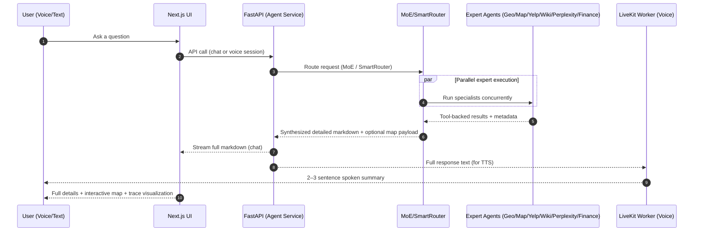

### OpenAgents: a Voice-First Public‑Benefit Copilot that Acts, Explains, and Maps Reality

Most assistants answer. **OpenAgents mobilizes a team.** When a person is stressed, time‑poor, or in motion—on a phone, in a car, mid‑shift—information without action is just noise. OpenAgents is built for those moments: it **routes** a request to the right specialist agents, **runs them in parallel**, **synthesizes a detailed, well‑structured markdown plan for the screen**, and **speaks only a 2–3 sentence summary** so the user can keep moving.

- **What makes it win**: not a single “smart model”, but a **reliable system** that can *choose, execute, verify, visualize, and communicate*—with interactive maps and tool-backed facts.
- **Built to ship**: Next.js UI + FastAPI backend + LiveKit realtime worker; production deployment documented for Heroku Enterprise.

---

### The problem (and why it’s still unsolved)

People don’t need more text. They need **a trustworthy sequence of next actions**: where to go, what to say, what it costs, what’s open now, what to do first—delivered through the modality that fits the moment.

Traditional demos fail in the last mile:
- **Voice assistants** talk too much and lose the listener.
- **Chatbots** don’t ground results in tools, or can’t show them spatially.
- **One-model solutions** can’t adapt to heterogeneous tasks (search, local, finance, geo, routing) with clear traceability.

OpenAgents turns “ask” into **a coordinated response**—and makes the coordination visible.

---

### The breakthrough: Orchestration with dual-channel communication

OpenAgents is intentionally bimodal:
- **Chat (screen)** gets the *full* answer: structured markdown, links, steps, caveats, and embedded interactive maps.
- **Voice (audio)** gets a *summary*: “Here are the top options and the next step—details are on screen.”

---

### What we built (highly specific)

- **MoE Orchestrator**: semantic expert selection, parallel execution, and LLM synthesis into **detailed markdown** (with trace visualization).
- **SmartRouter**: capability routing and query decomposition for multi-part questions.
- **MCP integration**: tool servers via Model Context Protocol (e.g., Yelp via MCP) with robust connection management.
- **Interactive Maps**: map payloads auto-injected for location queries; rendered in the web UI as a visual map instead of raw JSON.
- **Real-time Voice Mode**: LiveKit WebRTC loop with STT→orchestrator→TTS; optimized so spoken output stays digestible.

For implementation details, see:
- `docs/README.md` (high-level overview)
- `docs/AGENT_SYSTEM_GUIDE.md` (agent system architecture + mermaid flows)
- `docs/COMPLETE_TUTORIAL.md` (end-to-end usage + Heroku Enterprise deployment)

---

### A demo that feels like magic (but is just good engineering)

**Scenario: “Tonight’s plan, with real constraints.”**

Prompt:
- “Find three calm, affordable dinner spots near me, show them on a map, and tell me the fastest route to the best one. Also: keep it vegetarian-friendly.”

What happens:
- **Yelp/YelpMCP** finds options (tool-backed).
- **Geo + Map** geocodes, computes center/route, and emits an interactive map payload.
- Orchestrator returns **screen-ready markdown** (ranked options, tradeoffs, hours/price, links).
- Voice speaks: **“I found three great vegetarian-friendly spots nearby. The top pick is X for price and vibe, and the map on screen shows all options with a route. Want me to optimize for fastest drive or shortest walk?”**

---

### Why OpenAgents helps people in ways most projects can’t demonstrate

- **It’s not a single answer; it’s a pipeline**: selection → parallel evidence gathering → synthesis → visualization → action.
- **It respects human attention**: voice is concise; the screen is rich.
- **It grounds output in the world**: maps, routes, and tool-backed local results.
- **It’s inspectable**: the orchestration trace makes “how we got here” visible—critical for trust.

---

### How we deploy it (so it can actually serve people)

OpenAgents is designed as a production-ready, 3-app Heroku architecture:
- **Frontend** (Next.js)
- **API** (FastAPI)
- **Realtime worker** (LiveKit voice)

Deployment guide: `docs/COMPLETE_TUTORIAL.md#deploying-to-heroku-enterprise`

---

### What’s next (the ambitious, human part)

We’ll ship “community copilots” that can be forked and safely configured:
- **Health access navigator**: clinic discovery + eligibility checklists + map + call script.
- **Disaster relief runner**: verified shelter/food info + route planning + concise voice guidance.
- **Worker support**: quick policy lookup + step-by-step procedures + live summarization on the floor.

OpenAgents is the missing bridge between the brilliance of models and the blunt reality of life: **turns, time, distance, cost, and the next action.**

