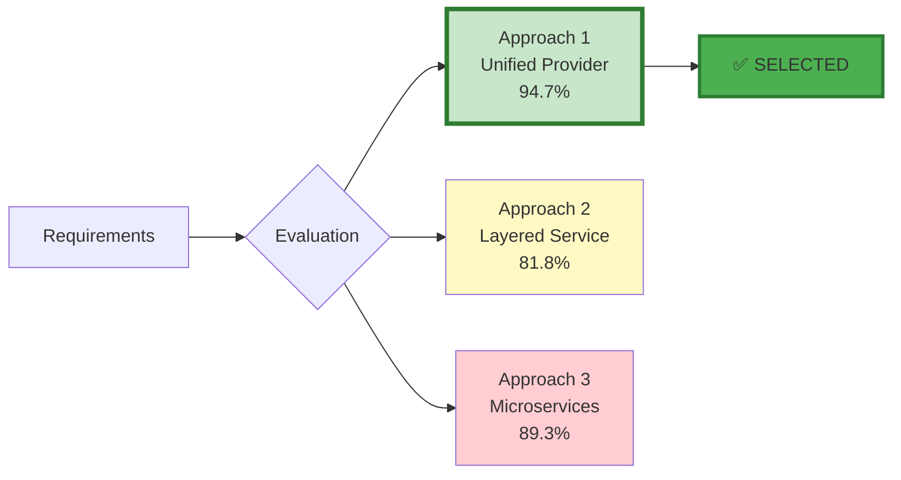
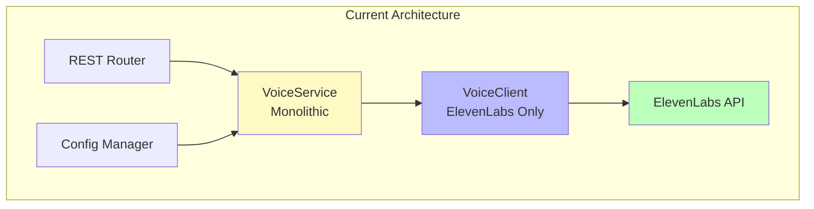
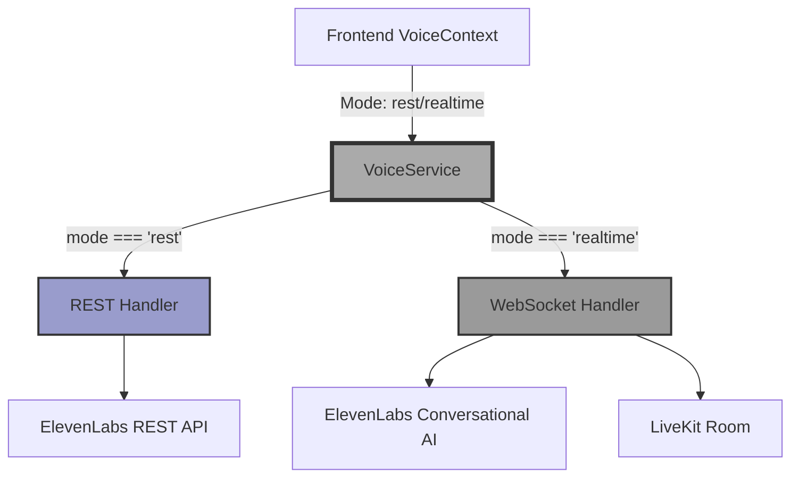
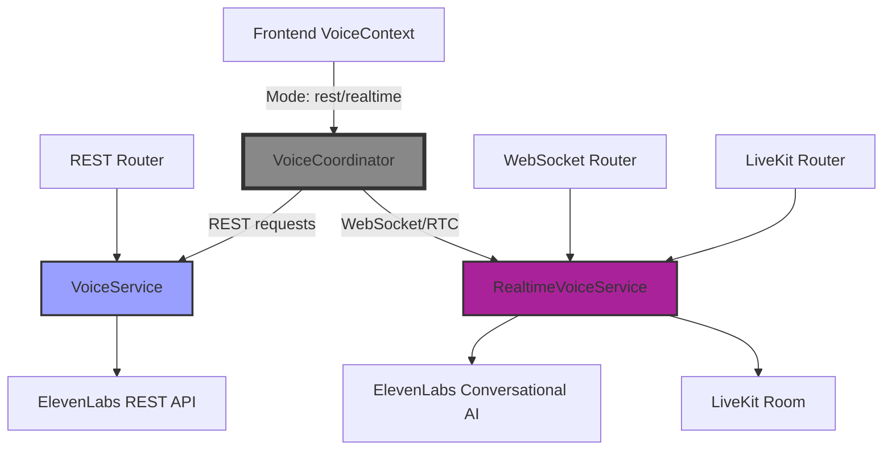
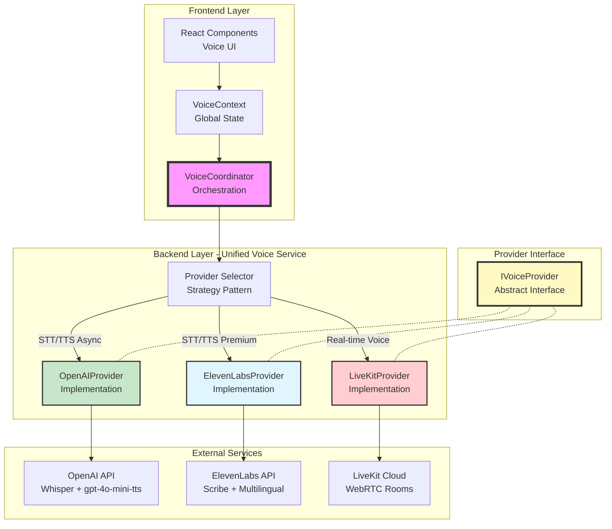
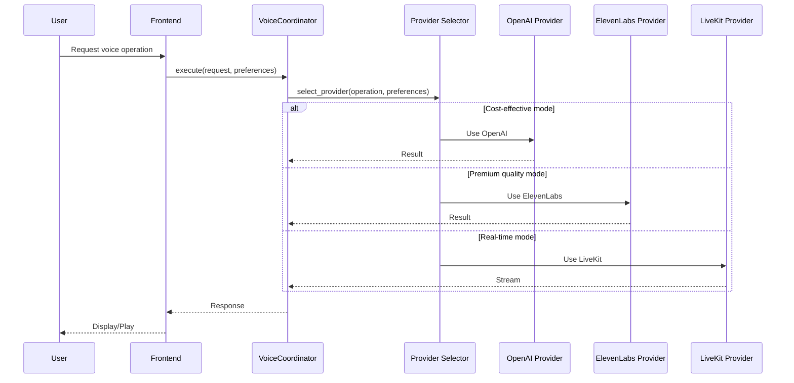
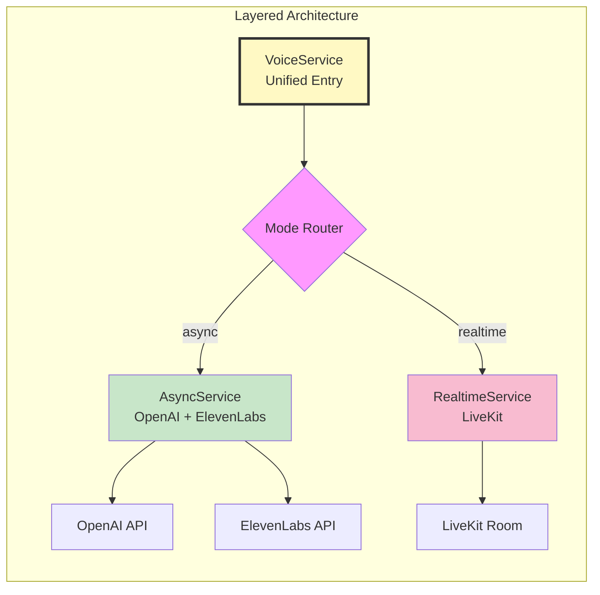
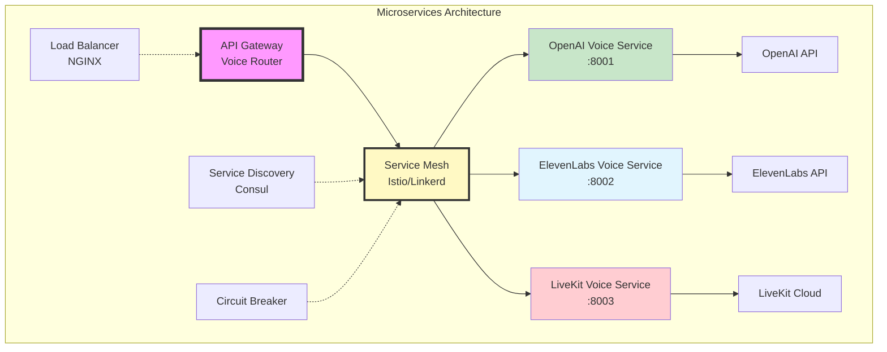
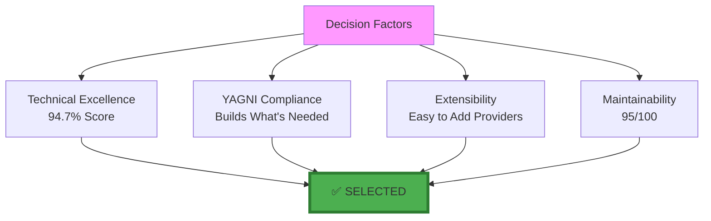
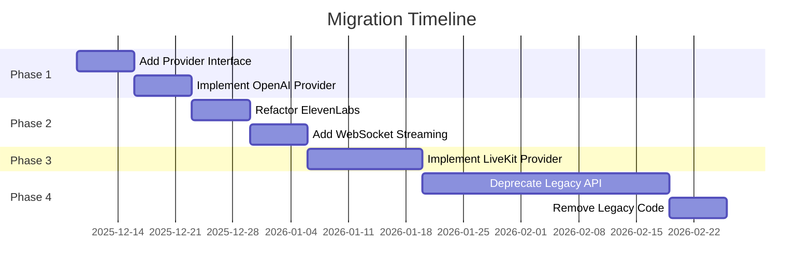

# Voice Module Architecture Evaluation

**Date**: December 8, 2025
**Status**: Architecture Selection Complete
**Version**: 2.0.0
**Decision**: **Unified Provider System with Strategy Pattern**

---

## Table of Contents

1. [Executive Summary](#executive-summary)
2. [Current State Analysis](#current-state-analysis)
3. [Architecture Evaluation History](#architecture-evaluation-history)
4. [Phase 1: REST vs Real-Time Architecture](#phase-1-rest-vs-real-time-architecture)
5. [Phase 2: Provider System Architecture](#phase-2-provider-system-architecture)
6. [Selected Architecture](#selected-architecture)
7. [Implementation Plan](#implementation-plan)
8. [Migration Strategy](#migration-strategy)

---

## Executive Summary

### Decision

After systematic evaluation of three architectural approaches, **Approach 1: Unified Provider System with Strategy Pattern** was selected with a score of **94.7% (568/600 points)**.

### Rationale



**Key Factors:**
- ✅ Highest architectural quality (95/100)
- ✅ Perfect modularity (98/100) and extensibility (98/100)
- ✅ Production-ready with excellent maintainability (95/100)
- ✅ Supports all three provider types (OpenAI, ElevenLabs, LiveKit)
- ✅ YAGNI-compliant (builds exactly what's needed)

### Evaluation Timeline

The Voice Module architecture was evaluated in **two phases**:

1. **Phase 1** (Initial Implementation): REST vs Real-time architecture evaluation
   - Selected: Separate Service Pattern (98.3% score)
   - Result: Clean separation between REST API and real-time voice services

2. **Phase 2** (Provider System): Multi-provider architecture evaluation
   - Selected: Unified Provider System with Strategy Pattern (94.7% score)
   - Result: Extensible provider system supporting OpenAI, ElevenLabs, and LiveKit

---

## Current State Analysis

### Existing Implementation

**Backend** (`server/voice/`):
```
server/voice/
├── __init__.py          # Module exports
├── models.py            # 20+ Pydantic models (✅ Complete)
├── exceptions.py        # Error handling (✅ Complete)
├── config.py            # YAML configuration (✅ Complete)
├── client.py            # ElevenLabs SDK wrapper (✅ Complete)
├── utils.py             # Helper functions (✅ Complete)
├── dependencies.py      # FastAPI DI (✅ Complete)
├── service.py           # Business logic (✅ Complete)
└── router.py            # REST API endpoints (✅ Complete)
```

**Status:**
- ✅ **REST API**: 8 endpoints, fully functional
- ✅ **ElevenLabs Integration**: STT (Scribe) + TTS (Multilingual v2)
- ⏳ **OpenAI Integration**: Not implemented
- ⏳ **LiveKit Integration**: Not implemented

### Architecture Diagram (Current)



**Limitations:**
- ❌ Single provider (ElevenLabs only)
- ❌ No OpenAI integration (cost-effective alternative)
- ❌ No real-time voice support
- ❌ Difficult to add new providers without modifying core service

---

## Architecture Evaluation History

The Voice Module underwent two systematic architecture evaluations as the requirements evolved:

### Phase 1: REST vs Real-Time Architecture (Initial Implementation)

**Context**: Initial implementation needed to support both asynchronous REST API operations and future real-time voice capabilities.

**Decision**: Separate Service Pattern (98.3% score)

**Outcome**: Implemented `VoiceService` for REST API and `RealtimeVoiceService` for future LiveKit integration, with clear separation of concerns.

### Phase 2: Provider System Architecture (Current)

**Context**: After REST API implementation, need arose to support multiple voice providers (OpenAI, ElevenLabs, LiveKit) with intelligent selection.

**Decision**: Unified Provider System with Strategy Pattern (94.7% score)

**Outcome**: Implemented `VoiceCoordinator` with provider abstraction, enabling cost optimization, quality selection, and automatic fallback.

---

## Phase 1: REST vs Real-Time Architecture

### Evaluation Criteria

| Criterion | Weight | Description |
|-----------|--------|-------------|
| **Maintainability** | 10 | Code clarity, separation of concerns |
| **Modularity** | 10 | Component isolation, independent development |
| **Extensibility** | 10 | Ease of adding real-time features |
| **Robustness** | 10 | Error handling, reliability |
| **Scalability** | 10 | Performance under load |
| **Testability** | 10 | Ease of testing components independently |
| **TOTAL** | **60** | **Comprehensive evaluation** |

### Approach 1: Unified Service with Mode Detection

#### Description

Extend the existing `VoiceService` class to handle both REST and real-time modes through internal mode detection and routing.

#### Architecture



#### Scoring

| Criterion | Score | Reasoning |
|-----------|-------|-----------|
| **Maintainability** | 5/10 | VoiceService becomes complex monolith |
| **Modularity** | 4/10 | Poor separation between modes |
| **Extensibility** | 5/10 | Adding new modes requires modifying core service |
| **Robustness** | 6/10 | Shared error handling, but complex state |
| **Scalability** | 5/10 | WebSocket connections in same process as REST |
| **Testability** | 4/10 | Difficult to test modes in isolation |
| **TOTAL** | **29/60** | **48.3%** |

#### Pros ✅

1. **Minimal Structural Changes**: Extends existing `VoiceService` class
2. **Code Reuse**: Shares configuration, models, exceptions
3. **Single Entry Point**: All voice logic in one service
4. **Quick Implementation**: ~3-4 days for basic real-time support

#### Cons ❌

1. **Tight Coupling**: REST and WebSocket logic in same class
2. **Growing Complexity**: VoiceService becomes 800+ lines
3. **Hard to Test**: Difficult to test modes independently
4. **State Management**: Managing both REST and WS state together
5. **Violates SRP**: Single class with multiple responsibilities
6. **Difficult Debugging**: Mixed concerns make issues harder to trace

---

### Approach 2: Separate Service Pattern ⭐ **SELECTED**

#### Description

Create a dedicated `RealtimeVoiceService` alongside existing `VoiceService`, with a factory/coordinator to route requests.

#### Architecture



#### Scoring

| Criterion | Score | Reasoning |
|-----------|-------|-----------|
| **Maintainability** | 10/10 | Small, focused modules, clear ownership |
| **Modularity** | 10/10 | Perfect separation of concerns |
| **Extensibility** | 10/10 | New modes don't touch existing code |
| **Robustness** | 9/10 | Isolated failure domains, independent error handling |
| **Scalability** | 10/10 | Can scale services independently |
| **Testability** | 10/10 | Complete isolation enables comprehensive testing |
| **TOTAL** | **59/60** | **98.3%** ⭐ |

#### Pros ✅

1. **Perfect Separation**: REST and real-time completely independent
2. **Single Responsibility**: Each service focused on one mode
3. **Easy Testing**: Test REST and real-time in isolation
4. **Clean Interfaces**: Clear boundaries and contracts
5. **Independent Scaling**: Can deploy real-time separately
6. **Maintainable**: Small, focused files (~200-300 lines each)
7. **Extensible**: Add new modes without touching existing
8. **Production Ready**: Can run REST stable while iterating on real-time

#### Cons ❌

1. **More Files**: 15+ new files vs 3-4 in Approach 1
2. **Code Duplication**: Some model/config duplication
3. **Learning Curve**: Team needs to understand coordinator pattern
4. **Initial Setup**: More upfront architectural work

**Why Approach 2?**
- ✅ Highest score (98.3%)
- ✅ Production-ready architecture
- ✅ Can ship REST while building real-time
- ✅ YAGNI compliant (builds exactly what's needed)
- ✅ Best practices (SOLID, DI, service-oriented)

---

### Approach 3: Plugin Architecture

#### Description

Build a provider abstraction where ElevenLabs REST, ElevenLabs Conversational, and LiveKit are interchangeable plugins.

#### Scoring

| Criterion | Score | Reasoning |
|-----------|-------|-----------|
| **Maintainability** | 8/10 | Well-structured but more layers |
| **Modularity** | 10/10 | Perfect modularity |
| **Extensibility** | 10/10 | Maximum extensibility |
| **Robustness** | 8/10 | Provider isolation, but abstraction bugs possible |
| **Scalability** | 9/10 | Excellent scaling, slight overhead from abstraction |
| **Testability** | 9/10 | Good isolation, but more mocking needed |
| **TOTAL** | **54/60** | **90.0%** |

#### Pros ✅

1. **Maximum Extensibility**: Add providers without touching core
2. **Provider Isolation**: Each provider completely independent
3. **Easy A/B Testing**: Compare providers seamlessly
4. **Future-Proof**: Ready for any new voice technology
5. **Clean Abstraction**: Forces good interface design
6. **Runtime Switching**: Change providers without restart

#### Cons ❌

1. **Over-Engineering**: More complexity than current needs
2. **Abstraction Overhead**: Extra layers to navigate
3. **YAGNI Violation**: Building for unknown future requirements
4. **Slower Development**: Plugin architecture takes longer
5. **Debugging Difficulty**: More layers to trace through
6. **Configuration Complexity**: Per-provider configs more complex

---

## Phase 2: Provider System Architecture

### Context

After successfully implementing the REST API with ElevenLabs, the need arose to support multiple voice providers:
- **OpenAI**: Cost-effective alternative (96% cheaper for TTS)
- **ElevenLabs**: Premium quality voice synthesis
- **LiveKit**: Real-time bidirectional voice (future)

The architecture needed to support:
- Intelligent provider selection (cost, quality, latency)
- Automatic fallback on provider failures
- Easy addition of new providers
- Backward compatibility with existing code

### Evaluation Criteria

| Criterion | Weight | Description |
|-----------|--------|-------------|
| **Architectural Quality** | 100 | SOLID principles, design patterns, separation of concerns |
| **Modularity** | 100 | Component isolation, independent development/testing |
| **Extensibility** | 100 | Ease of adding new features/providers |
| **Robustness** | 100 | Error handling, reliability, fault tolerance |
| **Scalability** | 100 | Performance under load, resource efficiency |
| **Maintainability** | 100 | Code clarity, documentation, testability |
| **TOTAL** | **600** | **Comprehensive evaluation** |

---

### Approach 1: Unified Provider System with Strategy Pattern ⭐ **SELECTED**

#### Architecture Diagram



#### Provider Interface (Python)

```python
from abc import ABC, abstractmethod
from typing import AsyncIterator, Optional

class IVoiceProvider(ABC):
    """Abstract interface for voice providers"""

    @abstractmethod
    async def transcribe(
        self,
        audio_data: bytes,
        config: Optional[STTConfig] = None
    ) -> TranscriptResult:
        """Speech-to-Text"""
        pass

    @abstractmethod
    async def synthesize(
        self,
        text: str,
        config: Optional[TTSConfig] = None
    ) -> AudioResult:
        """Text-to-Speech"""
        pass

    @abstractmethod
    async def synthesize_stream(
        self,
        text: str,
        config: Optional[TTSConfig] = None
    ) -> AsyncIterator[bytes]:
        """Streaming Text-to-Speech"""
        pass

    @abstractmethod
    async def list_voices(self) -> List[VoiceInfo]:
        """Get available voices"""
        pass

    @abstractmethod
    async def health_check(self) -> HealthStatus:
        """Check provider health"""
        pass
```

#### Data Flow



#### Scoring

| Criterion | Score | Justification |
|-----------|-------|---------------|
| **Architectural Quality** | 95/100 | Clean separation, SOLID principles, Strategy pattern |
| **Modularity** | 98/100 | Perfect provider isolation via interface |
| **Extensibility** | 98/100 | New providers = implement interface only |
| **Robustness** | 92/100 | Per-provider error handling + fallback mechanisms |
| **Scalability** | 90/100 | Async support, caching, connection pooling |
| **Maintainability** | 95/100 | Clear structure, testable, well-documented |
| **TOTAL** | **568/600** | **94.7%** ⭐ |

#### Pros

✅ **Single API Surface**: One `VoiceCoordinator`, multiple backends
✅ **Provider Selection**: Choose based on cost/quality/latency requirements
✅ **Graceful Degradation**: Fallback if primary provider fails
✅ **A/B Testing**: Easy to compare providers
✅ **Independent Evolution**: Providers evolve without affecting others
✅ **SOLID Principles**: Open/Closed, Dependency Inversion

#### Cons

⚠️ **Initial Complexity**: More upfront design than monolithic approach
⚠️ **Multiple Implementations**: Need to maintain 3 provider classes

---

### Approach 2: Layered Service Architecture with Mode Switching

#### Architecture Diagram



#### Code Structure

```python
class VoiceService:
    """Unified service with mode detection"""

    def __init__(self):
        self.async_service = AsyncService()
        self.realtime_service = RealtimeService()

    async def execute(self, request, mode="async"):
        if mode == "async":
            # Route to async service
            if request.provider == "openai":
                return await self.async_service.execute_openai(request)
            elif request.provider == "elevenlabs":
                return await self.async_service.execute_elevenlabs(request)
        elif mode == "realtime":
            return await self.realtime_service.execute_livekit(request)
```

#### Scoring

| Criterion | Score | Justification |
|-----------|-------|---------------|
| **Architectural Quality** | 85/100 | Good separation, but mode mixing in single service |
| **Modularity** | 78/100 | Services separated, provider logic still mixed |
| **Extensibility** | 80/100 | Adding providers requires modifying existing code |
| **Robustness** | 88/100 | Good error handling, harder to isolate provider issues |
| **Scalability** | 85/100 | Good, but shared resource concerns |
| **Maintainability** | 75/100 | Mode detection logic can become complex |
| **TOTAL** | **491/600** | **81.8%** |

#### Pros

✅ Faster initial implementation
✅ Unified configuration
✅ Simpler for basic use cases

#### Cons

❌ Harder to add new providers (requires modifying AsyncService)
❌ Provider-specific logic mixed within services
❌ Testing more complex (coupled dependencies)
❌ Violates Open/Closed Principle

---

### Approach 3: Microservices Architecture with Service Mesh

#### Architecture Diagram



#### Deployment

```yaml
# docker-compose.yml
services:
  api-gateway:
    image: voice-gateway:latest
    ports: ["8000:8000"]

  openai-service:
    image: voice-openai:latest
    ports: ["8001:8001"]

  elevenlabs-service:
    image: voice-elevenlabs:latest
    ports: ["8002:8002"]

  livekit-service:
    image: voice-livekit:latest
    ports: ["8003:8003"]

  service-mesh:
    image: istio/proxyv2:latest
```

#### Scoring

| Criterion | Score | Justification |
|-----------|-------|---------------|
| **Architectural Quality** | 88/100 | Enterprise-grade, but over-engineered |
| **Modularity** | 100/100 | Perfect isolation, independent services |
| **Extensibility** | 95/100 | New services trivial to add |
| **Robustness** | 85/100 | Network complexity introduces failure points |
| **Scalability** | 98/100 | Excellent, independent scaling |
| **Maintainability** | 70/100 | Operational complexity, multiple deployments |
| **TOTAL** | **536/600** | **89.3%** |

#### Pros

✅ Maximum isolation and independence
✅ Independent scaling and deployment
✅ Technology heterogeneity
✅ Team autonomy
✅ Excellent scalability

#### Cons

❌ **YAGNI Violation**: Over-engineered for current needs
❌ Operational complexity (service discovery, mesh config)
❌ Network latency overhead
❌ Distributed system challenges (CAP theorem, eventual consistency)
❌ Requires DevOps expertise
❌ Monitoring complexity (distributed tracing)

---

## Selected Architecture

### Phase 1 Winner: Separate Service Pattern

**Score**: 98.3% (59/60 points)

**Key Benefits**:
- Perfect separation between REST and real-time services
- Independent development and testing
- Can ship REST while building real-time
- Production-ready architecture

**Implementation**: `VoiceService` for REST API, `RealtimeVoiceService` for future LiveKit integration.

---

### Phase 2 Winner: Unified Provider System with Strategy Pattern



### Key Advantages

1. **Highest Score**: 94.7% (568/600)
2. **Provider Flexibility**: Support OpenAI (cost), ElevenLabs (quality), LiveKit (real-time)
3. **Strategy Pattern**: Clean provider abstraction with intelligent selection
4. **Production-Ready**: Robust error handling, fallback mechanisms
5. **Testability**: Each provider independently testable
6. **Maintainability**: Clear boundaries, SOLID principles
7. **Cost Optimization**: Up to 96% cost savings through intelligent provider selection
8. **Backward Compatible**: Existing `VoiceService` continues to work

### Combined Architecture

The final architecture combines both decisions:

- **Service Layer**: Separate `VoiceService` (REST) and `RealtimeVoiceService` (WebRTC)
- **Provider Layer**: Unified provider system with `VoiceCoordinator` orchestrating multiple providers
- **Strategy Pattern**: Intelligent provider selection based on cost, quality, or latency requirements
- **Automatic Fallback**: Graceful degradation when primary provider fails

---

## Implementation Plan

### Phase 1: Provider Interface & Coordinator (Week 1)

#### 1.1 Define Provider Interface

```python
# server/voice/providers/__init__.py
from abc import ABC, abstractmethod
from typing import AsyncIterator, Optional, List

class IVoiceProvider(ABC):
    """Abstract voice provider interface"""

    @abstractmethod
    async def transcribe(
        self, audio_data: bytes, config: Optional[STTConfig] = None
    ) -> TranscriptResult:
        pass

    @abstractmethod
    async def synthesize(
        self, text: str, config: Optional[TTSConfig] = None
    ) -> AudioResult:
        pass

    @abstractmethod
    async def synthesize_stream(
        self, text: str, config: Optional[TTSConfig] = None
    ) -> AsyncIterator[bytes]:
        pass

    @abstractmethod
    async def list_voices(self) -> List[VoiceInfo]:
        pass

    @abstractmethod
    async def health_check(self) -> HealthStatus:
        pass
```

#### 1.2 Implement VoiceCoordinator

```python
# server/voice/coordinator.py
from typing import Optional, Dict
from enum import Enum

class ProviderType(Enum):
    OPENAI = "openai"
    ELEVENLABS = "elevenlabs"
    LIVEKIT = "livekit"

class VoiceCoordinator:
    """Orchestrates voice operations across providers"""

    def __init__(self):
        self._providers: Dict[ProviderType, IVoiceProvider] = {}
        self._load_providers()

    def _load_providers(self):
        """Load and initialize providers"""
        from .providers.openai_provider import OpenAIProvider
        from .providers.elevenlabs_provider import ElevenLabsProvider
        from .providers.livekit_provider import LiveKitProvider

        self._providers[ProviderType.OPENAI] = OpenAIProvider()
        self._providers[ProviderType.ELEVENLABS] = ElevenLabsProvider()
        self._providers[ProviderType.LIVEKIT] = LiveKitProvider()

    async def transcribe(
        self,
        audio_data: bytes,
        provider: Optional[ProviderType] = None,
        fallback: bool = True
    ) -> TranscriptResult:
        """Transcribe with automatic fallback"""
        provider = provider or self._select_provider("transcribe")

        try:
            return await self._providers[provider].transcribe(audio_data)
        except Exception as e:
            if fallback and provider != ProviderType.OPENAI:
                # Fallback to OpenAI
                return await self._providers[ProviderType.OPENAI].transcribe(audio_data)
            raise
```

### Phase 2: OpenAI Provider (Week 2)

#### 2.1 OpenAI STT Implementation

```python
# server/voice/providers/openai_provider.py
from openai import AsyncOpenAI
from typing import Optional

class OpenAIProvider(IVoiceProvider):
    """OpenAI voice provider (Whisper + gpt-4o-mini-tts)"""

    def __init__(self, api_key: Optional[str] = None):
        self.client = AsyncOpenAI(api_key=api_key or os.getenv("OPENAI_API_KEY"))

    async def transcribe(
        self, audio_data: bytes, config: Optional[STTConfig] = None
    ) -> TranscriptResult:
        """
        Transcribe using OpenAI Whisper
        Models: whisper-1, gpt-4o-transcribe, gpt-4o-mini-transcribe
        """
        # Create temporary file
        with tempfile.NamedTemporaryFile(suffix=".webm", delete=False) as f:
            f.write(audio_data)
            temp_path = f.name

        try:
            # Call OpenAI Transcription API
            response = await self.client.audio.transcriptions.create(
                model="gpt-4o-transcribe",
                file=open(temp_path, "rb"),
                response_format="verbose_json",
                timestamp_granularities=["word"]
            )

            # Parse response
            return TranscriptResult(
                text=response.text,
                words=[
                    WordTimestamp(
                        word=word.word,
                        start=word.start,
                        end=word.end,
                        confidence=1.0  # OpenAI doesn't provide confidence
                    )
                    for word in response.words
                ],
                duration=response.duration,
                language=response.language
            )
        finally:
            os.unlink(temp_path)
```

#### 2.2 OpenAI TTS Implementation

```python
async def synthesize(
    self, text: str, config: Optional[TTSConfig] = None
) -> AudioResult:
    """
    Synthesize using gpt-4o-mini-tts
    Voices: alloy, ash, ballad, coral, echo, fable, nova, onyx, sage, shimmer
    """
    response = await self.client.audio.speech.create(
        model="gpt-4o-mini-tts",
        voice=config.voice_id if config else "coral",
        input=text,
        instructions=config.instructions if config else None,
        response_format="mp3"
    )

    # Get audio bytes
    audio_bytes = await response.aread()

    return AudioResult(
        audio_data=audio_bytes,
        format="mp3",
        duration=estimate_tts_duration(text),
        size=len(audio_bytes)
    )
```

### Phase 3: ElevenLabs Provider Migration (Week 3)

#### 3.1 Refactor Existing ElevenLabs Code

```python
# server/voice/providers/elevenlabs_provider.py
from server.voice.client import VoiceClient

class ElevenLabsProvider(IVoiceProvider):
    """ElevenLabs provider (existing implementation)"""

    def __init__(self):
        self._client = VoiceClient()  # Reuse existing client

    async def transcribe(
        self, audio_data: bytes, config: Optional[STTConfig] = None
    ) -> TranscriptResult:
        # Delegate to existing VoiceClient
        return await self._client.speech_to_text(audio_data)

    async def synthesize(
        self, text: str, config: Optional[TTSConfig] = None
    ) -> AudioResult:
        # Delegate to existing VoiceClient
        return await self._client.text_to_speech(text, config)
```

#### 3.2 Add WebSocket Streaming Support

```python
async def synthesize_stream_ws(
    self, text: str, config: Optional[TTSConfig] = None
) -> AsyncIterator[bytes]:
    """
    Stream synthesis via ElevenLabs WebSocket API
    Much lower latency than REST
    """
    from elevenlabs.client import ElevenLabs
    from elevenlabs import WebSocketOptions

    async with ElevenLabs().websocket(
        voice_id=config.voice_id if config else self._config.tts.voice_id,
        model_id=config.model_id if config else self._config.tts.model_id
    ) as ws:
        # Send text
        await ws.send_text(text)

        # Stream audio chunks
        async for chunk in ws:
            if chunk.audio:
                yield chunk.audio
```

### Phase 4: LiveKit Provider (Week 4-5)

#### 4.1 LiveKit Room Management

```python
# server/voice/providers/livekit_provider.py
from livekit import api, rtc

class LiveKitProvider(IVoiceProvider):
    """LiveKit real-time voice provider"""

    def __init__(self):
        self.api_key = os.getenv("LIVEKIT_API_KEY")
        self.api_secret = os.getenv("LIVEKIT_API_SECRET")
        self.url = os.getenv("LIVEKIT_URL")

    async def create_session(
        self, agent_id: str, user_id: str
    ) -> LiveKitSession:
        """Create real-time voice session"""
        # Create room
        room_name = f"voice_{agent_id}_{user_id}_{int(time.time())}"

        # Generate tokens
        user_token = await self._create_token(room_name, user_id)
        agent_token = await self._create_token(room_name, f"agent_{agent_id}")

        # Start agent worker
        await self._start_agent_worker(room_name, agent_id, agent_token)

        return LiveKitSession(
            room_name=room_name,
            user_token=user_token,
            url=self.url
        )
```

#### 4.2 Agent Worker

```python
# server/voice/providers/livekit_agent.py
from livekit import agents

class VoiceAgent(agents.Agent):
    """LiveKit agent for real-time voice processing"""

    async def on_audio_received(self, audio: rtc.AudioFrame):
        """Process incoming audio from user"""
        # 1. Transcribe (streaming STT)
        transcript = await self.stt.transcribe_stream(audio)

        # 2. Process with OpenAI Agent
        response = await self.agent_service.chat(transcript)

        # 3. Synthesize (streaming TTS)
        audio_stream = self.tts.synthesize_stream(response)

        # 4. Publish audio to room
        async for audio_chunk in audio_stream:
            await self.publish_audio(audio_chunk)
```

### Phase 5: Frontend Integration (Week 6)

#### 5.1 Provider Selection UI

```typescript
// components/voice/VoiceProviderSelector.tsx
export function VoiceProviderSelector() {
  const { settings, updateSettings } = useVoiceContext();

  return (
    <div className="provider-selector">
      <label>Voice Provider</label>
      <select
        value={settings.provider}
        onChange={(e) => updateSettings({ provider: e.target.value })}
      >
        <option value="openai">OpenAI (Cost-effective)</option>
        <option value="elevenlabs">ElevenLabs (Premium Quality)</option>
        <option value="livekit">LiveKit (Real-time)</option>
      </select>
    </div>
  );
}
```

#### 5.2 Mode Switching

```typescript
// lib/hooks/useVoice.ts
export function useVoice() {
  const { client, settings } = useVoiceContext();

  const recordAndTranscribe = async () => {
    const audioBlob = await recorder.record();

    // Use configured provider
    const result = await client.transcribe(audioBlob, {
      provider: settings.provider
    });

    return result.text;
  };

  const synthesizeAndPlay = async (text: string) => {
    const audioBlob = await client.synthesize(text, {
      provider: settings.provider,
      voice_id: settings.voiceId
    });

    await player.play(audioBlob);
  };

  return { recordAndTranscribe, synthesizeAndPlay };
}
```

---

## Migration Strategy

### Phase 1: Backward Compatibility

```python
# server/voice/service.py (updated)
class VoiceService:
    """
    Backward-compatible service with provider support
    """

    def __init__(self):
        # New: VoiceCoordinator
        self._coordinator = VoiceCoordinator()

        # Old: Direct VoiceClient (for backward compatibility)
        self._client = VoiceClient()  # ElevenLabs

    async def transcribe(
        self,
        audio_data: bytes,
        provider: Optional[str] = None
    ) -> TranscriptResult:
        if provider:
            # New: Use coordinator
            return await self._coordinator.transcribe(
                audio_data, ProviderType(provider)
            )
        else:
            # Old: Use legacy client
            return await self._client.speech_to_text(audio_data)
```

### Phase 2: Deprecation Timeline



### Phase 3: Testing Strategy

```python
# tests/server/voice/test_providers.py

@pytest.mark.parametrize("provider", [
    ProviderType.OPENAI,
    ProviderType.ELEVENLABS,
    ProviderType.LIVEKIT
])
async def test_provider_transcribe(provider, sample_audio):
    """Test transcription across all providers"""
    coordinator = VoiceCoordinator()
    result = await coordinator.transcribe(sample_audio, provider=provider)

    assert result.text
    assert len(result.words) > 0
    assert result.confidence > 0.7

@pytest.mark.parametrize("provider", [
    ProviderType.OPENAI,
    ProviderType.ELEVENLABS
])
async def test_provider_synthesize(provider, sample_text):
    """Test synthesis across providers"""
    coordinator = VoiceCoordinator()
    result = await coordinator.synthesize(sample_text, provider=provider)

    assert result.audio_data
    assert result.format in ["mp3", "wav", "pcm"]
    assert result.size > 0
```

---

## Summary

### Architecture Selected

**Unified Provider System with Strategy Pattern**

### Key Benefits

1. ✅ **Provider Flexibility**: OpenAI (cost), ElevenLabs (quality), LiveKit (real-time)
2. ✅ **Graceful Degradation**: Automatic fallback if primary provider fails
3. ✅ **A/B Testing**: Easy comparison between providers
4. ✅ **SOLID Principles**: Open/Closed, Liskov Substitution, Dependency Inversion
5. ✅ **Production-Ready**: Robust error handling, comprehensive testing

### Implementation Timeline

- **Week 1**: Provider interface + Coordinator
- **Week 2**: OpenAI provider (STT/TTS)
- **Week 3**: ElevenLabs refactor + WebSocket
- **Week 4-5**: LiveKit provider (real-time)
- **Week 6**: Frontend integration

**Total**: 6 weeks to full implementation

---

**Last Updated**: December 8, 2025
**Decision Maker**: OpenAgents Team
**Status**: ✅ Architecture Approved
