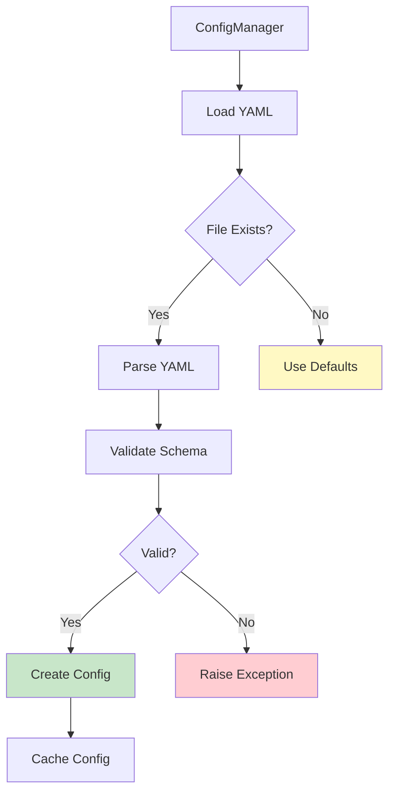

# Voice Module Testing Plan

**Date**: December 8, 2025  
**Status**: Test Plan Design Phase  
**Purpose**: Comprehensive testing strategy for Voice Module (REST API + LiveKit)  
**Version**: 1.0.0

---

## Table of Contents

1. [Overview](#overview)
2. [Architecture Context](#architecture-context)
3. [Testing Approach](#testing-approach)
4. [Backend Test Plan](#backend-test-plan)
5. [Frontend Test Plan](#frontend-test-plan)
6. [Integration Test Plan](#integration-test-plan)
7. [Test Execution Plan](#test-execution-plan)
8. [Test Utilities & Fixtures](#test-utilities--fixtures)
9. [Coverage Targets](#coverage-targets)
10. [CI/CD Integration](#cicd-integration)
11. [Success Criteria](#success-criteria)

---

## Overview

### Voice Module Status

| Component | Status | Coverage Target |
|-----------|--------|-----------------|
| **Backend REST API** | ✅ Complete | >90% |
| **Frontend Core** | ✅ Complete | >90% |
| **LiveKit Integration** | ⏳ Pending | N/A |
| **Testing** | ⏳ Pending | >90% overall |

### Module Architecture


### Current Implementation

**Backend** (9 files, ~2,100 lines):
- ✅ `server/voice/service.py` - Business logic
- ✅ `server/voice/client.py` - ElevenLabs wrapper
- ✅ `server/voice/router.py` - 8 REST endpoints
- ✅ `server/voice/config.py` - Configuration management
- ✅ `server/voice/models.py` - 20+ Pydantic models
- ✅ `server/voice/exceptions.py` - Error handling
- ✅ `server/voice/utils.py` - Helper functions
- ✅ `server/voice/dependencies.py` - DI setup

**Frontend** (8 files, ~2,400 lines):
- ✅ `lib/hooks/useAudioRecorder.ts` - Recording
- ✅ `lib/hooks/useAudioPlayer.ts` - Playback
- ✅ `lib/hooks/useVoice.ts` - Unified hook
- ✅ `lib/services/VoiceApiClient.ts` - API client
- ✅ `lib/contexts/VoiceContext.tsx` - State management
- ✅ `components/voice/VoiceToggle.tsx` - UI component
- ✅ `components/voice/VoiceAnimation.tsx` - Visualization
- ✅ `components/voice/VoiceSettings.tsx` - Settings panel

---

## Architecture Context

### Design Decision: Separate Services Pattern

The voice module follows **Approach 2: Separate Service Pattern** (98.3% score):


**Why This Architecture?**
- ✅ Perfect separation of concerns
- ✅ Easy to test independently
- ✅ Can ship REST while building real-time
- ✅ Maintainable and extensible

### Data Flow

#### REST API Flow


### API Endpoints

| Endpoint | Method | Purpose | Status |
|----------|--------|---------|--------|
| `/voice/transcribe` | POST | Transcribe audio | ✅ |
| `/voice/synthesize` | POST | Text to speech | ✅ |
| `/voice/synthesize/stream` | POST | Stream TTS | ✅ |
| `/voice/voices` | GET | List voices | ✅ |
| `/voice/voices/{id}` | GET | Get voice | ✅ |
| `/voice/config` | GET | Get config | ✅ |
| `/voice/config` | PUT | Update config | ✅ |
| `/voice/health` | GET | Health check | ✅ |

---

## Testing Approach

### Approach Evaluation

Three approaches were evaluated:

#### Approach 1: Unit Tests First ⭐ **SELECTED**
- **Score**: 92.5% (370/400)
- **Pros**: Robustness, modularity, maintainability, easy debugging
- **Cons**: Longer implementation time
- **Best for**: Existing implementation, systematic testing

#### Approach 2: Integration Tests First
- **Score**: 80% (320/400)
- **Pros**: Fast validation, real-world scenarios
- **Cons**: Harder debugging, more brittle

#### Approach 3: TDD Concurrent
- **Score**: 71.25% (285/400)
- **Pros**: Better design, full coverage
- **Cons**: Not applicable (implementation complete)

### Test Strategy


### Test Structure

```
tests/
├── server/voice/              # Backend tests (125 tests)
│   ├── conftest.py
│   ├── test_voice_client.py
│   ├── test_voice_service.py
│   ├── test_voice_router.py
│   ├── test_voice_config.py
│   ├── test_voice_exceptions.py
│   └── test_voice_integration.py
│
└── frontend_web/__tests__/voice/  # Frontend tests (185 tests)
    ├── hooks/
    ├── services/
    ├── contexts/
    ├── components/
    └── integration/
```

**Total Tests**: **310 tests**

---

## Backend Test Plan

### Test Suite 1: `test_voice_client.py` (30 tests)

**Purpose**: Test ElevenLabs SDK wrapper with comprehensive mocking

#### STT Tests (10 tests)


**Test Cases**:
- ✅ Successful transcription with valid audio
- ✅ Transcription with language code specified
- ✅ Transcription returns word timestamps
- ✅ Transcription confidence scores
- ✅ Handle empty audio input (error)
- ✅ Handle invalid audio format (error)
- ✅ Handle API errors (rate limit, auth, network)
- ✅ Validate audio format detection
- ✅ Handle large audio files (>10MB)
- ✅ Handle audio with silence

#### TTS Tests (15 tests)


**Test Cases**:
- ✅ Successful synthesis with valid text
- ✅ Synthesis with voice_id specified
- ✅ Synthesis with custom model
- ✅ Synthesis with voice settings (stability, similarity)
- ✅ Synthesis returns audio bytes
- ✅ Handle empty text input (error)
- ✅ Handle text exceeding max length (5000 chars)
- ✅ Handle invalid voice_id (error)
- ✅ Handle API errors
- ✅ Validate output format
- ✅ Stream synthesis (chunked output)
- ✅ Handle special characters in text
- ✅ Handle multilingual text
- ✅ Handle SSML tags
- ✅ Verify audio metadata

#### Voice Management Tests (5 tests)
- ✅ List all voices
- ✅ Get voice by ID
- ✅ Get voice settings
- ✅ Handle API errors
- ✅ Verify voice metadata structure

**Mock Strategy**:
```python
@pytest.fixture
def mock_elevenlabs_client():
    """Mock ElevenLabs SDK client"""
    with patch('elevenlabs.client.ElevenLabs') as mock:
        mock_instance = MagicMock()
        mock.return_value = mock_instance

        # Mock STT
        mock_instance.speech_to_text.convert.return_value = MagicMock(
            text="Hello world",
            words=[{"word": "Hello", "start": 0.0, "end": 0.5}],
            confidence=0.95
        )

        # Mock TTS
        mock_instance.text_to_speech.convert.return_value = iter([b"audio_chunk"])

        yield mock_instance
```

---

### Test Suite 2: `test_voice_service.py` (30 tests)

**Purpose**: Test business logic layer with service orchestration

#### Transcription Service Tests (10 tests)


**Test Cases**:
- ✅ Transcribe with default config
- ✅ Transcribe with custom STT config
- ✅ Transcribe with invalid audio (error handling)
- ✅ Transcribe with audio format validation
- ✅ Transcribe async execution
- ✅ Transcribe with language detection
- ✅ Transcribe with config hot-reload
- ✅ Transcribe caching (if implemented)
- ✅ Transcribe concurrent requests
- ✅ Transcribe with timeout handling

#### Synthesis Service Tests (15 tests)


**Test Cases**:
- ✅ Synthesize with default config
- ✅ Synthesize with voice profile
- ✅ Synthesize with custom voice_id
- ✅ Synthesize with text sanitization
- ✅ Synthesize with text exceeding limit (truncation)
- ✅ Synthesize async execution
- ✅ Synthesize streaming
- ✅ Synthesize with profile not found (error)
- ✅ Synthesize with config hot-reload
- ✅ Synthesize with volume/speed adjustments
- ✅ Synthesize with SSML tags
- ✅ Synthesize concurrent requests
- ✅ Synthesize caching (if implemented)
- ✅ Synthesize with retry logic
- ✅ Synthesize with fallback profile

#### Voice Management Service Tests (5 tests)
- ✅ Get voices with caching
- ✅ Get voices with refresh
- ✅ Get voice by ID
- ✅ Get voices cache expiry
- ✅ Get voices with API failure (graceful degradation)

---

### Test Suite 3: `test_voice_router.py` (25 tests)

**Purpose**: Test FastAPI endpoints with TestClient

#### Test Flow


#### Transcribe Endpoint Tests (8 tests)
- ✅ POST /voice/transcribe - success with valid audio
- ✅ POST /voice/transcribe - with language_code param
- ✅ POST /voice/transcribe - with invalid file format (400)
- ✅ POST /voice/transcribe - with missing file (422)
- ✅ POST /voice/transcribe - with empty file (400)
- ✅ POST /voice/transcribe - with large file (payload too large)
- ✅ POST /voice/transcribe - API error handling (500)
- ✅ POST /voice/transcribe - response structure validation

#### Synthesize Endpoint Tests (12 tests)
- ✅ POST /voice/synthesize - success with valid text
- ✅ POST /voice/synthesize - with voice_id
- ✅ POST /voice/synthesize - with profile_name
- ✅ POST /voice/synthesize - with invalid profile (404)
- ✅ POST /voice/synthesize - with empty text (422)
- ✅ POST /voice/synthesize - with text exceeding limit (400)
- ✅ POST /voice/synthesize - returns audio/mpeg
- ✅ POST /voice/synthesize - API error handling (500)
- ✅ POST /voice/synthesize/stream - success
- ✅ POST /voice/synthesize/stream - streaming chunks
- ✅ POST /voice/synthesize/stream - error handling
- ✅ POST /voice/synthesize/stream - content-type validation

#### Voice Management Endpoint Tests (3 tests)
- ✅ GET /voice/voices - success
- ✅ GET /voice/voices?refresh=true - force refresh
- ✅ GET /voice/voices/{voice_id} - get specific voice

#### Health & Config Endpoint Tests (2 tests)
- ✅ GET /voice/health - service health check
- ✅ GET /voice/config - get current config

**Test Client Setup**:
```python
from fastapi.testclient import TestClient
from server.main import app

@pytest.fixture
def client():
    """FastAPI test client"""
    return TestClient(app)

def test_transcribe_success(client, sample_audio_file):
    """Test successful transcription"""
    files = {'audio': ('test.webm', sample_audio_file, 'audio/webm')}
    response = client.post('/voice/transcribe', files=files)

    assert response.status_code == 200
    data = response.json()
    assert data['success'] is True
    assert 'result' in data
    assert 'text' in data['result']
```

---

### Test Suite 4: `test_voice_config.py` (15 tests)

**Purpose**: Test configuration loading and management

#### Config Loading Flow



**Test Cases**:

#### Config Loading Tests (8 tests)
- ✅ Load valid voice_config.yaml
- ✅ Load with missing file (defaults)
- ✅ Load with invalid YAML (syntax error)
- ✅ Load with missing required keys
- ✅ Load with invalid values (type errors)
- ✅ Load with environment variable expansion
- ✅ Validate Pydantic models
- ✅ Load multiple profiles

#### Config Hot-Reload Tests (5 tests)
- ✅ Detect file modification
- ✅ Reload on file change
- ✅ Cache unchanged config
- ✅ Handle reload errors gracefully
- ✅ Validate new config before applying

#### Config Access Tests (2 tests)
- ✅ Get default TTS config
- ✅ Get voice profile by name

---

### Test Suite 5: `test_voice_exceptions.py` (10 tests)

**Purpose**: Test error handling and exception classes

#### Exception Hierarchy


**Test Cases**:

#### Exception Hierarchy Tests (3 tests)
- ✅ VoiceException base class
- ✅ TTSException inheritance
- ✅ STTException inheritance

#### Error Code Tests (4 tests)
- ✅ TTSException error codes (VOICE_1xx)
- ✅ STTException error codes (VOICE_2xx)
- ✅ ConfigException error codes (VOICE_3xx)
- ✅ ClientException error codes (VOICE_4xx, VOICE_5xx)

#### Error Message Tests (3 tests)
- ✅ Exception message formatting
- ✅ Exception with details dict
- ✅ Exception serialization (to_dict)

---

### Test Suite 6: `test_voice_integration.py` (15 tests)

**Purpose**: Full-stack integration tests

#### End-to-End Workflow


**Test Cases**:

#### End-to-End Workflow Tests (10 tests)
- ✅ Upload audio → transcribe → get text
- ✅ Submit text → synthesize → get audio
- ✅ List voices → select voice → synthesize with voice
- ✅ Get config → use profile → synthesize
- ✅ Stream synthesis → receive chunks
- ✅ Transcribe + synthesize (round-trip)
- ✅ Concurrent transcriptions
- ✅ Concurrent syntheses
- ✅ Config hot-reload during request
- ✅ Health check validation

#### Error Recovery Tests (5 tests)
- ✅ API rate limit → retry
- ✅ Network timeout → error response
- ✅ Invalid API key → 401 error
- ✅ Service unavailable → 503 error
- ✅ Graceful degradation (cached data)

---

## Frontend Test Plan

### Test Suite 1: `useAudioRecorder.test.ts` (25 tests)

**Purpose**: Test audio recording hook with MediaRecorder API mocking

#### Recording Flow


**Test Categories**:

#### Permission Tests (5 tests)
- ✅ Request permission success
- ✅ Request permission denied
- ✅ Permission already granted
- ✅ Permission not supported (browser)
- ✅ Multiple permission requests

#### Recording Tests (10 tests)
- ✅ Start recording success
- ✅ Stop recording and get blob
- ✅ Cancel recording
- ✅ Recording duration tracking
- ✅ Audio level monitoring
- ✅ Auto-stop at max duration
- ✅ Multiple start/stop cycles
- ✅ Recording state transitions
- ✅ Concurrent recording attempts (error)
- ✅ Pause/resume recording

#### Error Handling Tests (5 tests)
- ✅ Start without permission (error)
- ✅ MediaRecorder not supported
- ✅ Recording failure (device error)
- ✅ Stop without active recording
- ✅ Audio context creation failure

#### Cleanup Tests (5 tests)
- ✅ Cleanup on unmount
- ✅ Stop audio tracks on cleanup
- ✅ Clear audio chunks
- ✅ Reset state on cleanup
- ✅ Multiple cleanup calls (idempotent)

---

### Test Suite 2: `useAudioPlayer.test.ts` (20 tests)

**Purpose**: Test audio playback hook with Audio API mocking

#### Playback Flow


**Test Categories**:

#### Playback Control Tests (8 tests)
- ✅ Play audio from blob
- ✅ Play audio from URL
- ✅ Pause playback
- ✅ Resume playback
- ✅ Stop playback
- ✅ Seek to position
- ✅ Volume control
- ✅ Playback speed control

#### State Management Tests (6 tests)
- ✅ Track playback state (playing/paused/stopped)
- ✅ Track current time
- ✅ Track duration
- ✅ Track loading state
- ✅ Track buffering state
- ✅ Track ended state

#### Error Handling Tests (3 tests)
- ✅ Handle load error
- ✅ Handle playback error
- ✅ Handle unsupported format

#### Cleanup Tests (3 tests)
- ✅ Cleanup on unmount
- ✅ Revoke blob URLs
- ✅ Stop audio on cleanup

---

### Test Suite 3: `useVoice.test.ts` (25 tests)

**Purpose**: Test unified voice hook combining recorder + player + API

#### Complete Workflow


**Test Categories**:

#### Workflow Tests (10 tests)
- ✅ Record and transcribe
- ✅ Synthesize and play
- ✅ Full round-trip (record → transcribe → synthesize → play)
- ✅ Auto-transcribe on stop
- ✅ Auto-play on synthesis
- ✅ Cancel recording workflow
- ✅ Stop playback workflow
- ✅ Concurrent operations handling
- ✅ Queue management
- ✅ Retry failed operations

#### State Management Tests (8 tests)
- ✅ Combined recording + playback state
- ✅ Loading states (transcribing, synthesizing)
- ✅ Error states
- ✅ Last transcript tracking
- ✅ Last audio tracking
- ✅ Audio level tracking
- ✅ Duration tracking
- ✅ State synchronization

#### Integration Tests (5 tests)
- ✅ Voice API client integration
- ✅ Settings from VoiceContext
- ✅ Error propagation
- ✅ Cleanup coordination
- ✅ Dependency injection

#### Error Recovery Tests (2 tests)
- ✅ Retry transcription on failure
- ✅ Fallback to default voice on error

---

### Test Suite 4: `VoiceApiClient.test.ts` (30 tests)

**Purpose**: Test REST API client with fetch mocking

#### API Client Flow


**Test Categories**:

#### Transcribe Tests (8 tests)
- ✅ Transcribe success
- ✅ Transcribe with language code
- ✅ Transcribe handles FormData
- ✅ Transcribe response parsing
- ✅ Transcribe error handling (400, 500)
- ✅ Transcribe network error
- ✅ Transcribe timeout
- ✅ Transcribe retries

#### Synthesize Tests (12 tests)
- ✅ Synthesize success
- ✅ Synthesize with voice_id
- ✅ Synthesize with profile_name
- ✅ Synthesize returns blob
- ✅ Synthesize error handling
- ✅ Synthesize streaming success
- ✅ Synthesize streaming chunks
- ✅ Synthesize streaming error
- ✅ Synthesize with custom settings
- ✅ Synthesize timeout
- ✅ Synthesize retries
- ✅ Synthesize cancellation

#### Voice Management Tests (5 tests)
- ✅ List voices success
- ✅ List voices with refresh
- ✅ Get voice by ID
- ✅ Voice caching
- ✅ Voice error handling

#### Config Tests (3 tests)
- ✅ Get config success
- ✅ Update config success
- ✅ Config error handling

#### Health Tests (2 tests)
- ✅ Health check success
- ✅ Health check failure

---

### Test Suite 5: `VoiceContext.test.tsx` (15 tests)

**Purpose**: Test React Context and provider

#### Context Architecture


**Test Categories**:

#### Provider Tests (5 tests)
- ✅ Provides voice client
- ✅ Provides settings
- ✅ Provides voices list
- ✅ Loads voices on mount
- ✅ Initializes with custom settings

#### Settings Management Tests (6 tests)
- ✅ Update settings
- ✅ Persist to localStorage
- ✅ Load from localStorage
- ✅ Merge with defaults
- ✅ Validate settings
- ✅ Reset settings

#### Voices Management Tests (3 tests)
- ✅ Refresh voices
- ✅ Cache voices
- ✅ Handle voices loading error

#### Hook Tests (1 test)
- ✅ Custom hooks work correctly

---

### Test Suite 6: Component Tests (60 tests total)

#### `VoiceToggle.test.tsx` (15 tests)

**Component States**:


**Test Cases**:
- ✅ Render idle state
- ✅ Render recording state
- ✅ Render processing state
- ✅ Click to start recording
- ✅ Click to stop recording
- ✅ Permission request flow
- ✅ Permission denied handling
- ✅ Disabled state
- ✅ Duration display
- ✅ Audio level indicator
- ✅ Error display
- ✅ Auto-transcribe behavior
- ✅ Keyboard accessibility
- ✅ Screen reader labels
- ✅ Cleanup on unmount

#### `VoiceAnimation.test.tsx` (12 tests)

**Animation Types**:


**Test Cases**:
- ✅ Render with audio level
- ✅ Animate bars based on level
- ✅ Different animation styles (bars, wave, pulse)
- ✅ Canvas rendering
- ✅ Resize handling
- ✅ Active/inactive states
- ✅ Custom bar count
- ✅ Custom height
- ✅ Color customization
- ✅ Smooth transitions
- ✅ Performance optimization
- ✅ Cleanup canvas on unmount

#### `VoiceSettings.test.tsx` (18 tests)

**Test Cases**:
- ✅ Render all settings controls
- ✅ Voice selector dropdown
- ✅ Profile selector radio group
- ✅ TTS toggle switch
- ✅ STT toggle switch
- ✅ Auto-play toggle
- ✅ Volume slider
- ✅ Speed slider
- ✅ Refresh voices button
- ✅ Settings persistence
- ✅ Loading states
- ✅ Error states
- ✅ Compact layout
- ✅ Full layout
- ✅ Disabled states
- ✅ Validation feedback
- ✅ Keyboard navigation
- ✅ Accessibility labels

#### `VoiceInputPanel.test.tsx` (15 tests)

**Test Cases**:
- ✅ Render voice button
- ✅ Render animation during recording
- ✅ Render duration display
- ✅ Render error message
- ✅ Start recording on click
- ✅ Stop recording on click
- ✅ Call onTranscript callback
- ✅ Disabled state handling
- ✅ Hide when STT disabled
- ✅ Processing state
- ✅ Permission flow
- ✅ Error recovery
- ✅ Multiple recording cycles
- ✅ Cleanup on unmount
- ✅ Integration with chat

---

### Test Suite 7: `voice-chat-flow.test.tsx` (10 tests)

**Purpose**: E2E integration tests for voice in chat

#### Complete Chat Flow


**Test Cases**:
- ✅ Record voice input → transcribe → send message
- ✅ Receive agent response → auto-play
- ✅ Toggle auto-play setting
- ✅ Adjust volume during playback
- ✅ Multiple voice interactions
- ✅ Voice + text input mixed
- ✅ Error handling in chat
- ✅ Settings persistence
- ✅ Voice disabled state
- ✅ Full conversation flow

---

## Integration Test Plan

### Backend Integration Tests

#### Full Stack Test Flow

```mermaid
graph TD
    A[Test Client] --> B[FastAPI Router]
    B --> C[VoiceService]
    C --> D[VoiceClient]
    D --> E[Mocked ElevenLabs]
    
    E -->|Success| F[Return Data]
    E -->|Error| G[Return Error]
    
    F --> H[Validate Response]
    G --> I[Validate Error]
    
    style H fill:#c8e6c9
    style I fill:#ffcdd2
```

### Frontend Integration Tests

#### Component Integration Flow

```mermaid
graph TD
    A[VoiceToggle] --> B[useVoice Hook]
    B --> C[VoiceApiClient]
    C --> D[Mocked Fetch]
    
    D -->|Success| E[Update State]
    D -->|Error| F[Show Error]
    
    E --> G[Update UI]
    F --> H[Display Error]
    
    style G fill:#c8e6c9
    style H fill:#ffcdd2
```

---

## Test Execution Plan

### Timeline

```mermaid
gantt
    title Voice Module Testing Timeline
    dateFormat YYYY-MM-DD
    section Backend
    Unit Tests           :a1, 2025-12-09, 2d
    Integration Tests    :a2, after a1, 1d
    section Frontend
    Unit Tests           :b1, after a1, 2d
    Component Tests      :b2, after b1, 2d
    section Integration
    E2E Tests            :c1, after b2, 1d
    section Polish
    Fix & Documentation  :d1, after c1, 2d
```

### Phase 1: Backend Unit Tests (Days 1-2)

**Target**: 85 tests, >90% coverage

1. **Setup** (2 hours):
   - Create test directory structure
   - Install test dependencies (pytest, pytest-asyncio, pytest-cov)
   - Create conftest.py with shared fixtures

2. **Implementation** (12 hours):
   - `test_voice_client.py` (30 tests) - 4 hours
   - `test_voice_service.py` (30 tests) - 4 hours
   - `test_voice_config.py` (15 tests) - 2 hours
   - `test_voice_exceptions.py` (10 tests) - 2 hours

3. **Validation** (2 hours):
   - Run all tests: `pytest tests/server/voice/ -v`
   - Check coverage: `pytest --cov=server.voice --cov-report=html`
   - Fix failing tests

### Phase 2: Backend Integration Tests (Day 3)

**Target**: 40 tests, full API coverage

1. **Implementation** (4 hours):
   - `test_voice_router.py` (25 tests)
   - `test_voice_integration.py` (15 tests)

2. **Validation** (2 hours):
   - Run integration tests
   - Test against real server (optional)
   - Fix issues

### Phase 3: Frontend Unit Tests (Days 4-5)

**Target**: 100 tests, >90% coverage

1. **Setup** (2 hours):
   - Update Jest configuration
   - Create mock utilities
   - Setup test environment

2. **Implementation** (14 hours):
   - `useAudioRecorder.test.ts` (25 tests) - 4 hours
   - `useAudioPlayer.test.ts` (20 tests) - 3 hours
   - `useVoice.test.ts` (25 tests) - 4 hours
   - `VoiceApiClient.test.ts` (30 tests) - 3 hours

3. **Validation** (2 hours):
   - Run tests: `npm test voice`
   - Check coverage: `npm run test:coverage`
   - Fix failing tests

### Phase 4: Frontend Component Tests (Days 6-7)

**Target**: 75 tests, full component coverage

1. **Implementation** (12 hours):
   - `VoiceContext.test.tsx` (15 tests) - 2 hours
   - `VoiceToggle.test.tsx` (15 tests) - 3 hours
   - `VoiceAnimation.test.tsx` (12 tests) - 2 hours
   - `VoiceSettings.test.tsx` (18 tests) - 3 hours
   - `VoiceInputPanel.test.tsx` (15 tests) - 2 hours

2. **Validation** (2 hours):
   - Run component tests
   - Visual regression checks
   - Accessibility validation

### Phase 5: E2E Integration Tests (Day 8)

**Target**: 10 tests, critical paths covered

1. **Implementation** (4 hours):
   - `voice-chat-flow.test.tsx` (10 tests)
   - Full workflow validation

2. **Validation** (2 hours):
   - Run E2E tests
   - Manual testing
   - Fix issues

### Phase 6: Fix & Polish (Days 9-10)

1. **Issue Resolution** (8 hours):
   - Fix all failing tests
   - Improve test coverage gaps
   - Refactor brittle tests

2. **Documentation** (4 hours):
   - Update test documentation
   - Add test examples
   - Document test patterns

3. **CI/CD Integration** (2 hours):
   - Add test commands to CI
   - Setup coverage reporting
   - Configure test matrix

---

## Test Utilities & Fixtures

### Backend Fixtures (`tests/server/voice/conftest.py`)

```python
import pytest
from unittest.mock import MagicMock, patch
from server.voice.client import VoiceClient
from server.voice.service import VoiceService
from server.voice.config import VoiceConfigManager

@pytest.fixture
def mock_elevenlabs_client():
    """Mock ElevenLabs SDK client"""
    with patch('elevenlabs.client.ElevenLabs') as mock:
        mock_instance = MagicMock()
        mock.return_value = mock_instance

        # STT mock
        mock_instance.speech_to_text.convert.return_value = MagicMock(
            text="Test transcription",
            words=[{"word": "Test", "start": 0.0, "end": 0.5}],
            confidence=0.95,
        )

        # TTS mock
        mock_instance.text_to_speech.convert.return_value = iter([
            b"audio_chunk_1",
            b"audio_chunk_2",
        ])

        # Voices mock
        mock_instance.voices.get_all.return_value = MagicMock(
            voices=[
                MagicMock(
                    voice_id="test_voice_1",
                    name="Test Voice",
                    category="premade",
                )
            ]
        )

        yield mock_instance

@pytest.fixture
def voice_client(mock_elevenlabs_client):
    """Create VoiceClient with mocked SDK"""
    return VoiceClient(api_key="test_api_key")

@pytest.fixture
def voice_config_manager(tmp_path):
    """Create config manager with temporary config file"""
    config_file = tmp_path / "voice_config.yaml"
    config_file.write_text("""
voice:
  enabled: true
  tts:
    voice_id: "test_voice"
    model_id: "eleven_multilingual_v2"
    output_format: "mp3_44100_128"
    stability: 0.5
    similarity_boost: 0.75
  stt:
    model_id: "scribe_v1"
    language_code: null
    timestamps_granularity: "word"
  voice_profiles:
    default:
      stability: 0.5
      similarity_boost: 0.75
    professional:
      stability: 0.4
      similarity_boost: 0.8
  default_profile: "default"
""")
    return VoiceConfigManager(config_path=config_file)

@pytest.fixture
def voice_service(voice_client, voice_config_manager):
    """Create VoiceService with mocks"""
    return VoiceService(
        client=voice_client,
        config_manager=voice_config_manager,
    )

@pytest.fixture
def sample_audio_bytes():
    """Generate sample audio bytes"""
    # Minimal WAV header + data
    return (
        b"RIFF"
        + b"\x24\x00\x00\x00"  # Chunk size
        + b"WAVE"
        + b"fmt "
        + b"\x10\x00\x00\x00"  # Subchunk1 size
        + b"\x01\x00"  # Audio format (PCM)
        + b"\x01\x00"  # Num channels
        + b"\x44\xAC\x00\x00"  # Sample rate (44100)
        + b"\x88\x58\x01\x00"  # Byte rate
        + b"\x02\x00"  # Block align
        + b"\x10\x00"  # Bits per sample
        + b"data"
        + b"\x00\x00\x00\x00"  # Subchunk2 size
    )

@pytest.fixture
def sample_text():
    """Sample text for synthesis"""
    return "Hello, this is a test of the text-to-speech system."
```

### Frontend Test Utilities

#### `mockMediaRecorder.ts`
```typescript
export const createMockMediaRecorder = () => {
  const mockMediaRecorder = {
    start: jest.fn(),
    stop: jest.fn(),
    pause: jest.fn(),
    resume: jest.fn(),
    state: 'inactive' as RecordingState,
    ondataavailable: null as ((event: BlobEvent) => void) | null,
    onstop: null as (() => void) | null,
    onerror: null as ((error: Error) => void) | null,
    addEventListener: jest.fn(),
    removeEventListener: jest.fn(),
  };

  mockMediaRecorder.start.mockImplementation(() => {
    mockMediaRecorder.state = 'recording';
    setTimeout(() => {
      if (mockMediaRecorder.ondataavailable) {
        const blob = new Blob(['audio'], { type: 'audio/webm' });
        mockMediaRecorder.ondataavailable({ data: blob } as BlobEvent);
      }
    }, 100);
  });

  mockMediaRecorder.stop.mockImplementation(() => {
    mockMediaRecorder.state = 'inactive';
    if (mockMediaRecorder.onstop) {
      mockMediaRecorder.onstop();
    }
  });

  return mockMediaRecorder;
};

export const setupMediaRecorderMock = () => {
  const mockRecorder = createMockMediaRecorder();

  global.MediaRecorder = jest.fn(() => mockRecorder) as any;
  (global.MediaRecorder as any).isTypeSupported = jest.fn(() => true);

  global.navigator.mediaDevices = {
    getUserMedia: jest.fn().mockResolvedValue({
      getTracks: () => [
        {
          stop: jest.fn(),
          kind: 'audio',
          enabled: true,
        },
      ],
    }),
  } as any;

  return mockRecorder;
};
```

#### `mockAudio.ts`
```typescript
export const createMockAudio = () => {
  const listeners: Record<string, Function[]> = {};

  const mockAudio = {
    play: jest.fn().mockResolvedValue(undefined),
    pause: jest.fn(),
    load: jest.fn(),
    currentTime: 0,
    duration: 100,
    volume: 1,
    playbackRate: 1,
    ended: false,
    paused: true,
    src: '',

    addEventListener: jest.fn((event: string, handler: Function) => {
      if (!listeners[event]) listeners[event] = [];
      listeners[event].push(handler);
    }),

    removeEventListener: jest.fn((event: string, handler: Function) => {
      if (listeners[event]) {
        listeners[event] = listeners[event].filter(h => h !== handler);
      }
    }),

    dispatchEvent: jest.fn((event: Event) => {
      if (listeners[event.type]) {
        listeners[event.type].forEach(handler => handler(event));
      }
    }),
  };

  mockAudio.play.mockImplementation(() => {
    mockAudio.paused = false;
    mockAudio.dispatchEvent(new Event('play'));
    return Promise.resolve();
  });

  mockAudio.pause.mockImplementation(() => {
    mockAudio.paused = true;
    mockAudio.dispatchEvent(new Event('pause'));
  });

  return mockAudio;
};

export const setupAudioMock = () => {
  const mockAudio = createMockAudio();
  global.Audio = jest.fn(() => mockAudio) as any;
  return mockAudio;
};
```

#### `mockVoiceApiClient.ts`
```typescript
import { VoiceApiClient } from '@/lib/services/VoiceApiClient';

export const createMockVoiceApiClient = (): jest.Mocked<VoiceApiClient> => {
  return {
    transcribe: jest.fn().mockResolvedValue({
      success: true,
      result: {
        text: 'Mock transcription',
        words: [],
        confidence: 0.95,
      },
    }),

    synthesize: jest.fn().mockResolvedValue(
      new Blob(['audio'], { type: 'audio/mpeg' })
    ),

    synthesizeStream: jest.fn(async function* () {
      yield new Uint8Array([1, 2, 3]);
      yield new Uint8Array([4, 5, 6]);
    }),

    listVoices: jest.fn().mockResolvedValue([
      {
        voice_id: 'test_voice_1',
        name: 'Test Voice',
        category: 'premade',
        description: 'Test voice description',
      },
    ]),

    getVoice: jest.fn().mockResolvedValue({
      voice_id: 'test_voice_1',
      name: 'Test Voice',
      category: 'premade',
      description: 'Test voice description',
    }),

    getConfig: jest.fn().mockResolvedValue({
      enabled: true,
      tts: { voice_id: 'test_voice' },
      stt: { model_id: 'scribe_v1' },
    }),

    healthCheck: jest.fn().mockResolvedValue({
      healthy: true,
      elevenlabs_connected: true,
    }),
  } as any;
};
```

---

## Coverage Targets

### Backend Coverage Goals

| Module | Target | Rationale |
|--------|--------|-----------|
| `voice/client.py` | **95%** | Critical SDK wrapper |
| `voice/service.py` | **90%** | Core business logic |
| `voice/router.py` | **90%** | API endpoints |
| `voice/config.py` | **85%** | Configuration handling |
| `voice/exceptions.py` | **100%** | Error classes (simple) |
| `voice/utils.py` | **90%** | Helper functions |
| `voice/models.py` | **80%** | Data models (Pydantic validates) |
| **Overall** | **>90%** | High confidence threshold |

### Frontend Coverage Goals

| Module | Target | Rationale |
|--------|--------|-----------|
| `hooks/useAudioRecorder.ts` | **90%** | Critical recording logic |
| `hooks/useAudioPlayer.ts` | **90%** | Critical playback logic |
| `hooks/useVoice.ts` | **90%** | Unified workflow |
| `services/VoiceApiClient.ts` | **95%** | API communication |
| `contexts/VoiceContext.tsx` | **85%** | State management |
| `components/VoiceToggle.tsx` | **85%** | UI component |
| `components/VoiceAnimation.tsx` | **80%** | Visual component |
| `components/VoiceSettings.tsx` | **85%** | Settings UI |
| `components/VoiceInputPanel.tsx` | **85%** | Chat integration |
| **Overall** | **>90%** | High confidence threshold |

### Coverage Visualization

```mermaid
graph LR
    A[Target Coverage] --> B[Backend >90%]
    A --> C[Frontend >90%]
    
    B --> D[Client: 95%]
    B --> E[Service: 90%]
    B --> F[Router: 90%]
    
    C --> G[Hooks: 90%]
    C --> H[Services: 95%]
    C --> I[Components: 85%]
    
    style A fill:#fff9c4
    style B fill:#c8e6c9
    style C fill:#c8e6c9
```

---

## CI/CD Integration

### GitHub Actions Workflow

```yaml
name: Voice Tests

on:
  push:
    branches: [main, develop]
    paths:
      - 'server/voice/**'
      - 'frontend_web/lib/hooks/use*.ts'
      - 'frontend_web/components/voice/**'
  pull_request:
    paths:
      - 'server/voice/**'
      - 'frontend_web/lib/hooks/use*.ts'
      - 'frontend_web/components/voice/**'

jobs:
  backend-tests:
    runs-on: ubuntu-latest
    steps:
      - uses: actions/checkout@v3

      - name: Set up Python
        uses: actions/setup-python@v4
        with:
          python-version: '3.11'

      - name: Install dependencies
        run: |
          cd server
          pip install -e .
          pip install pytest pytest-asyncio pytest-cov

      - name: Run backend tests
        run: |
          cd server
          pytest tests/server/voice/ --cov=server.voice --cov-report=xml

      - name: Upload coverage
        uses: codecov/codecov-action@v3
        with:
          files: ./server/coverage.xml
          flags: backend

  frontend-tests:
    runs-on: ubuntu-latest
    steps:
      - uses: actions/checkout@v3

      - name: Set up Node
        uses: actions/setup-node@v3
        with:
          node-version: '18'

      - name: Install dependencies
        run: |
          cd frontend_web
          npm ci

      - name: Run frontend tests
        run: |
          cd frontend_web
          npm run test:coverage -- voice

      - name: Upload coverage
        uses: codecov/codecov-action@v3
        with:
          files: ./frontend_web/coverage/coverage-final.json
          flags: frontend
```

### Test Commands

#### Backend
```bash
# Run all voice tests
pytest tests/server/voice/ -v

# Run specific test suite
pytest tests/server/voice/test_voice_client.py -v

# Run with coverage
pytest tests/server/voice/ --cov=server.voice --cov-report=html

# Run integration tests only
pytest tests/server/voice/test_voice_integration.py -v

# Run with parallel execution
pytest tests/server/voice/ -n auto

# Run with markers
pytest tests/server/voice/ -m "not slow"
```

#### Frontend
```bash
# Run all voice tests
npm test -- voice

# Run specific test suite
npm test -- useAudioRecorder.test.ts

# Run with coverage
npm run test:coverage -- voice

# Run in watch mode
npm test -- --watch voice

# Update snapshots
npm test -- -u voice

# Run E2E tests
npm test -- voice-chat-flow.test.tsx
```

---

## Success Criteria

### Phase Completion Checklist

#### Backend Tests ✅
- [ ] All 125 backend tests passing
- [ ] >90% code coverage achieved
- [ ] No critical bugs found
- [ ] Integration tests validate full API

#### Frontend Tests ✅
- [ ] All 185 frontend tests passing
- [ ] >90% code coverage achieved
- [ ] All components render correctly
- [ ] E2E workflows function properly

#### Quality Gates ✅
- [ ] No test flakiness (<1% flake rate)
- [ ] All error paths tested
- [ ] Performance tests pass (if applicable)
- [ ] Accessibility tests pass

#### Documentation ✅
- [ ] Test documentation complete
- [ ] Test patterns documented
- [ ] Examples provided
- [ ] CI/CD integrated

### Test Summary

```mermaid
pie title Test Distribution
    "Backend Unit" : 85
    "Backend Integration" : 40
    "Frontend Unit" : 100
    "Frontend Component" : 75
    "E2E Integration" : 10
```

**Total Tests**: **310 tests**  
**Estimated Time**: **10 days (80 hours)**  
**Coverage Target**: **>90% across backend and frontend**

---

## Next Steps After Testing

Once all tests are passing and coverage targets met:

1. **LiveKit Implementation** (optional):
   - Design LiveKit backend
   - Implement LiveKit agent
   - Design LiveKit frontend
   - Implement LiveKit components
   - Test LiveKit integration

2. **Production Readiness**:
   - Performance optimization
   - Security audit
   - Load testing
   - Deployment documentation

3. **User Documentation**:
   - User guides
   - API reference
   - Troubleshooting guides
   - Video tutorials

---

**Test Plan Status**: Ready for Implementation  
**Last Updated**: December 8, 2025  
**Maintainer**: OpenAgents Team

