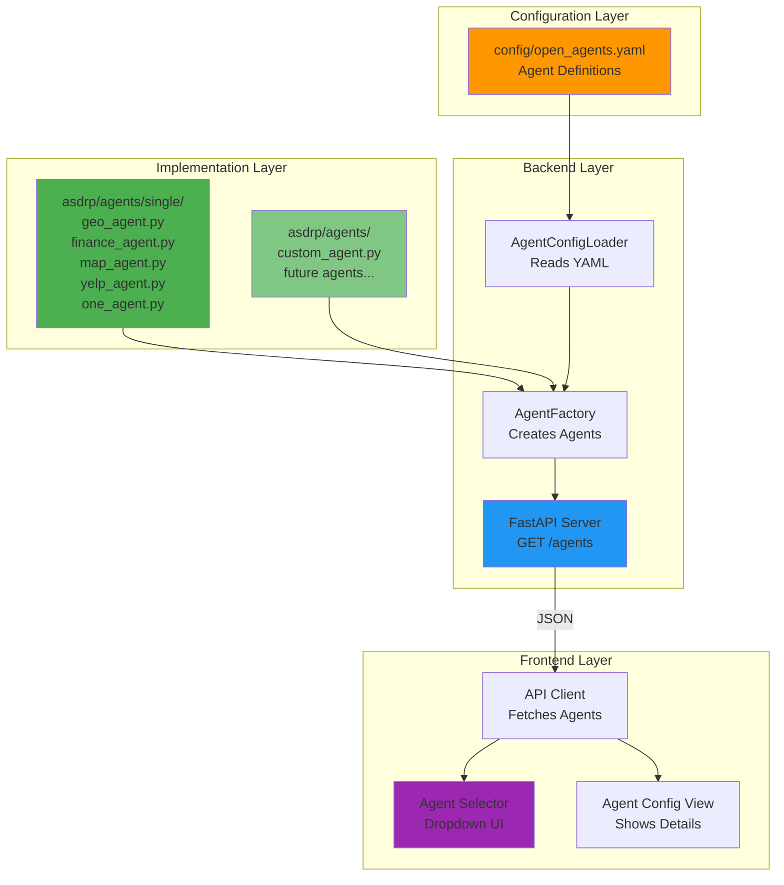

# Agent Discovery & Configuration System

## Overview

The OpenAgents frontend **automatically discovers and displays all agents** defined in `config/open_agents.yaml`. The system uses a dynamic, configuration-driven approach where agents are:

1. Defined in `config/open_agents.yaml`
2. Implemented in `asdrp/agents/` (typically `asdrp/agents/single/`)
3. Loaded by the backend via `AgentFactory`
4. Exposed to the frontend via REST API
5. Displayed in the frontend UI automatically

**No hardcoded agent lists!** Add a new agent to the YAML and it appears immediately.

## Architecture



## Agent Definition Flow

### 1. Agent Definition (YAML)

**File**: `config/open_agents.yaml`

```yaml
agents:
  geo:                                          # Agent ID (used in API calls)
    display_name: "GeoAgent"                    # Shown in UI
    module: "asdrp.agents.single.geo_agent"     # Python module path
    function: "create_geo_agent"                # Factory function
    default_instructions: |
      You are a geocoding agent...
    model:
      name: "gpt-4.1-mini"
      temperature: 0.7
      max_tokens: 2000
    session_memory:
      type: "sqlite"
      enabled: true
    enabled: true                               # Must be true to appear in UI
```

**Key Fields**:
- `module`: Python module containing the agent implementation
- `function`: Factory function that creates the agent instance
- `enabled`: If false, agent won't appear in the frontend

### 2. Agent Implementation (Python)

**File**: `asdrp/agents/single/geo_agent.py`

```python
from agents import Agent

def create_geo_agent(instructions: str, model_config=None) -> Agent:
    """
    Factory function that creates a GeoAgent instance.
    This function name must match the 'function' field in YAML.
    """
    agent = Agent(
        name="GeoAgent",
        instructions=instructions,
        model=model_config.name if model_config else "gpt-4",
        # ... tools, etc.
    )
    return agent
```

**Requirements**:
- Must have a factory function matching the YAML `function` field
- Factory function must accept `instructions` and optional `model_config`
- Must return an object implementing `AgentProtocol`

### 3. Backend Loading (FastAPI)

**File**: `server/agent_service.py`

```python
class AgentService:
    def list_agents(self) -> List[AgentListItem]:
        """
        Returns all ENABLED agents from config/open_agents.yaml.
        Frontend calls this via GET /agents endpoint.
        """
        agent_names = self._config_loader.list_agents()  # Reads YAML
        agents = []

        for name in agent_names:
            config = self._config_loader.get_agent_config(name)
            if config.enabled:  # Only include enabled agents
                agents.append(AgentListItem(
                    id=name,
                    name=name,
                    display_name=config.display_name,
                    enabled=config.enabled
                ))

        return agents
```

### 4. Frontend Display (React)

**File**: `frontend_web/components/agent-selector.tsx`

```typescript
export function AgentSelector({ value, onValueChange }: Props) {
  const [agents, setAgents] = useState<AgentListItem[]>([]);

  useEffect(() => {
    async function fetchAgents() {
      const client = getApiClient();
      const data = await client.listAgents();  // Calls GET /agents
      setAgents(data);  // Automatically displays all enabled agents
    }
    fetchAgents();
  }, []);

  return <Select options={agents.map(a => ({
    value: a.id,
    label: a.display_name
  }))} />;
}
```

## Current Agents

The system currently includes these agents from `config/open_agents.yaml`:

| Agent ID | Display Name | Module | Location |
|----------|-------------|---------|----------|
| `geo` | GeoAgent | `asdrp.agents.single.geo_agent` | `asdrp/agents/single/geo_agent.py` |
| `finance` | FinanceAgent | `asdrp.agents.single.finance_agent` | `asdrp/agents/single/finance_agent.py` |
| `map` | MapAgent | `asdrp.agents.single.map_agent` | `asdrp/agents/single/map_agent.py` |
| `yelp` | YelpAgent | `asdrp.agents.single.yelp_agent` | `asdrp/agents/single/yelp_agent.py` |
| `one` | OneAgent | `asdrp.agents.single.one_agent` | `asdrp/agents/single/one_agent.py` |

## Adding a New Agent

### Step-by-Step Guide

#### 1. Create Agent Implementation

Create `asdrp/agents/single/weather_agent.py`:

```python
from agents import Agent
from asdrp.actions.weather import weather_tools  # Your tools

def create_weather_agent(instructions: str, model_config=None) -> Agent:
    """Factory function for WeatherAgent."""

    agent = Agent(
        name="WeatherAgent",
        instructions=instructions,
        model=model_config.name if model_config else "gpt-4",
        tools=weather_tools,  # Tools for weather data
    )

    return agent
```

#### 2. Add to YAML Configuration

Edit `config/open_agents.yaml`:

```yaml
agents:
  # ... existing agents ...

  weather:                                        # New agent ID
    display_name: "WeatherAgent"                  # UI display name
    module: "asdrp.agents.single.weather_agent"   # Python module
    function: "create_weather_agent"              # Factory function
    default_instructions: |
      You are a weather agent that provides current weather information
      and forecasts for any location worldwide.
    model:
      name: "gpt-4.1-mini"
      temperature: 0.7
      max_tokens: 2000
    session_memory:
      type: "sqlite"
      session_id: null
      database_path: null
      enabled: true
    enabled: true                                 # Must be true!
```

#### 3. Restart Backend

```bash
# Backend automatically reloads the YAML
python -m server.main
```

#### 4. Verify in Frontend

```bash
# Frontend automatically fetches new agent
npm run dev
```

Open http://localhost:3000 and the new "WeatherAgent" appears in the dropdown!

### No Code Changes Needed!

- ✅ Frontend automatically discovers new agent
- ✅ Backend automatically loads new agent
- ✅ UI automatically displays new agent
- ❌ No hardcoded lists to update
- ❌ No frontend recompilation needed

## Agent Discovery Mechanisms

### Frontend Components

#### 1. Agent Selector

**File**: `components/agent-selector.tsx`

```typescript
// Automatically fetches ALL enabled agents from backend
const data = await client.listAgents();  // GET /agents

// Displays with logging
console.log(`✓ Loaded ${data.length} agents from config/open_agents.yaml`);
console.log('Available agents:', data.map(a => ({
  id: a.id,
  name: a.display_name,
  enabled: a.enabled
})));
```

**Features**:
- ✅ Dynamic agent loading
- ✅ Sorted by display name
- ✅ Shows agent count
- ✅ Debug info in development mode
- ✅ Error handling if config missing

#### 2. Agent Config View

**File**: `components/agent-config-view.tsx`

**Shows**:
- Agent metadata (name, description, type)
- **Python module location** (e.g., `asdrp.agents.single.geo_agent`)
- **File path hint** (e.g., `asdrp/agents/single/geo_agent.py`)
- Model configuration
- Available tools
- Connected agents
- Session memory status

**Example Output**:
```
Python Module
  Module: asdrp.agents.single.geo_agent
  Function: create_geo_agent()
  💡 Located at: asdrp/agents/single/geo_agent.py
```

This makes it **immediately clear** which Python file implements each agent!

### Backend Components

#### 1. AgentConfigLoader

**File**: `asdrp/agents/config_loader.py`

```python
class AgentConfigLoader:
    def list_agents(self) -> list[str]:
        """List all ENABLED agents from config."""
        agents = self._config_data.get('agents', {})
        return [name for name in agents.keys()
                if agents[name].get('enabled', True)]

    def get_agent_config(self, agent_name: str) -> AgentConfig:
        """Get full configuration for a specific agent."""
        # Returns AgentConfig with module, function, etc.
```

#### 2. AgentFactory

**File**: `asdrp/agents/agent_factory.py`

```python
class AgentFactory:
    async def get_agent(self, name: str) -> AgentProtocol:
        """Create agent instance by name."""
        config = self._config_loader.get_agent_config(name)

        # Dynamically import the module
        module = __import__(config.module, fromlist=[config.function])
        factory_func = getattr(module, config.function)

        # Call factory function
        agent = factory_func(config.default_instructions, config.model)
        return agent
```

#### 3. API Endpoints

**File**: `server/main.py`

```python
@app.get("/agents", response_model=list[AgentListItem])
def list_agents(service: AgentService = Depends(get_service)):
    """Get list of all enabled agents from config."""
    return service.list_agents()  # Returns agents from YAML

@app.get("/agents/{agent_id}")
def get_agent(agent_id: str, service: AgentService = Depends(get_service)):
    """Get detailed config for specific agent."""
    return service.get_agent_detail(agent_id)  # Returns full config
```

## Configuration Validation

The system validates agents at multiple levels:

### 1. YAML Validation

```python
# In config_loader.py
def validate_yaml(self, content: str) -> tuple[bool, str | None]:
    """Validate YAML syntax and structure."""
    data = yaml.safe_load(content)

    # Check required fields
    if 'agents' not in data:
        return False, "Missing 'agents' key"

    # Validate each agent
    for agent_name, agent_config in data['agents'].items():
        required = ['display_name', 'module', 'function']
        for field in required:
            if field not in agent_config:
                return False, f"Agent '{agent_name}' missing: {field}"

    return True, None
```

### 2. Runtime Validation

```python
# In agent_factory.py
def get_agent(self, name: str) -> AgentProtocol:
    """Create agent with validation."""
    config = self._config_loader.get_agent_config(name)

    # Check if enabled
    if not config.enabled:
        raise AgentException(f"Agent '{name}' is disabled")

    # Import and validate module
    module = __import__(config.module, fromlist=[config.function])
    factory_func = getattr(module, config.function)

    # Create and validate agent
    agent = factory_func(...)
    if not isinstance(agent, AgentProtocol):
        raise AgentException("Invalid agent implementation")

    return agent
```

## Debugging Agent Discovery

### Frontend Console Logs

When you open the app, check the browser console:

```
✓ Loaded 5 agents from config/open_agents.yaml
Available agents: [
  { id: 'geo', name: 'GeoAgent', enabled: true },
  { id: 'finance', name: 'FinanceAgent', enabled: true },
  { id: 'map', name: 'MapAgent', enabled: true },
  { id: 'yelp', name: 'YelpAgent', enabled: true },
  { id: 'one', name: 'OneAgent', enabled: true }
]
```

### Backend Logs

When backend starts:

```
✓ Loaded 5 agents from config/open_agents.yaml
✓ Agents available: geo, finance, map, yelp, one
INFO:     Uvicorn running on http://0.0.0.0:8000
```

### Debug Mode

**Frontend** (`.env.local`):
```env
NODE_ENV=development
```

Enables additional debug output in `AgentSelector` component.

**Backend** (`.env`):
```env
LOG_LEVEL=debug
```

Enables detailed logging of agent loading.

## Common Issues & Solutions

### Issue: Agent Not Appearing

**Symptom**: New agent not showing in dropdown

**Checklist**:
1. ✅ Is `enabled: true` in YAML?
2. ✅ Does module path match actual file?
3. ✅ Does function name match actual function?
4. ✅ Is backend restarted?
5. ✅ Is frontend reloaded?

**Debug**:
```bash
# Check backend can load agent
python -c "
from asdrp.agents.config_loader import AgentConfigLoader
loader = AgentConfigLoader()
print('Agents:', loader.list_agents())
"

# Check backend API
curl http://localhost:8000/agents

# Check frontend console
# Look for error messages or missing agents
```

### Issue: Module Not Found

**Symptom**: Backend error when starting

**Solution**:
```yaml
# Correct:
module: "asdrp.agents.single.my_agent"

# Wrong:
module: "asdrp/agents/single/my_agent.py"  # Don't use path syntax
```

### Issue: Function Not Found

**Symptom**: `AttributeError: module has no attribute 'create_agent'`

**Solution**:
```python
# In your agent file, ensure function name matches YAML
def create_my_agent(instructions: str, model_config=None):  # Must match YAML
    # ...
```

## Testing Agent Discovery

### Unit Test

```python
# tests/server/test_agent_discovery.py
def test_list_agents():
    """Test that all enabled agents are discovered."""
    service = AgentService()
    agents = service.list_agents()

    # Should find all enabled agents
    assert len(agents) >= 5
    assert any(a.id == 'geo' for a in agents)
    assert any(a.id == 'finance' for a in agents)
    # ...
```

### Integration Test

```typescript
// __tests__/integration/agent-discovery.test.tsx
describe('Agent Discovery', () => {
  it('should load all agents from config', async () => {
    const client = getApiClient();
    const agents = await client.listAgents();

    expect(agents.length).toBeGreaterThan(0);
    expect(agents).toContainEqual(
      expect.objectContaining({
        id: 'geo',
        display_name: 'GeoAgent',
        enabled: true
      })
    );
  });
});
```

## Best Practices

### 1. Agent Naming

```yaml
# Good: Clear, descriptive names
geo:
  display_name: "GeoAgent"

finance:
  display_name: "FinanceAgent"

# Avoid: Generic names
agent1:
  display_name: "Agent 1"
```

### 2. Module Organization

```
asdrp/agents/
├── single/              # Individual agents
│   ├── geo_agent.py
│   ├── finance_agent.py
│   └── weather_agent.py
├── multi/               # Multi-agent systems
│   └── orchestrator.py
└── custom/              # Custom implementations
    └── special_agent.py
```

### 3. Enable/Disable Pattern

```yaml
# Development: Disable agents you're not testing
agents:
  geo:
    enabled: true      # Active
  finance:
    enabled: false     # Temporarily disabled
```

### 4. Documentation

```python
def create_my_agent(instructions: str, model_config=None) -> Agent:
    """
    Factory function for MyAgent.

    This agent provides [specific functionality].

    Args:
        instructions: System instructions for the agent
        model_config: Optional model configuration

    Returns:
        Configured Agent instance
    """
    # ...
```

## Summary

✅ **Frontend automatically discovers agents** from `config/open_agents.yaml`
✅ **No hardcoded agent lists** - all driven by configuration
✅ **Add new agents** by editing YAML only
✅ **Clear module paths** shown in UI
✅ **Dynamic loading** - no recompilation needed
✅ **Type-safe** - Full TypeScript support
✅ **Validated** - Multiple validation layers
✅ **Debuggable** - Comprehensive logging

The system is designed for **extensibility** - add as many agents as you need in `asdrp/agents/` and they'll automatically appear in the frontend! 🚀
