# Frontend Architecture Documentation

## Table of Contents
1. [Overview](#overview)
2. [System Architecture](#system-architecture)
3. [Directory Structure](#directory-structure)
4. [Component Hierarchy](#component-hierarchy)
5. [Data Flow](#data-flow)
6. [Service Layer](#service-layer)
7. [Execution Modes](#execution-modes)
8. [API Client Design](#api-client-design)
9. [Type System](#type-system)
10. [State Management](#state-management)
11. [Styling Architecture](#styling-architecture)
12. [Testing Strategy](#testing-strategy)
13. [Performance Optimization](#performance-optimization)
14. [Security Architecture](#security-architecture)
15. [Deployment Architecture](#deployment-architecture)
16. [Design Patterns](#design-patterns)
17. [References](#references)

## Overview

The OpenAgents frontend is built using Next.js 14 with TypeScript, following clean architecture principles including SOLID, DRY, and dependency injection patterns.

### Technology Stack
- **Framework**: Next.js 14 (App Router)
- **Language**: TypeScript 5
- **UI Components**: shadcn/ui + Radix UI
- **Styling**: Tailwind CSS
- **State Management**: React Hooks + Context API
- **Testing**: Jest + React Testing Library
- **API Communication**: Fetch API + Server-Sent Events (SSE)

### Design Principles
- **SOLID Principles**: Each component and service has a single responsibility
- **Dependency Injection**: Services injected via React Context
- **Strategy Pattern**: Execution modes handled through polymorphism
- **Type Safety**: Full TypeScript coverage with strict typing
- **Separation of Concerns**: Clear boundaries between UI, services, and API layers

## System Architecture

The frontend follows a layered architecture pattern with clear separation of concerns.

### Architecture Layers

```
┌─────────────────────────────────────────────────────────────┐
│                     UI Components Layer                     │
│  (Presentation, User Interactions, Local State)             │
│  - AgentSelector, ExecutionModeToggle, UnifiedChatInterface │
└──────────────────────┬──────────────────────────────────────┘
                       │ uses services via DI
┌──────────────────────▼──────────────────────────────────────┐
│                    Service Layer                            │
│  (Business Logic, Execution Strategy, Session Management)   │
│  - AgentExecutionService, SessionService                    │
└──────────────────────┬──────────────────────────────────────┘
                       │ uses
┌──────────────────────▼──────────────────────────────────────┐
│                    API Client Layer                         │
│  (HTTP Communication, SSE Streaming, Error Handling)        │
│  - ApiClient (Singleton)                                    │
└──────────────────────┬──────────────────────────────────────┘
                       │ communicates with
┌──────────────────────▼──────────────────────────────────────┐
│                   Backend FastAPI                           │
│  - /simulate (mock), /chat (real), /chat/stream (streaming) │
└─────────────────────────────────────────────────────────────┘
```

### System Architecture Diagram

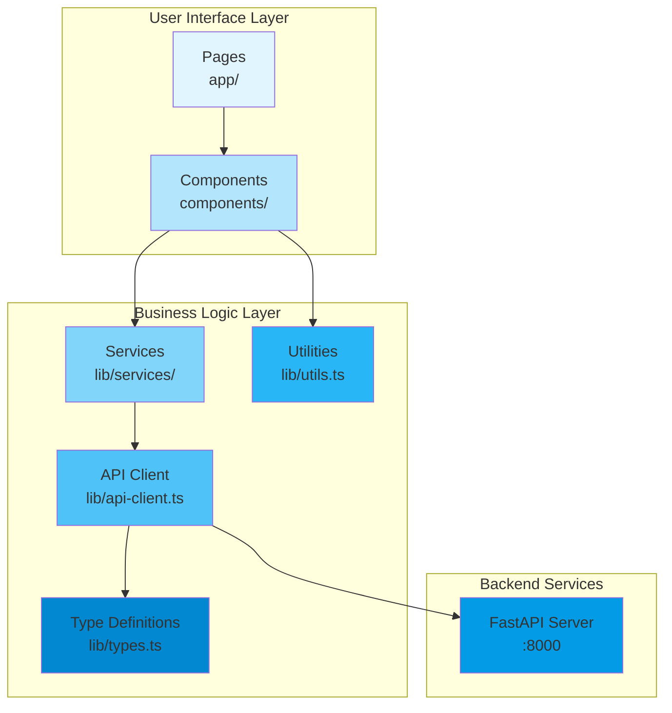

## Directory Structure

```
frontend_web/
├── app/                    # Next.js App Router (Pages)
│   ├── layout.tsx          # Root layout with ServiceProvider
│   ├── page.tsx            # Home/Simulation page
│   ├── config-editor/      # Config editor route
│   ├── help/               # Help page route
│   └── providers.tsx       # Global providers
│
├── components/             # React Components
│   ├── ui/                 # Base UI components (shadcn/ui)
│   ├── navigation.tsx      # Top navigation
│   ├── agent-selector.tsx  # Agent dropdown
│   ├── agent-config-view.tsx
│   ├── execution-mode-toggle.tsx  # Mock/Real/Stream toggle
│   ├── unified-chat-interface.tsx # Main chat interface
│   ├── simulation-console.tsx
│   ├── yaml-editor.tsx
│   └── graph-visualizer.tsx
│
├── lib/                    # Core Logic & Utilities
│   ├── services/           # Service layer (NEW)
│   │   ├── ServiceContext.tsx      # DI container
│   │   ├── AgentExecutionService.ts # Execution logic
│   │   └── SessionService.ts       # Session management
│   ├── api-client.ts       # API client (Singleton)
│   ├── types.ts            # TypeScript interfaces
│   └── utils.ts            # Helper functions
│
├── __tests__/              # Test files
│   ├── lib/
│   │   ├── services/       # Service tests (50 tests)
│   │   ├── api-client.test.ts
│   │   └── utils.test.ts
│   └── components/         # Component tests (86 tests)
│
└── docs/                   # Documentation
    └── ARCHITECTURE.md     # This file
```

## Component Hierarchy

The application follows a hierarchical component structure with dependency injection at the root.

```
App Layout (app/layout.tsx)
    │
    └── ServiceProvider (Dependency Injection Container)
            │
            ├── Provides: AgentExecutionService
            ├── Provides: SessionService
            └── Provides: ApiClient
                │
                └── Simulation Page (app/page.tsx)
                        │
                        ├── Left Sidebar
                        │   ├── Agent Selector
                        │   ├── Execution Mode Toggle
                        │   └── Agent Config View
                        │
                        └── Main Content
                            └── Unified Chat Interface
                                ├── Message List
                                ├── Input Form
                                └── Mode Indicator
```

### Key Components

#### **ServiceProvider** (lib/services/ServiceContext.tsx)
- Provides dependency injection container
- Initializes and provides all services
- Uses React Context API
- Memoizes service instances

#### **Simulation Page** (app/page.tsx)
- Main orchestration component
- Manages agent selection state
- Controls execution mode
- Coordinates sidebar and main content

#### **Unified Chat Interface** (components/unified-chat-interface.tsx)
- Handles all three execution modes (mock, real, stream)
- Message history management
- Real-time streaming display
- Session management integration
- Auto-scrolling and UI feedback

#### **Execution Mode Toggle** (components/execution-mode-toggle.tsx)
- Three-way toggle for execution modes
- Visual indicators for each mode
- Cost warnings and tooltips
- Accessibility support

### Component Composition Pattern

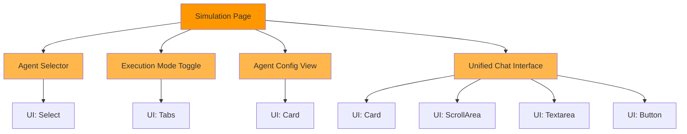

## Data Flow

### User Message Flow

```
User Types Message
    │
    ▼
UnifiedChatInterface validates input
    │
    ├─ Mock Mode? ──→ executeMock()
    │                     │
    │                     ▼
    │                 simulateAgent()
    │                     │
    │                     ▼
    │                 POST /simulate
    │                     │
    │                     ▼
    │                 Instant mock response
    │
    ├─ Real Mode? ──→ executeReal()
    │                     │
    │                     ▼
    │                 chatAgent()
    │                     │
    │                     ▼
    │                 POST /chat
    │                     │
    │                     ▼
    │                 Complete response (2-10s)
    │
    └─ Stream Mode? ──→ executeStream()
                          │
                          ▼
                      chatAgentStream()
                          │
                          ▼
                      POST /chat/stream
                          │
                          ▼
                      Token-by-token streaming
                          │
                          ▼
                      Real-time UI updates
```

### Data Flow Sequence Diagram

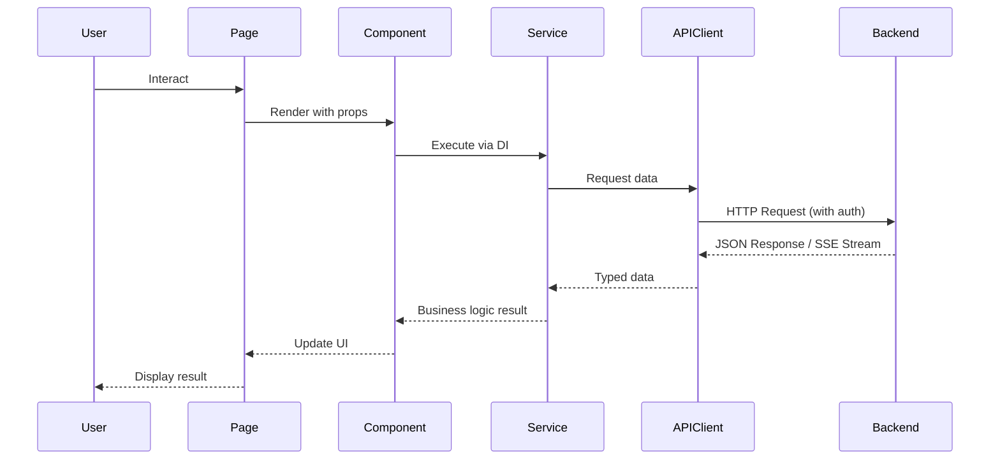

### State Management Flow

The application uses React hooks for state management:

1. **Local Component State**: `useState` for component-specific state
2. **Side Effects**: `useEffect` for data fetching and subscriptions
3. **Memoization**: `useMemo` for expensive computations
4. **Service Access**: `useContext` for dependency injection

## Service Layer

The service layer implements business logic with clear interfaces following SOLID principles.

### Service Interfaces

#### IAgentExecutionService
```typescript
interface IAgentExecutionService {
  // Strategy pattern - unified execution
  execute(
    agentId: string,
    request: SimulationRequest,
    mode: ExecutionMode
  ): Promise<SimulationResponse> | AsyncGenerator<StreamChunk>;

  // Mode-specific executions
  executeMock(agentId: string, request: SimulationRequest): Promise<SimulationResponse>;
  executeReal(agentId: string, request: SimulationRequest): Promise<SimulationResponse>;
  executeStream(agentId: string, request: SimulationRequest): AsyncGenerator<StreamChunk>;
}
```

**Implementation**: `AgentExecutionService`
- Encapsulates execution logic
- Delegates to API client
- Implements Strategy pattern for mode selection

#### ISessionService
```typescript
interface ISessionService {
  getSessionId(agentId: string): string;
  clearSession(agentId: string): void;
  clearAllSessions(): void;
}
```

**Implementation**: `SessionService`
- Generates unique session IDs
- Maintains session persistence
- Manages conversation continuity

### Dependency Injection Pattern

```typescript
// ServiceContext.tsx
export function ServiceProvider({ children }: { children: ReactNode }) {
  const services = useMemo(() => {
    const apiClient = initializeApiClient();
    return {
      apiClient,
      executionService: new AgentExecutionService(apiClient),
      sessionService: new SessionService(),
    };
  }, []);

  return <ServiceContext.Provider value={services}>{children}</ServiceContext.Provider>;
}

// Usage in components
export function UnifiedChatInterface() {
  const executionService = useExecutionService();
  const sessionService = useSessionService();

  // Use services...
}
```

**Benefits**:
- ✅ Testable via mocking
- ✅ Loose coupling
- ✅ Easy to replace implementations
- ✅ Clear dependency graph

## Execution Modes

The application supports three execution modes with different characteristics.

### Mode Comparison

| Feature | Mock | Real | Stream |
|---------|------|------|--------|
| **API Calls** | None | Yes | Yes |
| **Cost** | FREE | PAID | PAID |
| **Speed** | Instant (<100ms) | 2-10s | Incremental |
| **Use Case** | Testing, UI dev | Production | Best UX |
| **Backend** | `/simulate` | `/chat` | `/chat/stream` |
| **User Feedback** | Immediate | Complete | Token-by-token |

### Mode Implementation

#### Mock Mode
```typescript
public async executeMock(agentId: string, request: SimulationRequest): Promise<SimulationResponse> {
  return this.apiClient.simulateAgent(agentId, request);
}
```
- No OpenAI API calls
- Instant response
- Perfect for testing

#### Real Mode
```typescript
public async executeReal(agentId: string, request: SimulationRequest): Promise<SimulationResponse> {
  return this.apiClient.chatAgent(agentId, request);
}
```
- Actual OpenAI API calls
- Waits for complete response
- Returns full result at once

#### Stream Mode
```typescript
public async *executeStream(agentId: string, request: SimulationRequest): AsyncGenerator<StreamChunk> {
  yield* this.apiClient.chatAgentStream(agentId, request);
}
```
- Actual OpenAI API calls
- Server-Sent Events (SSE)
- Tokens streamed as generated
- Best user experience

### Streaming Implementation

```typescript
// API Client streaming method
public async *chatAgentStream(agentId: string, request: SimulationRequest): AsyncGenerator<StreamChunk> {
  const response = await fetch(url, { method: "POST", headers, body });
  const reader = response.body.getReader();
  const decoder = new TextDecoder();

  while (true) {
    const { done, value } = await reader.read();
    if (done) break;

    const text = decoder.decode(value, { stream: true });
    const lines = text.split("\n\n");

    for (const line of lines) {
      if (line.startsWith("data: ")) {
        const chunk: StreamChunk = JSON.parse(line.slice(6));
        yield chunk;
      }
    }
  }
}
```

## API Client Design

The API client follows the Singleton pattern for centralized request handling.

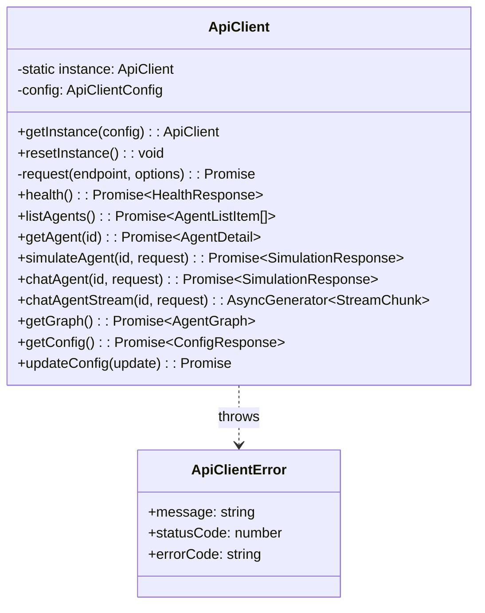

### API Client Features

1. **Singleton Pattern**: Single instance across application
2. **Type Safety**: Full TypeScript support
3. **Error Handling**: Custom error class with status codes
4. **Authentication**: Automatic API key injection
5. **Timeout Handling**: Configurable request timeouts
6. **Retry Logic**: Built-in retry mechanism
7. **Streaming Support**: SSE-based streaming for real-time updates

### Example Usage

```typescript
// Initialize once in providers
const client = initializeApiClient();

// Use anywhere in the app
const agents = await getApiClient().listAgents();

// Streaming usage
for await (const chunk of getApiClient().chatAgentStream(agentId, request)) {
  console.log(chunk.content);
}
```

## Type System

The application uses a comprehensive type system for type safety.

### Core Types

```typescript
// Execution mode type
export type ExecutionMode = "mock" | "real" | "stream";

// Request payload
export interface SimulationRequest {
  input: string;
  session_id?: string;
  context?: Record<string, unknown>;
  max_steps?: number;
}

// Response payload
export interface SimulationResponse {
  response: string;
  trace: SimulationStep[];
  metadata: {
    mode?: "mock" | "real";
    usage?: {
      prompt_tokens?: number;
      completion_tokens?: number;
      total_tokens?: number;
    };
    conversation_id?: string;
    [key: string]: unknown;
  };
}

// Streaming chunk
export interface StreamChunk {
  type: "metadata" | "token" | "step" | "done" | "error";
  content?: string;
  metadata?: Record<string, unknown>;
}

// Agent types
export interface AgentListItem {
  id: string;
  name: string;
  description: string;
}

export interface AgentDetail extends AgentListItem {
  config: Record<string, unknown>;
  capabilities: string[];
}
```

### Type Safety Benefits

- **Compile-time checks**: Errors caught before runtime
- **IDE support**: Autocomplete and IntelliSense
- **Refactoring safety**: Changes propagate correctly
- **Documentation**: Types serve as inline documentation

## State Management

Uses React hooks - no Redux needed!

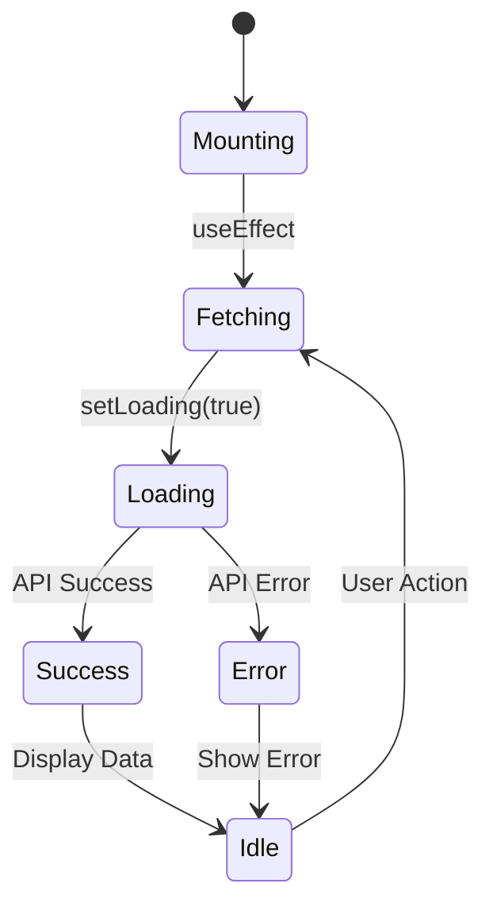

### State Patterns

1. **Local State**: `useState` for component-specific state
2. **Side Effects**: `useEffect` for data fetching
3. **Memoization**: `useCallback`, `useMemo` for performance
4. **Ref Management**: `useRef` for DOM access
5. **Context API**: Service injection via DI

### Example: Agent Selector State

```typescript
const [agents, setAgents] = useState<AgentListItem[]>([]);
const [loading, setLoading] = useState(true);
const [error, setError] = useState<string | null>(null);

useEffect(() => {
  async function fetchAgents() {
    try {
      setLoading(true);
      const data = await getApiClient().listAgents();
      setAgents(data);
    } catch (err) {
      setError(err.message);
    } finally {
      setLoading(false);
    }
  }

  fetchAgents();
}, []);
```

### Component Lifecycle

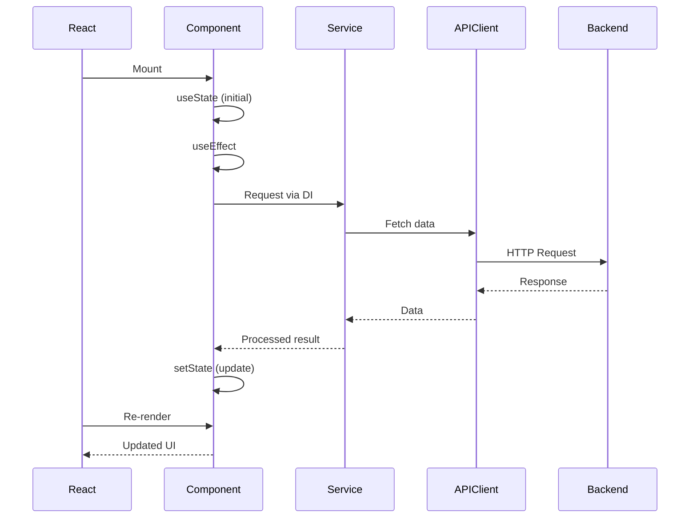

## Styling Architecture

Uses Tailwind CSS with shadcn/ui design system.

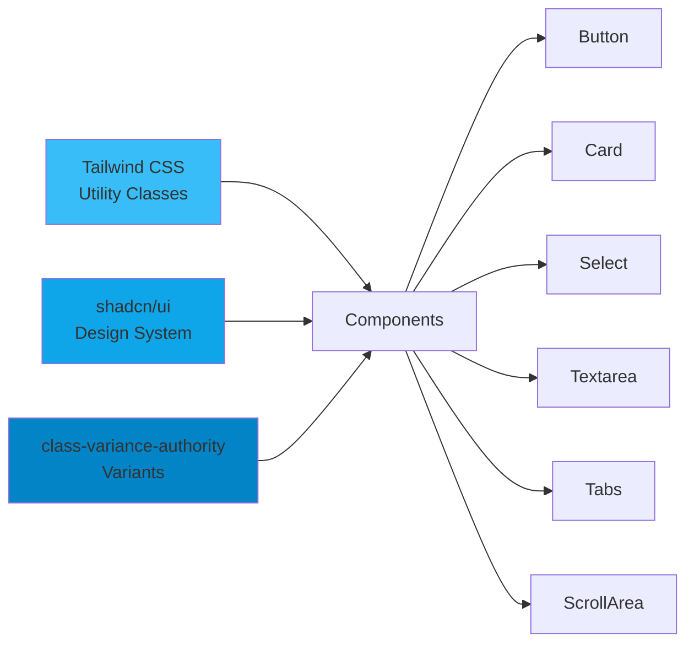

### Design Tokens

Defined in `app/globals.css`:

```css
:root {
  --background: 0 0% 100%;
  --foreground: 222.2 84% 4.9%;
  --primary: 221.2 83.2% 53.3%;
  --secondary: 210 40% 96.1%;
  --muted: 210 40% 96.1%;
  --accent: 210 40% 96.1%;
  /* ... more tokens */
}
```

### UI Component Hierarchy

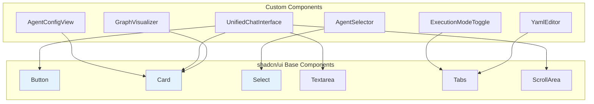

## Testing Strategy

The application has comprehensive test coverage across all layers.

### Test Structure

```
__tests__/
├── lib/
│   ├── services/
│   │   ├── AgentExecutionService.test.ts  (21 tests)
│   │   └── SessionService.test.ts         (29 tests)
│   ├── api-client.test.ts                 (14 tests)
│   └── utils.test.ts                      (13 tests)
├── components/
│   ├── execution-mode-toggle.test.tsx     (31 tests)
│   ├── unified-chat-interface.test.tsx    (28 tests)
│   └── agent-selector.test.tsx            (10 tests)
```

### Test Coverage Summary

```
Total Test Suites: 7
Total Tests: 146+
Status: ✓ All passing
Coverage: >90% on core logic
```

### Testing Architecture

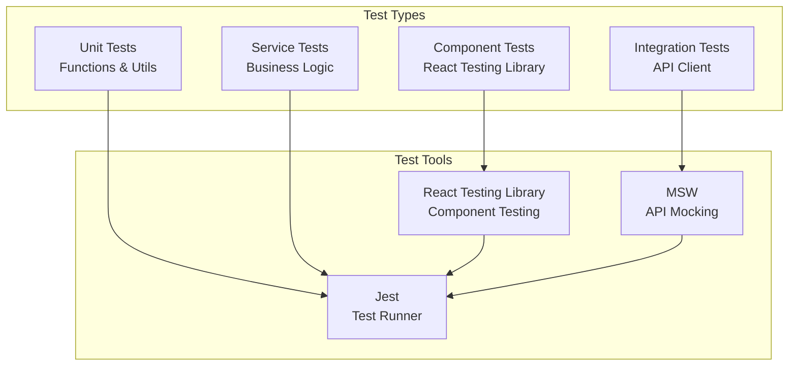

### Testing Patterns

#### Service Tests with Mocking
```typescript
it("should execute mock request", async () => {
  const mockResponse: SimulationResponse = {
    response: "Mock response",
    trace: [],
    metadata: { mode: "mock" },
  };

  mockApiClient.simulateAgent.mockResolvedValueOnce(mockResponse);

  const result = await service.executeMock("test-agent", {
    input: "Test input",
  });

  expect(result).toEqual(mockResponse);
});
```

#### Component Tests with User Interactions
```typescript
it("should submit message on Enter key", async () => {
  mockExecutionService.executeMock.mockResolvedValueOnce({
    response: "Response",
    trace: [],
    metadata: {},
  });

  render(<UnifiedChatInterface agentId="test-agent" mode="mock" />);

  const input = screen.getByPlaceholderText("Type your message...");
  await userEvent.type(input, "Test");
  fireEvent.keyDown(input, { key: "Enter" });

  await waitFor(() => {
    expect(mockExecutionService.executeMock).toHaveBeenCalled();
  });
});
```

### Running Tests

```bash
# Run all tests
npm test

# Run with coverage
npm run test:coverage

# Run specific test file
npm test -- AgentExecutionService.test.ts

# Run in watch mode
npm run test:watch
```

## Performance Optimization

### Code Splitting

Next.js automatically splits code by route.

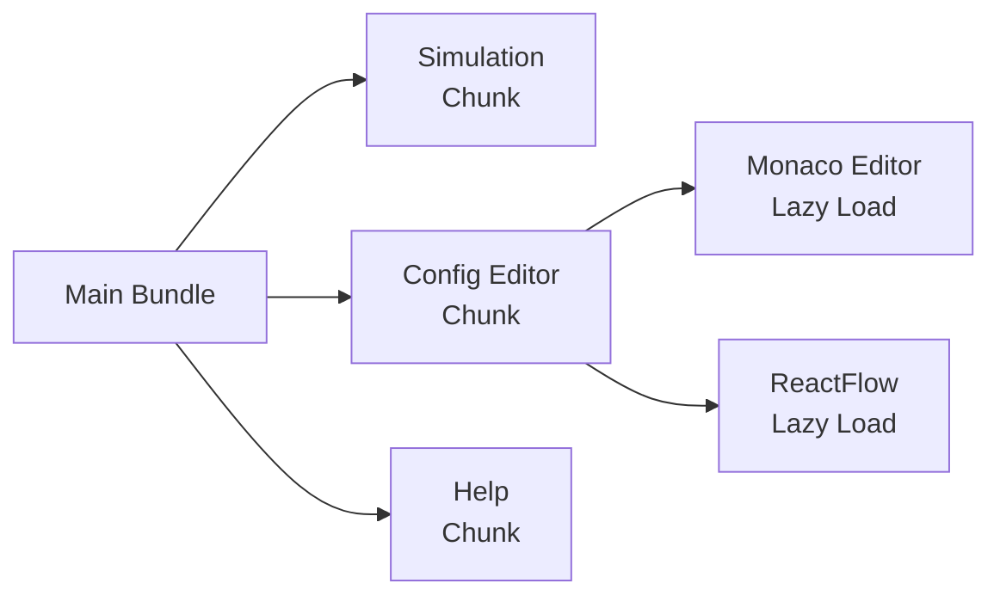

### Optimization Techniques

1. **Dynamic Imports**: Lazy load heavy dependencies
2. **Image Optimization**: Next.js Image component
3. **Font Optimization**: Next.js Font component
4. **Bundle Analysis**: Check bundle size regularly
5. **Service Memoization**: Singleton services prevent re-creation
6. **React Optimization**: `useMemo`, `useCallback` for expensive operations
7. **Streaming**: Perceived performance improvement via SSE

### Build Output

```
.next/
├── static/               # Static assets
├── server/               # Server-side code
└── standalone/           # Standalone output
```

## Security Architecture

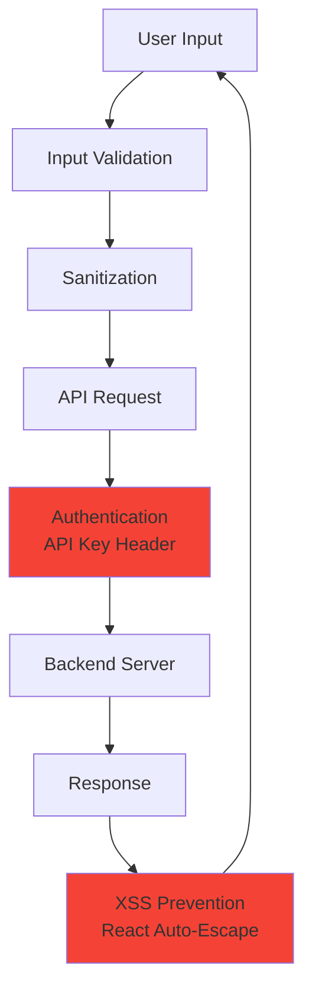

### Security Measures

1. **API Key Authentication**: Secure header-based auth
2. **Environment Variables**: Secrets in .env files
3. **XSS Prevention**: React automatic escaping
4. **CORS**: Backend CORS configuration
5. **Input Validation**: Client-side validation
6. **HTTPS**: Production requirement
7. **Type Safety**: TypeScript prevents common vulnerabilities

## Deployment Architecture

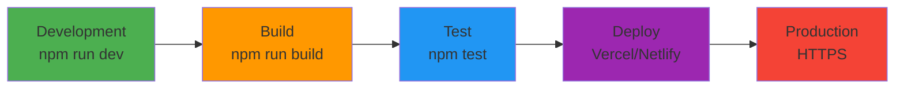

### Deployment Considerations

1. **Environment Configuration**: Separate configs for dev/staging/prod
2. **API Endpoints**: Configurable backend URLs
3. **Build Optimization**: Production builds with minification
4. **Static Exports**: Optional static site generation
5. **Edge Functions**: Leverage Next.js edge runtime
6. **Monitoring**: Error tracking and performance monitoring

## Design Patterns

### Patterns Used

1. **Singleton**: API Client - single instance across application
2. **Strategy**: Execution modes - polymorphic execution logic
3. **Dependency Injection**: Services provided via React Context
4. **Provider Pattern**: Global state/context distribution
5. **Composition**: Component hierarchy and reusability
6. **Hooks Pattern**: State management with React hooks
7. **Factory**: Component creation and configuration
8. **Observer**: React state updates and subscriptions

### Pattern Benefits

| Pattern | Benefit |
|---------|---------|
| Singleton | Consistent API client configuration |
| Strategy | Easy to add new execution modes |
| DI | Testable, loosely coupled services |
| Provider | Global state without prop drilling |
| Composition | Reusable, maintainable components |
| Hooks | Clean state management |

## Benefits of This Architecture

### 1. Maintainability
- Clear separation of concerns
- Easy to locate and fix bugs
- Self-documenting code structure

### 2. Testability
- Services mocked via dependency injection
- Components tested in isolation
- High test coverage achievable (>90%)

### 3. Extensibility
- New execution modes easily added
- New services integrated via DI
- Component reusability

### 4. Type Safety
- Full TypeScript coverage
- Compile-time error detection
- IDE autocomplete and refactoring support

### 5. Performance
- Singleton services (no re-creation)
- Optimized re-renders with React hooks
- Streaming for better perceived performance
- Code splitting by route

### 6. User Experience
- Real-time streaming feedback
- Clear mode indicators
- Session persistence
- User-friendly error messages
- Responsive UI with loading states

## Future Enhancements

### Planned Features

1. **WebSocket Support**: Real-time agent communication beyond SSE
2. **Offline Support**: Service Worker + Cache API
3. **Dark Mode**: Theme switching with persistence
4. **i18n**: Internationalization support
5. **A11y**: Enhanced accessibility (WCAG 2.1 AA)
6. **PWA**: Progressive Web App features
7. **Advanced Analytics**: User behavior tracking
8. **Multi-agent Orchestration**: Coordinate multiple agents
9. **Enhanced Visualization**: Real-time agent state graphs

### Implementation Timeline

#### Phase 1: Foundation (Completed ✅)
- ✅ Service layer with interfaces
- ✅ Dependency injection via React Context
- ✅ Type definitions for all execution modes
- ✅ API client with streaming support

#### Phase 2: UI Components (Completed ✅)
- ✅ ExecutionModeToggle component
- ✅ UnifiedChatInterface component
- ✅ Integration with main page
- ✅ Responsive layouts

#### Phase 3: Testing (Completed ✅)
- ✅ Service tests (50+ tests)
- ✅ Component tests (96+ tests)
- ✅ Full test coverage on critical paths

#### Phase 4: Documentation (In Progress ⏳)
- ✅ Architecture documentation (this file)
- ⏳ Usage guide
- ⏳ API reference
- ⏳ Contributing guidelines

## References

### Documentation
- [Next.js Documentation](https://nextjs.org/docs)
- [React Documentation](https://react.dev)
- [TypeScript Documentation](https://www.typescriptlang.org/docs)
- [shadcn/ui](https://ui.shadcn.com)
- [Tailwind CSS](https://tailwindcss.com)

### Libraries
- [React Testing Library](https://testing-library.com/react)
- [Jest](https://jestjs.io)
- [ReactFlow](https://reactflow.dev)
- [Radix UI](https://www.radix-ui.com)

### Design Patterns
- [SOLID Principles](https://en.wikipedia.org/wiki/SOLID)
- [Dependency Injection](https://en.wikipedia.org/wiki/Dependency_injection)
- [Strategy Pattern](https://en.wikipedia.org/wiki/Strategy_pattern)

---

**Document Version**: 3.0 (Merged)
**Last Updated**: 2025-11-29
**Maintained By**: OpenAgents Team
