# OpenAgents Frontend - Complete Tutorial

A step-by-step guide to setting up, running, and using the modern OpenAgents frontend with glass morphism UI design.

## 📋 Table of Contents

1. [Prerequisites](#prerequisites)
2. [Installation](#installation)
3. [Configuration](#configuration)
4. [Running the Application](#running-the-application)
5. [User Interface Guide](#user-interface-guide)
6. [Features Overview](#features-overview)
7. [Testing](#testing)
8. [Development Workflow](#development-workflow)
9. [Troubleshooting](#troubleshooting)
10. [Production Deployment](#production-deployment)

## 🎯 Prerequisites

### Required Software

- **Node.js**: v18.0.0 or higher
- **npm**: v9.0.0 or higher (comes with Node.js)
- **Git**: For version control
- **Text Editor**: VS Code recommended

### Check Versions

```bash
node --version    # Should be v18+
npm --version     # Should be v9+
git --version     # Any recent version
```

### Backend Server

The frontend requires the backend server to be running. See `../server/README.md` for setup.

```bash
# Quick check - backend should be running at:
curl http://localhost:8000/health
```

## 📦 Installation

### Step 1: Navigate to Frontend Directory

```bash
cd frontend_web
```

### Step 2: Install Dependencies

```bash
npm install --legacy-peer-deps
```

This will install:
- Next.js 14
- React 18
- TypeScript
- Tailwind CSS
- shadcn/ui components
- ReactFlow
- Monaco Editor
- React Markdown
- Testing libraries
- And more...

**Expected output:**
```
added 800+ packages in 30s
```

### Step 3: Verify Installation

```bash
npm list --depth=0
```

Should show all major dependencies including `next`, `react`, `typescript`, `react-markdown`, etc.

## ⚙️ Configuration

### Step 1: Create Environment File

```bash
cp .env.local.example .env.local
```

### Step 2: Edit Environment Variables

Open `.env.local` in your editor:

```env
# Backend API Configuration
NEXT_PUBLIC_API_BASE_URL=http://localhost:8000
NEXT_PUBLIC_API_KEY=your_api_key_here

# Optional: Enable debug logging
NEXT_PUBLIC_DEBUG=false
```

**Important**: Replace `your_api_key_here` with your actual API key from the backend.

### Step 3: Verify Configuration

```bash
cat .env.local
```

Ensure values are correct and no trailing spaces.

## 🚀 Running the Application

### Development Mode

Start the development server with hot-reload:

```bash
npm run dev
```

**Expected output:**
```
  ▲ Next.js 14.2.33
  - Local:        http://localhost:3000
  - Network:      http://192.168.1.x:3000

 ✓ Ready in 2.5s
```

### Access the Application

Open your browser:

```
http://localhost:3000
```

You should see the OpenAgents interface with modern glass morphism design.

### Pages Available

1. **Agent Execution** (`/`) - Main chat interface with agents
2. **Config Editor** (`/config-editor`) - YAML editor + graph visualization
3. **Help** (`/help`) - Documentation and guides

## 🎨 User Interface Guide

### Modern UI Design

The interface features a sophisticated glass morphism design with:


### Navigation Bar

Located at the top with:
- **Glass panel effect** with backdrop blur
- **OpenAgents logo** with gradient text
- **Navigation links** with smooth transitions
- **Active state** highlighting with gradient background

### Main Chat Interface

The Agent Execution page has been completely redesigned:

#### 1. **Collapsible Configuration Panel (Left)**


**Features:**
- **Single unified panel** with glass morphism design
- **Collapse entire panel** using chevron button in header
- **Individual section collapse** for Agent Selection, Execution Mode, and Agent Details
- **Floating expand button** appears on left edge when collapsed
- **Smooth animations** for all transitions
- **Icon indicators** for each section (Settings, Zap, Info)

**Usage:**
- Click the left-pointing chevron in panel header to collapse
- Click chevron-down on any section header to toggle that section
- Click floating button on left edge to expand panel

#### 2. **Chat Interface (Center/Right)**

**Layout:**
- **Fixed viewport height** - Input always visible
- **Three-section design**: Header, Messages, Input
- **Responsive sizing** - Adapts to panel collapse state

**Header Section:**
- Mode indicator (Real/Mock/Stream)
- Session status
- Clear chat button

**Messages Area:**
- **Smart auto-scrolling** - Only scrolls on agent responses
- **User scroll detection** - Pauses auto-scroll when you scroll up
- **Scroll-to-bottom button** - Appears when scrolled up
- **Markdown rendering** - Full rich text support
- **Image rendering** - Embedded images with styling
- **Message bubbles** with gradient backgrounds
- **Hover effects** on messages

**Input Area (Bottom):**
- **Always visible** - Anchored to bottom of viewport
- **Glass panel design** with frosted effect
- **Larger textarea** (60px min height)
- **Character counter** when typing
- **Premium send button** - Gradient with scale animation
- **Status indicator** - Animated dots for current mode
- **Keyboard hints** - Shift+Enter for new line

### Execution Modes

The interface supports three execution modes:

```mermaid
graph LR
    A[Execution Modes] --> B[Mock Mode]
    A --> C[Real Mode]
    A --> D[Stream Mode]

    B --> B1[🔵 Blue Indicator<br/>Instant Response<br/>No API Costs<br/>Testing]

    C --> C1[🟢 Green Indicator<br/>Actual API Calls<br/>Complete Response<br/>Production]

    D --> D1[🟣 Purple Indicator<br/>Token Streaming<br/>Real-time Updates<br/>Best UX]

    style B fill:#e3f2fd
    style C fill:#e8f5e9
    style D fill:#f3e5f5
```



**Default Mode:** Real (production-ready)

**Switching Modes:**
1. Expand Execution Mode section in config panel
2. Click on desired mode tab
3. Status indicator updates immediately

### Markdown & Rich Content Support

The chat interface renders rich content from agents:

**Supported Elements:**

| Element | Example | Rendered As |
|---------|---------|-------------|
| **Bold** | `**text**` | Bold text |
| *Italic* | `*text*` | Italic text |
| Code | `` `code` `` | Inline code with background |
| Code Block | ` ```python\ncode\n``` ` | Formatted code block |
| Links | `[text](url)` | Clickable links (new tab) |
| Images | `` | Embedded images with shadow |
| Lists | `- item` or `1. item` | Bulleted or numbered lists |
| Tables | Markdown table syntax | Styled data tables |
| Headings | `# H1` to `###### H6` | Formatted headings |
| Blockquotes | `> quote` | Bordered quote blocks |

**Image Example:**
```markdown

```
Will render as a responsive image with rounded corners and shadow.

## ✨ Features Overview

### 1. Glass Morphism Design

All UI elements feature modern glass morphism:
- **Backdrop blur effects**
- **Translucent backgrounds**
- **Gradient overlays**
- **Subtle shadows and borders**
- **Smooth hover animations**

### 2. Smart Scrolling

Chat interface intelligently manages scrolling:
- **Auto-scrolls** when agent sends messages
- **Respects manual scrolling** - Pauses auto-scroll if you scroll up
- **Scroll button** appears when not at bottom
- **Smooth animations** for all scroll behavior

### 3. Responsive Layout

Interface adapts to all screen sizes:
- **Mobile**: Single column, collapsible panels
- **Tablet**: Side-by-side with smaller margins
- **Desktop**: Full layout with optimal spacing
- **Viewport-aware**: Input always visible

### 4. Session Management

Conversations are tracked per agent:
- **Session IDs** generated automatically
- **Clear session** button to restart
- **Conversation history** maintained
- **Session indicator** in header

### 5. Error Handling

Comprehensive error displays:
- **Error messages** in red bubble with icon
- **Connection failures** clearly indicated
- **Retry suggestions** provided
- **Debug mode** available in console

## 🧪 Testing

### Run All Tests

```bash
npm test
```

**Expected output:**
```
PASS  __tests__/lib/services/AgentExecutionService.test.ts (21 tests)
PASS  __tests__/lib/services/SessionService.test.ts (29 tests)
PASS  __tests__/lib/api-client.test.ts (14 tests)
PASS  __tests__/components/unified-chat-interface.test.tsx (28 tests)
PASS  __tests__/components/execution-mode-toggle.test.tsx (31 tests)

Test Suites: 7 passed, 7 total
Tests:       146+ passed, 146+ total
Time:        5.2s
Coverage:    >90%
```

### Watch Mode (for development)

```bash
npm run test:watch
```

Tests will re-run automatically when files change.

### Coverage Report

```bash
npm run test:coverage
```

## 💻 Development Workflow

### Architecture Overview


### Key Design Patterns

1. **Dependency Injection**: Services provided via React Context
2. **Strategy Pattern**: Execution modes (mock/real/stream)
3. **Singleton**: API Client
4. **Component Composition**: Reusable UI components

### Adding New Features

**Example: Add a new agent capability**

1. **Update Types** (`lib/types.ts`):
```typescript
export interface AgentCapability {
  id: string;
  name: string;
  enabled: boolean;
}
```

2. **Create Component** (`components/capability-toggle.tsx`):
```typescript
"use client";

export function CapabilityToggle({ capability }: { capability: AgentCapability }) {
  return (
    <div className="flex items-center justify-between p-2">
      <span>{capability.name}</span>
      <Switch checked={capability.enabled} />
    </div>
  );
}
```

3. **Write Tests** (`__tests__/components/capability-toggle.test.tsx`)

4. **Integrate** into Agent Config View

### Custom Styling

Use Tailwind classes with our custom design system:

```typescript
// Glass panel effect
className="glass-panel rounded-xl backdrop-blur-xl bg-gradient-to-br from-card/80 to-card/40 border border-border/50 shadow-lg"

// Message bubble
className="message-bubble rounded-xl p-4 shadow-md bg-gradient-to-br from-primary to-primary/80"

// Custom scrollbar
className="custom-scrollbar overflow-y-auto"
```

## 🐛 Troubleshooting

### Common Issues

#### 1. Build Error: Cannot find module 'tailwindcss-animate'

**Error:**
```
Error: Cannot find module 'tailwindcss-animate'
```

**Solution:**
```bash
npm install tailwindcss-animate --legacy-peer-deps
```

#### 2. Chat Input Not Visible

**Issue:** Input box scrolls off screen when left panel expands.

**Solution:** This has been fixed. The chat interface now uses:
```tsx
h-[calc(100vh-12rem)] max-h-[900px]
```
Clear your browser cache and hard refresh (Cmd+Shift+R).

#### 3. Markdown Not Rendering

**Issue:** Agent responses show raw markdown.

**Solution:** Ensure react-markdown is installed:
```bash
npm install react-markdown remark-gfm rehype-raw rehype-sanitize --legacy-peer-deps
```

#### 4. Glass Effect Not Showing

**Issue:** UI looks flat without glass morphism.

**Solution:** Check that global CSS is loaded:
```bash
# Verify globals.css exists
ls app/globals.css

# Restart dev server
npm run dev
```

#### 5. API Connection Issues

**Error:**
```
ApiClientError: Failed to fetch
```

**Solution:**
```bash
# Check backend is running
curl http://localhost:8000/health

# Verify CORS is enabled in server
# Check .env.local has correct API_BASE_URL
cat .env.local | grep API_BASE_URL
```

### Debug Mode

Enable debug logging:

```env
# .env.local
NEXT_PUBLIC_DEBUG=true
```

Then check browser console (F12) for detailed logs.

## 🏗️ Production Deployment

### Build Checklist

Before deploying:

- [ ] All tests passing (`npm test`)
- [ ] No TypeScript errors (`npm run type-check`)
- [ ] No lint errors (`npm run lint`)
- [ ] Environment variables configured
- [ ] Backend URL updated for production
- [ ] API keys secured

### Build Production Bundle

```bash
npm run build
```

**Expected output:**
```
  ▲ Next.js 14.2.33

  Creating an optimized production build...
  ✓ Compiled successfully
  ✓ Linting and checking validity of types
  ✓ Collecting page data
  ✓ Generating static pages (4/4)
  ✓ Finalizing page optimization

Route (app)                Size     First Load JS
┌ ○ /                      2.8 kB         95.2 kB
├ ○ /config-editor         3.5 kB         97.8 kB
└ ○ /help                  1.4 kB         91.7 kB

○  (Static)  prerendered as static content
```

### Deploy to Vercel (Recommended)

```bash
# Install Vercel CLI
npm install -g vercel

# Login
vercel login

# Deploy
vercel --prod
```

### Configure Production Environment

In Vercel dashboard:

1. **Project Settings** → **Environment Variables**
2. Add production values:
   - `NEXT_PUBLIC_API_BASE_URL`: `https://api.yourdomain.com`
   - `NEXT_PUBLIC_API_KEY`: Your production API key

### Performance Monitoring

After deployment, monitor:

1. **Lighthouse scores** - Should be 90+ for all metrics
2. **Bundle size** - Keep First Load JS under 100 kB
3. **API response times** - Track in browser DevTools
4. **Error rates** - Monitor console for errors

## 📊 UI/UX Best Practices

### Design Guidelines

1. **Glass Morphism**: Use for all panels and cards
2. **Animations**: Keep under 300ms for responsiveness
3. **Colors**: Use CSS variables from design system
4. **Spacing**: Follow 4px grid (0.25rem increments)
5. **Typography**: Use semantic heading levels

### Accessibility

The interface follows WCAG 2.1 AA standards:

- **Keyboard navigation**: All interactive elements accessible via Tab
- **ARIA labels**: Screen reader support
- **Color contrast**: Meets 4.5:1 minimum ratio
- **Focus indicators**: Visible focus states
- **Alt text**: All images have descriptive alt attributes

### Performance Tips

1. **Code splitting**: Large components lazy-loaded
2. **Image optimization**: Next.js Image component
3. **Memoization**: React.memo for expensive renders
4. **Virtual scrolling**: For long message lists (future enhancement)

## 🎓 Next Steps

### Explore the Codebase

Key files to understand:

1. **`app/page.tsx`** - Main agent execution page
2. **`components/unified-chat-interface.tsx`** - Chat interface with markdown
3. **`lib/services/AgentExecutionService.ts`** - Business logic
4. **`lib/api-client.ts`** - API communication layer
5. **`app/globals.css`** - Custom styling and glass effects

### Advanced Features to Implement

1. **Dark mode** - Toggle between light/dark themes
2. **Voice input** - Speech-to-text for messages
3. **Export conversations** - Download as PDF or Markdown
4. **Agent comparison** - Side-by-side agent testing
5. **Custom visualizations** - Agent performance graphs
6. **Collaborative sessions** - Multi-user chat rooms

### Contributing

When adding features:

1. Follow existing patterns (DI, Strategy pattern)
2. Write comprehensive tests (>80% coverage)
3. Update documentation
4. Use TypeScript strictly (no `any`)
5. Add visual diagrams for complex features

## ✅ Final Checklist

Verify your setup:

- [ ] Frontend running at `http://localhost:3000`
- [ ] Backend running at `http://localhost:8000`
- [ ] Can select an agent from dropdown
- [ ] Can switch execution modes (Real is default)
- [ ] Can send messages and receive responses
- [ ] Markdown renders correctly (bold, code, links, images)
- [ ] Left panel collapses/expands smoothly
- [ ] Individual sections collapse properly
- [ ] Input box always visible at bottom
- [ ] Smart scrolling works (doesn't scroll on user input)
- [ ] Scroll-to-bottom button appears when scrolled up
- [ ] All tests passing

## 🎉 Congratulations!

You now have a fully functional, modern OpenAgents frontend with:

✅ **Glass morphism UI** - Beautiful, contemporary design
✅ **Smart chat interface** - Intelligent scrolling and layout
✅ **Markdown support** - Rich content from agents
✅ **Three execution modes** - Mock, Real, and Streaming
✅ **Collapsible panels** - Customizable workspace
✅ **Responsive design** - Works on all devices
✅ **Production-ready** - Tested and optimized

Start building amazing agent applications! 🚀

## 📚 Additional Resources

- **Architecture**: See [`ARCHITECTURE.md`](./ARCHITECTURE.md) for detailed system design
- **Implementation**: See [`FRONTEND_IMPLEMENTATION.md`](./FRONTEND_IMPLEMENTATION.md) for technical details
- **Backend API**: See [`../server/README.md`](../../server/README.md) for server documentation
- **Agent System**: See [`../../docs/AGENT_SYSTEM_GUIDE.md`](../../docs/AGENT_SYSTEM_GUIDE.md) for agent development

Happy coding! 💻✨
