# OpenAgents Frontend - UI Features Update

**Last Updated**: November 30, 2025
**Version**: 3.0 (Glass Morphism Edition)

## 🎨 Major UI/UX Enhancements

This document summarizes the comprehensive UI/UX improvements made to the OpenAgents frontend.

### Visual Overview


## 1. Glass Morphism Design System

### Implementation

All UI components now feature a sophisticated glass morphism design:

**Key Features:**
- **Backdrop blur effects** (`backdrop-blur-xl`)
- **Translucent backgrounds** (80% opacity with gradients)
- **Subtle shadows and borders** (50% opacity)
- **Smooth hover animations** (scale, elevation changes)
- **Gradient overlays** (primary color variants)

**CSS Classes:**
```css
/* Custom glass-panel class in globals.css */
.glass-panel {
  position: relative;
  overflow: hidden;
  backdrop-filter: blur(20px);
  background: linear-gradient(135deg, rgba(255,255,255,0.4) 0%, rgba(255,255,255,0.1) 100%);
}
```

### Visual Diagram


## 2. Enhanced Navigation Bar

### Features


**Implementation Details:**
- Sticky header that stays visible during scroll
- Logo with animated icon badge and gradient text
- Active page indicator with gradient background
- Smooth transitions on all interactive elements

## 3. Unified Configuration Panel

### Architecture

The left sidebar has been completely redesigned as a single, cohesive panel:


### Key Improvements

**Before:**
- Multiple separate white cards
- No collapse functionality
- Fixed visibility

**After:**
- ✅ Single unified glass panel
- ✅ Entire panel collapsible via header button
- ✅ Each section individually collapsible
- ✅ Floating expand button when collapsed
- ✅ Smooth fade/slide animations
- ✅ Icon indicators for each section

### User Interactions

1. **Collapse entire panel**: Click chevron-left in header
2. **Expand panel**: Click floating button on left edge
3. **Toggle sections**: Click on section headers with chevron-down icons
4. **Customize view**: Show only sections you need

## 4. Modern Chat Interface

### Three-Section Layout


### Messages Area Features

**Smart Auto-Scrolling:**


**Key Features:**
- Only auto-scrolls when agent responds
- Respects manual scrolling (pauses auto-scroll)
- Scroll-to-bottom button appears when scrolled up
- Smooth animations for all scroll behavior

### Input Area Enhancements

**Before:**
- Small textarea
- Basic send button
- Could scroll off screen
- No visual feedback

**After:**
- ✅ **60px minimum height** - More comfortable
- ✅ **Character counter** - Shows when typing
- ✅ **Premium send button** - Gradient with icon
- ✅ **Tooltip** - "Send message (or press Enter)"
- ✅ **Always visible** - Fixed to viewport bottom
- ✅ **Glass panel** - Frosted effect with shadow
- ✅ **Status indicator** - Animated dots for mode

**Visual Design:**
```css
/* Input area styling */
border-top: 1px solid hsl(var(--border) / 0.3);
background: linear-gradient(to bottom,
  hsl(var(--background) / 0.95),
  hsl(var(--background)));
backdrop-filter: blur(20px);
box-shadow: 0 -4px 6px -1px rgb(0 0 0 / 0.1);
```

## 5. Markdown & Rich Content

### Supported Markdown Elements


### Image Rendering

Images embedded in agent responses render with:
- **Rounded corners** (0.5rem)
- **Shadow effects** for depth
- **Lazy loading** for performance
- **Responsive sizing** (max-width: 100%)
- **Alt text support** for accessibility

**Example:**
```markdown

```
Renders as a styled, responsive image within the message bubble.

### Code Highlighting

**Inline code:**
```markdown
Use the `execute()` method
```
Renders with subtle background and monospace font.

**Code blocks:**
````markdown
```python
def hello_agent():
    return "Hello from agent!"
```
````
Renders with:
- Syntax-ready container
- Horizontal scroll for long lines
- Muted background
- Monospace font

## 6. Execution Modes

### Mode Visualization

```mermaid
graph TB
    A[Execution Modes] --> B[Mock Mode]
    A --> C[Real Mode - DEFAULT]
    A --> D[Stream Mode]

    B --> B1[🔵 Blue dot<br/>Instant<br/>FREE<br/>Testing]

    C --> C1[🟢 Green dot<br/>API calls<br/>PAID<br/>Production]

    D --> D1[🟣 Purple dot<br/>Streaming<br/>PAID<br/>Best UX]

    B --> B2[simulateAgent]
    C --> C2[chatAgent]
    D --> D2[chatAgentStream]

    style A fill:#f5f5f5
    style B fill:#e3f2fd
    style C fill:#e8f5e9
    style D fill:#f3e5f5
```



### Default Changed

**Important**: Default execution mode is now **"Real"** instead of "Mock" for production-ready behavior out of the box.

### Status Indicators

Each mode now has an animated status indicator:
```tsx
<span className="w-2 h-2 rounded-full bg-green-500 animate-pulse"></span>
<span>Real mode - actual API calls</span>
```

## 7. Responsive Design

### Viewport-Aware Layout


### Chat Container Height

Fixed height calculation ensures input always visible:
```css
height: calc(100vh - 12rem);  /* Viewport height minus header/padding */
max-height: 900px;            /* Cap for very large screens */
```

This prevents the input box from scrolling off-screen when panels expand/collapse.

## 8. Performance Optimizations

### Implemented

1. **Code Splitting** - Next.js automatic route-based splitting
2. **Lazy Loading** - Images with `loading="lazy"`
3. **Memoization** - Service singletons prevent re-creation
4. **Optimized Re-renders** - React.memo on expensive components
5. **Custom Scrollbars** - Styled, lightweight scrollbars

### Bundle Size

Current production build sizes:
```
Route                  Size     First Load JS
/ (main)               2.8 kB   95.2 kB
/config-editor         3.5 kB   97.8 kB
/help                  1.4 kB   91.7 kB
```

All under 100 kB for optimal performance! ✅

## 9. Accessibility Features

### WCAG 2.1 AA Compliance


### Features

- **Keyboard accessible**: All controls via Tab/Enter
- **Screen reader support**: Proper ARIA labels
- **High contrast**: Meets 4.5:1 minimum ratio
- **Focus indicators**: Clear visual focus states
- **Semantic HTML**: Proper heading hierarchy

## 10. Testing Coverage

### Test Statistics

```
Total Test Suites: 7 passed
Total Tests: 146+ passed
Coverage: >90% on core logic
```

### Test Structure


## Migration Guide

### For Developers

If you're upgrading from an older version:

1. **Install new dependencies:**
```bash
npm install react-markdown remark-gfm rehype-raw rehype-sanitize tailwindcss-animate --legacy-peer-deps
```

2. **Update environment:**
```bash
cp .env.local.example .env.local
# Default mode is now "real" instead of "mock"
```

3. **Clear cache:**
```bash
rm -rf .next node_modules/.cache
npm run dev
```

### Breaking Changes

- ⚠️ Default execution mode changed from "mock" to "real"
- ⚠️ Message rendering now uses ReactMarkdown (plain text still works)
- ⚠️ Chat interface layout uses flexbox (custom CSS may need adjustment)

### New Features to Try

1. **Send markdown** in chat:
```markdown
**Bold** text, `code`, [links](https://example.com)

```

2. **Collapse config panel** - Click chevron in panel header

3. **Toggle individual sections** - Click section headers

4. **Scroll behavior** - Try scrolling up while agent responds

## Future Enhancements

### Roadmap


## Summary

The OpenAgents frontend has been transformed with:

✅ **Modern glass morphism design** - Contemporary, professional appearance
✅ **Enhanced UX** - Smart scrolling, collapsible panels, always-visible input
✅ **Rich content** - Markdown and image rendering
✅ **Better defaults** - Real mode by default, optimized for production
✅ **Responsive** - Works beautifully on all screen sizes
✅ **Accessible** - WCAG 2.1 AA compliant
✅ **Well-tested** - 146+ tests with >90% coverage
✅ **Production-ready** - Optimized bundle sizes, performance monitoring

The interface now provides a premium, modern experience while maintaining excellent usability and performance!

## Documentation Links

- **[TUTORIAL.md](./TUTORIAL.md)** - Complete setup and usage guide
- **[ARCHITECTURE.md](./ARCHITECTURE.md)** - System design and patterns
- **[FRONTEND_IMPLEMENTATION.md](./FRONTEND_IMPLEMENTATION.md)** - Technical implementation details
- **[AGENT_DISCOVERY.md](./AGENT_DISCOVERY.md)** - Agent system integration

---

**Maintained by**: OpenAgents Team
**Version**: 3.0
**Date**: November 30, 2025
