# Agent Execution - Complete Guide

## Overview

The server provides **three distinct endpoints** for agent interaction, each serving a specific purpose:

1. **`POST /agents/{agent_id}/simulate`** - Mock responses (no API calls)
2. **`POST /agents/{agent_id}/chat`** - Real execution (complete response)
3. **`POST /agents/{agent_id}/chat/stream`** - Real execution (streaming)

## Architecture


## Data Flow

### Mock Execution (/simulate)

```mermaid
sequenceDiagram
    participant Client
    participant FastAPI
    participant Service as AgentService
    participant Factory as AgentFactory

    Client->>FastAPI: POST /agents/geo/simulate<br/>{input: "test"}
    FastAPI->>FastAPI: Verify API Key
    FastAPI->>Service: simulate_agent()
    Service->>Factory: get_agent_with_session()
    Factory-->>Service: agent instance
    Service->>Service: Generate mock response
    Service-->>FastAPI: SimulationResponse<br/>(mode: "mock")
    FastAPI-->>Client: JSON response<br/>[MOCK] No API call

    Note over Client,Factory: ⚡ Fast (~50ms)<br/>💰 Free (no API costs)
```



### Real Execution (/chat)


### Streaming Execution (/chat/stream)

```mermaid
sequenceDiagram
    participant Client
    participant FastAPI
    participant Service as AgentService
    participant Factory as AgentFactory
    participant Runner as agents.Runner
    participant OpenAI as OpenAI API

    Client->>FastAPI: POST /agents/geo/chat/stream<br/>{input: "Explain AI"}
    FastAPI->>FastAPI: Verify API Key
    FastAPI->>Service: chat_agent_streaming()
    Service->>Factory: get_agent_with_session()
    Factory-->>Service: agent instance

    Service->>FastAPI: StreamChunk(type: "metadata")
    FastAPI-->>Client: data: {...metadata...}

    Service->>Runner: Runner.run_streamed(agent, input)

    loop For each token
        Runner->>OpenAI: API Request (stream)
        OpenAI-->>Runner: Token chunk
        Runner-->>Service: Token
        Service->>FastAPI: StreamChunk(type: "token")
        FastAPI-->>Client: data: {content: "token"}
    end

    Service->>FastAPI: StreamChunk(type: "done")
    FastAPI-->>Client: data: {...done...}

    Note over Client,OpenAI: ⚡ Real-time tokens<br/>💰 API costs apply
```



---

## Endpoint Comparison

| Feature | `/simulate` | `/chat` | `/chat/stream` |
|---------|-------------|---------|----------------|
| **Purpose** | Fast testing | Real execution | Interactive UI |
| **API Calls** | ❌ None | ✅ Yes | ✅ Yes |
| **Response Time** | ~50ms | 2-10s | Immediate start |
| **Response Format** | JSON | JSON | Server-Sent Events |
| **Costs** | 💰 Free | 💰 Paid | 💰 Paid |
| **Token Visibility** | ❌ | ❌ | ✅ Real-time |
| **Use Cases** | Testing, CI/CD | Simple queries | Chat UIs |
| **Metadata** | `mode: "mock"` | `mode: "real"` | Streaming chunks |

---

## 1. `/simulate` - Mock Testing

### Purpose
Fast mock responses for testing infrastructure **without** making OpenAI API calls.

### Use Cases
- ✅ UI development and testing
- ✅ Integration tests
- ✅ CI/CD pipelines
- ✅ Cost-free infrastructure validation
- ✅ Fast iteration during development

### Request
```json
{
  "input": "What is the capital of France?",
  "context": {"user_id": "123"},
  "max_steps": 10,
  "session_id": "optional-session-id"
}
```

### Response
```json
{
  "response": "[MOCK RESPONSE from GeoAgent]\n\nYour input: 'What is the capital of France?'\n\nThis is a simulated response for fast testing. No actual OpenAI API calls were made. Use POST /agents/geo/chat for real execution.",
  "trace": [
    {
      "agent_id": "geo",
      "agent_name": "GeoAgent",
      "action": "mock_process",
      "output": "[MOCK] Processing: What is the capital of France?...",
      "timestamp": "2025-11-29T22:00:00"
    }
  ],
  "metadata": {
    "agent_id": "geo",
    "agent_name": "GeoAgent",
    "mode": "mock",
    "session_enabled": false,
    "timestamp": "2025-11-29T22:00:00"
  }
}
```

### Examples

**curl:**
```bash
curl -X POST \
  -H "X-API-Key: your_key" \
  -H "Content-Type: application/json" \
  -d '{"input": "Test input"}' \
  http://localhost:8000/agents/geo/simulate
```

**Python:**
```python
import httpx

async with httpx.AsyncClient() as client:
    response = await client.post(
        "http://localhost:8000/agents/geo/simulate",
        headers={"X-API-Key": "your_key"},
        json={"input": "Test input"}
    )
    data = response.json()
    assert data["metadata"]["mode"] == "mock"
    print("✓ Mock test passed")
```

**JavaScript:**
```javascript
const response = await fetch('/agents/geo/simulate', {
  method: 'POST',
  headers: {
    'X-API-Key': 'your_key',
    'Content-Type': 'application/json'
  },
  body: JSON.stringify({input: 'Test input'})
});

const data = await response.json();
console.log(data.metadata.mode);  // "mock"
```

---

## 2. `/chat` - Real Execution (Complete)

### Purpose
Execute agent with **real OpenAI API calls**, returning complete response.

### Use Cases
- ✅ Simple queries
- ✅ Batch processing
- ✅ When streaming not needed
- ✅ API integrations

### Request
Same as `/simulate`

### Response
```json
{
  "response": "The capital of France is Paris.",
  "trace": [
    {
      "agent_id": "geo",
      "agent_name": "GeoAgent",
      "action": "execute",
      "output": "The capital of France is Paris.",
      "timestamp": "2025-11-29T22:00:00"
    }
  ],
  "metadata": {
    "agent_id": "geo",
    "agent_name": "GeoAgent",
    "mode": "real",
    "session_enabled": true,
    "session_id": "session-123",
    "max_turns": 10,
    "usage": {
      "prompt_tokens": 50,
      "completion_tokens": 10,
      "total_tokens": 60
    },
    "conversation_id": "conv-456",
    "response_id": "resp-789",
    "timestamp": "2025-11-29T22:00:00"
  }
}
```

### Examples

**curl:**
```bash
curl -X POST \
  -H "X-API-Key: your_key" \
  -H "Content-Type: application/json" \
  -d '{"input": "What is the capital of France?"}' \
  http://localhost:8000/agents/geo/chat
```

**Python:**
```python
import httpx

async with httpx.AsyncClient() as client:
    response = await client.post(
        "http://localhost:8000/agents/geo/chat",
        headers={"X-API-Key": "your_key"},
        json={"input": "What is the capital of France?"}
    )
    data = response.json()
    print(data["response"])  # Real answer
    print(data["metadata"]["usage"])  # Token usage
```

**JavaScript:**
```javascript
const response = await fetch('/agents/geo/chat', {
  method: 'POST',
  headers: {
    'X-API-Key': 'your_key',
    'Content-Type': 'application/json'
  },
  body: JSON.stringify({input: 'What is the capital of France?'})
});

const data = await response.json();
console.log(data.response);  // Real answer
console.log(data.metadata.usage);  // Token usage
```

---

## 3. `/chat/stream` - Real Execution (Streaming)

### Purpose
Execute agent with **real OpenAI API calls**, streaming tokens in real-time.

### Use Cases
- ✅ Interactive chat interfaces
- ✅ Long-running agents
- ✅ Real-time user feedback
- ✅ Better perceived performance

### Request
Same as `/simulate` and `/chat`

### Response Format
Server-Sent Events (SSE) with JSON chunks:

```
data: {"type": "metadata", "content": null, "metadata": {"agent_id": "geo", "agent_name": "GeoAgent", "session_enabled": true}}

data: {"type": "token", "content": "The", "metadata": {}}

data: {"type": "token", "content": " capital", "metadata": {}}

data: {"type": "token", "content": " of", "metadata": {}}

data: {"type": "token", "content": " France", "metadata": {}}

data: {"type": "token", "content": " is", "metadata": {}}

data: {"type": "token", "content": " Paris", "metadata": {}}

data: {"type": "token", "content": ".", "metadata": {}}

data: {"type": "done", "content": null, "metadata": {"timestamp": "2025-11-29T22:00:00"}}
```

### Chunk Types
- `metadata` - Initial execution metadata
- `token` - Individual tokens as generated
- `step` - Agent execution steps
- `done` - Execution completed successfully
- `error` - Error occurred during execution

### Examples

**curl:**
```bash
curl -N -X POST \
  -H "X-API-Key: your_key" \
  -H "Content-Type: application/json" \
  -d '{"input": "What is the capital of France?"}' \
  http://localhost:8000/agents/geo/chat/stream
```

**Python:**
```python
import httpx
import json

async with httpx.AsyncClient() as client:
    async with client.stream(
        "POST",
        "http://localhost:8000/agents/geo/chat/stream",
        headers={"X-API-Key": "your_key"},
        json={"input": "What is the capital of France?"}
    ) as response:
        async for line in response.aiter_lines():
            if line.startswith('data: '):
                chunk = json.loads(line[6:])

                if chunk['type'] == 'metadata':
                    print(f"Started: {chunk['metadata']['agent_name']}")
                elif chunk['type'] == 'token':
                    print(chunk['content'], end='', flush=True)
                elif chunk['type'] == 'done':
                    print('\n✓ Done')
                elif chunk['type'] == 'error':
                    print(f'\n✗ Error: {chunk["content"]}')
```

**JavaScript/TypeScript:**
```typescript
const response = await fetch('/agents/geo/chat/stream', {
  method: 'POST',
  headers: {
    'X-API-Key': 'your_key',
    'Content-Type': 'application/json'
  },
  body: JSON.stringify({input: 'What is the capital of France?'})
});

const reader = response.body.getReader();
const decoder = new TextDecoder();

while (true) {
  const {done, value} = await reader.read();
  if (done) break;

  const text = decoder.decode(value);
  const lines = text.split('\n\n');

  for (const line of lines) {
    if (line.startsWith('data: ')) {
      const chunk = JSON.parse(line.slice(6));

      switch (chunk.type) {
        case 'metadata':
          console.log('Execution started:', chunk.metadata);
          break;
        case 'token':
          process.stdout.write(chunk.content);  // Stream tokens
          break;
        case 'done':
          console.log('\n✓ Execution completed');
          break;
        case 'error':
          console.error('✗ Error:', chunk.content);
          break;
      }
    }
  }
}
```

---

## Session Management

All three endpoints support **session persistence** via `session_id`:

```json
{
  "input": "What is the capital of France?",
  "session_id": "user-123-session"
}
```

### With Session:
- ✅ Conversation history maintained
- ✅ Agent remembers previous context
- ✅ Follow-up questions work correctly
- ✅ Stored in SQLite (configurable)

### Without Session:
- Each request is independent
- No conversation history
- No context from previous messages

---

## Error Handling

### Non-streaming (`/simulate`, `/chat`)
```json
{
  "detail": "Agent execution failed: OpenAI API error",
  "error_code": "agent_error",
  "timestamp": "2025-11-29T22:00:00"
}
```

### Streaming (`/chat/stream`)
```
data: {"type": "error", "content": "Agent execution failed: OpenAI API error", "metadata": {"agent_id": "geo"}}
```

---

## Implementation Details

### Agent Service Layer

**File**: `server/agent_service.py`

```python
class AgentService:
    async def simulate_agent(self, agent_id: str, request: SimulationRequest) -> SimulationResponse:
        """Mock responses - no API calls."""
        agent, session = await self._factory.get_agent_with_session(agent_id, session_id=request.session_id)

        # Return mock response
        return SimulationResponse(
            response=f"[MOCK RESPONSE from {agent.name}]...",
            trace=[...],
            metadata={"mode": "mock", ...}
        )

    async def chat_agent(self, agent_id: str, request: SimulationRequest) -> SimulationResponse:
        """Real execution - uses Runner.run()."""
        from agents import Runner

        agent, session = await self._factory.get_agent_with_session(agent_id, session_id=request.session_id)

        # Execute agent
        run_result = await Runner.run(
            starting_agent=agent,
            input=request.input,
            context=request.context,
            max_turns=request.max_steps,
            session=session,
        )

        # Extract response and metadata
        return SimulationResponse(
            response=str(run_result.final_output),
            trace=[...],
            metadata={"mode": "real", "usage": run_result.usage, ...}
        )

    async def chat_agent_streaming(self, agent_id: str, request: SimulationRequest):
        """Real streaming - uses Runner.run_streamed()."""
        from agents import Runner

        agent, session = await self._factory.get_agent_with_session(agent_id, session_id=request.session_id)

        # Send metadata
        yield StreamChunk(type="metadata", metadata={...})

        # Stream tokens
        async for chunk in Runner.run_streamed(
            starting_agent=agent,
            input=request.input,
            context=request.context,
            max_turns=request.max_steps,
            session=session,
        ):
            yield StreamChunk(type="token", content=str(chunk.content))

        # Send done
        yield StreamChunk(type="done", metadata={...})
```

---

## Testing

### Quick Test All Endpoints

```bash
# Set API key
export API_KEY="your_dev_key"

# 1. Mock (fast)
curl -X POST \
  -H "X-API-Key: $API_KEY" \
  -H "Content-Type: application/json" \
  -d '{"input": "Test"}' \
  http://localhost:8000/agents/geo/simulate | jq .metadata.mode

# Expected: "mock"

# 2. Real execution
curl -X POST \
  -H "X-API-Key: $API_KEY" \
  -H "Content-Type: application/json" \
  -d '{"input": "What is 2+2?"}' \
  http://localhost:8000/agents/geo/chat | jq .response

# Expected: Real answer from agent

# 3. Streaming
curl -N -X POST \
  -H "X-API-Key: $API_KEY" \
  -H "Content-Type: application/json" \
  -d '{"input": "What is 2+2?"}' \
  http://localhost:8000/agents/geo/chat/stream

# Expected: Stream of SSE chunks
```

---

## Summary

✅ **Three distinct endpoints** with clear purposes
✅ **`/simulate`** - Mock responses for fast testing (no API costs)
✅ **`/chat`** - Real execution with complete response
✅ **`/chat/stream`** - Real execution with streaming tokens
✅ **Session management** supported on all endpoints
✅ **Comprehensive error handling** on all endpoints
✅ **Clear separation** between mock and real execution
✅ **Type-safe** with Pydantic models
✅ **Well-documented** with examples in multiple languages

The server provides **flexibility** for different use cases while maintaining **clarity** about when real API calls are made! 🚀
